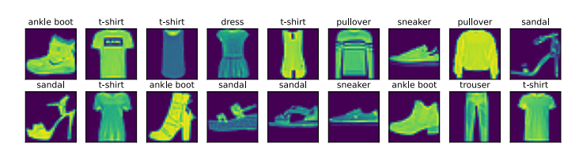

# Fashion-MNIST数据集

## 一、读取数据集

我们通过框架中的内置函数将Fashion-MNIST数据集下载并读取到内存中。

```python
%matplotlib inline
import torch
import torchvision
from torch.utils import data
# transforms 对图像尺寸格式进行转化
from torchvision import transforms
from d2l import torch as d2l

# 使用svg来显示图片
d2l.use_svg_display()


# 读取数据集 通过ToTensor实例将图像数据从PIL类型变化成32浮点数格式
# 并除以255使得所有像素的数据均在0-1之间
trans = transforms.ToTensor() # 预处理
# transform = trans 下载好的文件转化成tensor
mnist_train = torchvision.datasets.FashionMNIST(root="../data",train=True,transform=trans,download=True)
mnist_test = torchvision.datasets.FashionMNIST(root="../data",train=False,transform=trans,download=True)

print(len(mnist_test))
print(len(mnist_train))

mnist_train[0][0].shape # 取出第一张图片
torch.Size([1, 28, 28])  # 黑白图片 28 * 28
```

torchvision 是Pytorch关于计算机视觉的库

Fashion-MNIST总共有十个类别的图像。每一个类别由训练数据集6000张图像和测试数据集1000张图像。所以训练集和测试集分别包含60000张和10000张。测试训练集用于评估模型的性能

每一个输入图像的高度和宽度均为28像素。数据集由灰度图像组成。Fashion-MNIST,中包含十个类别，分别是t-shirt，trouser,pillover,dress,coat,sandal,shirt,sneaker,bag,ankle boot 

Fashion-MNIST中包含的10个类别，下面这个函数用于数字标签索引和文本名称之间进行转换。

```python
def get_fashion_mnist_labels(labels):
    """返回Fashion-MNIST数据集的文本标签"""
    text_labels = ['t-shirt', 'trouser', 'pullover', 'dress', 'coat', 'sandal', 'shirt', 'sneaker', 'bag', 'ankle boot']
    return [text_labels[int(i)] for i in labels]

# 创建一个函数来可视化样本
def show_images(imgs,num_rows,num_cols,titles=None,scale=1.5):
    """绘制图像列表"""
    figsize = (num_cols * scale,num_rows * scale) # 图像尺寸
    
    # 显示2 * 9 = 18 个子图
    _,axes = d2l.plt.subplots(num_rows,num_cols,figsize=figsize)
    axes = axes.flatten()
    for i,(ax,img) in enumerate(zip(axes,imgs)):
        if torch.is_tensor(img):
            # 图片张量
            ax.imshow(img.numpy())
            
        else:
            # PIL图片
            ax.imshow(img)
        
        ax.axes.get_xaxis().set_visible(False)
        ax.axes.get_xaxis().set_visible(False)
        
        # 设置标题
        if titles:
            ax.set_title(titles[i])
        
    return axes

# 将数据集取小批量放入DataLoader 使用用Next取出第一个数据
取出训练数据集中前几个样本的图像以及相应的标签。
X, y = next(iter(data.DataLoader(mnist_train, batch_size=18)))
show_images(X.reshape(18, 28, 28), 2, 9, titles=get_fashion_mnist_labels(y))

```

  

## 二、读取小批量

在每次迭代中，数据加载器每次都会读取一小批量数据，大小batch_size.通过内置数据迭代器，我们可以随机打乱了所有样本。

```python
batch_size = 256
def get_dataloader_workers():
    """使用四个进程来读取数据"""
    return 4

train_iter = data.DataLoader(mnist_train,batch_size,shuffle= True,num_workers=get_dataloader_workers())

timer = d2l.Timer()

for X,y in train_iter:
    continue
    
print(f'{timer.stop():.2f} sec')

# 3.41 sec
```

## 三、整合所有的组件

定义load_data_fashion_mnist函数，用于获取和读取Fashion-MNIST数据集。这个函数返回训练集和验证集的数据迭代器。此外，这个函数还接受一个可选参数resize,用来将图像大小调整为另一种形状

```python
def load_data_fashion_mnist(batch_size, resize=None): #@save
    """下载Fashion-MNIST数据集，然后将其加载到内存中"""
    trans = [transforms.ToTensor()]
    if resize:
        trans.insert(0, transforms.Resize(resize))
    trans = transforms.Compose(trans)
    mnist_train = torchvision.datasets.FashionMNIST(
        root="../data", train=True, transform=trans, download=True)
    mnist_test = torchvision.datasets.FashionMNIST(
        root="../data", train=False, transform=trans, download=True)
    return (data.DataLoader(mnist_train, batch_size, shuffle=True,
        num_workers=get_dataloader_workers()),
        data.DataLoader(mnist_test, batch_size, shuffle=False,
        num_workers=get_dataloader_workers()))

train_iter, test_iter = load_data_fashion_mnist(32, resize=64)
for X, y in train_iter:
    print(X.shape, X.dtype, y.shape, y.dtype)
    break


torch.Size([32, 1, 64, 64]) torch.float32 torch.Size([32]) torch.int64
```


Fashion-MNIST数据集，便于下面的章节评估各种分类算法

## 四、小结

* Fashion-MNIST是一个服装分类数据集，由十个类别的图像组成。后面各个章节需要使用此数据集评估各种分类算法

* 数据迭代器是获得高性能的关键组件。


