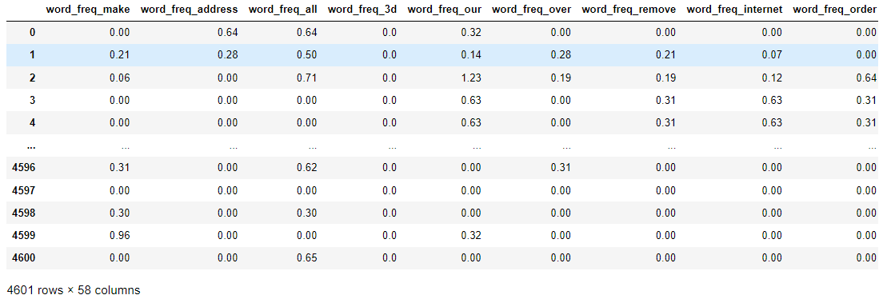
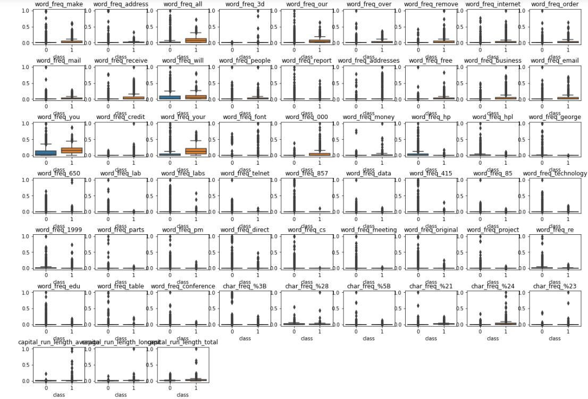
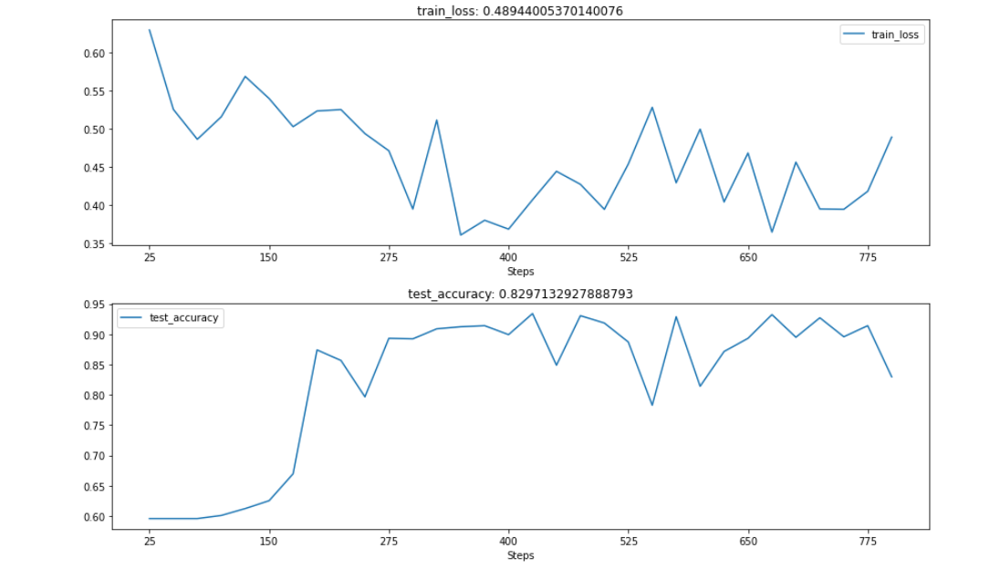

# Pytorch-全连接神经网络分类与回归实战

## 一、全连接神经网络的简介

&emsp;人工神经网络（ANN）简称神经网络，可以对一组输入信号和一组输出信号之间的关系进行建模，是机器学习和认知科学领域中一种模仿生物神经网络结构和功能的数学模型。

&emsp;神经元接收到来自n个其他神经元传递过来的输入信号，这些输入信号通过带权重的连接进行传递，神经元收到的总输入值将经过激活函数f处理之后产生神经元的输出。

&emsp;全连接神经网络或者叫做多层感知机（MLP）是一种连接方式较为简单的人工神经网络结构，属于前馈神经网络的一种，主要有输入层、隐藏层和输出层构成，并且在每一个隐藏层中可以有多个神经元。MLP网络是可以应用于几乎所有任务的多功能学习方法，包括分类、回归甚至是无监督学习。

&emsp;输入层仅仅接受外界的输入，不进行任何函数的处理，所以输入层的神经元个数（n x d d是输入特征数量）往往和输入的特征数量相同，隐藏层和输出层神经元对信号进行加工处理，最终结果由输出层神经元输出。根据隐藏层的数量可以分为单隐藏层MLP和多隐藏层MLP。

一般的，隐藏层的神经元数量不好确定,但是一般的更多的神经元就会有更强的表示能力，同时更容易造成网络的过拟合。

## 二、搭建多隐藏层MLP-分类任务

### 2.1 导入相关模块

```python
import numpy as np
import pandas as pd
from sklearn.preprocessing import StandardScaler,MinMaxScaler  # 用于数据标准化预处理
from sklearn.model_selection import train_test_split # 用于数据集的切分
from sklearn.metrics import accuracy_score,confusion_matrix,classification_report   # 用于评价模型的预测效果
from sklearn.manifold import TSNE # 用于数据的降维以及可视化
import torch  # 用于全连接网络的搭建和训练
import torch.nn as nn
from torch.optim import SGD,Adam
import torch.utils.data as Data
import matplotlib.pyplot as plt
import seaborn as sns
import hiddenlayer as hl
from torchviz import make_dot
```

&emsp;上述模块中，sklearn.preprocessing模块用于数据标准化预处理，sklearn.model_selection用于数据集的切分，sklearn.metrics模块用于评价模型的预测效果，sklearn.manifold模块用于数据的降维以及可视化。torch库适用于全连接网络的搭建和训练。


### 2.2 数据准备

&emsp;这里使用一个垃圾邮件数据，该数据集从UCI机器学习数据库进行下载，```https://archive.ics.uci.edu/ml/datasets/Spambase```

&emsp;在该数据集中一共有57个邮件内容的统计特征，数据集中最后一个变量（最后一列）是待预测目标变量（0，1），表示电子邮件被认为是垃圾邮件（1）或者不是（0），垃圾邮件数据下载之后被保存为spambase.csv,使用pandas包将其读入Python工作环境中。

```python
## 读取数据显示数据前几行
spam = pd.read_csv(r"spambase.csv")
# spam.head(5)  # 多行样本  每一行有
spam # 多行样本 每一行有58个统计特征

```

  


&emsp;将数据集进行分割，分为训练集和测试集，其中使用75%的数据作为训练集，剩余的25%作为测试集，以测试训练好的模型的泛化能力，数据集切分可以使用train_test_split()函数。

```python
X = spam.iloc[:,0:57]  # 统计特征 切片57取不到  n x 57矩阵
print(X.shape)
y = spam.iloc[:,57]  # 样本标签  n x 1矩阵
print(y.shape)

X_train,X_test,y_train,y_test = train_test_split(X,y,test_size = 0.25,random_state = 123)  # 切分数据集  25%是测试数据集
```

&emsp;切分好数据之后，需要对数据进行标准化处理，此处采用MinMaxScaler()将数据进行最大值-最小值标准化，将数据集中的每一个特征值取值范围转化到0~1之间

```python
# 切分好数据之后 进行标准化处理
# 使用MinMaxsCALER()将数据进行最大值-最小值标准化，将数据集中的每个特征取值范围转化到0-1之间
scales = MinMaxScaler(feature_range = (0,1)) 

# 对数据的前57列特征进行数据标准化处理
# fit_transform和transform都是对数据进行标准化处理
# 训练集和测试集都进行标准化
X_train_s = scales.fit_transform(X_train)
X_test_s = scales.transform(X_test)

# 查看数据集中标签名字
target_name = spam.columns[57]
print(target_name)
```

&emsp;在得到标准化数据之后，将训练数据集的每个特征变量使用箱线图进行显示，对比不同类别的邮件（垃圾邮件和非垃圾邮件）在每个特征变量上的数据分布情况。

```python
# 将训练数据集每一个特征使用箱线图进行显示，对比不同类别的邮件再每一个特征上的数据分布情况
colname = spam.columns.values[:-1]  # 除了最后一个取全部  也就是取出所有的特征变量名
plt.figure(figsize = (20,14))  # 创建画布
for ii in range(len(colname)):
    plt.subplot(7,9,ii + 1) # 创建七行九列的子图  
    
    # 横坐标是训练集标签  纵坐标是训练集数据：取出所有行的第ii个数据
    # 画出他们在某一特征上的分布
    sns.boxplot(x = y_train,y = X_train_s[:,ii])
    plt.title(colname[ii])  # 获取标题
    
plt.subplots_adjust(hspace = 0.6)
plt.show()  # 展示

```

  

上面的程序使用sns.boxplot()函数将数据集X_train_s中的57个特征变量进行了可视化。

### 2.3 搭建网络并可视化

&emsp;网络中的每一个全连接隐藏层由nn.Linear()函数和nn.Relu()函数构成，其中nn.ReLu()表示使用激活函数Relu。构建全连接层分类网络的程序如下所示。

```python
## 全连接网络
class MLPclassifica(nn.Module):
    def __init__(self):
        super(MLPclassifica,self).__init__()
        
        ## 定义第一个隐藏层
        self.hidden1 = nn.Sequential(
            nn.Linear(
                # d x q
                in_features = 57, ## 第一个隐藏层的输入：数据的特征数
                out_features = 30, ## 第一个隐藏层的输出：神经元的数量
                bias = True, ## 默认会有偏置
            ),
            nn.ReLU()  # 激活函数
        )
        
        ## 定义第二个隐藏层
        self.hidden2 = nn.Sequential(
            nn.Linear(30,10),
            nn.ReLU()
        )
        
        ## 分类层 = 输出层
        self.classifica = nn.Sequential(
            nn.Linear(10,2),  # 输出只有两种分类
            nn.Sigmoid()  # 激活函数
        )
        
    ## 定义网络的前向传播路径:正向传播
    def forward(self,x):
        fc1 = self.hidden1(x)
        fc2 = self.hidden2(fc1)
        output = self.classifica(fc2)
        # 输出是两个隐藏层和一个输出层
        return fc1,fc2,output
    
mlpc = MLPclassifica()
```

&emsp;上面的程序定义了一个MLPclassifica函数类，其网络结构中含有hidden1和hidden2两个隐藏层，分别包含30和10个神经元以及一个分类层classifica，并且分类层使用sigmoid函数作为激活函数，由于数据包含57个特征，所以第一个隐藏层的输入特征为57，而且该数据为二分类问题，所以分类层由两个神经元,在定义完网络结构之后，需要定义网络的正向传播过程，分别输出了网络的两个隐藏层fc1、fc2以及分类层的输出output。


### 2.4 使用未预处理的数据训练模型

&emsp;首先我们使用未标准化的训练数据训练模型，然后利用未标准化的测试数据验证模型的泛化能力，分析网络在未标准化的数据集中是否也可以很好地拟合数据。首先将未标准化的的数据转化为张量，并将张量处理为数据加载器，可以使用如下的程序：

```python
# 使用未预处理的数据训练模型
# 然后使用未标准化的测试数据验证模型的泛化能力
## 将数据转化成张量
X_train_nots = torch.from_numpy(X_train.values.astype(np.float32))
y_train_t = torch.from_numpy(y_train.values.astype(np.int64))
X_test_nots = torch.from_numpy(X_test.values.astype(np.float32))
y_test_t = torch.from_numpy(y_test.values.astype(np.int64))

# 将训练集转化为张量之后，使用TensorDataset将X和Y整理到一起
train_data_nots = Data.TensorDataset(X_train_nots,y_train_t)  # 将训练集的特征和标签 封装到一起

# 定义一个数据加载器  将训练数据集进行批量处理
# 批量读取数据
train_nots_loader = Data.DataLoader(
    dataset = train_data_nots,## 使用的数据集
    batch_size = 64,  ## 批处理样本大小
    shuffle = True, ## 每次迭代器打乱数据
    num_workers = 1,
)

```

&emsp;在上面的程序中，为了模型正常的训练，需要将数据集X转化为32位浮点型的张量以及将Y转化为64位整型的张量，将数据设置为加载器，将Data.TensorDataset()函数和Data.DataLoader()结合在一起使用。在上述加载器每一个batch包含64个样本。

&emsp;数据准备完毕之后，需要使用训练集对全连接神经网络进行训练和测试。优化函数使用torch.optim.Adam(),损失函数使用交叉熵损失函数nn.CrossEntropyLoss()。为了观察网络在训练过程中损失的变化情况以及在测试集中的预测精度的变化，可以使用HiddenLayer库，将相应熟知的变化进行可视化，模型的训练和相关可视化程序如下所示：

```python
# # 定义优化模型
optimizer = torch.optim.Adam(mlpc.parameters(),lr = 0.01)
loss_func = nn.CrossEntropyLoss()  ## 二分类损失函数   交叉熵损失函数

# 记录训练过程的指标
history1 = hl.History()

# 使用Canvas进行可视化
canvas1 = hl.Canvas()
print_step = 25

## 对模型进行迭代训练，对所有的数据训练epoch轮
for epoch in range(15):
    ## 对训练数据的加载器进行迭代计算
    ## 内部循环每次处理64个样本  step是索引 (b_x,b_y)是数据和标签
    for step,(b_x,b_y) in enumerate(train_nots_loader):
        # 计算每一个batch的损失
        # b_x是一个样本的数据，b_y是一个样本的标签
        _,_,output = mlpc(b_x)  ## MLP在训练batch上的输出 输出前两个隐藏层的结果和最终输出结果
        train_loss = loss_func(output,b_y) # 计算训练损失
        optimizer.zero_grad()  # 每次迭代的梯度初始化为0
        train_loss.backward() # 损失反向传播，计算梯度
        optimizer.step() # 使用梯度进行优化
        
        niter = epoch * len(train_nots_loader) + step + 1
        
        ## 计算每经过print_setp次迭代之后的输出
        if niter % print_step == 0:
            _,_,output = mlpc(X_test_nots) # 计算测试集的输出 output是n x 2 的矩阵 两列都是概率值
            _,pre_lab = torch.max(output,1)  # 取出每一行概率最大的下标->pre_lab
            test_accuracy = accuracy_score(y_test_t,pre_lab)  # 使用测试集标签和测试集训练结果
            ## 为history添加epoch 损失和精度
            history1.log(niter,train_loss = train_loss,test_accuracy = test_accuracy)
            ## 使用两个图像可视化损失函数和精度
            with canvas1:
                canvas1.draw_plot(history1["train_loss"])
                canvas1.draw_plot(history1["test_accuracy"])

```

   


&emsp;从图中我们可以看出，损失函数一直在波动，并没有收敛到一个平稳的数值区间，说明使用未标准化的数据集训练的模型并没有训练效果，也就是MLP分类器没有收敛。

原因可能如下：

* 数据没有经过标准化预处理，所以网络没有收敛。
* 使用的训练数据样本太少，导致网络没有收敛。
* 搭建的MLP网络使用的神经元太多或者太少，所以网络并没有收敛。


### 2.5 使用预处理之后的数据训练模型


