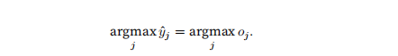
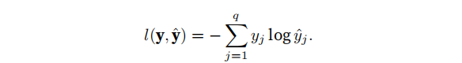

# Softmax回归-复习


## 一、独热编码
&emsp;独热编码是一个向量，它的分量和类别一样多。类别对应的分量设置为1，其他所有分量设置为0。比如(1,0,0)对应猫，（0，1，0）对应于鸡，（0，0，1）对应于狗。

## 二、网络架构

&emsp;为了估计所有可能类别的条件概率，我们需要一个有多个输出的模型，每一个类别对应一个输出。**为了解决线性模型的分类问题，那么我们就需要和输出一样多的仿射函数**，这里有四个特征和三个可能的输出类别，所以就需要12个权重，三个偏置b。

  


与线性回归一样，softmax回归也是一个单层的神经网络，由于计算每一个输出o1,o2,o3都取决于所有的输入x1,x2,x3,x4，所以softmax回归的输出层也是全连接层。
 
  

&emsp;通过向量表达为O = Wx + b

## 三、softmax运算
&emsp;优化参数以最大化观测数据的概率。为了得到预测结果，我们需要设置一个阈值，比如选择一个具有最大概率的标签。

我们希望模型的输出yj 作为类j的概率，然后选择具有最大输出值的类别argmaxyj作为我们的预测。

未规范化的预测o不可以直接视为输出，因为线性层的输出视为概率时存在一些问题：没有限制这些输出概率和为1；根据输入的不同，输出可能为负值

softmax函数将未规范化的预测变换为非负并且总和为1，同时要求模型保持可导。**对每一个未规范化的预测值进行求幂函数，确保非负数，然后为了确保输出的总和是1，在对每一个求幂之后的结果除以他们的总和。**

  

softmax会对每一种类别分配一个概率，所以接下来需要选择一个最大的概率：

  

尽管softmax是一个非线性函数，但是softmax回归的输出仍然是输入特征的放射变换决定的。


## 四、小批量样本的矢量化
&emsp;为了提高计算效率并且充分利用CPU，我们通常会针对小批量的样本X，其中X的特征维度（也是列数）为d,批量的大小为n(行数)。那么假设输出有q个类别，那么小批量特征为X(n x d),权重为W（dxq）,偏置b为（1xq）,softmax回归的矢量计算表达式为：

  

**小批量样本的矢量化加快了XW的矩阵向量乘法。X中的每一行都表示一个数据样本，输出的O就是一个n行q列的矩阵（q代表q个类别，n代表n个样本），对于O的每一行，我们先对所有项进行幂运算，然后通过求和对它们进行标准化，XW + b的求和会使用广播机制。小批量未规范化的预测O经过softmax回归之后形状不变，仍然是n x q矩阵**


## 五、损失函数

&emsp;我么需要一个损失函数来度量预测的效果。这里使用最大似然估计。softmax函数给出一个向量y^,我们将他看成条件概率：对于给定任意输入x的每一个类的条件概率。假设数据集{X,Y}具有n个样本，其中索引i的样本由特征向量Xi,和独热标签向量Yi组成，然后将预测值与标签进行比较：


  

根据最大似然估计，我们最大化P(Y|X),相当于最小化负对数似然：

  


  

对于该损失函数计算导数：

  

  

&emsp;可以看到，损失函数的导数是softmax模型预测概率与实际发生的概率（独热标签向量表示）之间的差异


## 六、softmax回归从0开始实现

### 1. 读取数据集
&emsp;这里我们将使用Fashion-MNIST数据集，并设置数据迭代器的批量大小为256。

```python
import torch
from IPython import display
from d2l import torch as d2l

batch_size = 256
traiin_iter,test_iter = d2l.load_data_fashion_mnist(batch_size)  # 未指定resize  批量参数256  读取小批量训练集 测试集
```

### 2. 初始化模型参数
&emsp; 在本节中，我们将展平每一个图像，将他们看作长度为784的一维行向量。在softmax回归中，输出与类别一样多，因为我们的数据集有10个类别，所以网络输出的维度就是10，因此，权重将构成一个784 x 10的矩阵（d x q）,偏置将构成一个1 x 10的行向量(1 x q),与线性回归一样，我们将使用正态分布初始化我们的权重w,偏置初始化为0。

```python
num_inputs = 784
num_outputs = 10

W = torch.normal(0,0.01,size = (num_inputs,num_outputs),requires_grad = True)
b = torch.zeros(num_outputs,requires_grad = True)

```
### 3. 定义softmax操作

实现softmax三个步骤：

* 对每一个项进行求幂
* 对每一行进行求和（小批量中每一个样本是一行，得到每一个样本的规范化常数）
* 将每一行除以其规范化常数，确保结果的和为1

  

```python
def softmax(X):
    # X 是一个N行 784列的向量 求幂操作是对该矩阵中所有的数据都进行求幂操作
    X_exp = torch.exp(X)
    partition = X_exp.sum(1,keepdim = True) # 按照行进行求和
    
    return X_exp / partition  # 这里使用了广播机制

# 对于任何随即输入，我们都可以将每一个元素变成一个非负数，并且总和为1
X = torch.normal(0,1,(2,5)) # 随机初始化一个X
x_prob = softmax(X)
x_prob,x_prob.sum(1) # 按行求和

```

### 4. 定义模型

&emsp;定义softmax操作之后，我们就可以实现softmax回归模型。**下面的代码展示了如何通过网络映射到输出。将数据传递到模型之前，我们使用reshape函数将每一张原始图像展平为行向量(1 x 784)**

```python
def net(X):
    return softmax(torch.matmul(X.reshape((-1,W.shape[0])),W) + b)
```

### 5. 定义损失函数

```python
# 定义损失函数
def cross_entropy(y_hat,y):
    return  -torch.log(y_hat[range(len(y_hat)),y])
```

### 6.分类精度

&emsp;当预测与标签分类y一致时，即是正确的。分类精度即正确预测数量与总预测数量之比。

&emsp;为了计算精度，进行以下操作：如果y_hat是矩阵，那么假定第二个维度存储每一个类的预测概率，我们使用argmax获得每一行中最大元素的索引来获得预测类别，我们将预测类别和真实y元素进行比较，由于等式运算符“==”对数据类型很敏感，因此我们将y_hat的数据类型转换成与y的数据类型一致。结果是一个包含0(错)和1（对）的张量。**最后，求和得到正确预测的数量**

```python
# 计算预测精度
def accuracy(y_hat,y):
    """计算预测正确的数量"""
    if len(y_hat.shape) > 1 and y_hat.shape[1] > 1:
        # y_hat 维度大于1  分类类别也大于1
        y_hat = y_hat.argmax(axis = 1)  # 按照行取最大值的索引  然后重新组成一个行向量
    
    
    cmp = y_hat.type(y.dtype) == y # 比较预测值和真实值向量  相等的位表示1 不相等表示0
    
    # 最后计算正确的分类个数（1的个数）
    return float(cmp.type(y.dtype).sum())
```

### 7.训练


