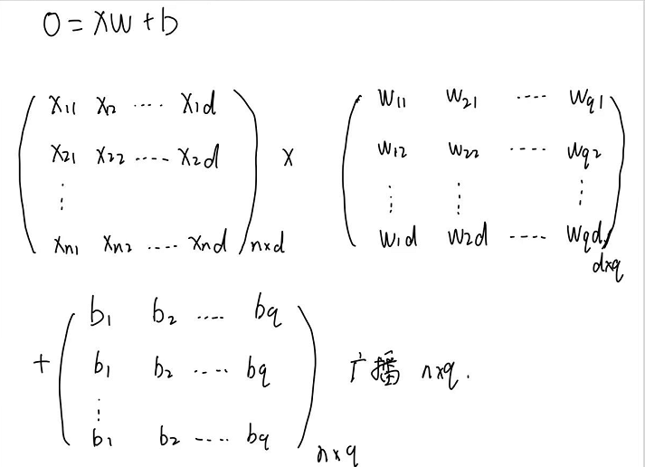
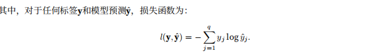
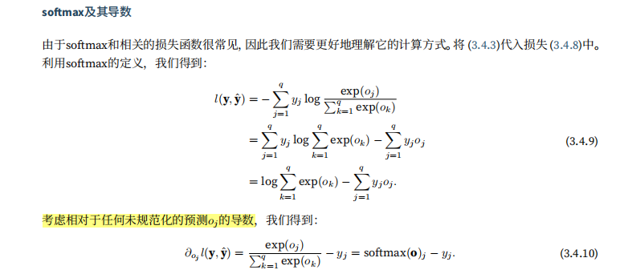

# 动手学习深度学习-softmax回归

对于分类问题，有硬分类和软分类之分，一般的，我们只对样本的硬性类别感兴趣，也就是属于哪一个类别；我们也希望得到软性类别，也就是属于每一个类别的概率。

## 一、分类问题

输入是一个2x2的灰度图像，每一个图像对应四个特征x1,x2,x3,x4，每一个图像属于类别"猫"，"鸡"，"狗"中的一个。

接下来，对于标签，我们使用独热编码，独热编码是一个向量，他的分量和类别一样多。类别对应的分量设置为1，其他分量设置为0。标签y是一个三维向量，其中(1,0,0)对应于"猫",(0,1,0)对应于鸡，(0,0,1)对应于狗。

## 二、网络架构

&emsp;为了解决线性模型的分类问题，我们需要和输出一样多的仿射函数，每一个输出对应于它自己的放射函数，在本例中，我们有四个特征和三个输出类别，所以我们需要十二个标量来表示你权重（因为他有三种输出），（这就类似于组成一个非齐次线性方程组），三个标量来表示偏置，下面为每一个输入计算三个未规范化的预测（logit）,o1、o2和o3。

  

用神经网络图来描述这个计算过程，与线性回归一样，softmax回归也是一个单层神经网络。由于计算每一个输出o1,o2,o3都取决于所有的输入x1,x2,x3,x4(只不过每一种输出对应的权重不一样，**因为每一种输出是一种动物，而x1,x2,x3是动物的一些共有特征，但是对于不同的动物有不同的特征，这就涉及到对每一种输入特征进行加权，得到不同的输出**)，所以softmax的回归输出层也是全连接层。

  

我们使用一个非齐次线性方程组来表示 o = Wx + b,对于之前的线性回归模型y = Xw + b,我们可以看到线性回归模型的X是一个多行多列列的张量，每一行就是一个样本数据，每一行由若干列做成，每一列对应一个特征，而w是一个多行列向量，但是这里的softmax模型W是一个多行多列的张量，x是一个多行列向量。线性回归模型中的b只是一个标量，那么运算会涉及到广播机制，这里的softmax模型中的b是一个张量。

**这样，我们将所有的权重放到一个3x4的矩阵中。对于给定数据样本的特征x,我们的输出是由权重与输入特征进行矩阵-向量乘法再加上偏置b得到的。**

很显然，参数w的开销变大了。

## 三、全连接层的参数开销

对于具有d个输入和q个输出的全连接层，参数开销是O(dq)。

## 四、softmax运算

&emsp;我们希望模型的输出y可以视为某一类的概率，然后选择具有最大输出值的类别argmax y作为预测。比如y1,y2,y3分别为0.1，0.8，0.1，那么我们的预测类别就是2。

这里要注意：预测o要不要规范化，因为线性层的输出直接视为概率时存在一些问题：没有限制这些输出数字的总和是1。他们可以为负值。

softmax函数：首先对每一个没有规范化的预测求幂，这样可以保证输出非负，然后在对每一个求幂之后的结果除以他们的总和。

  

softmax函数并不会改变预测o之间的顺序，只会确定分配给每一个类别的概率。

  

然后，我们选取概率最大的类别。

## 五、小批量样本的矢量化

为了进行GPU并行计算，我们需要针对小批量数据执行矢量计算。我们读取了一个批量的样本X,其中特征难度（输入数量）为d，批量大小为n。此外，假设输出有q个类别，那么，**输入特征矩阵X是n x d,每一行是一个样本数据，每一列是一种特征，权重矩阵是d x q，偏置b是1 x q矩阵，**
  

  

对于O的每一行，我们先对所有项进行幂运算，然后通过求和对他们进行标准化，在XW+b的求和会使用广播，小批量的未规范化预测O和输出概率Y都是形状为n x q矩阵。

## 六、损失函数

我们使用极大似然估计法。

### 6.1 对数似然

  

对于这个式子，我么可以理解为：在给定任意输入x的每一个类的条件概率。

按照极大似然估计法，

  

  

  

可以看到导数是softmax模型分配的概率与实际发生的情况（独热标签向量表示）之间的差异。

## 七、模型预测和评估

训练完softmax回归模型之后，给出任何样本特征，我们可以预测每一个输出类别的概率。通常我破门使用预测概率最高的类别作为输出类别。如果预测与实际类别一致，那么预测就是正确的。

