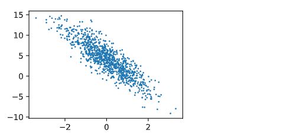
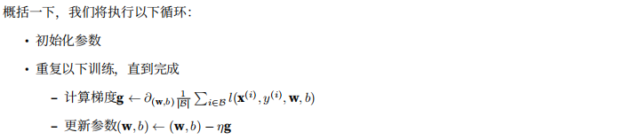

# 动手学习深度学习-从0开始实现线性回归

## 一、生成数据集

根据带有噪声的线性模型构造一个人造数据集，我们将生成一个包含1000个样本的数据集，我们使用线性模型参数：w = [2,-3.4]^T、b = 4.2 和噪声生成数据集以及标签。

```python
import random
import torch
from d2l import torch as d2l

def synthetic_data(w,b,num_examples):
    """生成y = Xw+b的噪声"""

    # 创建一个单一的正态分布张量
    # 参数：均值，标准差，张量尺寸：1000个长度为len(w)的数据 也就是100行样本数据，每一行是一个样本 
    # 本例中张量的尺寸就是1000 x 2
    X = torch.normal(0,1,(num_examples,len(w)))

    # 多维矩阵的乘法，支持broadcast操作，X是1000 x 2 的数据集 w是2 x 1的加权值
    # 最后生成一个1000 x 1的标签，最后加上偏置（广播操作）
    y = torch.matmul(X,w) + b

    # 最后还要加上噪声 噪声的尺寸和y张量尺寸相同
    y += torch.normal(0,0.01,y.shape)

    # y 形成一个一列的张量
    return X,y.reshape((-1,1))

true_w = torch.tensor([2,-3.4])
true_b = 4.2
features,labels = synthetic_data(true_w,true_b,1000)

print('features:',features[0],'\nlabel',labels[0])

d2l.set_figsize()
d2l.plt.scatter(features[:, (1)].detach().numpy(), labels.detach().numpy(), 1)

```

```python
torch.normal(means,std,out=None)

返回一个张量，包含从给定参数means,std的离散正态分布中抽取随机数。均值means是一个张量，包含每一个输出元素相关的正态分布的均值。std是一个张量，包含每一个输出元素相关的正态分布的标准差。均值和标准差的形状不需要匹配，但是每一个张量的元素个数必须相同。

参数：
means(Tensor)-均值
std(Tensor)-标准差
out(Tensor)-可选的输出张量
```

```python
torch.matmul(input,other,out=None)

多维矩阵的乘法。支持广播操作
```

关于reshape(-1,1),（初学者还有很多不懂），行的参数是-1,那么就会自动根据所给出的列数，自动按照原始数组的大小形成一个新的数组。那么这里也就是形成一个一列的数组。


  

## 二、读取数据集

训练一个模型需要对整个数据集进行遍历，每次抽取一小批样本。所以，我们需要定义一个函数可以打乱数据集中的样本并且小批量获取数据。

```python
def data_iter(batch_size,features,labels):
    num_examples = len(features)  # 本例中 features是X，长度是1000
    indices = list(range(num_examples))  # 根据长度生成一个序列
    
    random.shuffle(indices) # 将序列打乱顺序
    # 以batch_size作为步长，选取一个片段 长度也是batch_size
    # 然后用得到的batch_indices获取数据
    for i in range(0,num_examples,batch_size):
        batch_indices = torch.tensor(indices[i:min(i + batch_size,num_examples)])
        yield features[batch_indices],labels[batch_indices]
        
batch_size = 10
for X,y in data_iter(batch_size,features,labels):
    print(X,'\n',y)
    break


tensor([[-0.6566, -1.6268],
        [ 0.7621,  0.0327],
        [ 0.5170,  0.3251],
        [ 0.0787, -0.2931],
        [ 1.6971,  0.0719],
        [ 0.7560,  0.5021],
        [ 0.4074, -2.1551],
        [ 0.7080, -0.6437],
        [-1.6180,  0.0966],
        [ 1.2589,  0.8884]]) 
tensor([[ 8.4113],
        [ 5.6045],
        [ 4.1106],
        [ 5.3482],
        [ 7.3493],
        [ 4.0177],
        [12.3333],
        [ 7.8004],
        [ 0.6366],
        [ 3.6978]])
```

利用GPU并行计算的优势，处理合理大小的‘小批量’。每一个样本都可以进行并行计算。

## 三、初始化模型参数

在使用随机梯度下降优化我们的模型参数之前，我们需要有一些参数。我们通过从均值为0、标准差为0.01的正态分布中采样随机数来初始化权重，将偏置b初始化0

```
w = torch.normal(0,0.01,size=(2,1),requires_grad = True)
b = torch.zeros(1,requires_grad=True)
```

初始化参数之后，我们需要计算损失函数关于模型参数的梯度，然后向着减小损失的方向更新每一个参数。使用自动微分计算梯度。


## 四、定义模型
&emsp;我们只需要计算输入特征X和模型权重w的矩阵，然后再加上b，Xw是一个向量（列向量），使用广播机制，标量b会被加到向量的每一个分量上。

```python
def linreg(X,w,b):
    """线性回归模型"""
    return torch.matmul(X,w) + b

```

## 五、定义损失函数

使用平方损失函数：这里需要注意，我们预测出的y是一个1000 x 1 的列向量，所以需要将真实的y形状转换一下：y.reshape(y_hat.shape)

```python
def squared_loss(y_hat,y):
    """均方损失"""
    return (y_hat - y.reshape(y_hat.shape)) **2 / 2
```

## 六、定义优化算法

小批量随机梯度下降。输入参数：模型参数集合，学习速率，批量大小。每一步更新的大小由学习速率lr决定，因为我们计算的损失是一个批量样本的总和。

```python
def sgd(params,lr,batch_size):
    
    with torch.no_grad():
        for param in params:
            param -= lr * param.grad / batch_size
            param.grad.zero_()

```

## 七、训练

**在每一次迭代中，我们读取一小量训练样本，并通过我们的模型来获得一组预测，计算损失函数，然后开始反向传播，存储每一个参数的梯度，然后使用随机梯度下降优化模型参数**

```python
    
lr = 0.03  # 超参数  学习率
num_epochs = 3  # 超参数  迭代周期
net = linreg
loss = squared_loss

for epoch in range(num_epochs):
    for X,y in data_iter(batch_size,features,labels):
        l = loss(net(X,w,b),y) # X和y的小批量损失
        l.sum().backward()
        sgd([w, b], lr, batch_size)
        
    with torch.no_grad():
        train_l = loss(net(features, w, b), labels)
        print(f'epoch {epoch + 1}, loss {float(train_l.mean()):f}')
 
print(f'w的估计误差: {true_w - w.reshape(true_w.shape)}')
print(f'b的估计误差: {true_b - b}')


epoch 1, loss 0.042150
epoch 2, loss 0.000167
epoch 3, loss 0.000052
w的估计误差: tensor([ 0.0003, -0.0016], grad_fn=<SubBackward0>)
b的估计误差: tensor([0.0007], grad_fn=<RsubBackward1>)

```

  


