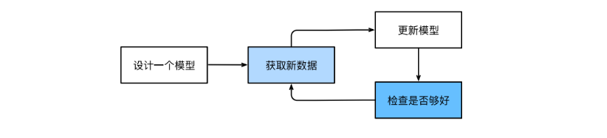
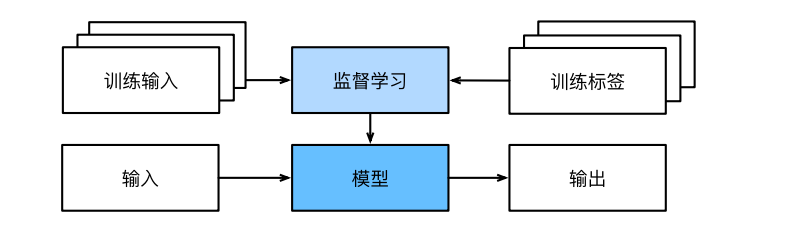
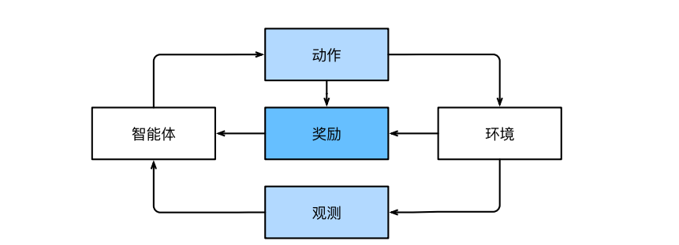

# 02 动手学习深度学习-前言

## 一、机器学习概述
&emsp;在机器学习中，学习是一个训练模型的过程，通过这个过程，我们可以发现正确的参数集，从而使模型强制执行所需的行为。也就是使用数据训练模型。

训练过程步骤：
* 从一个随机初始化参数的模型开始，这个模型基本毫不智能
* 获取一些数据样本（例如，音频片段以及对应的{是，否}标签）
* 调整参数，使模型在这些样本中表现得更好
* 重复第二步和第三步，知道模型在任务中的表现让人满意

  

## 二、机器学习问题的组件

* 可以学习的数据(data)
* 转换数据的模型(model)
* 一个目标函数(objective function),用来量化模型的有效性
* 调整模型参数以优化目标函数(algorithm)

### 2.1 数据

* 每个数据集都是由一个个样本组成
* 样本都是独立同分布的，每一个样本由一组成为特征的属性组成。机器学习模型会根据这些属性进行预测。
* 每个样本的特征类别数量都是相同的时候，其特征向量是固定长度的，这个长度被称为数据的维数（dimensionality）。
* 并不是每一个数据都是可以用固定长度的向量来表示，以图像数据为例，如果他们全部来自标准显微镜设备，那么固定长度是可取的，但是如果图像数据全部来自互联网，他们很难具有相同的分辨率或者形状，可以考虑将图像裁剪成标准尺寸，另外文本数据基本没有固定长度，有的文本数据很简短，有的则是长篇大论，与传统的机器学习相比，深度学习有一个巨大的优势在于可以处理不同长度的数据。
* 数据集的由小变大为现代机器学习的成功奠定基础
* 不仅需要海量的数据，还需要正确的数据，如果数据充满了错误，或者数据的特征不能正确的预测任务目标，那么模型很可能无效。

### 2.2 模型
&emsp; 深度学习与经典方法的区别在于：前者关注功能强大的模型，这些模型由神经网络错综复杂的交织在一起，包含层层的数据转换，因此被称之为深度学习。

### 2.3 目标函数
&emsp;深度学习所说的学习指的是自主提高模型完成某些任务的效能。对于“提高”，我们需要定义模型的优劣程度，这个度量在大多数情况下是可优化的，我们称为目标函数。

* 当任务在试图预测数值时，最常见的损失函数是平方误差(squared error), 即预测值与实际值之差的平方。
* 当任务解决分类问题，最常见的目标函数就是最小化错误率，即预测与实际情况不符合的样本比例。有些目标函数（如平方误差）很容易被优化，有些目标（如错误率）由于不可微性或其他复杂性难以直接优化。
* 数据集分为训练数据集以及测试数据集，训练数据集用于拟合模型参数，测试数据集用于评估拟合的模型。将两部分的数据集的实际性能进行比较，测试性能可能会显著偏离训练性能，一个模型在训练集上表现良好，但是不能推广到测试集，这个模型就是过拟合的。

### 2.4 优化算法
当我们获得了数据、模型、目标函数，接下来就需要一个算法，这个算法可以搜索出最佳参数，最佳参数用来优化模型，以此来最优化目标函数，大多流行的优化算法通常基于一种基本方法-梯度下降。梯度下降法会检查每一个参数，看看你仅对该参数进行少量变动，训练集损失会朝那个方向移动，然后在调整参数。

## 三、各种类型的机器学习问题

### 3.1 监督学习

&emsp;监督学习(supervised learning)擅长在给定输入特征情况下预测标签，每一个特征-标签称之为一个样本。**目标是生成一个模型，能够将任何输入特征映射到标签，即预测**

例子：预测患者是否会心脏病发作，输入特征：生命体征，心率、舒张压，标签：心脏病发作、心脏病没有发作

**监督学习的本质就是条件概率**，训练参数时，我们为模型提供了一个数据集，其中每一个样本都有真实的标签。**我们希望预测估计给定输入特征的标签的条件概率**，工业界，大部分机器学习的成功应用都是监督学习。因为很多重要的任务都可以清晰地描述为：在给定一组特定的可用数据情况下，估计未知事物的概率。

通俗理解,监督学习的过程如下:
* 从已知大量数据集中随机选取一个子集，为每一个样本获取基本的真实标签。有时，这些样本已经有了标签（比如患者是否会康复），但是有时需要人工标记数据（图像分类），这些输入和相应的标签一起构成了训练数据集。随后我们选择有监督的学习算法，他将训练数据集作为输入，并输出一个完成学习模型。之后将之前用过的样本放到该模型中，模型的输出就是该样本的标签预测。

  

**简单的来说，就是使用模型预测相应的标签（输出结果）**

#### 3.2 回归问题

&emsp;回归问题是监督学习的一类问题，典型的例子就是房价预测，比如，房子的特征肯定就是大小，卧室数量，浴室数量，相应的标签自然就是他的价格。所以当房价预测模型训练好之后，任意给定一个数据的特征，预测出相应的标签，也就是预测出他的价格。

#### 3.3 分类问题
&emsp;虽然回归问题可以很好的预测出标签，但是很多问题并非如此。在分类问题中，我们希望模型可以预测样本属于哪一个类别，**对于回归问题，我们输出一个数值，分类问题中我们训练一个分类器**。

&emsp;模型如何得出是或者不是的预测？模型为每一种可能的类分配一个概率，比如猫狗分类的一个例子，模型可能会输出图像是猫的概率是0.9,也就是90%的概率确定他是猫，但是仍然存在不确定性。

#### 3.4 标记问题

&emsp;我们可以训练一个普通的二元分类来区分猫和狗，但是遇到新的动物模型就束手无策，比如“不来梅的城市音乐家”这张画像。不能将其简单地视为二元分类问题。

  

这是一个多元分类问题，学习预测不相互排斥的类别问题称之为多标签分类问题。比如一篇技术博客，里面涉及到很多技术，那么关于博客的标签就有很多，比如：C++、Linux、机器学习、python。

#### 3.5 搜索

&emsp;搜索引擎使用机器学习和用户行为模型来获取网页相关性得分，然后检索评级最高的元素。

#### 3.6 推荐系统
&emsp;另一类与搜索和排名相关的问题就是推荐系统，他的目标是向特定用户进行个性化推荐。

&emsp;有些应用，用户会进行明确反馈，比如对喜欢的产品评分，对于短视频这种应用，用户很快跳出播放界面，那么表示该用户不喜欢这类视频。一个成功的推荐算法会综合用户的活动和项目特征经过大量数据的训练得到，可以很容易捕捉一个人的喜好

#### 3.7 序列学习
&emsp;如果输入的样本是连续的，那么我们的模型可能就需要拥有记忆功能，比如处理视频片段，每一个视频片段可能由不同数量的帧组成，通过前一帧的图像，我们可能对后一帧发生的事情更加有把握。

&emsp;医学上，序列的输入和输出更为重要。我们用一个模型来监控重症病人，我们会根据过去所有时间的病人的所有信息来进行预测，而不是仅仅根据最近的测量结果来做出预测。

### 3.2 无监督学习

&emsp;以上所讲的都是监督学习：我们向模型提供巨大的数据集，每一个样本包含特征和相应的标签值，模型在大量的数据集训练之下，学会从情况到行动的映射。

&emsp;但是，如果工作没有十分具体的目标那么你就需要进行自发的学习，我们称这类数据中不含有目标的机器学习问题为无监督学习，无监督学习的应用场景：

* 聚类问题：没有标签的情况下，进行数据分类
* 主成分分析：找到少量的参数来准确地捕捉数据的线性相关属性
* 因果关系和概率图模型：我们能否描述观察到的许多数据的根本原因。
* 生成对抗性网络：提供合成数据的方法

### 3.3 与环境互动
&emsp;到目前为止，我们所讨论的都是不在于环境交互的学习，这里的所有学习都是在算法与环境断开之后进行的，被称为离线学习，这种离线学习既有缺点又有优点，优点在于可以孤立的进行模式识别，而不必分心与其他问题。但是缺点在于，解决问题相当有限，你更希望他可以与真实环境进行互动。

**强化学习问题是一类考虑与环境交互的问题**

### 3.4 强化学习

  

强化学习框架的通用性十分强大，我们可以将任何监督学习问题转化为强化学习；强化学习还可以解决许多监督学习无法解决的问题，在监督学习中，我们总是希望输入与正确的标签相关联，但是在强化学习中，我们并不假设环境告诉agent每个观测的最优动作，一般来说agent只是得到一些奖励。

在任何时间点上，强化学习agent可能知道一个好的策略，但是可能有许多更好的策略没有尝试过，强化学习agent必须不断地做出选择，是应该利用当前最好的策略还是探索新的策略空间（放弃一些短期汇报来换取知识）。

当环境可以被完全观察到时，我们将强化学习问题称之为马尔科夫决策过程。当状态不依赖于之前的操作时，我们称该问题是上下文赌博机，当没有状态，只有一组最初未知回报的可用动作时，这个问题就是经典的多臂赌博机。

