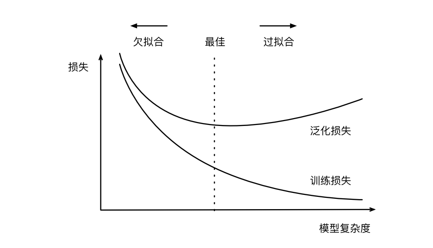

# 动手学习深度学习-过拟合与欠拟合

## 一、训练误差与泛化误差
&emsp;训练误差指的是模型在训练数据集上计算得到的误差。泛化误差是指，模型应用在同样从原始样本的分布抽取的无线多数据样本时，模型误差的期望。

&emsp;在实际中我们只能通过将模型应用在一个独立的测试集来估计泛化误差，该测试集由随机选取的、未曾在训练集中出现的数据样本构成。

  

## 二、模型复杂性与模型容量

&emsp;当我们有简单的模型和大量的数据时，我们期望泛化误差和训练误差想接近。当我们有更复杂的模型和更少的样本时，我们预计训练误差会下降，但是泛化误差会增大。

&emsp;一个模型能否很好地泛化取决于很多因素。例如，**具有更多参数的模型可能被认为更加复杂，参数有更大取值范围的模型可能更为复杂**。通常对于神经网络，我们认为需要更多训练迭代的模型比较复杂，而需要早停的模型（也就是较少训练迭代周期）就不那么复杂。

关于模型容量：
* 拟合各种函数的能力
* 低容量的模型难以拟合训练数据
* 高容量的模型可以记住所有的训练数据

影响模型泛化的因素：
* 可调整参数的数量。当可调整参数的数量（有时候称之为自由度）很大时，模型往往更容易过拟合。
* 参数采用的值。当权重的取值范围较大时，模型可能更容易过拟合
* 训练样本的数量。即使你的模型很简单，也很容易过拟合只包含一两个样本的数据集。而过拟合一个有数百万个样本的数据集则需要一个极其灵活的模型。

## 三、模型选择
&emsp;在机器学习中，我们通常在评估几个候选模型之后选择最终的模型。这个过程叫做模型选择。有时候需要进行比较的模型在本质上是完全不同的（决策树与线性模型）。或者我们需要比较不同的超参数设置下的同一类模型。

&emsp;训练多层感知机模型时，我们可能希望比较具有不同数量的隐藏层、不同数量的隐藏层单元以及不同的激活函数组合的模型。为了确定候选模型中的最佳模型，我们通常会使用验证集。

&emsp;验证集：在我们确定所有的超参数之前，我们都不希望用到测试集，如果我们在模型选择过程中使用测试数据，可能会有过拟合测试数据的风险。如果我们过拟合了训练数据，还可以在测试数据上的评估来判断是否过拟合，

&emsp;训练数据用来选择模型，测试数据用来估计训练数据的泛化误差。

&emsp;由于现实中，测试数据可能比较少，那么我们一般将数据分成三份，除了训练数据和测试数据之外，还增加一个验证数据集。

&emsp;K折交叉验证：当训练数据稀缺时，我们甚至没办法提供足够多的数据来构成一个合适的验证集。这里可以采用K折交叉验证。这里原始的训练数据被分成K个不重叠的子集。然后执行K次模型训练和验证，每一次在K-1个子集上进行训练，并在剩余的一个子集上进行验证。最后通过K次饰演的结果取平均来估计训练和验证误差。

## 四、欠拟合还是过拟合

&emsp;欠拟合：训练误差和验证误差都很严重，但是她们之间的泛化误差很小，如果模型不能降低训练误差，这可能意味着模型过于简单（也就是模型没办法记住数据），无法捕获试图学习的模式，此外，由于训练误差和验证误差之间的泛化误差很小，我们有理由相信可以用一个更加复杂的模型降低训练误差。

&emsp;过拟合：当我们的训练误差明显低于验证误差时，这表明严重的过拟合。过拟合并不总是一件坏事。最好的预测模型在训练数据上的表现往往比在保留（验证）数据上好得多。最终，我们通常更关心验证误差，而不是训练误差和验证误差之间的差距（泛化误差）

**是否过拟合或者欠拟合取决于模型的复杂性和可用训练数据集的大小**

### 1. 模型复杂性

  

我们可以看到随着模型的复杂性升高，模型的训练损失逐渐降低，模型过多的关注了细节，很好地记住了数据，所以当使用数据进行测试的时候，测试误差就会加大，模型的泛化性会降低。

### 2. 数据集大小

## 五、多项式回归

