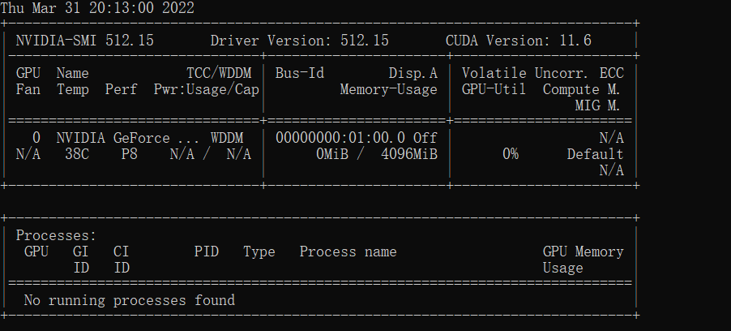
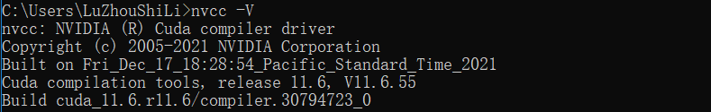
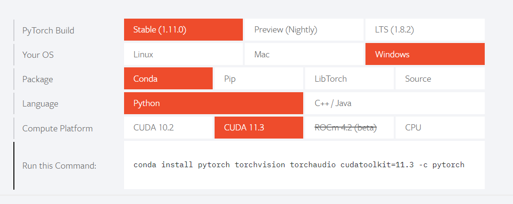
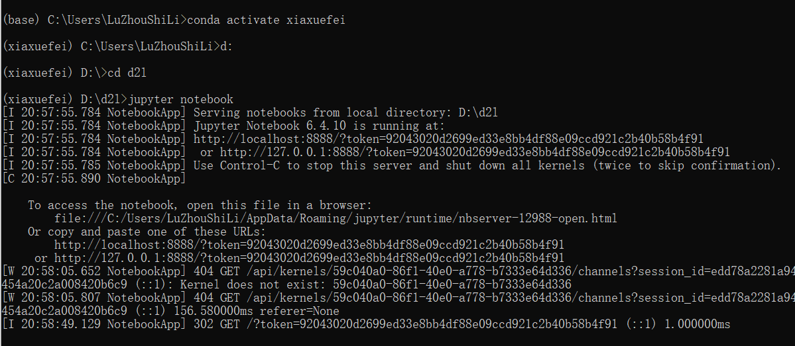
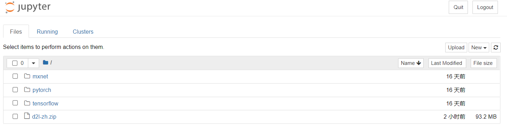

# 01 动手学习深度学习-配置环境pytorch

## 一、需要的配置以及准备
* 学习环境：windows10 + anaconda + python3.7 + jupyter notebook + cuda + cudnn
* GPU版本：CUDA（11.6）+ cudnn(相应cuda版本)

## 二、安装anaconda

参考：```https://blog.csdn.net/qq_44653420/article/details/122111441?spm=1001.2014.3001.5502```

检查conda的版本：conda --version

切换anconda的镜像源：切换国内清华的镜像源
```
conda config --add channels https://mirrors.tuna.tsinghua.edu.cn/anaconda/pkgs/free/

conda config --add channels http://mirrors.tuna.tsinghua.edu.cn/anaconda/pkgs/main/

conda config --set show_channel_urls yes

```

设置搜索时显示通道的地址：
```
conda config --set show_channel_urls yes
```

显示源：
```
conda config --show channels
```

删除源：
```
conda config --remove channels 源名称或者链接
```

## 二、安装CUDA:

先检查显卡驱动：cmd命令行输入nvidia-smi 找到对应的cuda版本。
  

cuda下载地址：
```https://developer.nvidia.com/cuda-toolkit-archive```
安装可以选择别的路径，安装之后，输入nvcc -V检查安装情况

测试cuda是否安装成功：nvcc -V
  


## 三、安装CUDNN

需要先注册才可以下载，（可以使用微信登录），下载解压之后，做如下操作：

* 将cudnn\bin目录中的 cudnn64_8.dll 复制到 C:\Program Files\NVIDIA GPU Computing Toolkit\CUDA\v11.2\bin 中
* 将cudnn\include目录中的 cudnn.h 复制到 C:\Program Files\NVIDIA GPU Computing Toolkit\CUDA\v11.2\include中
* 将cudnn\lib\x64 目录中的 cudnn.lib 复制到 C:\Program Files\NVIDIA GPU Computing Toolkit\CUDA\v11.2\lib\x64 中
* 环境变量已经自动添加过


## 四、安装pytorch

1. 新建一个conda环境
   
   * 在anaconda prompt中使用以下命令检查已经存在的conda环境：conda info -e

   * 创建一个虚拟环境：conda create -name 名称 python=3.7

   * 激活环境：conda activate 名称
   * 退出环境：conda deactivate 名称

2. 安装pytorch
   
   官网```https://pytorch.org/``` 复制如下命令，在刚才新建的环境中输入：```conda install pytorch torchvision torchaudio cudatoolkit=11.3 -c pytorch```

     

3. 测试pytorch的安装
   命令行中，先输入python,转到python解释器环境中
   ```python
   import torch
    from __future__ import print_function
    x = torch.rand(5,3)
    print(x)
    torch.cuda.is_available() # 测试CUDA是否可用
   ```

   参考李沐老师的视频讲解```https://www.bilibili.com/video/BV18K411w7Vs?spm_id_from=333.1007.top_right_bar_window_history.content.click```


## 五、安装jupyter notebook

打开动手学习深度学习网页下载压缩包：```http://zh.d2l.ai/```

选择一个位置解压压缩包。

然后安装需要的包：```pip install jupyter d2l```

安装完毕之后，到刚才解压d2l文件夹下面打开anaconda prompt 输入jupyter notebook

  


  

进入pytorch，可以运行书中的一些代码。


