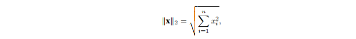
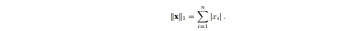

# 03 动手学习深度学习-预备知识

## 一、数据操作
&emsp;给定一个n维数组，也成为张量(tensor)。无论使用哪个深度学习框架，它的张量类(在MXNet中为ndarray,在pytorch和TensorFlow中为Tensor)都与Numpy中的ndarray相似，但是深度学习框架又比ndarray多一些重要的功能：首先GPU很好地支持加速计算，但是NumPy仅支持CPU计算；其次张量类支持自动微分。这些功能使得张量类更适合深度学习。

### 1.1 入门
首先，我们导入torch,虽然它被称为PyTorch,但是代码中使用torch而不是pytorch

```python
import torch
```

张量表示有一个数值组成的数组，具有一个轴的张量对应数学上的向量(vector);具有两个轴的张量对应数学上的矩阵(martix); 具有两个轴以上的张量没有特殊的数学名称

使用arange创建一个行向量x。这个行向量包含从）开始的前12个整数，默认创建整数，也可以指定类型是浮点数。张量中的每一个值都称之为元素。

张量的形状可以通过shape属性进行访问。

```python
import torch
x = torch.arange(12)
print(x)
print(x.shape)
```

获取张量中元素总个数：使用如下函数：```x.numel()```

想要改变一个张量的形状但是不改变元素的数量和元素值，使用reshape函数，将一个张量从1x12变成3x4的矩阵，这个新的张量包含与转换前相同的值，虽然张量的形状发生了改变，但是元素值并没有发生改变。

**我们不必自己算出每一个维度，我们只要算出他是三行，那么另一个维度就一定是四列** 所以可以使用x.reshape(-1,4)或者x.reshape(3，-1)


有时候，我们需要创建一个全为0或者全为1的矩阵，比如：

创建全为0矩阵
```python 
z = torch.zeros((2,3,4))  # 全为0 的三维矩阵
print(z)
```

创建全为1矩阵
```python
u = torch.ones((2,3,4))
print(u)
```

从某个特定的概率分布中随机采样来得到张量中每个元素的值。创建一个(3,4)张量，每一个元素都是从均值0、标准差1的标准高斯分布中随机采样

```
torch.randn(3,4)
```

### 1.2 运算符

对于任意具有相同形状的张量，常见的标准算术运算符(+、-、*、/和**)都可以被升级为按照元素运算，我们可以将同意形状的任意两个张量调用按元素操作

```python
import torch
x = torch.tensor([1.0,2,4,8])
y = torch.tensor([2,2,2,2])
print(x + y)
print(x - y)
print(x * y)
print(x  / y)
print(x ** y)
print(torch.exp(x)) # 求幂运算
```

可以将多个张量进行连接（concatenate），形成一个端对端更大的向量。

```python 
x = torch.arange(12,dtype = torch.float32).reshape((3,4))
y = torch.tensor([[2.0,1,4,3],[1,2,3,4],[4,3,2,1]])
torch.cat((x,y),dim = 0),torch.cat((x,y),dim = 1)
```

上面这个例子演示了我们沿着行（轴0，形状的第一个元素），沿着列（轴1，形状的第一个元素）连接两个矩阵会发生什么情况。

还可以通过逻辑运算符构建二元张量，对于每一个位置，如果XY在该处的元素相等，则新张量中相应的值为1。

```python
x==y

tensor([[False,  True, False,  True],
        [False, False, False, False],
        [False, False, False, False]])
```

对张量中所有的元素求和，会产生一个单元素张量。

```python
x.sum()

tensor(66.)
```

### 1.3 广播机制

上面只是介绍了如何在两个相同形状的张量上进行元素操作，即使形状不同，我们可以调用广播机制来执行按元素操作。

首先通过适当复制元素来扩展一个或两个数组，以便在转换之后，两个张量具有相同的形状。然后对生成的数组执行按元素操作。

```python
a = torch.arange(3).reshape((3,1))
b = torch.arange(2).reshape((1,2))
a + b

tensor([[0, 1],
        [1, 2],
        [2, 3]])

```

由于a、b分别是3x1和1x2矩阵，如果让他们相加，他们的形状不匹配，我们将两个矩阵广播为一个更大的3x2矩阵，**也就是矩阵a复制列，矩阵b将复制行，然后再按元素进行相加**


### 1.4 索引与切片

与python一样，张量中的元素可以通过索引进行访问，与任何python数组一样，第一个元素的索引是0，最后一个元素索引是-1，也可以指定区间

```python
print(x[-1])
print(x[1:3])  # 取出后两行元素 也就是第二行与第三行 3是取不到的

tensor([ 8.,  9., 10., 11.])
tensor([[ 4.,  5.,  6.,  7.],
        [ 8.,  9., 10., 11.]])
```

不仅可以读取元素，也可以指定索引写入元素。

```
x[1,2] = 9
```

**如果我们想为多个元素赋值相同的值，我们只需要索引所有的元素，然后为他们赋值。[0:2,:]访问第一行和第二行，其中:代表沿着轴1（列）的所有元素**

```python
x[0:2,:] = 12
x

tensor([[12., 12., 12., 12.],
        [12., 12., 12., 12.],
        [ 8.,  9., 10., 11.]])

```


### 1.5 节省内存

运行一些操作可能会导致为新结果分配内存。x = x + y,将释放指向y张量的内存，进而分配新的内存。

我们使用Id函数可以清楚的看到内存中引用对象的确切地址。


```python
before = id(y)
y = x + y
id(y) == before

False
```

为了执行原地操作，我们可以利用切片表示法将操作的结果分配给先前分配的数组，例如y[:] = x + y; 为了说明这一点，我们创建一个新的矩阵，形状与y相同，使用zeros_like来分配一个全为0的矩阵。

```python
z = torch.zeros_like(y)
print('id(z):',id(z))
z[:] = x + y
```

### 1.6 转换为其他python对象

深度学习框架定义的张量与Numpy张量相互转换很容易，并且torch张量与numpy张量共享底层内存。更改一个张量会更改另外一个张量。

```python 
A = x.numpy()
B = torch.tensor(A)  # numpy张量转换为torch张量
type(A),type(B)

(numpy.ndarray, torch.Tensor)
```
要将大小为1的张量转换为python张量，我们可以调用item函数或者python内置函数。

```python
c= torch.tensor([3.5])
a,a.item(),float(a),int(a)  # 使用item函数 或者python函数将张量转换为标量

(tensor([3.5000]), 3.5, 3.5, 3)

```


## 二、数据预处理

使用pandas预处理原始数据，并将原始数据转换为张量格式。

### 2.1 读取数据集

```python
import os
# 先创建一个data的目录 ..表示在上一级目录
os.makedirs(os.path.join('..','data'),exist_ok = True)
# 创建一个csv文件，添加到上面创建的目录中
data_file = os.path.join('..','data','house_tiny.csv')
with open(data_file,'w') as f:
    f.write('NumRooms,Alley,Price\n') # 别名
    f.write('NA,Pave,127500\n') # 每行表示一个数据样本
    f.write('2,NA,106000\n')
    f.write('4,NA,178100\n')
    f.write('NA,NA,140000\n')

import pandas as pd
data = pd.read_csv(data_file)
print(data)


   NumRooms Alley   Price
0       NaN  Pave  127500
1       2.0   NaN  106000
2       4.0   NaN  178100
3       NaN   NaN  140000
```

### 2.2 处理缺失值

NAN表示缺失值，为了处理缺失的数据，方法是插值法或者删除法，

通过位置索引iloc,我们将data分成inputs和outputs，其中前者为data的前两列，而后者是data的最后一列，对于inputs缺少的值，我们使用同一列的均值替换NAN项。

由于Alley只有两种类型Pave或者NAN，那么pandas可以自动将此列转换成两列Alley_Pave和Alley_nan.
```python
inputs = pd.get_dummies(inputs,dummy_na = True)
print(inputs)

   NumRooms  Alley_Pave  Alley_nan
0       3.0           1          0
1       2.0           0          1
2       4.0           0          1
3       3.0           0          1
```

### 2.3 转换成张量格式

```python
import torch

m,n = torch.tensor(inputs.values),torch.tensor(outputs.values)
m,n

(tensor([[3., 1., 0.],
         [2., 0., 1.],
         [4., 0., 1.],
         [3., 0., 1.]], dtype=torch.float64),
 tensor([127500, 106000, 178100, 140000]))
```

## 三、线性代数

本科学过线性代数，这一段浏览一遍即可。更多的信息可以参考大学线性代数课本，或者相关网课（李永乐考研线性代数）

维度的含义区分：向量或者轴的维度被用来表示向量或者轴的长度，也就是向量或者轴的元素数量。**但是张量的维度被用来表示张量具有的轴数。在此基础之上，张量的某个轴的维数就是这个轴的长度**。

```python
import torch

# 创建一个矩阵
x = torch.arange(20).reshape(5,4)
x

x.T  # 矩阵的转置

```


将张量乘以或者加上一个标量不会改变张量的形状，其中张量的每一个元素都将与标量相加或者相乘

```python
import torch
a = 2
X = torch.arange(24).reshape(2,3,4)
a + X,(a * X).shape

```

A.sum()是一个求和函数，默认情况下，调用求和函数会沿着所有的轴降低张量的维度，使它变成一个标量。我们还可以指定张量沿着哪一个轴来通过求和降低维度。

张量降维案例：沿着行方向降维（联想到cat连接）
```
A = torch.arange(25).reshape(5,5)
A_sum_axis0 = A.sum(axis = 0)  # 沿着行方向求和 降维
A_sum_axis0,A_sum_axis0.shape

(tensor([50, 55, 60, 65, 70]), torch.Size([5]))
```

张量降维案例：沿着列方向降维
```
A_sum_axis1 = A.sum(axis = 1)  # 沿着列方向求和 降维
A_sum_axis1,A_sum_axis1.shape

(tensor([ 10,  35,  60,  85, 110]), torch.Size([5]))
```

所有元素求和
```
A.sum(axis = [0,1]) # 沿着轴0与轴1方向求和 等价于所有元素进行求和
```

计算张量的平均值：A.mean(),A.sum() / A.numel()

同样地，计算平均值的函数也可以指定轴降低张量的维度

```python
A.mean(axis = 0),A.sum(axis = 0) / A.shape[0]
```

非降维求和：调用函数来计算总和或均值时保持轴数不变会很有用。

```python
sum_A = A.sum(axis = 1,keepdims = True)
sum_A

# 可以看到仍然保留了两个轴
tensor([[ 10],
        [ 35],
        [ 60],
        [ 85],
        [110]])
```


关于向量范数的知识点：一个向量的范数告诉我们一个向量有多大。

L2范数：欧几里得距离；向量元素平方和的平方根

  

```python
import torch
u = torch.tensor([3.0,-4.0])
torch.norm(u)
```

L1范数，他表示为向量元素的绝对值之和：

  

```pytho
torch.abs(u).sum()
```
