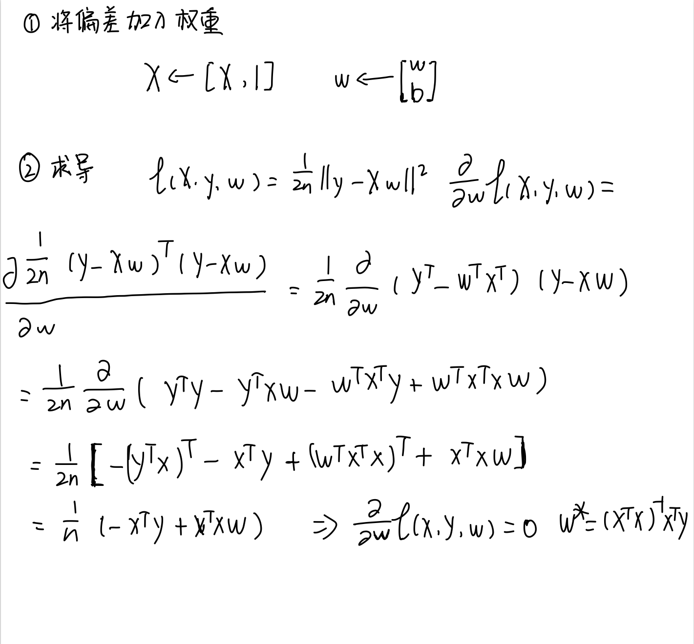
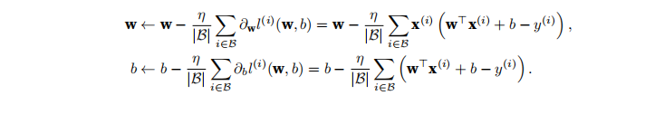
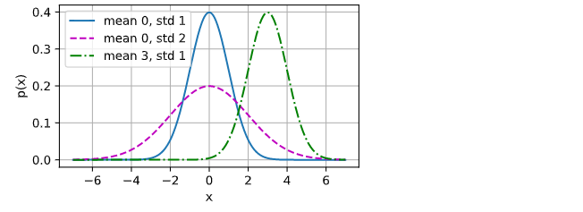

# 动手学深度学习-线性网络-第一节线性回归

## 一、线性回归

回归概念：回归是能为一个或者多个自变量与因变量之间关系建模的一类方法。在机器学习领域中的大多数任务通常与预测有关。预测房屋价格、预测住院时间。

线性回归：基于几个简单的假设，自变量x和因变量y之间的关系是线性的，也就是y可以表示为x中元素的加权和，这里通常允许观测值的一些噪声。

### 1.1 线性模型

线性假设是指目标可以表示为特征的加权和。

  

Warea和Wage称为权重，权重决定每一个特征对我们预测值的影响。b称为偏置(bias)、偏移量(offset)或者截距(intercept)。偏置是指当所有的特征都取值为0时，预测值应该是多少。

上图的公式其实是一个仿射变换：通过加权和对特征进行线性变换，并通过偏置项来进行平移。

机器学习领域，我们的输入数据通常是高维数据集，


  

  

这里的x是单个数据样本的特征。用X表示整个数据集的所有样本，X的每一行都是一个样本，每一列是一种特征。

对于特征集合X，预测值y可以通过：y = Xw + b表示

  

这样y其实是一个n维列向量，每一行都是一个样本下计算出的结果。

给定训练数据特征X和对应的已知标签y，线性回归的目标是找到一组权重向量w和偏置b:**当给定从X的同分布中取样的新样本特征时，这组权重向量和偏置能够使得新样本预测标签的误差尽可能小**

**无论使用什么手段来观察特征X和标签y，都可能出现少量的观测误差。我们只是假设特征与标签的潜在关系是线性的，我们会加入噪声项来考虑观测误差带来的影响。**


### 1.2 损失函数

&emsp;损失函数能够量化目标的实际值与预测值之间的差距，损失的数值越小，说明拟合程度越好。回归问题中最常用的损失函数是平方误差函数。类似于方差

  

这里算的只是一个样本，为了度量模型在整个数据集上的质量，我们需要计算在训练集n个样本上的损失均值

  

在训练模型时，我们希望总的损失最小，那么就要求找到一组**合适的参数**，最小化总的损失：
  

### 1.3解析解

线性回归的解可以用一个公式简单地表达出来，这类解叫做解析解。首先，我们将偏置b合并到参数w中，合并的方法是在包含所有参数的矩阵中附加一列。我们的预测问题是最小化||y-Xw||^2。下面找极小值点。对w求导。

  


最后的解析解：
  


但不是所有的问题都存在解析解。

### 1.4 随机梯度下降

梯度下降最简单的方法是计算损失函数关于模型参数的导数（其实就是梯度）。随机抽取一小批样本，进行梯度下降。

首先抽样一个小批量，计算小批量的平均损失关于模型参数的导数，最后将梯度乘以一个预定的整数，并从当前参数的值减去。

  

|B|表⽰每个⼩批量中的样本数，这也称为批量⼤⼩（batch size）。η表⽰学习率（learning rate）。批量⼤⼩和学习率的值通常是⼿动预先指定，⽽不是通过模型训练得到的。

这些可以调整但不在训练过程中更新的参数成为超参数。调参是选择超参数的过程。超参数通常是我们根据训练迭代结果来调整的，而训练迭代结果是在独立的验证数据集上评估得到的。

在训练了预先确定的若干次迭代次数之后，记录下模型的参数估计值。**这些参数估计值只能让损失值慢慢收敛，但却不能在有限的迭代次数内达到最小值。**

**难点：找到一组参数，在从未见过的数据上实现较低的损失，泛化问题。**


### 1.5 用模型进行预测

使用给定的模型估计一个新的训练数据的输出。


### 1.6 矢量化加速

在训练模型时，我们希望同时处理多个样本。对计算进行矢量化。

* for循环加法：
```python
import math
import time
import numpy as np
import torch
from d2l import torch as d2l

n = 10000
a = torch.ones(n)
b = torch.ones(n)

class Timer:
    """记录多次运行时间"""
    def __init__(self):
        self.times = []
        self.start()
    
    def start(self):
        """启动计时器"""
        self.tik = time.time() # 采集当前时间
    # 计算程序的运行时间  当前时间减去开始时间
    def stop(self):
        """停止计时器并且将时间记录在列表中"""
        self.times.append(time.time() - self.tik)
        return self.times[-1]  # 返回最新的时间差
    
    def sum(self):
        """返回时间总和"""
        return sum(self.times)
    
    def cumsum(self):
        """返回累计时间"""
        return np.array(self.times).cumsum().tolist()
    
c = torch.zeros(n)
timer = Timer()
for i in range(n):
    c[i] = a[i] + b[i]
    
print(f'{timer.stop():.5f} sec')
```

结果：0.12576 sec


* 矢量化

```python
timer.start()
d = a + b
print(f'{timer.stop():.5f} sec')

```
结果：0.00096 sec


### 1.7 正态分布与平方损失

正态分布也称为高斯分布，正态分布的概率密度函数是：
  

```python
def normal(x,mu,sigma):
    p = 1 / math.sqrt(2 * math.pi * sigma **2)
    return p * np.exp(-0.5 / sigma**2 * (x - mu)**2)

x = np.arange(-7,7,0.01)

params = [(0,1),(0,2),(3,1)]
d2l.plot(x, [normal(x, mu, sigma) for mu, sigma in params], xlabel='x',
ylabel='p(x)', figsize=(4.5, 2.5),
legend=[f'mean {mu}, std {sigma}' for mu, sigma in params])
```
  

我们假设观测中包含噪声，噪声服从于正态分布

  

写出w,b的极大似然估计函数：
  

### 1.8 从线性回归到深度网络

线性回归其实是一个单层的神经网络：
  

上图中，输入是x1,x2,xd,因此输入层中的输入数是d。网格的输出为o1,输出层的输出数是1。图中的神经网络的层数是1，我们将线性回归模型是为仅有单个人工神经元组成的神经网络，或者称为单层神经网络。

对于线性回归，每一个输入与输出相连，这种变换称为全连接层。

 


