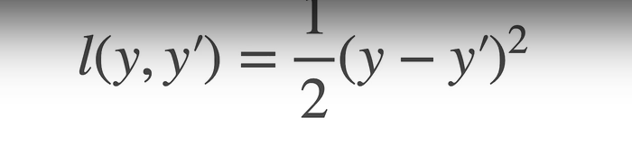
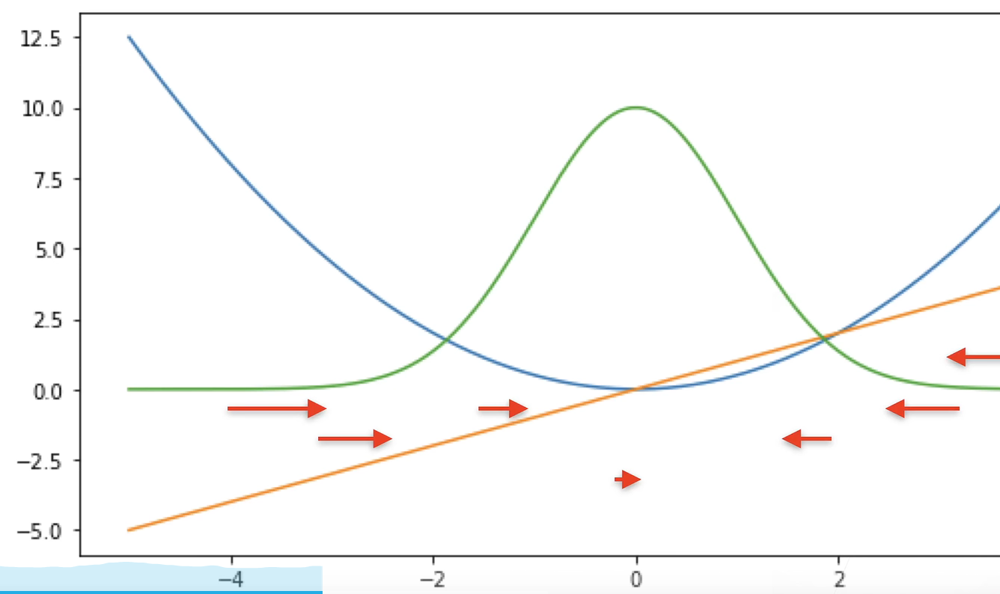
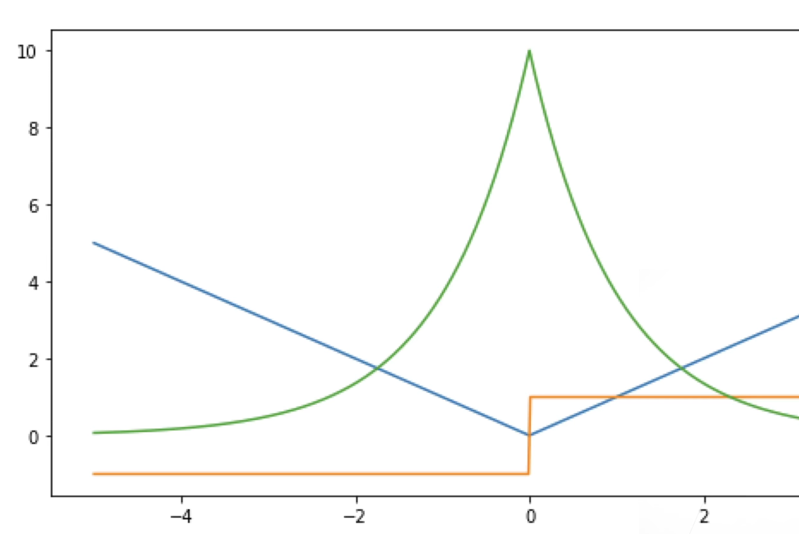
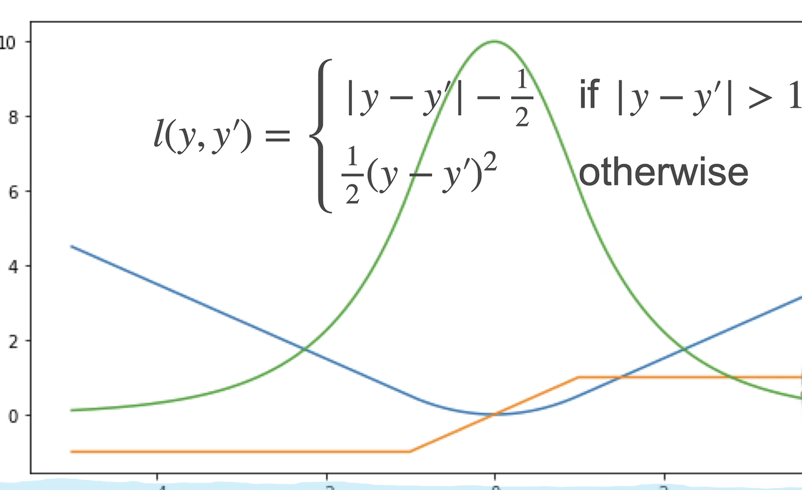
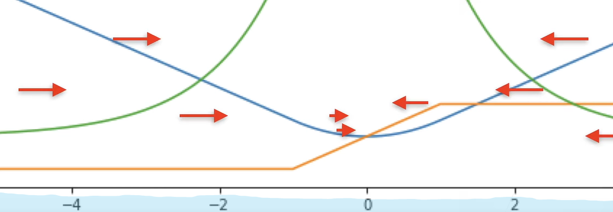

# 损失函数

## L2 Loss:均方损失

  

  

&emsp;蓝色的线代表损失函数曲线，橙色的线代表损失函数的导数，对损失函数进行求导，就可以发现梯度函数是一个线性函数，那么参数更新会从两边向中间靠拢，且速率越来越慢

## L1 Loss:绝对值损失

  

  

&emsp;蓝色的线代表损失函数，橙色的线代表损失函数的导数，绿色的线代表似然函数。不管真实值和预测值离得多远，梯度都是不变的，都是以同样的力度进行更新，由于0处不可导，优化不那么稳定。

## Huber's Robust Loss

  

&emsp;当真实值和预测值离得比较远的时候，损失函数就是一条直线，离得比较近的时候，损失函数就是平滑的曲线，

  

&emsp;橙色的线代表损失函数的导数，当真实值和预测值离得比较远，导数是个常数，梯度会以不变的速度进行下降，当真实值和预测值离得比较近的时候，导数是一条直线，那么梯度会以比较缓慢的速度进行变化。

