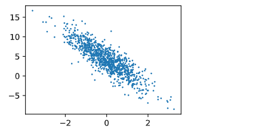
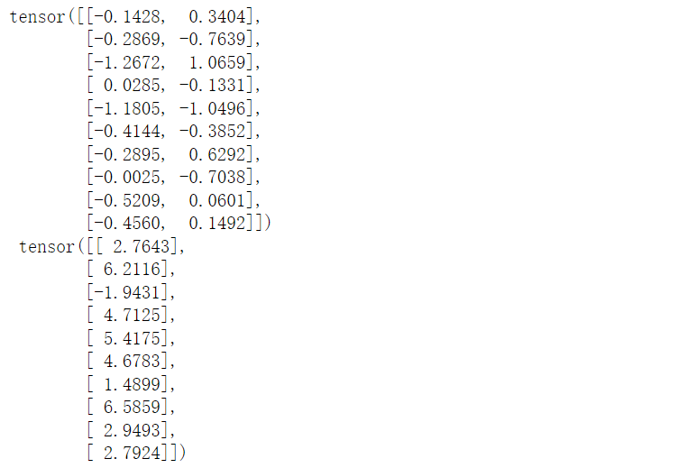

# 线性回归从0开始实现-复习

&emsp; 我们将从0开始实现整个方法，包括数据流水线、模型、损失函数和小批量随机梯度下降优化器

```python
%matplotlib inline
import random
import torch
from d2l import torch as d2l
```

## 一、生成数据集

&emsp; 根据带有噪声的线性模型构造一个人造数据集。我们使用线性模型参数w=[2,-3.4]^T,b = 4.2 和噪声项生成数据集以及标签：

  

```python

def synthetic_data(w,b,num_examples):
    """生成 y = Xw + b + 噪声"""
    X = torch.normal(0,1,(num_examples,len(w)))# 生成num_example行 len(w)列 的随机数矩阵
    y = torch.matmul(X,w) + b  # Xw相乘，最后加上b 偏置
    y += torch.normal(0,0.01,y.shape)# 生成噪声  形状与y矩阵一样
    
    return X,y.reshape((-1,1)) # 让y成为一个列向量

true_w = torch.tensor([2,-3.4])
true_b = 4.2
features,labels = synthetic_data(true_w,true_b,1000) # 生成X数据集 和标签y


# features中的每一行都包含一个二维数据样本，labels中的每一行都包含一维标签值（标量） features:n x 2矩阵   labels: n x 1矩阵
print('features:',features[0],'\nlabel:',labels[0])

d2l.set_figsize()
d2l.plt.scatter(features[:,1].detach().numpy(),labels.detach().numpy(),1) # 查看第二列和标签之间的关系

# detach() 分离出数值 不在含有梯度
# scatter()函数最后的一个1是绘制点直径的大小
# 这里绘制的是数据集的第二列（所有行）和标签的关系，观察线性关系

```
  


## 二、读取小批量数据集
&emsp;训练模型需要对数据集进行遍历，每次抽取一小批量样本，并使用它们来更新模型。我们需要定义一个函数，是的这个函数可以打乱数据集中的样本并且以小批量的方式获取数据。

&emsp;定义一个data_iter函数，该函数接受批量大小、特征矩阵和标签向量作为输入，生成大小为batch_size的小批量。每一个小批量包含一组特征和标签。

```python
def data_iter(batch_size,features,labels):
    num_examples = len(features)
    
    # 生成一个列表 0 - numexamples - 1
    indices = list(range(num_examples))
    
    # 打乱顺序  
    random.shuffle(indices)
    
    # 循环的步长是batch_size
    for i in range(0,num_examples,batch_size):
        # 获取一个批量
        # 获取到的张量 是一个打乱之后的一组样本（不同的下标） 样本数是10
        batch_indices = torch.tensor(indices[i:min(i + batch_size,num_examples)])
        # 通过yield创建生成器  节省内存空间 不必创建完整的list
        yield features[batch_indices],labels[batch_indices]
        
batch_size = 10 # 批量大小

# 循环数据迭代器 每次取出batch_size数据
for X,y in data_iter(batch_size,features,labels):
    print(X,'\n',y)
    # 只打印第一个批量的数据和标签
    break

```
  


&emsp; 通常，我们利用GPU并行运算的优势，处理合理大小的“小批量”。每一个样本都可以并行的进行模型计算，且每一个样本损失函数的梯度也可以被并行计算。GPU可以再处理几百个样本的时候，所花费的时间不比处理一个样本时间多太多。

&emsp;当我们运行迭代的时候，我们会连续的获得不同的小批量，直至遍历完整的数据集，上面实现的迭代对于教学来说很好，但是它的执行效率比较低，可能会在实际问题上出现问题，例如它要求我们将所有的数据加载到内存中并执行大量的随机内存访问。在深度学习框架中实现的内置迭代器效率要高得多，他可以处理存储在文件中的数据和数据流提供的数据。

## 三、初始化模型参数

&emsp;在我们使用小批量随机梯度下降优化我们的模型参数之前，我们需要先有一些参数，下面的代码中初始化一个均值为0、标准差为0.01的正态分布中随机数，并将偏置b初始化为0

```python
w = torch.normal(0,0.01,size(2,1),requires_grad=True) # requires_grad = True 表示需要计算梯度  通过normal采样随机数来初始化梯度
b = torch.zeros(1,requires_grad = True) # 全部初始化为0
```

&emsp;在初始化参数之后，我们的任务就是更新这些参数，直到这些参数足够拟合我们的数据。**每一次更新都需要计算损失函数关于模型参数的梯度。有了这个梯度，我们就可以向着减小损失的方向更新每一个参数**。**我们将引入自动微分来计算梯度**


## 四、定义模型

&emsp; 接下来定义模型，只需要计算输入特征X和模型权重w的矩阵-向量乘法之后再加上偏置b。注意上面的XW是一个向量（N行一列），但是b是一个标量。使用boardcast：向量加上一个标量，标量会被加到向量的每一个分量。

```python
def linreg(X,w,b):
    """线性回归模型"""
    return torch.matmul(X,w) + b

```

## 五、定义损失函数
&emsp; 因为需要计算损失函数的梯度，先定义损失函数，这里使用平方损失函数
**需要注意的是，这里需要将真实值y的形状转换成与预测值y_hat的形状相同**

```python
def squared_loss(y_hat,y):
    """均方损失"""
    return (y_hat - y.reshape(y_hat.shape)) ** 2 / 2 # 需要将真实值y的形状转换成预测值y_hat相同

```

## 六、定义优化算法

&emsp;在每一步中，使用从数据集中随机抽取的一个小批量数据，然后根据参数计算损失的梯度。然后，**朝着减小损失的方向更新我们的参数。**

```python
# 优化算法：小批量随机梯度下降法
def sgd(params,lr,batch_size):
    """小批量随机梯度下降"""

    # 更新时不需要计算梯度
    with torch.no_grad():

        # 对每一个参数进行计算
        for param in params:
            param = param - lr * param.grad / batch_size # 除以批量  算出梯度的均值

            # Pytorch会不断累加变量的梯度，每更新一次参数，就要让其对应的梯度清零
            param.grad.zero_()
```

&emsp;上面的函数就是定义了优化算法：小批量随机梯度下降法，该函数接受模型参数集合、学习速率和批量大小作为输入。每一步更新的大小由学习速率lr进行决定。因为我们计算的损失是一个批量样本的总和，所以我们使用批量大小(batch_size)来规范化步长，这样步长大小就不会取决于我们对批量大小的选择。

## 七、训练
&emsp;在每一次迭代中，我们读取一小批量训练样本，并通过我们的模型来获得一组预测。计算完损失之后，我们开始反向传播，存储每一个参数的梯度，最后，我们调用优化算法sgd来更新模型参数。

&emsp;在每一个迭代周期中，我们使用data_iter函数遍历整个数据集，并将训练数据集中所有样本都使用一次（假设样本数能够被批量大小整除）。这里的迭代周期个数num_epochs和学习率lr都是超参数，分别是3和0.03。设置超参数需要进行反复实验。


```python
lr = 0.03 # 超参数：学习率
num_epochs = 3 # 超参数：迭代周期
net = linreg # 线性模型
loss = squared_loss # 损失函数：均方损失

# 优化算法：小批量随机梯度下降法
def sgd(params,lr,batch_size):
    """小批量随机梯度下降"""
    # 更新时不需要计算梯度
    with torch.no_grad():
        for param in params:
            param -= lr * param.grad / batch_size # 除以批量  算出梯度的均值
            param.grad.zero_()

for epoch in range(num_epochs):
    for X,y in data_iter(batch_size,features,labels):
        # 每次读取批量的数据
        # 计算X和y的小批量损失
        l = loss(net(X,w,b),y) # net(X,w,b) 表示使用模型预测的值 y是真实值
        
        # l的形状是一个多维的列向量（batch_size,1）,而不是一个标量，l中所有的元素被加到一起
        # 并以此计算关于参数[w,b]的梯度
        # 自动求导那一节说到向量求梯度比较麻烦，都是通过sum()求和之后转化为标量再求梯度
        l.sum().backward() # 该语句执行之后，会对损失函数中的参数w,b进行方向导数的求解，并对每一个参数的导数
        # 表达存储到变量名.grad中 也就是l.backward = w.grad + b.grad
        # 使用参数的梯度更新参数
        sgd([w,b],lr,batch_size)
        
    # 对整个数据集扫完一遍之后，对整个数据集进行一定的评估，计算损失函数
    with torch.no_grad():
        train_l = loss(net(features,w,b),labels)  # 计算出来是一个多维的列向量：len(features) x 1
        # 这里需要打印损失函数的均值
        print(f'epoch {epoch + 1},loss {float(train_l.mean()):f}')

```


```python
print(f'w的估计误差：{true_w - w.reshape(true_w.shape)}')
print(f'b的估计误差：{true_b - b}')

```

&emsp;通过比较真实参数和训练学到的参数来评估训练的成功程度。


&emsp;在机器学习中，我们通常不太关系恢复真正的参数，而是更加关系如何高度正确的预测参数。幸运的是，即使是在复杂的优化问题上，随机梯度下降通常也能找到非常好的解。（在深度网络中存在着许多参数组合可以实现高度精确的预测）


