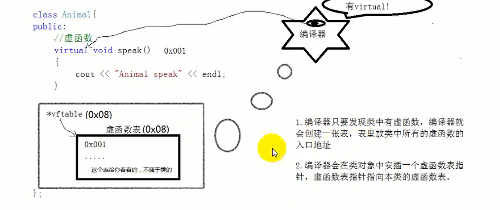
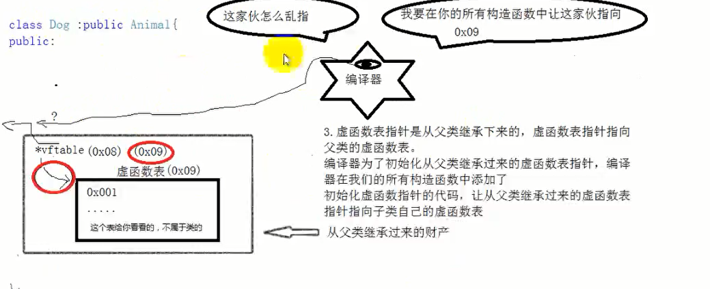
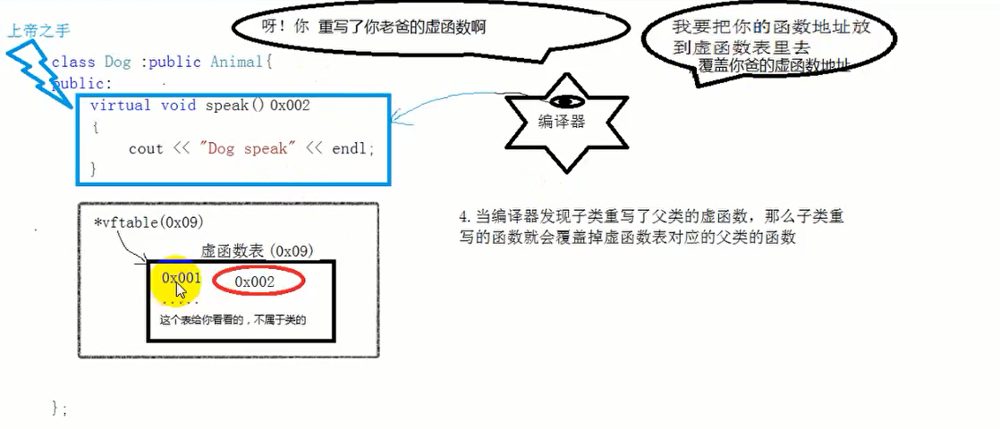
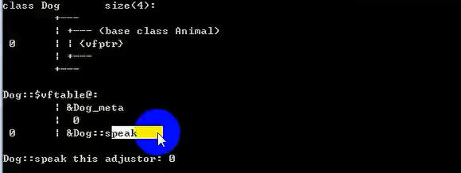
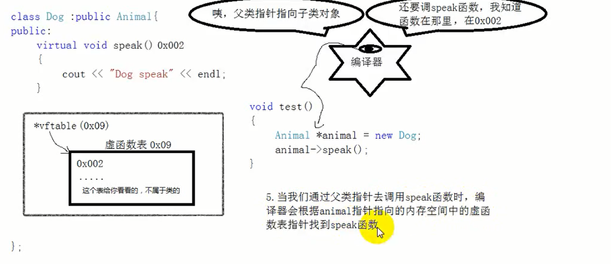

# C++多态学习笔记

## 一、多态概述

&emsp;同一个操作作用于不同的对象，可以有不同的解释，会产生不同的效果，这就是多态

```cpp
#define _CRT_SECURE_NO_WARNINGS
#include<iostream>
using namespace std;

class People
{
public:
	// 虚函数
	virtual void Mypro()
	{
		cout << "父类的虚函数" << endl;  // 在编译阶段就确定了调用speak这个函数 
	}
};

class xishi :public People
{
public:
	// 重写父类虚函数
	virtual void Mypro()
	{
		cout << "西施的虚函数" << endl;
	}
};

class wangzhaojun :public People
{
public:
	// 重写父类虚函数
	virtual void Mypro()
	{
		cout << "王昭君的虚函数" << endl;
	}
};

class diaochan :public People
{
public:
	// 重写父类虚函数
	virtual void Mypro()
	{
		cout << "貂蝉的虚函数" << endl;
	}
};

// 同一个操作
void doLogin(People* pro)
{
	pro->Mypro();
}

void test()
{
	// 创建不同的对象 会产生不同的效果


	People* pro = NULL;
	pro = new xishi;
	doLogin(pro);// 继承 向上转换   指针范围缩小
	delete pro;


	pro = new wangzhaojun;
	doLogin(pro);// 继承向上转换 
	delete pro;
}


int main()
{
	//test02();
	test();
	return EXIT_SUCCESS;
}

```

## 二、多态的作用


* 可以解决项目中的紧耦合问题，提供程序的可扩展性
* 应用程序不必为每一个实现子类的功能调用编写代码

## 三、多态发生的三个条件

* 有多继承
* 重写父类的虚函数
* 父类指针指向子类对象

## 四、多态实现的原理

  

  


  


* 编译器只要发现类中有虚函数，编译器就会创建一张表，表中存放类中所有的虚函数的入口地址

* 编译器会在类对象中安插一个虚函数表指针，虚函数表指针指向本类的虚函数表

* 虚函数表指针是从父类继承下来的，虚函数表指针指向父类的虚函数表，编译器未来初始化从父类继承过来的虚函数表指针，编译器在我们的所有构造函数中添加了初始化虚函数指针的代码，让从父类继承过来的虚函数表指针指向子类自己的虚函数表

* 当编译器发现子类重写了父类的虚函数，那么子类重写的函数就会覆盖掉虚函数表对应的父类的函数
  
* 当我们通过父类指针去调用speak函数时，编译器会根据animal指针指向的内存空间中的虚函数表指针找到speak函数

  

  

```cpp
#define _CRT_SECURE_NO_WARNINGS
#include<iostream>
using namespace std;

class People
{
public:
	// 虚函数
	virtual void Mypro()
	{
		cout << "父类的虚函数" << endl;  // 在编译阶段就确定了调用speak这个函数 
	}
};

class xishi :public People
{
public:
	// 重写父类虚函数
	virtual void Mypro()
	{
		cout << "西施的虚函数" << endl;
	}
};

class wangzhaojun :public People
{
public:
	// 重写父类虚函数
	virtual void Mypro()
	{
		cout << "王昭君的虚函数" << endl;
	}
};

class diaochan :public People
{
public:
	// 重写父类虚函数
	virtual void Mypro()
	{
		cout << "貂蝉的虚函数" << endl;
	}
};

// 同一个操作
void doLogin(People* pro)
{
	pro->Mypro();
}

void test()
{
	// 创建不同的对象 会产生不同的效果
	People* pro = NULL;// 父类指针
	pro = new xishi;// 父类指针 指向子类对象
	doLogin(pro);// 继承 向上转换   指针范围缩小
	delete pro;

	pro = new wangzhaojun;
	doLogin(pro);// 继承向上转换 
	delete pro;
}


int main()
{
	//test02();
	test();
	return EXIT_SUCCESS;
}

```

**将代码分成 抽象层 实现层  业务层**
```cpp
#define _CRT_SECURE_NO_WARNINGS
#include<iostream>
using namespace std;

// 抽象层  很多函数不在这里实现 仅仅定义一下
class rule
{
public:
	virtual int getnum(int a, int b)
	{
		return 0;
	}
};

// 实现层  通过虚函数 实现不改变父类的基础上 扩展功能
// 所以实现层 可以有很多类
class plus_rule :public rule
{
public:
	virtual int getnum(int a, int b)
	{
		return a + b;// 重载父类的虚函数
	}
};

// 实现层代码
class miux_rule :public rule
{
public:
	virtual int getnum(int a, int b)
	{
		return a - b;// 重载父类的虚函数  做减法
	}
};


// 业务层  业务层调用抽象层的代码 通过抽象层的对象指针 （该指针指向实现层对象）
int doLogin(rule *cal)
{
	int a = 10;
	int b = 20;
	int ret = cal->getnum(a,b);// 函数的调用还是通过父类指针  父类指针指向子类对象
	return ret;
}

// 测试
void test()
{
	rule* r = NULL;
	r = new plus_rule;
	cout << doLogin(r) << endl;
	delete r;

	
	rule *m = new miux_rule;// 父类指针指向子类对象   向上转换
	cout << doLogin(m) << endl;// 调用不同实现层的代码
	delete m;

}

int main()
{
	//test02();
	test();
	return EXIT_SUCCESS;
}

```

**开闭原则：对修改源代码关闭，对扩展新功能进行开发**


**一般情况下，都会将抽象层的被重载函数写成纯虚函数**

```cpp
#define _CRT_SECURE_NO_WARNINGS
#include<iostream>
using namespace std;

// 抽象层  很多函数不在这里实现 仅仅定义一下
class rule
{
public:
	virtual int getnum(int a, int b) = 0;
};

// 实现层  通过虚函数 实现不改变父类的基础上 扩展功能
// 所以实现层 可以有很多类
class plus_rule :public rule
{
public:
	virtual int getnum(int a, int b)
	{
		return a + b;// 重载父类的虚函数
	}
};

// 实现层代码
class miux_rule :public rule
{
public:
	virtual int getnum(int a, int b)
	{
		return a - b;// 重载父类的虚函数  做减法
	}
};


// 业务层  业务层调用抽象层的代码 通过抽象层的对象指针 （该指针指向实现层对象）
int doLogin(rule *cal)
{
	int a = 10;
	int b = 20;
	int ret = cal->getnum(a,b);// 函数的调用还是通过父类指针  父类指针指向子类对象
	return ret;
}

// 测试
void test()
{
	rule* r = NULL;
	r = new plus_rule;
	cout << doLogin(r) << endl;
	delete r;

	
	rule *m = new miux_rule;// 父类指针指向子类对象   向上转换
	cout << doLogin(m) << endl;// 调用不同实现层的代码
	delete m;

}

int main()
{
	//test02();
	test();
	return EXIT_SUCCESS;
}
```

**有纯虚函数的类叫做抽象类，不可以实例化对象**

```cpp
#define _CRT_SECURE_NO_WARNINGS
#include<iostream>
using namespace std;

// 抽象层  很多函数不在这里实现 仅仅定义一下
class rule
{
public:
	virtual int getnum(int a, int b) = 0;
};

// 实现层  通过虚函数 实现不改变父类的基础上 扩展功能
// 所以实现层 可以有很多类
class plus_rule :public rule
{
public:
	virtual int getnum(int a, int b)
	{
		return a + b;// 重载父类的虚函数
	}
};

// 实现层代码
class miux_rule :public rule
{
public:
	virtual int getnum(int a, int b)
	{
		return a - b;// 重载父类的虚函数  做减法
	}
};


// 业务层  业务层调用抽象层的代码 通过抽象层的对象指针 （该指针指向实现层对象）
int doLogin(rule *cal)
{
	int a = 10;
	int b = 20;
	int ret = cal->getnum(a,b);// 函数的调用还是通过父类指针  父类指针指向子类对象
	return ret;
}

// 测试
void test()
{
	rule* r = NULL;
	r = new plus_rule;
	cout << doLogin(r) << endl;
	delete r;

	
	rule *m = new miux_rule;// 父类指针指向子类对象   向上转换
	cout << doLogin(m) << endl;// 调用不同实现层的代码
	delete m;

}

int main()
{
	//test02();
	test();
	return EXIT_SUCCESS;
}

```

**子类继承抽象类，子类必须实现抽象类的所有纯虚函数，不然子类也变为抽象类**

```cpp
#define _CRT_SECURE_NO_WARNINGS
#include<iostream>
using namespace std;


class Maker
{
public:
	virtual void func1() = 0;
	virtual void func2() = 0;
};

// 子类需要实现父类的所有虚函数
class Son :public Maker
{
	virtual void func1()
	{

	}
	virtual void func2()
	{

	}
};

void test()
{
	Son s;
}

int main()
{
	test();
	return EXIT_SUCCESS;
}

```

## 五、接口的定义

&emsp;所谓的接口，就是将内部实现细节封装起来，外部用户通过预留的接口可以使用接口的功能而不需要知晓内部具体的细节，C++中，通过类实现面对对象的编程，在基类中只给出纯虚函数的声明，然后在派生类中实现纯虚函数的具体定义的方式实现接口，不同派生类实现接口的方式也不相同

```cpp
#define _CRT_SECURE_NO_WARNINGS
#include<iostream>
using namespace std;

class Father
{
public:
	virtual void func1() = 0;// 接口的声明
	virtual void func2(int a) = 0;
	virtual void func3(int a,int b) = 0;
};

class Son :public Father
{
public:
	virtual void func1()
	{

	}
	virtual void func2(int a)
	{

	}
	virtual void func3(int a,int b)
	{

	}
};


int main()
{

	return EXIT_SUCCESS;
}

```

## 六、模板方法模式

```cpp
#define _CRT_SECURE_NO_WARNINGS
#include<iostream>
using namespace std;

class Drink
{
public:
	//zhu
	virtual void Boil() = 0;

	// 冲泡
	virtual void Brew() = 0;

	// 导入杯中
	virtual void PourInCup() = 0;

	// 加点辅料
	virtual void addSonm() = 0; 

	// 模板方法  抽象类将所有的虚基类方法归纳 然后   实现层实现每一个方法
	void func()
	{
		Boil();
		Brew();
		PourInCup();
		addSonm();
	}

};


class Coffee :public Drink
{
public:

	//zhu
	virtual void Boil()
	{
		cout << "煮点露水" << endl;
	}

	// 冲泡
	virtual void Brew()
	{
		cout << "拿铁" << endl;
	}

	// 导入杯中
	virtual void PourInCup()
	{
		cout << "导入盆中" << endl;
	}

	// 加点辅料
	virtual void addSonm()
	{
		cout << "加点糖" << endl;
	}
};

class Tea :public Drink
{
public:
	//zhu
	virtual void Boil()
	{
		cout << "煮点露水" << endl;
	}

	// 冲泡
	virtual void Brew()
	{
		cout << "茶叶" << endl;
	}

	// 导入杯中
	virtual void PourInCup()
	{
		cout << "导入盆中" << endl;
	}

	// 加点辅料
	virtual void addSonm()
	{
		cout << "加点糖" << endl;
	}

};


void test()
{
	// 父类指针指向子类对象
	Drink* d = NULL;
	d = new Coffee;
	d->func();
	delete d;

	d = new Tea;
	d->func();
	delete d;
	d = NULL;
}

int main()
{
	test();
	return EXIT_SUCCESS;
}

```


## 七、虚析构函数和纯虚析构函数


运行下面这段代码，因为静态联编：不会执行子类的析构函数

```cpp
#define _CRT_SECURE_NO_WARNINGS
#include<iostream>
using namespace std;

class Animal
{
public:
	Animal()
	{
		cout << "Animal 的构造函数" << endl;
	}

	~Animal()
	{
		cout << "Animal 的析构函数" << endl;
	}
};

class Son :public Animal
{
public:
	Son()
	{
		cout << "Son的构造函数" << endl;
		pName = new char[64];// 新建一个堆
		memset(pName,0,64);// 初始化0  全部字节
		strcpy(pName,"如花");// 拷贝字符串
	}

	~Son()
	{
		cout << "Son的析构函数" << endl;
		if (pName != NULL)
		{
			delete[] pName;
			pName = NULL;
		}
	}
public:
	char* pName;
};

void test()
{
	Animal* animal = new Son;
	delete animal;
}

int main()
{
	test();
	return EXIT_SUCCESS;
}

```

**也就是，上面这段代码，基类指针指向了派生类对象，先执行基类的构造函数，然后执行子类的构造函数，但是delete的时候，只能执行基类的析构函数，不可以执行子类的析构函数**

### 7.1 虚析构函数

**虚析构函数是为了解决基类指针指向派生类对象，并使用基类指针释放派生类对象**

```cpp
#define _CRT_SECURE_NO_WARNINGS
#include<iostream>
using namespace std;

class Animal
{
public:
	Animal()
	{
		cout << "Animal 的构造函数" << endl;
	}

	// 虚析构函数可以调用子类的虚析构函数
	virtual ~Animal()
	{
		cout << "Animal 的析构函数" << endl;
	}
};

class Son :public Animal
{
public:
	Son()
	{
		cout << "Son的构造函数" << endl;
		pName = new char[64];// 新建一个堆
		memset(pName,0,64);// 初始化0  全部字节
		strcpy(pName,"如花");// 拷贝字符串
	}

	~Son()
	{
		cout << "Son的析构函数" << endl;
		if (pName != NULL)
		{
			delete[] pName;
			pName = NULL;
		}
	}
public:
	char* pName;
};

void test()
{
	Animal* animal = new Son;
	delete animal;
}

int main()
{
	test();
	return EXIT_SUCCESS;
}

```

### 7.2 纯虚析构函数

**纯虚析构函数，有纯虚析构函数的类是抽象类，不可以实例化对象**

**纯虚析构函数需要在类外实现**

```cpp
#define _CRT_SECURE_NO_WARNINGS
#include<iostream>
using namespace std;

class Animal
{
public:
	Animal()
	{
		cout << "Animal 的构造函数" << endl;
	}

	// 虚析构函数可以调用子类的虚析构函数
	virtual ~Animal() = 0;
};

// 在类外实现纯虚析构函数
Animal::~Animal()
{

}

class Son :public Animal
{
public:
	Son()
	{
		cout << "Son的构造函数" << endl;
		pName = new char[64];// 新建一个堆
		memset(pName,0,64);// 初始化0  全部字节
		strcpy(pName,"如花");// 拷贝字符串
	}

	~Son()
	{
		cout << "Son的析构函数" << endl;
		if (pName != NULL)
		{
			delete[] pName;
			pName = NULL;
		}
	}
public:
	char* pName;
};

void test()
{
	Animal* animal = new Son;
	delete animal;
}

int main()
{
	test();
	return EXIT_SUCCESS;
}

```

**虚析构函数和纯虚析构函数的区别：**

* 有纯虚析构函数的类是抽象类，不能实例对象 而且要在类外实现
* 虚析构函数不需要在类外实现


## 八、重写重载重定义

* 重载：同一作用域的同名函数
* 重定义（隐藏）：有继承，子类（派生类）重新定义父类（基类）的同名成员（非Virtual函数）
* 重写：有继承，子类（派生类）重写父类(基类)的virtual函数，函数返回值，函数名字，函数参数，必须和基类中的虚函数一致


## 九、父类引用子类对象

```cpp
#define _CRT_SECURE_NO_WARNINGS
#include<iostream>
using namespace std;

class Animal
{
public:
	virtual void speak()
	{
		cout << "Animal 的构造函数" << endl;
	}
};

class Dog :public Animal
{
public:
	virtual void speak()
	{
		cout << "构造函数" << endl;
	}
};


void test()
{
	Animal &animal = Dog();
	//delete animal;
	animal.speak();
}

int main()
{
	test();
	return EXIT_SUCCESS;
}

```


