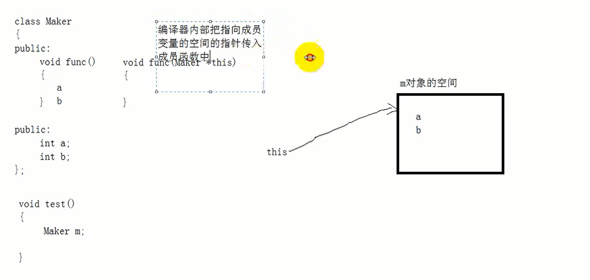

# C++对象模型

## 一、空类的大小是1不是0

**空类大小是1  因为编译器从内存更好区分对象**
```cpp
#include<iostream>
using namespace std;
#define _CRT_SECURE_NO_WARNINGS
#pragma warning(disable:4996)

class Maker
{

};

void test01()
{
	cout << sizeof(Maker) << endl;// 输出1  空类大小是1  因为编译器从内存更好区分对象
	Maker* m = new Maker[20];
	cout << sizeof(m) << endl;// 输出4
}

int main()
{

	test01();

	return EXIT_SUCCESS;
}


```

## 二、类的成员函数不占用类的大小

```cpp
#include<iostream>
using namespace std;
#define _CRT_SECURE_NO_WARNINGS
#pragma warning(disable:4996)

class Maker
{
public:
	void func()
	{
		// 成员函数不占用内存空间
	}
};

void test01()
{
	cout << sizeof(Maker) << endl;// 输出1  空类大小是1  因为编译器从内存更好区分对象
	Maker* m = new Maker[20];
	cout << sizeof(m) << endl;// 输出4
}

int main()
{
	test01();
	return EXIT_SUCCESS;
}
```

## 三、静态成员变量不占用类的大小

```cpp
#include<iostream>
using namespace std;
#define _CRT_SECURE_NO_WARNINGS
#pragma warning(disable:4996)

class Maker
{
public:
	void func()
	{
		// 成员函数不占用内存空间
	}

	static int a;
};

int Maker::a = 100;// 静态成员变量赋值

void test01()
{
	cout << sizeof(Maker) << endl;// 输出1  空类大小是1  因为编译器从内存更好区分对象
	
}

int main()
{

	test01();
	return EXIT_SUCCESS;
}


```

## 四、静态成员函数不占用类的大小

```cpp
#include<iostream>
using namespace std;
#define _CRT_SECURE_NO_WARNINGS
#pragma warning(disable:4996)

class Maker
{
public:
	void func()
	{
		// 成员函数不占用内存空间
	}

	static int a;// 静态成员变量不占用内存大小

	static void test()
	{
		// 静态成员函数不占用内存大小

	}
};

int Maker::a = 100;// 静态成员变量赋值

void test01()
{
	cout << sizeof(Maker) << endl;// 输出1  空类大小是1  因为编译器从内存更好区分对象
	
}

int main()
{

	test01();
	return EXIT_SUCCESS;
}
```

## 五、普通成员变量占用类的大小

```cpp
#include<iostream>
using namespace std;
#define _CRT_SECURE_NO_WARNINGS
#pragma warning(disable:4996)

class Maker
{
public:
	void func()
	{
		// 成员函数不占用内存空间
	}

	static int a;// 静态成员变量不占用内存大小

	static void test()
	{
		// 静态成员函数不占用内存大小

	}

	int b;// 普通成员变量占用内存
};

int Maker::a = 100;// 静态成员变量赋值

void test01()
{
	cout << sizeof(Maker) << endl;// 输出1  空类大小是1  因为编译器从内存更好区分对象	
}

int main()
{
	test01();
	return EXIT_SUCCESS;
}
```

**注意：类的成员变量和成员函数是分开存储的**

## 六、成员函数如何访问到成员变量

**既然类的成员变量和成员函数是分开存放的，那么成员函数如何访问到成员变量**

  

**结论：成员函数默认传入一个参数 Maker *this指针，这个指针指向你定义的类对象内存空间，由于成员变量和类一起存放，所以this指针是可以访问到成员变量**