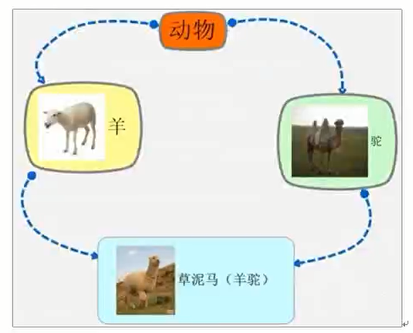

# C++继承

## 一、继承的作用

* 代码的复用
* 扩展功能

```cpp
#define _CRT_SECURE_NO_WARNINGS
#include<iostream>
using namespace std;

// 继承的作用1：代码的复用  2 扩展功能
class Father
{
public:
	void func1()
	{
		cout << "高颜值" << endl;
	}
	void func2()
	{
		cout << "有钱" << endl;
	}
};

class Son:public Father
{
public:
	void fun3()
	{
		cout << "油菜花" << endl;
	}
};

void test()
{
	Son s;
	s.func1();
	s.func2();
	s.fun3();
}

int main()
{
	test();
	return EXIT_SUCCESS;
}
```

## 二、继承的方式

### 2.1 继承方式种类
* 公有继承
* 私有继承
* 保护继承

### 2.2 子类从父类继承过来的成员的权限

#### 2.2.1 公有继承
* 公有成员:父类的公有属性成员进入子类还是公有
**类内和类外都可以访问私有成员**

```cpp
#define _CRT_SECURE_NO_WARNINGS
#include<iostream>
using namespace std;

class Father
{
public:
	int a;

private:
	int b;

protected:
	int c;
};


class Son1:Father
{
public:
	void func()
	{
		cout << a <<endl;// 从类内进行访问 OK
	}
};

void test()
{
	Son1 s;
	s.a;// 从类外进行访问 OK
}

int main()
{
    test();

	return EXIT_SUCCESS;
}

```

* 私有成员：父类的私有成员进入子类还是私有的成员

**类内和类外都不可以访问私有成员**


```cpp
#define _CRT_SECURE_NO_WARNINGS
#include<iostream>
using namespace std;

class Father
{
public:
	int a;

private:
	int b;

protected:
	int c;
};


class Son1:Father
{
public:
	void func()
	{
		//cout << a <<endl;// 从类内进行访问
		cout << b << endl;//私有成员不可以进行访问 报错
	}
};

void test()
{
	Son1 s;
	s.b;// 从类外进行访问私有成员 报错

}

int main()
{
	test();

	return EXIT_SUCCESS;
}
```

* 保护成员：父类的成员到子类还是保护成员
**类内可以访问私有成员 类外不可以访问私有成员**

```cpp
#define _CRT_SECURE_NO_WARNINGS
#include<iostream>
using namespace std;

class Father
{
public:
	int a;

private:
	int b;

protected:
	int c;
};


class Son1:Father
{
public:
	void func()
	{
		//cout << a <<endl;// 从类内进行访问
		cout << c << endl;//子类可以访问保护成员  不报错
	}
};

void test()
{
	Son1 s;
	s.b;// 从类外进行访问保护成员  报错
}

int main()
{
	test();
	return EXIT_SUCCESS;
}
```

#### 2.2.2 保护继承

* 公有属性

**父类公有属性 子类保护属性**

```cpp
#define _CRT_SECURE_NO_WARNINGS
#include<iostream>
using namespace std;

class Father
{
public:
	int a;

private:
	int b;

protected:
	int c;
};

class Son1:protected Father
{
public:
	void func()
	{
		cout << a <<endl;// 从类内进行访问 OK
	}
};

void test()
{
	Son1 s;
	s.a;// 从类外进行访问保护成员  报错
}

int main()
{
	test();
	return EXIT_SUCCESS;
}

```

* 私有属性

**父类私有属性 子类还是私有属性**

```cpp
#define _CRT_SECURE_NO_WARNINGS
#include<iostream>
using namespace std;

class Father
{
public:
	int a;

private:
	int b;

protected:
	int c;
};


class Son1:protected Father
{
public:
	void func()
	{
		cout << b <<endl;// 从类内进行访问 报错  仍然是私有属性
	}
};

void test() 
{
	Son1 s;
	s.b;// 从类外进行访问保护成员  报错  
}

int main()
{
	test();

	return EXIT_SUCCESS;
}

```

* 保护属性
**父类保护属性  子类仍然是保护属性**

```cpp
#define _CRT_SECURE_NO_WARNINGS
#include<iostream>
using namespace std;

class Father
{
public:
	int a;

private:
	int b;

protected:
	int c;
};


class Son1:protected Father
{
public:
	void func()
	{
		cout << c <<endl;// 从类内进行访问 OK
	}
};

void test() 
{
	Son1 s;
	s.c;// 从类外进行访问保护成员  报错  
}

int main()
{
	test();

	return EXIT_SUCCESS;
}
```


#### 2.2.3 私有继承

* 父类的公有属性成员  到子类是保护
* 父类的私有属性成员  到子类还是私有
* 父类的保护属性成员  到子类还是保护

* 公有属性

**公有属性变成保护属性**
```cpp
#define _CRT_SECURE_NO_WARNINGS
#include<iostream>
using namespace std;

class Father
{
public:
	int a;

private:
	int b;

protected:
	int c;
};


class Son1:private Father
{
public:
	void func()
	{
		cout << a <<endl;// 从类内进行访问 OK
	}
};

void test() 
{
	Son1 s;
	s.a;// 从类外进行访问保护成员  报错    变成保护属性
}

int main()
{
	test();

	return EXIT_SUCCESS;
}

```

* 私有属性
**父类的私有属性成员 到子类还是私有属性成员**

```cpp
#define _CRT_SECURE_NO_WARNINGS
#include<iostream>
using namespace std;

class Father
{
public:
	int a;

private:
	int b;

protected:
	int c;
};


class Son1:private Father
{
public:
	void func()
	{
		cout << b <<endl;// 从类内进行访问 ERROR
	}
};

void test() 
{
	Son1 s;
	s.b;// 从类外进行访问保护成员  报错  还是私有属性
}

int main()
{
	test();

	return EXIT_SUCCESS;
}

```


* 保护属性
**父类的保护属性 子类还是保护属性**

```cpp
#define _CRT_SECURE_NO_WARNINGS
#include<iostream>
using namespace std;

class Father
{
public:
	int a;

private:
	int b;

protected:
	int c;
};


class Son1:private Father
{
public:
	void func()
	{
		cout << c <<endl;// 从类内进行访问 OK
	}
};

void test() 
{
	Son1 s;
	s.c;// 从类外进行访问保护成员  报错 还是保护属性
}

int main()
{
	test();
	return EXIT_SUCCESS;
}

```

## 三、继承中的构造和析构的调用


* 继承调用顺序
**先调用父类的构造函数 在调用子类的构造函数  析构函数调用顺序相反**

```cpp
#define _CRT_SECURE_NO_WARNINGS
#include<iostream>
using namespace std;

class Father
{
public:
	Father() {
		cout << "构造函数" << endl;
	}

	~Father() {
		cout << "析构函数" << endl;
	}
};

// 先调用父类的构造函数 在调用子类的构造函数  析构函数调用顺序反之
class Son :public Father
{
public:
	Son() {
		cout << "Son构造函数" << endl;
	}

	~Son()
	{
		cout << "Son析构函数" << endl;
	}
};

void test()
{
	Son s;
}

int main()
{
	test();

	return EXIT_SUCCESS;
}
```


* 继承和组合的混搭

**先调用父类的构造，然后调用成员对象的构造，最后调用本身的构造，析构函数反之**

```cpp
#define _CRT_SECURE_NO_WARNINGS
#include<iostream>
using namespace std;

class A
{
public:
	A()
	{
		cout << "A的构造函数" << endl;
	}

	~A()
	{
		cout << "A的析构函数" << endl;
	}
};

class B
{
public:
	B()
	{
		cout << "B的构造函数" << endl;
	}

	~B()
	{
		cout << "B的析构函数" << endl;
	}
};

class C
{
public:
	C()
	{
		cout << "C的构造函数" << endl;
	}

	~C()
	{
		cout << "C的析构函数" << endl;
	}
};


class D:public A
{
public:
	D()
	{
		cout << "D的构造函数" << endl;
	}

	~D()
	{
		cout << "D的析构函数" << endl;
	}

public:
	B b;
	C c;
};

void test()
{
	D d;
}

int main()
{
	test();

	return EXIT_SUCCESS;
}

```

先调用A的构造函数，在调用B C 的构造函数 最后调用D的构造函数


```cpp
#define _CRT_SECURE_NO_WARNINGS
#include<iostream>
using namespace std;

class Father
{
public:
	Father()
	{
		cout << "Father的构造函数" << endl;
	}

	~Father()
	{
		cout << "Father的析构函数" << endl;
	}
};

class Son:public Father
{
public:
	Son()
	{
		cout << "Son的构造函数" << endl;
	}

	~Son()
	{
		cout << "Son的析构函数" << endl;
	}
};

class A
{
public:
	A()
	{
		cout << "A的构造函数" << endl;
	}
	~A()
	{
		cout << "A的析构函数" << endl;
	}
public:
	Son s;
};

class B
{
public:
	B()
	{
		cout << "B的构造函数" << endl;
	}

	~B()
	{
		cout << "B的析构函数" << endl;
	}
};

class C
{
public:
	C()
	{
		cout << "C的构造函数" << endl;
	}

	~C()
	{
		cout << "C的析构函数" << endl;
	}
};


class D:public A
{
public:
	D()
	{
		cout << "D的构造函数" << endl;
	}

	~D()
	{
		cout << "D的析构函数" << endl;
	}

public:
	B b;
	C c;
};

void test()
{
	D d;
}

int main()
{
	test();

	return EXIT_SUCCESS;
}
```

先调用父类A的成员对象的父类的构造函数


## 三、继承中同名成员的处理方法
* 当子类和父类有相同的同名成员的时候，子类会隐藏父类的同名成员

```cpp
#define _CRT_SECURE_NO_WARNINGS
#include<iostream>
using namespace std;

class Father
{
public:
	Father()
	{
		a = 10;
	}
public:
	int a;
};

class Son:public Father
{
public:
	Son()
	{
		a = 20;
	}
public:
	int a;
};

void test()
{
	Son s;
	cout << s.a << endl;// 访问的是自己的成员变量
}

int main()
{
	test();
	return EXIT_SUCCESS;
}
```

**可以通过作用域访问父类的同名成员变量**

```cpp
#define _CRT_SECURE_NO_WARNINGS
#include<iostream>
using namespace std;

class Father
{
public:
	Father()
	{
		a = 10;
	}
public:
	int a;
};

class Son:public Father
{
public:
	Son()
	{
		a = 20;
	}
public:
	int a;
};

void test()
{
	Son s;
	cout << s.a << endl;// 访问的是自己的成员变量

	// 可以通过作用域来访问父类的成员变量
	cout << s.Father::a << endl;
}

int main()
{
	test();
	return EXIT_SUCCESS;
}
```

* 当子类和父类有同名函数的时候，父类的所有函数重载都会被隐藏完毕

```cpp
#define _CRT_SECURE_NO_WARNINGS
#include<iostream>
using namespace std;

class Father
{
public:
	Father()
	{
		a = 10;
	}

	void func()
	{
		cout << "Father func" << endl;
	}

	void func(int a)
	{
		cout << "Father func1" << endl;
	}

	void func(int a,int b)
	{
		cout << "Father func a b" << endl;
	}

public:
	int a;
};

class Son:public Father
{
public:
	Son()
	{
		a = 20;
	}

	void func()
	{
		cout << "Son func" << endl;
	}

public:
	int a;
};

void test()
{
	
	Son s;
	s.func();// 调用的是子类的 同名成员函数
	s.func(1);// 不行  子类没有和父类的同名成员函数
}
 
int main()
{
	test();
	return EXIT_SUCCESS;
}
```

**可以通过作用域来访问同名函数**

```cpp
#define _CRT_SECURE_NO_WARNINGS
#include<iostream>
using namespace std;

class Father
{
public:
	Father()
	{
		a = 10;
	}

	void func()
	{
		cout << "Father func" << endl;
	}

	void func(int a)
	{
		cout << "Father func1" << endl;
	}

	void func(int a,int b)
	{
		cout << "Father func a b" << endl;
	}

public:
	int a;
};

class Son:public Father
{
public:
	Son()
	{
		a = 20;
	}

	void func()
	{
		cout << "Son func" << endl;
	}

public:
	int a;
};

void test()
{
	
	Son s;
	s.func();// 调用的是子类的 同名成员函数
	s.Father::func(1);// 通过作用域进行访问
}
 
int main()
{
	test();
	return EXIT_SUCCESS;
}
```


## 四、继承中的静态成员特性
**静态成员可以被继承**

```cpp
#define _CRT_SECURE_NO_WARNINGS
#include<iostream>
using namespace std;

class Father
{
public:
	static int mA;
};

// 静态成员类内部声明  类外进行访问
int Father::mA = 10;

class Son :public Father
{
public:

};

void test()
{
	Son s;
	cout << s.mA << endl;// 静态成员可以被继承

}
 
int main()
{
	test();
	return EXIT_SUCCESS;
}

```

**子类同名的静态成员会覆盖掉父类的同名静态成员**
```cpp
#define _CRT_SECURE_NO_WARNINGS
#include<iostream>
using namespace std;

class Father
{
public:
	static int mA;
};

// 静态成员类内部声明  类外进行访问
int Father::mA = 10;

class Son :public Father
{
public:
	static int mA;
};


// 子类同名的静态成员会覆盖父类的同名静态成员
int Son::mA = 100;

void test()
{
	Son s;
	cout << s.mA << endl;// 静态成员可以被继承 

}

int main()
{
	test();
	return EXIT_SUCCESS;
}
```

**继承中的静态成员函数中，当子类和父类同名函数时候，父类的所有重载静态函数都会被隐藏**

```cpp
#define _CRT_SECURE_NO_WARNINGS
#include<iostream>
using namespace std;

class Father
{
public:
	// 静态成员函数
	static void func()
	{
		cout << "Father func()" << endl;
	}

	// 静态成员函数重载
	static void func(int a)
	{
		cout << "Father func(int a)" << endl;
	}

	static void func(int a,int b)
	{
		cout << "Father func(int a,int b)" << endl;
	}

public:
	static int mA;
};

// 静态成员类内部声明  类外进行访问
int Father::mA = 10;

class Son :public Father
{
public:
	static void func()
	{
		cout << "Son func()" << endl;
	}

public:
	static int mA;
};


// 子类同名的静态成员会覆盖父类的同名静态成员
int Son::mA = 100;

void test()
{
	Son s;
	s.func();
	s.func(1);// 保存  父类的同名静态函数会被隐藏

}
 
int main()
{
	test();
	return EXIT_SUCCESS;
}

```

* 从父类继承过来的静态成员变量是父类的静态成员变量 不是拷贝过来的

```cpp
#define _CRT_SECURE_NO_WARNINGS
#include<iostream>
using namespace std;

class Father
{
public:
	// 静态成员函数
	static void func()
	{
		cout << "Father func()" << endl;
	}

	// 静态成员函数重载
	static void func(int a)
	{
		cout << "Father func(int a)" << endl;
	}

	static void func(int a,int b)
	{
		cout << "Father func(int a,int b)" << endl;
	}

public:
	static int mA;
};

// 静态成员类内部声明  类外进行访问
int Father::mA = 10;

class Son :public Father
{
public:
	static void func()
	{
		cout << "Son func()" << endl;
	}

public:
	static int mA;
};


// 子类同名的静态成员会覆盖父类的同名静态成员
int Son::mA = 100;

void test()
{
	Son s;
	cout << s.mA << endl;

	// 通过子类更改父类的静态成员变量
	s.Father::mA = 200;
	cout << Father::mA << endl;

	// 通过打印地址 查看是否更改同一个变量地址
	cout << &(s.Father::mA) << endl;
	cout << &(Father::mA) << endl;

}
 
int main()
{
	test();
	return EXIT_SUCCESS;
}

```


## 五、多继承

* 多继承是一个类有两个以上的父类
* 多继承的问题是，当父类中有同名的成员时，子类会产生二义性问题

```cpp
#define _CRT_SECURE_NO_WARNINGS
#include<iostream>
using namespace std;

class Father1
{
public:
	int bmw;
};

class Father2
{
public:
	int bmw;
};

class Son :public Father1, public Father2
{

};

void test()
{
	Son s;// 产生二义性问题
}
 
int main()
{
	test();
	return EXIT_SUCCESS;
}
```

## 六、菱形继承

两个派生类同时继承同一个基类，而又有某个类同时继承两个派生类，这种继承被称为菱形继承，或者钻石型继承

  

**虚基类的定义：被虚继承的基类称之为虚基类**

```cpp
#define _CRT_SECURE_NO_WARNINGS
#include<iostream>
using namespace std;

// 称之为虚基类
class Animal
{
public:
	Animal()
	{
		mA = 100;
	}
public:
	int mA;
};

// 虚继承
class Sheep :virtual public Animal
{

};

// 虚继承
class Camel :virtual public Animal
{

};

class SheepCamel :public Sheep, public Camel
{
	// 多继承
	// 使用虚继承的方法解决菱形继承中的二义性问题
	

};

void test()
{
	SheepCamel s;

	// 直接使用组类的成员变量
	cout << s.mA << endl;// 打印100
	
}
 
int main()
{
	test();
	return EXIT_SUCCESS;
}
```

**两个父类中有组类中的数据，然后子类会继承两个父类的数据，会产生二义性问题**

**解决二义性问题的关键是使用父类虚继承组类，使用virtual关键字**

虚继承的原理：

* 编译给类添加了一个指针，指针指向类似于表的组织，该表记录了该指针距离变量的偏移量
* 当子类多继承两个父类，那么只有一份成员变量，然后又有两个指针，只有一份成员变量，所以不会产生二义性问题


## 七、通过指针访问成员变量

```cpp
#define _CRT_SECURE_NO_WARNINGS
#include<iostream>
using namespace std;

// 称之为虚基类
class Animal
{
public:
	Animal()
	{
		mA = 100;
	}
public:
	int mA;
};

// 虚继承
class Sheep :virtual public Animal
{

};

// 虚继承
class Camel :virtual public Animal
{

};

class SheepCamel :public Sheep, public Camel
{
	// 多继承
	// 使用虚继承的方法解决菱形继承中的二义性问题

};

void test()
{
	SheepCamel s;
	cout << s.mA << endl;// 打印100
	
}

void test1()
{
	Sheep s;
	cout << *((int*)*(int*)&s + 1) << endl;

	// 将类型转换为Animal指针类型
	cout << ((Animal*)((char*)&s + *((int*)*(int*)&s + 1)))->mA << endl;
}
 
int main()
{
	test1();
	return EXIT_SUCCESS;
}
```


