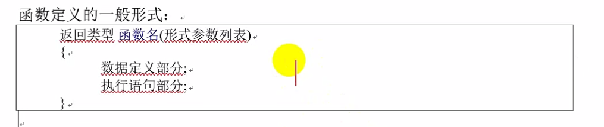
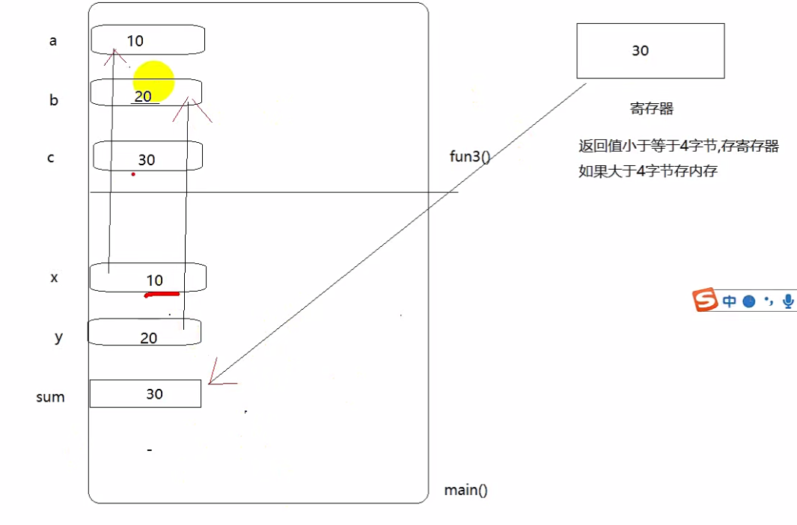
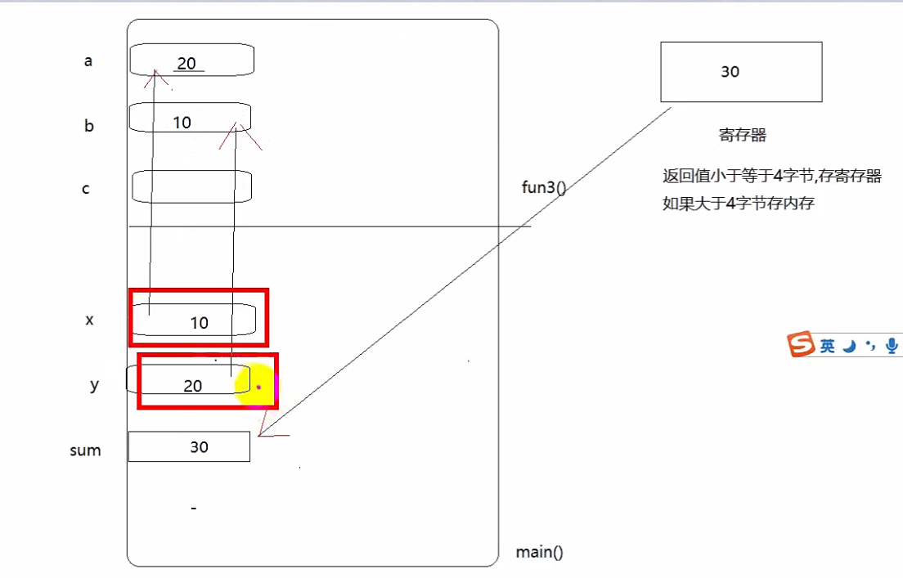
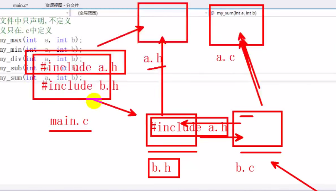

# C语言基础Day4-函数

## 一、概述

&emsp;C程序都是由函数组成的，我们写代码都是从主函数main()开始执行的，函数是C程序的基本模块，是用于完成特定任务的程序代码单元。

* 系统函数，也就是库函数，这是由编译系统提供的，用户不必自己定义这些函数，可以直接使用它们
* 用户定义函数：用以解决用户的专门需要。

作用：
* 为了减少重复的代码
* 代码模块清晰


## 二、函数的定义

  


### 2.1 函数名
&emsp;做到见名知意

### 2.2 形参列表

&emsp;在未出现函数调用时，它们并不占用内存中的存储单元，因此称他们是形式参数或者虚拟参数，简称形参，表示它们并不是实际存在的数据，所以，形参里的变量不可以被赋值。

### 2.3 函数体

花括号{}里面的内容就是函数体的内容

### 2.4 返回值

函数的返回值是通过函数中的return语句获得的，return 后面也可以是一个表达式

### 2.5 函数的调用

&emsp;定义函数后，我们需要调用此函数才能执行到这个函数里面的代码，一个C程序只有一个main函数。

## 三、无参数无返回值函数的调用

```cpp
void fun()
{
    printf("hello");
    return;
}

```

## 四、有参数无返回值的函数调用

&emsp;定义一个有参数无返回值函数，函数定义时里面的参数叫做形参，（因为这个形参只是形式上的参数，定义函数时没有给形参开辟空间），形参只有在被调用时才会分配空间，形参的定义：类型名 + 变量名

```cpp
void fun(int a,int b)
{
    int c = 0;
    c = a + b;
    return;
}

```
## 五、有参数有返回值的函数调用

&emsp;调用有返回值函数时，可以不接返回值，也可以接，返回的类型和所接受返回值的变量的类型需要相同，参数的传递只能是单向传递。（实参传递给形参）

**如果返回值小于或者等于四个字节，存入寄存器，如果大于四个字节，存入内存**

```cpp
int fun(int a,int b)
{
    int c = a + b;
    return c;
}

```

  

## 六、实参传递-交换两个值

```cpp
void fun(int a,int b)
{
    int c = a;
    a = b;
    b = c;
}

```

**交换的时候，只是将实参的值传入进去，并没有将实参的内存地址传入，所以fun并没有完成交换数值的任务。实参的值传给形参，形参的值改变不会改变实参的值。本质上是值传递。不是传递变量的地址空间**

  


## 七、函数声明

&emsp;函数的声明，把函数的定义形式放在调用之前，函数声明不用写函数体。声明函数的时候需要加上分号。

**声明的作用就是告诉编译器这个东西在其他地方定义。**

**声明没有代码块，有分号，定义是有函数体的**

```cpp
void fun(int a,int b); // 函数的定义
extern void fun(int a,int b);// 函数的定义 可以不加extern
```

## 八、return 和exit函数的区别

return 结束当前所在的函数，如果return在子函数中调用只会结束子函数,如果return在main函数中，会结束整个程序。

exit是一个库函数，用来结束整个程序，不管exit在哪里调用都会结束整个程序，exit(0)

## 九、多文件编程（分文件）

* 将函数声明放在头文件xxx.h中，在主函数中包含相应的头文件
* 在头文件对应的xxx.c中实现xxx.h声明的函数

* 主函数
```cpp
#include<stdio.h>
#include<stdlib.h>
#include<string.h>
#define _CRT_SECURE_NO_WARNINGS
#include "mt_math.h"  // 导入头文件

int main()
{
	int a = 1, b = 2;
	printf("max_num = %d\n",my_max(a,b));
	printf("min_num = %d\n",my_min(a,b));

	return 0;
}


```

* 头文件 函数声明，**头文件中只声明 不定义**
```cpp
#pragma once
extern int my_max(int a,int b);
extern int my_min(int a,int b);
```

* 实现头文件
```cpp
#include<stdio.h>

int my_max(int a, int b)
{
	return a > b ? a : b;
}

int my_min(int a, int b)
{
	return a < b ? a : b;
}


```

* **防止头文件重复包含**

  

这里可以看到main.c文件中重复导入了a.h文件，那么在声明h文件的时候，需要添加如下代码，防止重复导入：

```cpp
#ifndef _MT_MATH_H_
#define _MT_MATH_H_
extern int my_max(int a,int b);
extern int my_min(int a,int b);

#endif

```

