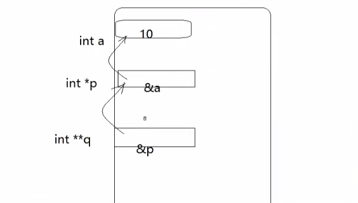

# 一文搞定C语言指针

## 一、内存概述

### 1.1 相关概念

* 存储器：计算机的组成中，用来存储程序与数据，辅助CPU进行运算处理的重要部分
* 内存：内部存储器，暂存程序/数据，掉电丢失
* 外存：外部存储器，辅助存储器，掉电不丢失

**内存是沟通CPU和硬盘的桥梁**
* 暂存放CPU中的运算数据
* 暂存与硬盘等外部存储器交换的数据

### 1.2 物理存储器和存储地址空间

* 物理存储器：实际存在的具体存储器芯片
  * 主板上装插的内存条
  * 显示卡上的显示RAM芯片
  * 各种适配卡上的RAM芯片和ROM芯片

* 存储地址空间：对存储器编码的范围，我们在软件上常说的内存是指这一层含义。
  * 编码：对每个物理存储单元（一个字节）分配一个号码
  * 寻址：可以根据分配的号码找到相应的存储单元，完成数据的读写

### 1.3 内存地址

* 将内存抽象成一个很大的一维字符数组
* 编码就是对内存的**每一个字节**分配一个32为或者64位的编号（这个和处理器有关系）
* 这个内存编号我们称之为内存地址，内存中的每一个数据都会分配相应的地址
* char:占一个字节分配一个地址
* int:占四个字节分配四个地址

## 二、指针与指针变量

### 2.1 指针通俗的理解

&emsp;启动一个程序，系统在内存上给程序分配一块内存空间，我们编程人员只需要关注逻辑地址，这块内存空间是一个一个字节构成的，每一个字节都是有他的地址编号（十六进制表示），比如32位的CPU，内存寻址就是0x0000 0000 - 0xffff ffff

  

**那么，内存地址其实就是内存的编号，我们把这个编号（地址）就叫做指针**

**指针 == 地址 == 编号**

### 2.2 指针变量

指针变量：存放指针的变量，**同时，因为地址编号是0x0000 0000，所以，指针变量使用四个字节就可以存放**

**如果是64位编译器，内存的编号范围是0x0000 0000 0000 0000 - 0xffff ffff ffff ffff**,这样的编号，需要八个字节存下，所以指针变量也需要八个字节

### 2.3 总结

* 内存区的每一个字节都有一个编号，这就是地址
* 如果程序中定义了一个变量，在对程序进行编译或者运行时，系统就会给这个变量分配一个内存单元，并确定内存地址
* 指针的实质就是内存地址，指针就是地址，地址就是指针
* 指针是内存单元的编号，指针变量是存放地址的变量
* 通常的我们叙述将指针变量简称为指针，但是含义不一样。


## 三、指针变量的定义和初始化

```cpp
int a = 10;
int *p;
p = &a;
```

* 定义指针的三步骤
  * ***与符号结合代表是一个指针变量**
  * 要保存谁的地址，将他的定义形式放在此处
  * 用*p替换掉定义的变量

* 理解：
  * p与*结合代表这是一个指针变量
  * p是指针变量，p的类型是 int *（除去变量名以外的所有部分）
  * 指针变量p用来保存int类型的地址（除去变量名和最近的*以外的部分）

对于int **p的理解：

* p是指针变量，p的类型是int **
* 指针变量p用来保存int * 数据类型的地址（所以说就是一个二级指针）
 
## 四、指针的使用

*p = 100; //*与p相结合代表：取p指针所指向那块空间的内容。这里直接赋值100

// 通过指针变量间接修改变量的值
```cpp
#define _CRT_SECURE_NO_WARNINGS
#include<stdio.h>
#include<stdlib.h>
#include<string.h>

int main()
{
	int a = 10;
	int* p = &a;

	*p = 100;
	printf("%d\n",a);// a的值发生改变
	return 0;
}


```

**注意：&可以取得一个变量在内存中的地址，但是不可以去寄存器变量，因为寄存器变量不在内存中，而在CPU中，所以是没有地址的。**


**在使用时，对一个表达式取*，就会对表达式减一级，如果对表达式取&，就会加一级***

```cpp
int *p;
int **q;

q = &p;// 二级指针 存放的是p的地址

// q 类型 int **
// p 类型 int *
// 取& 加一级*

*q = p;
// 取* 减一级

```

## 四、指针变量的大小

**不管什么类型的指针变量，大小之和编译器类型有关，32位四个字节，64位八个字节**

## 五、指针的宽度和步长

  

  


**通过*取指针变量所指向那块空间内容时，取得内存得宽度和指针变量本身的类型有关**

```cpp
#define _CRT_SECURE_NO_WARNINGS
#include<stdio.h>
#include<stdlib.h>
#include<string.h>

int main()
{
	int num = 0x01020304;
	char* p1 = (char*)&num;//int * 强制转换
	short* p2 = (short*)&num;
	int* p3 = &num;

	// 通过*取指针变量所指向的那块空间内容时，取的内存的宽度和指针变量本身的类型有关
	printf("%x\n",*p1);// 只能取一个字节 打印04
	printf("%x\n",*p2);//取两个字节  0403
	printf("%x\n",*p3);// 取四个字节  01020304

	return 0;
}

```

指针的宽度 = 将指针变量与指针变量最近的*拖黑，剩下的类型。

```
char *p  1
short *p  2
int *p  4
int **p  sizeof(int *)   4
```


```cpp
#define _CRT_SECURE_NO_WARNINGS
#include<stdio.h>
#include<stdlib.h>
#include<string.h>

int main()
{
	int num = 0x01020304;
	char* p1 = (char*)&num;//int * 强制转换
	short* p2 = (short*)&num;
	int* p3 = &num;

	// 通过*取指针变量所指向的那块空间内容时，取的内存的宽度和指针变量本身的类型有关
	printf("%x\n",*p1);// 只能取一个字节 打印04
	printf("%x\n",*p2);//取两个字节  0403
	printf("%x\n",*p3);// 取四个字节  01020304


	printf("%u\n",p1);
	printf("%u\n", p2);
	printf("%u\n", p3);


	printf("%u\n", p1 + 1);// 加一
	printf("%u\n", p2 + 1);// 加2
	printf("%u\n", p3 + 1);// 加 4

	return 0;
}

```

## 六、野指针

```cpp
int *p;

*p = 200;
```

&emsp;野指针就是没有初始化的指针，指针的指向是随机的，不可以操作野指针。指针p保存的地址一定是定义过的（向系统申请过的）

## 七、空指针

空指针的作用：如果使用完指针将指针赋值为NULL,在使用时判断一下指针是否为NULL,就知道指针有没有被使用。

```cpp
#define _CRT_SECURE_NO_WARNINGS
#include<stdio.h>
#include<stdlib.h>
#include<string.h>

int main()
{
	int a;
	// 将指针的值赋值为0,0x000000 = NULL
	int* p = NULL;// 给指针p的内容赋值为0
	*p = 200;
	printf("%d\n",*p);
	return 0;
}

```

## 八、万能指针

* void b;  不可以定义void类型的变量 因为编译器不知道给变量分配几个字节
* 但是可以定义void *类型 因为指针一定是四个字节


```cpp
#define _CRT_SECURE_NO_WARNINGS
#include<stdio.h>
#include<stdlib.h>
#include<string.h>

int main()
{
	int a = 10;
	void* p = (void*)&a;// 万能指针可以保存 任意地址 但是需要指针类型转换 
	// printf("%d\n",*p);// 没办法打印 因为sizeof(void) 不知道几个字节  没办法取地址里面的内容
	printf("%d\n",*(int *)p);// 先将指针类型转换为原始类型  在取内容
	return 0;
}
```

## 九、const修饰的指针变量

* const 修饰常量 不能直接修改内容，需要通过指针来进行修改

```cpp

#include<stdio.h>
#include<stdlib.h>
#include<string.h>
#define _CRT_SECURE_NO_WARNINGS

int main()
{
	const int a = 10;// 修饰变量a 不可以再通过a修改a内存里面的内容
	int *p = &a;
	*p = 100;// 可以通过指针p修改内容
	printf("%d\n",*p);
	printf("%d\n",a);
	return 0;
}

```

```

* const int *p = &a;不能通过*p 来修改P所指向的内容

*p = 100;// error


* int* const p = &a; p保存的地址不可以被修改

p = &b;// error p本身的值不能被修改

* const int *const p = &a;// p本身指向的地址不能被改变  也不能通过*p修改p指向的地址存得内容

```

## 十、多级指针
二级指针存放的是一级指针的地址
  

```cpp
int *p = &a;

int **q = &p;// 二级指针

// 如果*和&相遇，相抵消
// **q == *(*q) == *(p) == a
```
## 十一、指针与数组

### 11.1 通过指针操作数组元素

指针加一，跨过一个元素

```cpp

#include<stdio.h>
#include<stdlib.h>
#include<string.h>
#define _CRT_SECURE_NO_WARNINGS

int main()
{
	int a[10] = {1,2,3,4,5,6,7,8,9,10};
	// a 数组名，首元素的地址

	int* p = a;// 指针p保存的是首元素的地址
	for (int i = 0; i < sizeof(a) / sizeof(a[0]); i++)
	{
		printf("%d ",*(p + i));
	}

	return 0;
}

```

```cpp
#include<stdio.h>
#include<stdlib.h>
#include<string.h>
#define _CRT_SECURE_NO_WARNINGS

int main()
{
	int a[10] = {1,2,3,4,5,6,7,8,9,10};
	// a 数组名，首元素的地址

	int* p = a;// 指针p保存的是首元素的地址
	for (int i = 0; i < sizeof(a) / sizeof(a[0]); i++)
	{
		*(p + i) = i;
		printf("%d ",*(p + i));
	}

	return 0;
}
```

### 11.2 指针运算

两个指针相减，得到中间跨过多少个元素，两个指针相加没有意义

```cpp

#include<stdio.h>
#include<stdlib.h>
#include<string.h>
#define _CRT_SECURE_NO_WARNINGS

int main()
{
	int a[10] = {1,2,3,4,5,6,7,8,9,10};
	// a 数组名，首元素的地址
	int* p = a;
	// int* q = &a[9];
	// 这里一定要转换一下int * 因为后面加一或者减一 都会跨过整个元素的数组
	// 转换之后 才跨过一个元素大小地址
	int* q = (int*)(&a + 1) - 1;// 指向最后一个元素
	printf("%d\n",q - p);// 9
	printf("%d\n", *(p + 3));
	return 0;
}

```

### 11.3 []不是数组的专属

a[i] = p[i] = *(p + i) = *(a + i)

```cpp

#include<stdio.h>
#include<stdlib.h>
#include<string.h>
#define _CRT_SECURE_NO_WARNINGS

int main()
{
	int a[10] = {1,2,3,4,5,6,7,8,9,10};
	int* p = a;

	for (int i = 0; i < sizeof(a) / sizeof(a[0]); i++)
	{
		//printf("%d ",*(a + i));
		//printf("%d ",*(p + i));
		printf("%d ",p[i]);

	}

	return 0;
}

```


## 十二、指针数组

  

```cpp

#include<stdio.h>
#include<stdlib.h>
#include<string.h>
#define _CRT_SECURE_NO_WARNINGS

int main()
{
	int a = 10;
	int b = 20;
	int c = 30;

	// 指针数组：数组中的每一个元素都是指针（地址）
	int* num[3] = {&a,&b,&c};
	printf("%d \n",sizeof(num));

	// 打印a b c
	for (int i = 0; i < sizeof(num) / sizeof(num[0]); i++)
	{
		printf("%d ",*num[i]);
	}

	// 定义一个指针用来保存数组num首元素的地址
	// 首先num首元素本身就是一个指针（地址）
	// Num = &num[0] = &(int *) = int **
	int** k = num;// 二级指针操纵指针数组

	// 打印数组里面的元素，比如打印b 那么首先通过k去到首元素地址 k + 1得到b的地址，之后*(k + 1) 得到num[1]的内容，最后**（k+ 1）得到b
	for (int i = 0; i < sizeof(num) / sizeof(num[0]); i++)
	{
		printf("%d ", **(k + i));// 通过二级指针操纵指针数组
	}

	return 0;
}

```

## 十三、指针作为形参

```cpp
#include<stdio.h>
#include<stdlib.h>
#include<string.h>
#define _CRT_SECURE_NO_WARNINGS

void swap(int* x, int* y)
{
	// 传入的是地址  形参可以写成指针形式
	int k = *x;
	*x = *y;
	*y = k;
}

int main()
{
	int a = 10;
	int b = 20;
	int c = 30;

	swap(&a,&b);// 传入的是地址

	printf("%d %d\n",a,b);

	return 0;
}

```


## 十四、数组作为函数的参数

**数组作为函数的参数，会直接退化成指针类型**

```cpp
void print_arr(int* b, int len)
{
	int n = sizeof(b) / sizeof(b[0]);//打印 1
	printf("%d\n",n);
	for (int i = 0; i < len; i++)
	{
		printf("%d ",b[i]);
	}
	printf("\n");
}

int main()
{
	int b[10] = {1,2,3,4,5,6,7,8,9,10};

	print_arr(b,10);

	return 0;
}

```

## 十五、指针作为函数的返回值
**返回的是一个地址**

```cpp
#include<stdio.h>
#include<stdlib.h>
#include<string.h>
#include<time.h>
#define _CRT_SECURE_NO_WARNINGS
int num = 0;

int* getnum()
{
	//{}中定义的变量叫做局部变量，局部变量在函数结束之后的空间会被释放
	srand(time(NULL));
	num = rand();
	return &num;
}


int main()
{
	int* p = getnum();

	printf("%d", *p);

	return 0;
}

```

## 十六、指针与字符串

### 16.1 指针与字符数组

```cpp
#include<stdio.h>
#include<stdlib.h>
#include<string.h>
#include<time.h>
#define _CRT_SECURE_NO_WARNINGS

int main()
{
	char a[] = "helloworld";// 定义一个字符数组 长度是十一，字符数组内容是helloworld\0 其实就是字符串
	// 定义一个指针用来保存数组首元素的地址
	char* p = a;
	printf("%s\n",p);// %s 打印一个字符串 要的是首个字符的地址  
	// 指针p保存的就是首个字符的地址
	return 0;
}
```

**可以通过字符数组指针来改变单个字符**

```cpp
#include<stdio.h>
#include<stdlib.h>
#include<string.h>
#include<time.h>
#define _CRT_SECURE_NO_WARNINGS

int main()
{
	char a[] = "helloworld";// 定义一个字符数组 长度是十一，字符数组内容是helloworld\0 其实就是字符串
	// 定义一个指针用来保存数组首元素的地址
	char* p = a;
	printf("%s\n",p);// %s 打印一个字符串 要的是首个字符的地址  
	// 指针p保存的就是首个字符的地址

	printf("%s\n",p + 2);

	*p = 'x';// 通过字符指针直接改变字符
	p++;
	*p = 'o';
	printf("%s\n", a);

	return 0;
}

```

### 16.2 字符串常量

**将一个字符串常量赋值给一个指针，指针保存的是字符串常量得地址，可以通过指针来打印字符串，但是不可以通过指针来修改字符串的字符**

```cpp
#include<stdio.h>
#include<stdlib.h>
#include<string.h>
#include<time.h>
#define _CRT_SECURE_NO_WARNINGS

int main()
{
	// 字符串存在于数组  栈区  可以被改变
	char a[] = "helloworld";// 定义一个字符数组 长度是十一，字符数组内容是helloworld\0 其实就是字符串
	// 定义一个指针用来保存数组首元素的地址
	char* p = a;
	p = "abcdef";// 字符串常量存文字常量区，在使用时，取得是字符串首元素的地址
	// 文字常量区内容不可以被改变

	printf("%s\n",p);// %s 打印一个字符串 要的是首个字符的地址  
	// 指针p保存的就是首个字符的地址

	printf("%d\n",sizeof(p));// 4
	printf("%d\n",sizeof("abcdef"));// 7

	printf("%d\n",strlen(p));// 6
	printf("%d\n",strlen("abcdef"));// 6

	return 0;
}

```

### 16.3 字符指针作为函数形参

```cpp
#include<stdio.h>
#include<stdlib.h>
#include<string.h>
#include<time.h>
#define _CRT_SECURE_NO_WARNINGS

char* my_strcat(char* src, char* dst)
{
	// 拼接两个字符串
	int n = strlen(src);// 计算有效字符个数
	int i = 0;

	// 循环遍历第二个字符串
	while (*(dst + i) != 0)
	{
		// 循环条件是 当前字符不是\0

		// src 一开始指向字符串得第一个字符 加上n之后指向字符串末尾字符\0  然后直接覆盖\0
		*(src + n + i) = *(dst + i);
		i++;
	}
	*(src + n + i) = 0;// 添加\0字符
	return src;
}

int main()
{
	char a[] = "zxcvb";
	char b[] = "wqeqwrrt";

	printf("%s\n",my_strcat(a,b));

	return 0;
}

```


### 16.4 字符指针数组

**字符指针数组，每一个元素都是字符指针（字符串地址）**

```cpp
#include<stdio.h>
#include<stdlib.h>
#include<string.h>
#include<time.h>
#define _CRT_SECURE_NO_WARNINGS

int main()
{
	char* p1 = "heihei";
	char* p2 = "haha";
	char* p3 = "xixi";
	char *num[3] = {p1,p2,p3};// 字符指针数组  每一个元素都是字符指针（字符串地址）

	for (int i = 0; i < 3; i++)
	{
		printf("%s\n",num[i]);// num中存放的是字符串的地址
	}

	printf("%c\n",*num[0]);// 打印 h
	printf("%c\n",*(num[1] + 1));// 打印a
	printf("%c\n",*(num[2] + 2));

	return 0;
}
```

  

### 16.5 字符指针数组作为main函数参数

```cpp
#include<stdio.h>
#include<stdlib.h>
#include<string.h>
#include<time.h>
#define _CRT_SECURE_NO_WARNINGS

//char* argv[] = { ".*.exe","hello","123456" };

int main(int argc,char *argv[])
{
	
	for (int i = 0; i < argc; i++)
	{
		// argc代表参数个数
		// argv代表指针数组 存储的是每个参数字符串的地址  默认argv[0]是程序的地址字符串
		for (int i = 0; i < argc; i++)
		{
			printf("%s\n",argv[i]);// 传入字符串地址  打印每一个字符串
		}
	}

	return 0;
}

```

## 十七、字符串常用处理函数

* 字符串复制函数stcpy
```cpp
char str1[128] = ".";
char str2[128] = "world";
strcpy(str1,str2);
printf("%s\n",str1);
```

str2会直接从头开始覆盖str1，并且复制\0字符，所以下面这段代码会打印world

```cpp
char str1[128] = "hhhhhhhiiiiiii";
char str2[128] = "world";
strcpy(str1,str2);
printf("%s\n",str1);
```

* strncpy字符串复制函数
将str2中前n个字符拷贝到str1中，如果拷贝时不足N个，遇到\0拷贝结束

* strcat(str1,str2) 字符串连接函数
将str2字符串连接到dest的尾部，\0也会追加过去，链接的时候，遇到\0结束

* strncat(str1,str2,n)
将str2字符数组中的N个字符拷贝到str1字符数组中，遇到\0结束

* strcmp(str1,str2)  比较字符串
str1数组中和str2数组拿出一个元素进行比较，相等继续想后面比较，比较的是字符的ascii值，如果str1 > str2 返回值等于1，str1 ==  str2返回值等于0，如果str1 < str2 返回值等于 -1

* sprintf()：组包函数

int len = sprintf(buf,"格式"，"数据");//将数据按照格式组包，存放在数组buf中，sprintf函数的返回值是组完包的有效长度

```cpp
#include<stdio.h>
#include<stdlib.h>
#include<string.h>
#include<time.h>
#define _CRT_SECURE_NO_WARNINGS
#pragma warning(disable:4996)

int main()
{
	int year = 2018;
	int month = 10;
	int day = 20;
	char buf[1024] = "";

	int len = sprintf(buf,"year = %d %c month = %d day = %d",year,0,month,day);
	printf("buf = [%s]\n",buf);// 遇到\0就不打印
	printf("%d\n",len);// 返回字符串长度
	
	return 0;
}

```

* sscanf():拆包函数

sscanf(buf,"格式",数据);// 将buf中的内容格式化输出到数据

```cpp
#include<stdio.h>
#include<stdlib.h>
#include<string.h>
#include<time.h>
#define _CRT_SECURE_NO_WARNINGS
#pragma warning(disable:4996)

int main()
{
	int year = 2018;
	int month = 10;
	int day = 20;
	char buf[1024] = "2018:10:20";

	sscanf(buf,"%d:%d:%d",&year,&month,&day);// 从Buf中按照格式获取数据
	printf("%d %d %d\n",year,month,day);
	
	return 0;
}
```

* strchr(str,'c')截取从某一个字符开始的字符串
```cpp
char str[] = "xixihellogworld";
char *p = strchr(str,'g);
printf("%s\n",p);// 打印gworld
```

自己动手实现
```cpp
#include<stdio.h>
#include<stdlib.h>
#include<string.h>
#include<time.h>
#define _CRT_SECURE_NO_WARNINGS
#pragma warning(disable:4996)

char* my_strchr(char *p,char ch)
{
	int i = 0;
	while (*(p + i) != 0)
	{
		if (*(p + i) == ch)
		{
			// return (p + i);// 取地址
			// 或者写成
			return &p[i];
		}
		i++;
	}

	if (*(p + i) == 0)
	{
		return NULL;
	}
}

int main()
{
	char str[] = "xixixihellogworld";
	char* p = my_strchr(str,'g');
	printf("%s\n",p);
	return 0;
}
```

* strstr(str1,str2)

从某一字符串开始截取剩下的字符串

```cpp
int main()
{
	char str[] = "xixiabcxihellogworld";
	char str1[] = "abc";
	char* p = strstr(str,str1);
	printf("%s\n",p);
	return 0;
}
```

* strtok(str,"c") 切割字符串

```cpp
#include<stdio.h>
#include<stdlib.h>
#include<string.h>
#include<time.h>
#define _CRT_SECURE_NO_WARNINGS
#pragma warning(disable:4996)


int main()
{
	char str[] = "xixiab#cxihello#gworld";
	char* p1 = strtok(str,"#");// 在str1中将#切割，返回切割前面的字符串
	printf("%s\n",p1);

	char* p2 = strtok(NULL,"#");
	printf("%s\n",p2);

	char* p3 = strtok(NULL,"#");
	printf("%s\n",p3);
	
	return 0;
}

```

* atoi()函数 将字符串转换成整数

atoi()会扫描字符串，跳过前面的空格字符，直到遇到数字或者正负号开始转换，遇到非数字或者字符串结束符\0结束转换，并将结果返回返回值整数。

```cpp
char num[] = "123";
int sum = atoi(num);
```

类似的atof()转换成小数

## 十八、字符串案例

### 18.1 查找字符串中某一字符串出现的次数

```cpp
#include<stdio.h>
#include<stdlib.h>
#include<string.h>
#include<time.h>
#define _CRT_SECURE_NO_WARNINGS
#pragma warning(disable:4996)

int strstr_num(char* src, char* dst)
{
	int i = 0;
	char* p = src;
	int n = 0;

	do
	{
		p = strstr(p,dst);

		if (p != NULL)
		{
			// 如果查找返回的地址不是NULL 说明找到了
			n++;
			p = p + strlen(dst);
		}

	} while (p != NULL);

	return n;
}

int main()
{
	char src[] = "hdabchabchjfsjabcjdsjabc";
	char dst[] = "abc";
	int n = strstr_num(src,dst);
	printf("%d\n",n);
	return 0;
}
```

### 18.2 两头堵模型

```cpp

int main()
{
	char buf[] = "    hello world      ";
	char dst[128] = "";
	
	char* start = buf;
	char* end = &buf[strlen(buf) - 1];// end指向最后一个字符

	// 找到第一个不是空格的位置
	while (*start != ' ' && *start != 0)
	{
		start++;
	}

	while (*end != ' ' && end != start)
	{
		end--;
	}

	printf("%d\n",end - start + 1);// 打印长度
	strncpy(dst,start,end - start + 1);
	printf("%s\n",dst);

	return 0;
}

```


### 18.3 字符串翻转

```cpp
int main()
{
	char buf[] = "abcdef";
	char* start = buf;
	char* end = &buf[strlen(buf) - 1];// 定位到最后一个字符

	while (end > start)
	{
		char ch = *end;
		*end = *start;
		*start = ch;
		end--;
		start++;
	}
	printf("%s",buf);
	return 0;
}

```
