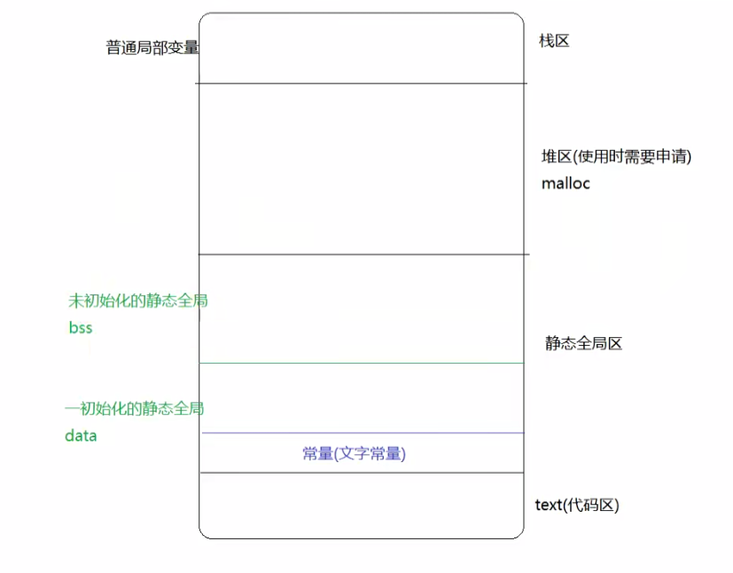
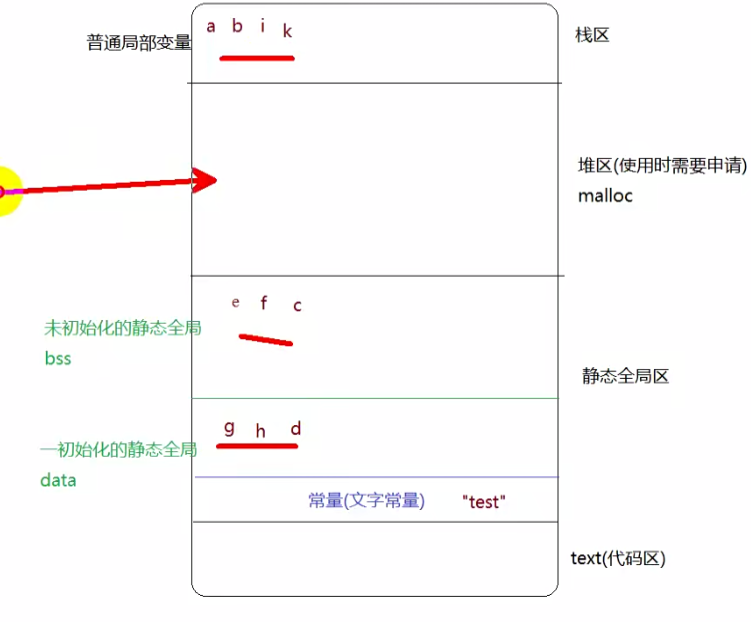

# C语言基础Day6-内存管理

## 一、作用域和变量

变量起作用的范围

C语言变量的作用域分为：

* 代码块作用域（代码块是{}之间的一段代码）
* 函数作用域
* 文件作用域


变量：

* 局部变量：在{}范围之内定义的变量都是局部变量
* 静态局部变量：static int a 在{}范围之内定义的静态变量
* 全局变量：在函数之外定义的变量
* 静态全局变量：在函数之外定义的静态变量

## 二、局部变量和静态局部变量

### 2.1 局部变量

&emsp;局部变量也叫auto自动变量（auto可写可不写），一般情况下代码块{}内部定义的变量都是自动变量，有如下特点：

* 在一个函数内部定义，只在函数范围内有效
* 再复合语句中定义，只在复合语句中有效
* 对着函数调用的结束或者复合语句的结束 局部变量的声明周期也结束
* 如果没有赋初始值，内容是随机的

```
* 作用域  在定义变量的{}之内有效,跳出代码块{}就无效了，但是内存空间并没有释放
* 生命周期 程序运行至变量定义处开辟空间，所在的函数结束之后释放空间
* 未初始化的值  随机值

```


### 2.2 静态局部变量

```
* 作用域：在定义变量的{}之内有效，跳出代码块{}就无效，但是内存空间并没有释放
* 生命周期：在main函数运行之前 就开辟空间，程序结束之后才释放空间
* 未初始化的值 0

```


## 三、全局变量和静态全局变量

### 3.1 全局变量

全局变量：

* 作用域：整个工程
* 生命周期：程序在main函数运行之前就开辟空间，程序结束之后释放空间
* 未初始化的值：0

```cpp
# include<stdio.h>
# include<stdlib.h>

int num32;// 全局变量 作用域整个工程

void fun1()
{
    num32 = 10;
}

int main()
{
    printf("%d\n",num32);
    fun1();
    printf("%d\n",num32);
    system("pause");
    return 0;
}


```

### 3.2 静态全局变量

* 作用域：当前文件
* 生命周期：执行main函数之前就已经开辟空间，程序结束之后才释放空间
* 未初始化：0

static extern int num64;// error 静态全局变量是不能声明的，也不能在其他文件中使用

extern int num32;//声明num32在其他地方定义过

### 3.3 总结

* 作用域：局部变量（普通局部和静态局部）在{}范围之内，普通全局变量作用域在整个工程中 静态全局作用在当前文件中
* 生命周期：只有普通局部是运行至变量定义处时开辟，函数结束释放，其他变量都是执行main函数之前就已经开辟空间，程序结束之后才释放空间
* 初始化的值：只有普通局部未初始化的值是随机值，其他的都是0


## 四、全局变量分文件问题

### 4.1 全局变量在主函数文件中

main.cpp
```cpp
# include<stdio.h>
# include<stdlib.h>
# include<string.h>
#define _CRT_SECURE_NO_WARNINGS

int num = 0;// 声明 全局变量

int main()
{
	fun();// 调用其他文件中的函数  也需要声明整个函数 .h文件

	printf("%d\n",num);// 打印全局变量

	system("pause");
	return 0;
}

```

demo.cpp
```cpp

extern int num;// 声明  才可以在其他文件中使用
void fun()
{
	num = 10;
}

```

demo.h
```cpp
#pragma once  // 防止头文件重复

void fun();// 函数头文件声明
```


### 4.2 全局变量不在主函数文件中

main.cpp
```cpp
# include<stdio.h>
# include<stdlib.h>
# include<string.h>
#define _CRT_SECURE_NO_WARNINGS
# include "demo.h" // 需要添加头文件

int main()
{
	fun();// 调用其他文件中的函数  也需要声明整个函数 .h文件
	printf("%d\n",num);// 打印全局变量
	system("pause");
	return 0;
}

```
demo.c
```cpp
int num = 10;// 定义全局变量
void fun()
{
	num = 10;
}

```

demo.h（.h文件中只进行声明，不要进行定义！！！）

```cpp
#pragma once  // 防止头文件重复

extern void fun();// 函数头文件声明
extern int num;// 全局变量声明
```

**注意：在.h文件中，全局变量只声明不定义，定义只放在.c文件中**

## 五、变量重名问题

**一般打印离他最近的变量**

```cpp
#define _CRT_SECURE_NO_WARNINGS
#include<stdio.h>
#include<string.h>
#include<stdlib.h>

int num = 0;
// 不同的作用域可以重名  变量一般优先使用最近的重名变量

int main()
{
    int num =10;
    printf("num1 = %d\n",num);// 打印10  打印最近的num
    {
        int num = 100;
    }
    printf("num2 = %d\n",num);// 打印10 代码块中的num是局部变量 销毁了
    system("pause");
    return 0;
}

```

```cpp
#define _CRT_SECURE_NO_WARNINGS
#include<stdio.h>
#include<stdlib.h>

int num = 0;
void fun()
{
	printf("num = %d\n",num);// 打印全局变量 不是静态的全局变量
}


int main()
{
	fun();
	fun1();

	return 0;
}

```

```cpp
static int num = 20;// 声明一个静态的全局变量 只作用于该文件

void fun1()
{
	printf("num1 = %d\n",num);
}
```


## 六、静态函数

&emsp;静态函数就是在函数定义时加上static修饰的函数，静态函数只可以被当前文件函数调用，static void fun(){},普通的函数没有加上任何修饰，就是全局函数，整个工程可以调用。

## 七、重名案例

main.c
```c
#include<stdio.h>
#include<stdlib.h>
#define _CRT_SECURE_NO_WARNINGS
extern int va;
extern int getG(void);
extern int getO(void);

int main(void)
{
	printf("%d\n",va);// 7
	printf("%d\n",getO());// 18

	printf("%d\n",getG());// 20

	printf("%d\n",va * getO() * getG());// 7 * 18 * 20
}


```

a.c
```c
int va = 7;// 定义全局变量
// 定义全局函数
int getG(void)
{
	int va = 20;
	return va;
}
```

b.c
```c
static int va = 18;// 定义静态全局变量  只作用于本文件

// 定义静态全局函数  只作用于本文件
static int getG(void)
{
	return va;
}

// 这里调用的时上面的静态全局函数
int getO(void)
{
	return getG();
}
```

注意：

* 允许在不同的函数中使用相同的变量名，他们代表不同的对象，分配不同的单元，互不干扰
* 同一源文件中，允许全局变量和局部变量同名，在局部变量的作用域内部，全局变量不起作用
* 所有的函数默认都是全局的，意味着所有的函数都不能重名，但是如果是static函数，那么作用域是文件级别的，所以不同的文件static函数名是可以相同的

## 八、内存分布

  

  

```c
int e;// 全局变量
static int f;// 未初始化的静态变量  bss
int g = 10;// 已经初始化的全局变量 data
static int h = 10;// 已经初始化的全局变量 data
int main()
{
	int a;// 局部变量
	int b = 10;//局部变量
	static int c;// 未初始化的静态变量 bss
	static int d = 10;// 已经初始化的静态变量 data
	char *i = "test";// i是局部变量 栈区  "test" 文字常量
	char *k = NULL;// k 是局部变量 栈区
}
```

## 九、内存处理函数

### 9.1 memset()

void *memset(void *s,int c,size_t n);
功能：将s的内存区域的前n个字节以参数的形式填入

参数：
	* s:需要操作内存s的首地址
	* c:填充的字符，c虽然参数是int,但是必须是unsigned char 范围是0~255
	* n:指定需要设置的大小

返回值：s的首地址

```c
#include<stdio.h>
#include<stdlib.h>
#include<string.h>
#define _CRT_SECURE_NO_WARNINGS

int main()
{
    int a = 10;
    // 将a赋值0
    memset(&a,0,sizeof(a));// 计算a的字节 将每一个字节都赋值为0
    printf("a = %d\n",a);

    char buf[10] = "";//空字符数组
    strcpy(buf,"hello");// 拷贝字符串  参数是字符串地址
    memset(buf,0,sizeof(buf));// 将字符数组全部清空 0
    printf("%s\n",buf);

    // 将前九个字符置为a
    memset(buf,'a',sizeof(buf) - 1);
    printf("%s\n",buf);

    return 0;
}

```

### 9.2 memcpy()

void *memcpy(void *dest,const void *src,size_t n);

功能：拷贝src所指的内存内容的前n个字节到dest所指向的内存地址上

参数：

	* dest:目的内存首地址
	* src:源内存地址，注意：dest和src所指向的内存空间不可重叠，可能会导致程序报错
	* n:需要拷贝的字节数

返回值：dest的首地址

**值得注意的是，memcpy拷贝字符串遇到\0不会结束，strncpy遇到\0会结束拷贝**


```c
#include<stdio.h>
#include<string.h>
#include<stdlib.h>

#define _CRT_SECURE_NO_WARNINGS

int main()
{
    // 将数组a中前五个元素拷贝至数组b中
    int a[10] = {1,2,3,4,5,6,7,8,9,10};
    int b[10] = {0};

    memcpy(b,a,5 * sizeof(int));
    
    for(int i = 0; i < sizeof(b) / sizeof(b[0]); i++){
        printf("%d ",b[i]);
    }

    return 0;
}

```


拷贝字符串
```c
#include<stdio.h>
#include<stdlib.h>
#include<string.h>
#define _CRT_SECURE_NO_WARNINGS

int main()
{
    char str1[128] = "";
    char str2[128] = "abc\0dsa\0ad";
    memcpy(str1,str2,10 * sizeof(char));// 拷贝十个字节

    for(int i = 0; i < 10; i++)
    {
        printf("%d ",str1[i]);// 打印ASCII值
    }

    return 0;
}

```


拷贝字符串
```c
#include<stdio.h>
#include<stdlib.h>
#include<string.h>
#define _CRT_SECURE_NO_WARNINGS


int main()
{
    char str1[128] = "";
    char str2[128] = "abc\0dsa\0ad";
    // memcpy(str1,str2,10 * sizeof(char));// 拷贝十个字节

    strncpy(str1,str2,10 * sizeof(char));// 遇到\0 停止拷贝

    for(int i = 0; i < 10; i++)
    {
        printf("%d ",str1[i]);// 打印ASCII值
    }

    return 0;
}
```

### 9.3 memcmp()比较大小

int memcmp(const void *s1,const void *s2,size_t n);

功能：比较s1和s2所指向的内存区域的前n个字节

参数：
	s1:内存首地址1
	s2:内存首地址2
	n:需要比较的前n个字节

返回值：
	相等：= 0
	大于: > 0
	小于: < 0

```c
#include<stdio.h>
#include<stdlib.h>
#include<string.h>
#define _CRT_SECURE_NO_WARNINGS

int main()
{
    // char str1[128] = "";
    // char str2[128] = "abc\0dsa\0ad";
    // memcpy(str1,str2,10 * sizeof(char));// 拷贝十个字节

    // strncpy(str1,str2,10 * sizeof(char));// 遇到\0 停止拷贝

    // for(int i = 0; i < 10; i++)
    // {
    //     printf("%d ",str1[i]);// 打印ASCII值
    // }

    char num1[] = {1,2,3,4,5,6,7};
    char num2[] = {1,2,3,6,5,6,7};

    printf("%d\n",memcmp(num1,num2,7 * sizeof(char)));// 打印-1
    return 0;
}

```

注意memcmp遇到\0不会停止比较，但是strncmp遇到\0就会停止比较

```cpp
#include<stdio.h>
#include<stdlib.h>
#include<string.h>
#define _CRT_SECURE_NO_WARNINGS


int main()
{
    char num1[] = {1,2,0,4,5,6,7};
    char num2[] = {1,2,0,6,5,6,7};
    // printf("%d\n",memcmp(num1,num2,7 * sizeof(char)));// 打印-1
    printf("%d\n",strncmp(num1,num2,7 * sizeof(char)));// 打印0 遇到\0就停止  这里是ASCII值

    char s1[] = "abc\0ss";
    char s2[] = "abc\0aa";
    printf("%d\n",strncmp(s1,s2,6 * sizeof(char)));//打印0
    return 0;
}
```

## 十、堆区内存分配和释放

### 10.1 malloc（）

void *malloc(size_t size);  // 注意 返回的地址是void *，具体需要转换

功能：在内存的动态存储区（堆区）中分配一块长度为size字节的连续区域，用来存放类型说明符指定的类型。分配的内存空间内容不确定，一般使用Memset初始化

参数：size:需要分配的内存大小

返回值：成功：分配空间的起始地址
		失败：NULL


```cpp
#include<stdio.h>
#include<stdlib.h>
#define _CRT_SECURE_NO_WARNINGS

int main()
{
    // 申请一个数组 数组有十个元素 每一个元素都是int类型
    int *p = (int *)malloc(sizeof(int) * 10);// void* 转换成int * 申请一片内存空间

    // 将申请的空间内容清0
    memset(p,0,sizeof(int) * 10);

    *p = 1000;// 内存赋值
    
    for(int i = 0; i < 10; i++)
    {
        // printf("%d ",*(p + i));
        printf("%d ",p[i]);// 这样写也可以
    }
    return 0;
}

```

申请一个字符数组空间，使用free(p) 释放空间
```c
#include<stdio.h>
#include<stdlib.h>
#include<string.h>
#define _CRT_SECURE_NO_WARNINGS

int main()
{
    //申请一块字符数组空间 长度是1024个字节
    char *p = (char *)malloc(sizeof(char) * 1024);
    memset(p,0,1024 * sizeof(char));
    strcpy(p,"helloworld");
    printf("%s ",p);// 打印字符串
    free(p);// 释放内存  申请的空间不可以释放两次
    return 0;
}

```

### 10.2 free()

void free(void *ptr)

功能：释放ptr所指向的一块内存空间，ptr是一个任意类型的指针变量，指向被释放区域的首地址，对同一内存空间多次释放会出错

参数：

ptr:需要释放空间的首地址，被释放区应该是由malloc函数所分配的区域

返回值:无

注意：free只能释放一次上次申请过的空间
      free参数 地址必须是上一次malloc申请过的，不能改变这个地址

## 十一、内存泄漏

内存泄漏：内存空间只申请不释放，导致程序使用的内存空间一直增长

内存污染：向没有申请的内存空间写入数据

## 十二、返回变量的地址

### 12.1 局部变量在函数结束后 释放内存空间

**函数内部定义一个局部变量，局部变量存入栈中，函数执行结束之后，栈中变量就销毁内存，指针虽然保存了原有的内存地址空间，但是无法操作内存了**


```c
#include<stdio.h>
#include<stdlib.h>
#include<string.h>
#define _CRT_SECURE_NO_WARNINGS

int *fun()
{
    int a = 10;// 局部变量  return之后  释放内存空间
    a *= 10;
    return &a;
}

int main()
{
    int *p = fun();
    *p = 2000;// p 所指向a的内存空间 其实已经被释放了
    printf("%d",*p);
    return 0;
}
```

### 12.2 全局变量在主函数执行结束之后，才会释放内存空间

**全局变量在主函数执行结束之后，才会释放内存，所以不同于局部变量存在于栈区中，对于初始化的静态变量，存在于data区，bss区存放未初始化的静态变量**

```cpp
#include<stdio.h>
#include<stdlib.h>
#include<string.h>
#define _CRT_SECURE_NO_WARNINGS

int *fun()
{
    static int a = 10;// 全局变量  之后主函数执行结束之后 内存空间才会释放
    a *= 10;
    return &a;
}

int main()
{
    int *p = fun();
    *p = 2000;// p 所指向a的内存空间 其实已经被释放了
    printf("%d",*p);
    return 0;
}

```


注意：**只有普通局部变量的地址不可以返回，因为普通局部变量所在的函数结束之后就被释放，静态局部，全局，静态全局，这些变量只要程序不退出，就不会释放，所以这些变量的地址是可以返回操作**


## 十三、传值与传地址

### 13.1 函数传参：传值

**形参就相当于局部变量，返回的是局部变量地址，所以函数执行结束之后，内存空间销毁，局部变量**
```cpp
#include<stdio.h>
#include<stdlib.h>
#include<string.h>
#define _CRT_SECURE_NO_WARNINGS

int* fun(int a)
{
    a *= 10;
    return &a;
}

int main()
{
    int a = 1;
    int* p = fun(a);
    // *p = 2000;// p 所指向a的内存空间 其实已经被释放了
    printf("%d", *p);
    return 0;
}
```

### 13.2 函数传参：传地址

**函数传参，参数是地址，那么在函数内部指针就会通过变量的地址操作变量，改变原有空间的内容**

```cpp
#include<stdio.h>
#include<stdlib.h>
#include<string.h>
#define _CRT_SECURE_NO_WARNINGS

int *fun(int* a)
{
    // static int a = 10;// 全局变量  之后主函数执行结束之后 内存空间才会释放
    *a *= 10;
    return a;
}

int main()
{
    int a = 1;
    int *p = fun(&a);
    // *p = 2000;// p 所指向a的内存空间 其实已经被释放了
    printf("%d",*p);
    return 0;
}
```

### 13.3 返回堆区地址

```cpp
#include<stdio.h>
#include<stdlib.h>
#include<string.h>
#define _CRT_SECURE_NO_WARNINGS

// int *fun(int* a)
// {
//     // static int a = 10;// 全局变量  之后主函数执行结束之后 内存空间才会释放
//     *a *= 10;
//     return a;
// }

char *fun()
{
    // 堆区地址是可以被返回的 因为函数结束 堆区地址不会被释放
    char *q = (char *)malloc(sizeof(char) * 100);// 申请一块内存空间
    return q;
}

int main()
{
    char *p = fun();
    p = "hello";// p所指向的内存空间已经发生改变了

    strcpy(p,"helo");//可以的 赋值

    free(p);// 没有释放malloc申请的空间
    return 0;
}

```


## 十四、实参是一级指针的地址（指针的指针）

形参是一级指针：
```cpp
#include<stdio.h>
#include<stdlib.h>
#include<string.h>
#define _CRT_SECURE_NO_WARNINGS

char *fun(char *q)
{
    // 堆区地址是可以被返回的 因为函数结束 堆区地址不会被释放
    char *q = (char *)malloc(sizeof(char) * 100);// 申请一块内存空间
    return q;
}

int main()
{
   char *p  = NULL; 
    p = fun(p);
    strcpy(p,"hello");// p所指向的内存空间已经发生改变了
    free(p);// 没有释放malloc申请的空间
    return 0;
}

```

形参是二级指针：

```cpp
#include<stdio.h>
#include<stdlib.h>
#include<string.h>
#define _CRT_SECURE_NO_WARNINGS

void *fun(char **q)
{
    // 堆区地址是可以被返回的 因为函数结束 堆区地址不会被释放

    // 传入的是&p 相当于*q  然后*q被重新赋予新的地址 最后返回q

    *q = (char *)malloc(sizeof(char) * 100);// 申请一块内存空间
    return q;
}

int main()
{
    char *p  = NULL; 
    fun(&p);
    strcpy(p,"hello");
    printf("%s ",p);
    free(p);
    return 0;
}
```

