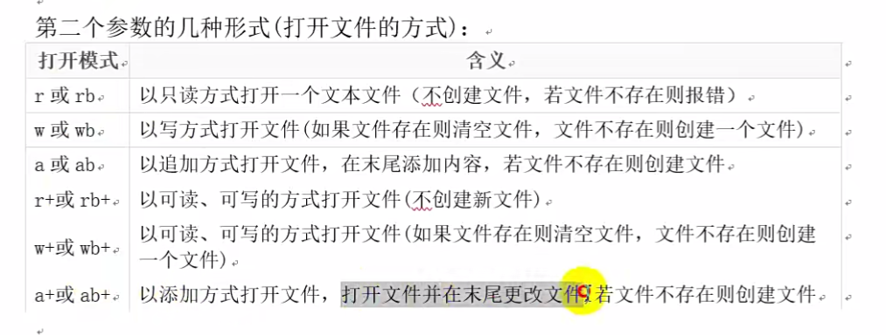
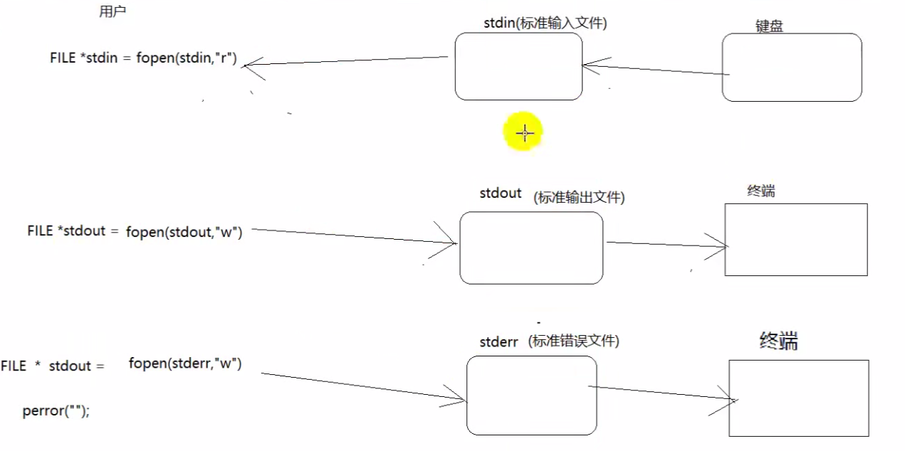
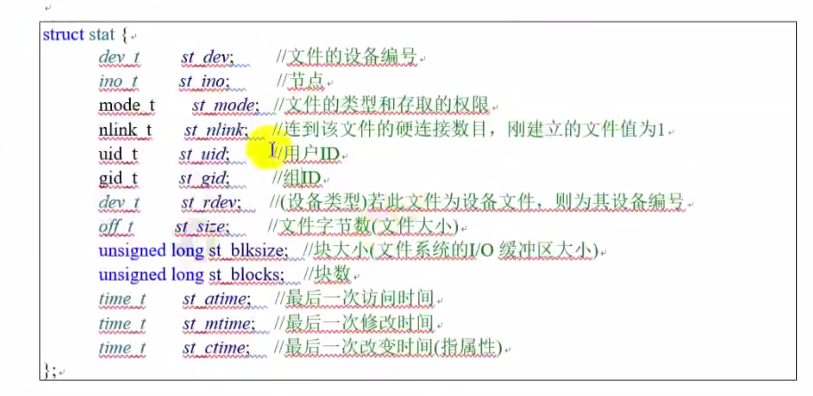
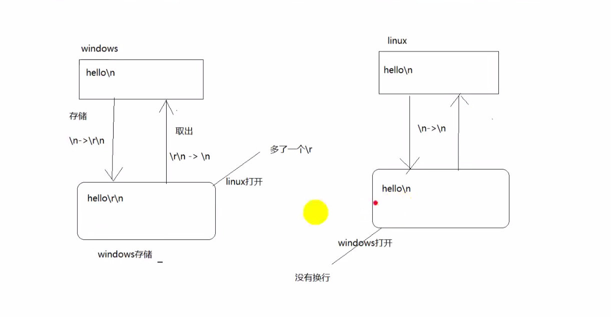
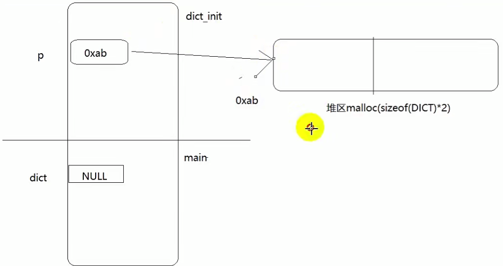
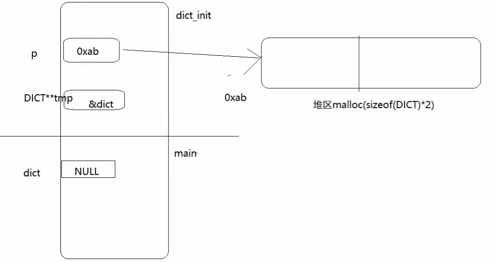

# C语言基础Day9-文件

## 一、文件概述

* 磁盘文件
  指一组相关数据的有序集合，通常存储在外部介质（如磁盘上），使用时才调入内存

* 设备文件
  在操作系统中把每一个与主机相连得输入、输出设备看作是一个文件，把它们得输入、输出等同于对磁盘文件得读和写

* 文本文件
  存储时，是将字符得ascii值存在磁盘中，取得时候将数值(ascii)翻译成对应的字符

* 二进制文件
  存的是二进制，取的也是二进制


## 二、文件流指针

在C语言中用一个指针变量指向一个文件，这个指针称之为文件指针

**当打开一个文件得时候，系统会返回一个结构体，这个结构体有对此文件操作的所有信息**

```c
typedef struct
{
    short level;// 缓冲区 满或者空的程度
    unsigned flags;// 文件状态标志
    char fd;// 文件描述符
    unsigned char hold;// 如无缓冲区不读取字符
    short bsize;// 缓冲区的大小
    unsigned char *buffer;// 数据缓冲区的位置
    unsigned ar;// 指针  当前的指向
    unsigned istemp;// 临时文件 指示器
    short token;// 用于有效性的检查
}FILE;

```


**FILE是系统使用typedef定义出来的有关文件信息的一种结构体类型，结构中含有文件名、文件状态和文件当前位置等信息**

声明FILE结构体类型的信息包含在头文件stdio.h中，一般设置一个指向FILE类型变量的指针变量，然后通过它来引用这些FILE类型变量。

当执行下面这行语句：
```
FILE *p = fopen("a.txt");
```

调用fopen时，系统返回这个结构体的地址，用户使用FILE类型的指针操作这个结构体


## 三、打开一个文件

```c
FILE *fp = fopen("pathname",打开的方式);// 返回的是存储文件信息的结构体的地址  失败的话返回NULL
```

第一个参数的几种形式：
```c
// 相对路径
// 打开当前目录的text.txt文件
FILE *fp = fopen("text.txt","r");

// 打开当前目录下test文件夹下的text.txt文件
FILE *fp = fopen("./test/text.txt","r");

// 打开当前目录上一级目录 text.txt文件
FILE *fp = fopen("../text.txt","r");


// 绝对路径
// 打开C盘下test目录下的text.txt文件
FILE *fp = fopen("C:/test/text.txt","r");
```


第二个参数的几种形式：
```
// 只读 r  文件不存在 不创建 会报错
// 只写 清空文件 w
// 可读可写 r+  不创建新的文件 不清空文件
// 可读可写清空文件  w+  文件不存在就创建新的文件
// 追加 a+ 添加的方式打开文件 打开文件并在末尾更改文件
// 打开一个文件 成功返回FILE结构体地址 失败返回NULL
// b 代表二进制文件

```

  


关闭一个文件：fclose(p)

## 四、相对路径

* 如果直接在vs2019中调试运行  ，相对路径相对的工程文件xxx.vcxproj
* 如果是手动运行exe文件，相对路径相对的是可执行文件

## 五、设备文件

**当启动一个程序的时候，系统打开三个文件**

  


首先是标准输入文件stdin
* stdin

FILE *stdin = fopen(stdin,"r");

通过fgets函数进行读取文件流
fgets(buf,sizeof(buf),stdin);

* stdout

FILE *stdout = fopen(stdout,"w");// 标准输出文件 输出到终端

* stderr

FILE *stderr = fopen(stderr,"w");// 标准错误文件 输出到终端

perror()函数将错误信息写入stderr


## 六、fputc写文件

```c
int fputc(int ch,FILE *stream)

功能：将ch转换为unsigned char之后写入stream指定的文件中

参数：
  ch:需要写入文件的字符
  stream:文件指针

返回值：
  成功：成功写入文件的字符
  失败返回-1
```

```c
#include<stdio.h>
#include<stdlib.h>
#define _CRT_SECURE_NO_WARNINGS

int main()
{   
    // 打开一个文件 成功返回FILE结构体地址 失败返回NULL
    FILE *fp = fopen("./a.txt","w");
    if(fp == NULL)
    {
        perror("没有这个文件");// 该函数用来打印错误信息
        return;
    }

    char buf[] = "hello";// 字符串hello
    int i = 0;

    // 循环写入hello
    while(buf[i] != 0)
    {
      // '\0' 的ascii码为0

      fputc(buf[i],fp);
      i++;
    }
    
    // fputc('b',fp);// 清空文件 然后写入字符b


    fclose(fp);

    return 0;
}


```

## 七、fgetc读取

```c
#include<stdio.h>
#include<stdlib.h>
#define _CRT_SECURE_NO_WARNINGS

int main()
{
    FILE *fp = fopen("./a.txt","r");

    if(fp == NULL)
    {
        perror("文件打开失败");
        return -1;
    }

    char buf[128] = "";
    int i = 0;

    // 读取失败了 返回-1
    while((buf[i] = fgetc(fp)) != -1)
    {
        i++;
    }

    printf("%s\n",buf);// 打印字符串
    return 0;
}

```

feof:如果读取文件不是纯文本，包含-1，-2这种（非字符，字符都是0~128），那么就不可以使用EOF（-1）作为文件的结尾，因为没办法识别是字符

```
#include<stdio.h>

int feof(FILE* stream)

功能：检测是否读取到了文件结尾。判断的是最后一次“读操作的内容”，不是当前位置内容（上一个内容）。

参数：stream文件指针


返回值：
  非0值：已经到了文件结尾
  0：没有到达文件结尾

```

```c
#include<stdio.h>
#include<stdlib.h>
#define _CRT_SECURE_NO_WARNINGS

int main()
{
    FILE *fp = fopen("./a.txt","r");

    if(fp == NULL)
    {
        perror("文件打开失败");
        return -1;
    }

    char buf[128] = "";
    int i = 0;
    int a;

    do{
        buf[i] = fgetc(fp);
        i++;
        a = feof(fp);// 如果是0 说明没有到达文件末尾
    }while(a == 0);
   

    printf("%s\n",buf);// 打印字符串
    return 0;
}

```

## 八、拷贝文件

```cpp
#include<stdio.h>
#include<stdlib.h>
#define _CRT_SECURE_NO_WARNINGS

// 拷贝文件案例
int main()
{
    FILE *src = fopen("./a.txt","r");// 只读方式打开一个文件
    if(src == NULL)
    {
        perror("打开失败");
        return -1;
    }

    // 打开dist 创建新的文件
    FILE *dst = fopen("./c.txt","w");

    if(dst == NULL)
    {
        perror("创建失败");
        return -1;
    }
    char ch = 0;
    while(1)
    {
        // 读取src一个字符
        ch = fgetc(src);
        if(feof(src))
        {
            // feof(src) 的结果不是0 说明src读取完毕
            break;
        }
        // 写道dst文件中
        fputc(ch,dst);
    }
    fclose(src);
    fclose(dst);

    return 0;
}
```


**注意：如果是图像这种二进制文件加上b**


## 九、cat案例

将文件的内容输出到终端

```cpp
#include<stdio.h>
#include<stdlib.h>
#define _CRT_SECURE_NO_WARNINGS

int main()
{
    FILE *fp = fopen("./a.txt","r");
    if(fp == NULL)
    {
        perror("打开文件失败");
        return -1;
    }
    char ch = 0;
    while(1)
    {
        ch = fgetc(fp);

        // 关于feof：读取完一个字符 立马判断是否合法  然后决定在写

        if(feof(fp))
        {
            break;
        }
        fputc(ch,stdout);// 将文件中的字符输出到终端
        // 也就是输出到stdout  设备文件
    }
    return 0;
}

```

## 十、fgets、fputs


// 将标准文件输入流stdin中的内容一行一行读取到buf中
**fgets(buf,sizeof(buf),stdin)**

// 将buf中的内容一行一行读取到stdout标准输出文件
**fputs(buf,sizeof(buf),stdout)**

### 10.1 fgets
**fgets(buf,sizeof(buf),stdin)**

遇到\n会结束

功能：从stream指定的文件内读入字符，保存到str所指定的内存空间，直到出现换行字符，督导文件结尾或者是已经读了size - 1个字符为止，最后会自动加上字符'\0'作为字符串结束

参数：str:字符串
      size:指定最大读取字符串的长度(size - 1)
      stream:文件指针

返回值：
     成功：成功读取的字符串
     读到文件结尾或者出错：NULL

```c
#include<stdio.h>
#include<stdlib.h>
#define _CRT_SECURE_NO_WARNINGS

int main()
{
    FILE *fp = fopen("./a.txt","r");
    if(fp == NULL)
    {
        perror("打开文件失败");
        return -1;
    }
    char buf[1024] = "";
    fgets(buf,sizeof(buf),fp);// 将文件中的内容读取到buf
    printf("%s",buf);
    return 0;
}

```


### 10.2 fputs

**fputs(buf,stdout)**

功能：将str所指定的字符串写入到stream指定的文件中，字符串结束符'\0'不写入文件

参数：str:字符串
      stream:文件指针

返回值：
      成功：0
      失败：-1


```c
#include<stdio.h>
#include<stdlib.h>
#define _CRT_SECURE_NO_WARNINGS

int main()
{
    FILE *fp = fopen("./a.txt","w");

    if(fp == NULL)
    {
        perror("打开文件失败");
        return -1;
    }

    char buf[] = "helloWorld";

    // 遇到\0 结束

    fputs(buf,fp);// 遇到\0 结束
    return 0;
}

```

## 十一、四则运算案例

```c
#include<stdio.h>
#include<stdlib.h>
#include<time.h>
#define _CRT_SECURE_NO_WARNINGS
#pragma warning(disable:4996)

FILE* open_file(char *str)
{
	FILE* fp = fopen("calc.txt", str);
	

	return fp;


}

// 获取随机数  然后写入文件
void get_date()
{
	FILE* fp1 = open_file("w");
	char abb[4] = {'+','-','*','/'};
	srand(time(NULL));// 产生随机数种子
	int a = 0;
	int b = 0;
	char c = 0;
	char cmd[1024] = "";
	for (int i = 0; i < 10; i++)
	{
		a = rand() % 100 + 1;
		b = rand() % 100 + 1;
		c = rand() % 4;// 产生随机值 0 1 2 3
		sprintf(cmd,"%d%c%d=\n",a,abb[c],b);// 按照格式写入cmd字符串中  记得加上换行符
		fputs(cmd,fp1);
		printf("%s",cmd);
	}
	fclose(fp1);
}

void read_data()
{
	FILE* fp2 = open_file("r");
	int a = 0;
	int b = 0;
	char c = 0;// 运算符
	char buf[128] = "";
	int num = 0;
	char cmd[10][128] = {0};
	int len = 0;
	char* p = NULL;
	int i = 0;

	while (1)
	{
		p = fgets(buf,sizeof(buf),fp2);

		if (p == NULL)
		{
			break;
		}

		sscanf(buf,"%d%c%d",&a,&c,&b);// 从buf中读出a c b

		switch (c)
		{
			case '+':
				num = a + b;
				break;

			case '-':
				num = a - b;
				break;

			case '*':
				num = a * b;
				break;

			case '/':
				num = a / b;
				break;
		}

		

		// 开始组包
		sprintf(cmd[i],"%d%c%d=%d\n",a,c,b,num);
		i++;
	}

	fclose(fp2);

	FILE* fp3 = open_file("w");

	int j = 0;
	for (j = 0; j < i; j++)
	{
		fputs(cmd[j],fp3);
	}

	fclose(fp3);
}

int main()
{
	get_date();
	read_data();
	return 0;
}
```

## 十二、fprintf()

```
printf("hello:%d\n",a)
sprintf(buf,"hello:%d\n",a) // 将a按照格式写入Buf中
fprintf(fp,"hello:%d\n",a)  // 将a按照格式写入文件中
```
功能：根据参数format字符串来转换并格式化数据，然后将结果输出到stream指定的文件中，指定出现字符串结束符'\0'为止。

参数： stream:已经打开的文件
       format:字符串格式，用法和printf()一样
返回值：
    成功：实际写入文件的字符个数
    失败：-1


```cpp

#include<stdio.h>
#include<stdlib.h>
#define _CRT_SECURE_NO_WARNNINGS

int main()
{
    int year = 2018;
    int month = 10;
    int day = 27;

    char buf[1024] = "";
    FILE *fp = NULL;
    fp = fopen("./fprintf.txt","w");

    if(!fp)
    {
        perror("文件打开失败");
        return -1;
    }
    // 先将字符串按照指定格式写入buf中
    sprintf(buf,"%04d:%02d:%02d\n",year,month,day);

    // 或者写成
    fprintf(fp,"%04d:%02d:%02d\n",year,month,day);// 直接将字符串按照指定格式写入文件中


    // 将格式化字符串写入文件中
   
    fputs(buf,fp);

    fclose(fp);
    return 0;
}

```


## 十三、fscanf()

```cpp

scanf("%d",&a);
sscanf(buf,"%d",&a);// 将buf中的数据按照格式读入a中
fscanf(fp,"%d",&a);// 将文件中的数据按照格式读入a中

```

功能：从stream指定的文件读取字符串，并根据参数format字符串来转换并格式化数据

参数：stream:已经打开的文件
      format:字符串格式，用法和fscanf()一样

返回值：成功：参数数目，成功转换的值个数
        失败：-1

```cpp
#include<stdio.h>
#include<stdlib.h>
#define _CRT_SECURE_NO_WARNINGS

int main()
{
    FILE* fp = NULL;
    fp = fopen("./fprintf.txt","r");

    if(fp ==  NULL)
    {
        perror("文件打开失败");
        return -1;
    }
    
    int year = 0,month = 0 ,day = 0;
    fscanf(fp,"%d:%d:%d",&year,&month,&day);// 将文件中的内容按照格式写入变量中
    printf("%d %d %d\n",year,month,day);
    return 0;
}
```


## 十四、fwrite()

功能：以数据块的方式给文件写入内容

参数：

    * ptr:准备写入文件数据的地址
    * size:size_t为unsigned int 类型，此参数指定写入文件内容的块数据大小
    * nmemb：写入文件的块数，写入文件数据总大小为size * nmemb
    * stream:已经打开的文件指针

返回值：成功：实际成功写入文件数据的块数目，此值和nmemb相等

```cpp
#include<stdio.h>
#include<stdlib.h>
#define _CRT_SECURE_NO_WARNINGS

struct _std
{
    int id;
    char name[16];
};

typedef struct _std STD; // 重命名

int main()
{
    FILE *fp = NULL;
    fp = fopen("fwrite.txt","w");
    if(fp ==NULL)
    {
        perror("文件打开失败");
        return -1;
    }

    // 定义一个结构体数组
    STD num[3] = {{1,"lucy"},{2,"bob"},{3,"peter"}};

    // 返回值：写入总的文件字节数
    // 这样设置 为了方便知道写入了多少个字节
    int count = fwrite(num,1,sizeof(num),fp);// 传入块数据大小一个字节   sizeof(num)
    // 表示每块数据的字节数

    printf("%d",count);// 一个结构体有20个字节 总共有六十个字节


    return 0;

}
```


## 十五、fread()

功能：以数据块的方式从文件中读取内容

参数：

    * ptr:存放读取出来数据的内存空间
    * size:size_t 是unsigned int类型，此参数指定读取文件的块数据大小
    * nmemb:读取文件的块数，读取文件数据总大小是：size * nmemb
    * stream:已经打开的文件指针

返回值：
    * 成功：实际成功读取到内容的块数，如果此值比nmemb小，但是大于0，说明读到文件的结尾
    * 失败：0

```cpp
#include<stdio.h>
#include<stdlib.h>
#define _CRT_SECURE_NO_WARNINGS
#include "type.h"
#include<string.h>

int main()
{
    STD num[3];

    // 全部初始化为0
    memset(num,0,sizeof(num));
    FILE* fp = fopen("./fwrite.txt","r");

    if(fp ==  NULL)
    {
        perror("文件打开失败");
        return -1;
    }

    int count = 0;
    for(int i = 0; i < 3; i++)
    {
        count = fread(&num[i],1,sizeof(STD),fp);// 每次读取一块数据 每块数据是一个结构体大小
        // count返回20
        printf("count = %d\n",count);
        printf("%d %s\n",num[i].id,num[i].name);// 查看写入结果
    }
    return 0;
}
```
## 十六、fseek()函数
```
int fseek(FILE *stream, long offset,int whence)

```
功能：移动文件流（文件光标）的读写位置

参数：
    * stream:已经打开的文件指针
    * offset:根据whence来移动的位移数（偏移量），可以是正数，也可以是负数，如果是正数，则相对于whence往右移动，如果是负数，相对于whence往左移动，如果往前移动的字节数超过了文件开头则出错返回，如果往后移动的字节数超过了文件末尾，再次写入时将增大文件尺寸。
    * whence:
      * SEEK_SET:从文件开头移动offset个字节
      * SEEK_CUR:从当前位置移动offset个字节
      * SEEK_END：从文件末尾移动offset个字节

返回值：
    * 成功：0
    * 失败:-1

```cpp
// 光标相对于开头向后移动五个字节
fseek(fp,5,SEEK_SET);

// 光标移至开头
fseek(fp,0,SEEK_SET);

// 光标相对于当前位置向后移动4个字节
fseek(fp,-4,SEEK_CUR);

// 光标相对于末尾向前移动四个字节
fseek(fp,-4,SEEK_END);
```

```cpp
#include<stdio.h>
#include<stdlib.h>
#define _CRT_SECURE_NO_WARNINGS
#include "type.h"
#include<string.h>
int main()
{
    FILE *fp = NULL;
    fp = fopen("fseek.txt","w");
    if(fp == NULL)
    {
        perror("文件打开失败");
        return -1;
    }
    fputs("ghelldgchsuacdguascg",fp);// 写入字符串
    fseek(fp,0,SEEK_SET);// 从文件开头移动0个字节  也就是将光标移动到文件内开头
    // 移动光标之后 再次写入字符串
    fputs("seek",fp);

    fseek(fp,-5,SEEK_END);// 移动光标相对于文件末尾 五个位置
    fputs("seek",fp);// 接着插入数据


    fclose(fp);// 关闭文件
    return 0;
}
```


## 十七、获取文件状态信息stat

int stat(const char*path,struct stat *buf);// 获取文件状态

功能：获取文件状态信息

参数：path:文件名
      buf: 保存文件信息的结构体

返回值：成功：0  失败：-1
```cpp
#include<stdio.h>
#include<string.h>
#include<stdlib.h>
#include<sys/stat.h>
#include<sys/types.h>

int main()
{
    struct stat buf;  // 初始化一个 struct stat 结构体 
    int ret = 0;
    ret = stat("fwrite.txt",&buf);// 第二个参数填写结构体地址
    // 将文件的状态信息写入buf中
    if(ret < 0)
    {
        printf("file not found\n");
    }
    printf("%d\n",buf.st_size);// 打印文件的大小  60个字节
    return 0;
}
```

  

**如果返回值小于0  则说明文件不存在**

## 十八、linux和windows\n的区别

windows下文件中 hello\n 写入文件中是hello\r\n,但是linux下就没有\r,所以linux下的hello\n在windows下打开就没有换行，因为不是hello\r\n

  


## 十九、文件缓冲区问题

### 19.1 rename重命名函数

```
rename("fseek.txt","seek.txt");
```

### 19.2 remove删除文件函数

```
remove(const char *pathname);

```

功能：删除文件

参数：pathname 文件名


### 19.3 文件缓冲区

缓冲区：就是内存中一块临时的空间

三种方法刷新缓冲区：

* 当内容满了，就要写入文件
* fflush()强制刷新缓冲区
* 程序正常退出

```cpp
#include<stdio.h>
#include<stdlib.h>
#define _CRT_SECURE_NO_WARNINGS
#include<string.h>

int main()
{
    FILE *fp = NULL;
    fp = fopen("demo.txt","w");

    if(fp ==  NULL)
    {
        perror("文件打开失败");
        return -1;
    }

    fputs("hellodemo",fp);// 不会马上写入文件  先存到缓冲区
    while(1);// 设置死循环  让缓冲区的字节不被立刻写入到文件中
    return 0;
}
```


fflush强制刷新缓冲区，缓冲区中的内容写入文件中

```cpp
#include<stdio.h>
#include<stdlib.h>
#define _CRT_SECURE_NO_WARNINGS
#include<string.h>

int main()
{
    FILE *fp = NULL;
    fp = fopen("demo.txt","w");

    if(fp ==  NULL)
    {
        perror("文件打开失败");
        return -1;
    }

    fputs("hellodemo",fp);// 不会马上写入文件 先存到缓冲区
    fflush(fp);// 强制刷新缓冲区的内容至fp文件中
    while(1);// 设置死循环  让缓冲区的字节不被立刻写入到文件中
    return 0;
}


```


缓冲区满了 直接写入文件中
```cpp
#include<stdio.h>
#include<stdlib.h>
#define _CRT_SECURE_NO_WARNINGS
#include<string.h>

int main()
{
    FILE *fp = NULL;
    fp = fopen("demo.txt","w");

    if(fp ==  NULL)
    {
        perror("文件打开失败");
        return -1;
    }

    char buf[1024];

    for(int i = 0; i < 1024; i++)
    {
        memset(buf,'1',sizeof(buf));// 所有字节全部写成1
        fwrite(buf,1,sizeof(buf),fp);// 将buf按照一个字节大小的数据块写入fp中
        // 每一次总共有sizeof(buf)个数据块被写入fp
        printf("i = %d\n",i);// 
    }

    while(1);
    return 0;
}
```

## 二十、单词翻译案例

### 20.1 简单的案例

  


  

```cpp
#include<stdio.h>
#include<stdlib.h>
#include"type.h"
#include<string.h>
#define _CRT_SECURE_NO_WARNINGS
#pragma warning(disable:4996)


void dict_init(DICT **tmp)
{
	// tmp 存储的是dict的地址

	DICT *p;
	p = (DICT *)malloc(sizeof(DICT) * 2);// 申请一块内存空间  返回内存空间的地址

	strcpy(p[0].key,"hello");
	strcpy(p[0].content,"你好");
	strcpy(p[1].key,"world");
	strcpy(p[1].content,"世界");
	// 将这块内存空间的地址赋值给p 

	// 之后将p赋值给*tmp 
	*tmp = p;// 使dict指向内存空间
}

int search_dict(char* cmd, DICT* dict, int n, char* content)
{
	for (int i = 0; i < n; i++)
	{
		// 比对关键字
		if (strcmp(cmd, dict[i].key) == 0)
		{
			strcpy(content,dict[i].content);// 复制到content
			return 1;
		}
	}
	return 0;
}

int main()
{

	// 一个中文单词 对应一个英文单词  使用结构体进行存储
	// 创建一个结构体指针  然后作为地址参数传入初始化函数  进行初始化
	DICT* dict;
	dict_init(&dict);// 使用二级指针

	char buf[256] = "";// 设置一个字符串数组
	char content[256] = "";
	int ret = 0;
	// 循环输入单词
	while (1)
	{
		printf("请输入需要翻译的单词");
		fgets(buf,sizeof(buf),stdin);// 从标准输入流文件读取到Buf中
		buf[strlen(buf) - 1] = 0;// 将最后一个字符去掉\n
		ret = search_dict(buf,dict,2,content);

		if (ret == 0)
		{
			printf("未查找到该单词");
		}
		else
		{
			printf("该单词的中文意思是：%s\n",content);
		}
	}
	return 0;
}
```

```cpp
#pragma once

struct _dict {

	char key[256];
	char content[256];

};

typedef struct _dict DICT;// 重命名
```

### 20.2 翻译案例2

为了少分配空间，将结构体数组的成员改成指针类型，然后初始化的时候为每一个成员分配新的内存空间，指针指向改内存空间

```cpp
#include<stdio.h>
#include<stdlib.h>
#include"type.h"
#include<string.h>
#define _CRT_SECURE_NO_WARNINGS
#pragma warning(disable:4996)


void dict_init(DICT **tmp)
{
	// tmp 存储的是dict的地址

	DICT *p;
	p = (DICT *)malloc(sizeof(DICT) * 2);// 申请一块内存空间  返回内存空间的地址
	p[0].key = malloc(strlen("hello") + 1);// 加上\0 结构体成员是指针类型  开辟内存空间 地址赋值给指针
	strcpy(p[0].key,"hello");
	p[0].content = malloc(strlen("你好") + 1);// 加上\0
	strcpy(p[0].content,"你好");
	p[1].key = malloc(strlen("world") + 1);// 加上\0
	strcpy(p[1].key,"world");
	p[1].content = malloc(strlen("世界") + 1);// 加上\0
	strcpy(p[1].content,"世界");
	// 将这块内存空间的地址赋值给p 

	// 之后将p赋值给*tmp 
	*tmp = p;// 使dict指向内存空间
}

int search_dict(char* cmd, DICT* dict, int n, char* content)
{
	for (int i = 0; i < n; i++)
	{
		// 比对关键字
		if (strcmp(cmd, dict[i].key) == 0)
		{
			strcpy(content,dict[i].content);// 复制到content
			return 1;
		}
	}
	return 0;
}

int main()
{

	// 一个中文单词 对应一个英文单词  使用结构体进行存储
	// 创建一个结构体指针  然后作为地址参数传入初始化函数  进行初始化
	DICT* dict;
	dict_init(&dict);// 使用二级指针

	char buf[256] = "";// 设置一个字符串数组
	char content[256] = "";
	int ret = 0;
	// 循环输入单词
	while (1)
	{
		printf("请输入需要翻译的单词");
		fgets(buf,sizeof(buf),stdin);// 从标准输入流文件读取到Buf中
		buf[strlen(buf) - 1] = 0;// 将最后一个字符去掉\n
		ret = search_dict(buf,dict,2,content);

		if (ret == 0)
		{
			printf("未查找到该单词");
		}
		else
		{
			printf("该单词的中文意思是：%s\n",content);
		}
	}
	return 0;
}

```

```cpp
#pragma once

struct _dict {

	char *key;
	char *content;

};

typedef struct _dict DICT;// 重命名
```

### 20.3 单词翻译案例3

```cpp
#include<stdio.h>
#include<stdlib.h>
#include"type.h"
#include<string.h>
#define _CRT_SECURE_NO_WARNINGS
#pragma warning(disable:4996)
#define LINE_NUM 111102
#include<time.h>

FILE* open_file()
{
	FILE* fp = fopen("./dict.txt","r");// 只读方式打开文件
	if (fp == NULL)
	{
		perror(" 文件打开失败");
		return NULL;
	}
	return fp;
}

// 过滤非法字符  直接将第一个非法字符变成\0即可
void filter_buf(char* buf)
{
	// 首先找到最后一个字符的下标 然后从后往前开始移动 遇到第一个有效字符停止移动 然后将下一个字符直接赋值成\0

	int n = strlen(buf) - 1;

	while (buf[n] == ' ' || buf[n] == '\n' || buf[n] == '\r' || buf[n] == '\t')
	{
		n--;// 向前寻找有效字符
	}

	buf[n + 1] = 0;
}

void dict_init(DICT **tmp)
{
	// tmp 存储的是dict的地址
	DICT *p;
	p = (DICT *)malloc(sizeof(DICT) * LINE_NUM);// 申请一块内存空间  返回内存空间的地址  定义111102个结构体  每一个结构体包含两个元素：单词 和 意思 每次都开辟新的空间
	char* q = NULL;
	char buf[256] = "";// 读取一行数据
	FILE* fp = open_file();
	int i = 0;
	while (1)
	{
		// 读取一行单词 
		q = fgets(buf,sizeof(buf),fp);// 每次读取一行数组 进入buf 

		if (q == NULL)
		{
			break;
		}

		// 过滤/n /r
		// 找到第一个无效字符 比如\n 然后直接赋值成\0
		filter_buf(buf);

		p[i].key = malloc(strlen(buf) + 1);// 申请一块空间

		// 将# 之后的数据存入p[i].key中
		strcpy(p[i].key,buf + 1);// buf需要加一 才是单词


		// 读取一行翻译
		fgets(buf,sizeof(buf),fp);// 每次读取一行数组 进入buf 
		p[i].content = malloc(strlen(buf) + 1);// 申请空间 + 1是因为添加\0
		strcpy(p[i].content,buf + 6);// 直接赋值元素  跳过前面的无效字符
		i++;
	}

	fclose(fp);
	// 之后将p赋值给*tmp 
	*tmp = p;// 使dict指向内存空间
}

int search_dict(char* cmd, DICT* dict, int n, char* content)
{
	for (int i = 0; i < n; i++)
	{
		// 比对关键字
		if (strcmp(cmd, dict[i].key) == 0)
		{
			strcpy(content,dict[i].content);// 复制到content
			return 1;
		}
	}
	return 0;
}

int get_file_line()
{
	// 获取文件有多少行  直接遍历即可

	int i = 0;
	FILE* fp = open_file();
	char *q = NULL;
	char buf[256] = "";// 定义一个空字符串

	while (1)
	{
		q = fgets(buf,sizeof(buf),fp);

		if (q == NULL)
		{
			break;
		}
		q = fgets(buf,sizeof(buf),fp);// 每次读取一行数据
		if (q == NULL)
		{
			break;
		}
		i++;
	}
	fclose(fp);
	return i;

}

int main()
{

	// 一个中文单词 对应一个英文单词  使用结构体进行存储
	// 创建一个结构体指针  然后作为地址参数传入初始化函数  进行初始化
	DICT* dict;
	dict_init(&dict);// 使用二级指针

	int n = 0;
	n = get_file_line();// 获取文件的行号

	char buf[256] = "";// 设置一个字符串数组
	char content[256] = "";
	int ret = 0;

	// 测试一次查找时间
	clock_t start, end;


	// 循环输入单词
	while (1)
	{
		start = clock();// 开始查找时间
		printf("请输入需要翻译的单词:");
		fgets(buf,sizeof(buf),stdin);// 从标准输入流文件读取到Buf中
		buf[strlen(buf) - 1] = 0;// 将最后一个字符去掉\n
		ret = search_dict(buf,dict,LINE_NUM,content);

		if (ret == 0)
		{
			printf("未查找到该单词\n");
		}
		else
		{
			printf("该单词的中文意思是：%s\n",content);
		}

		end = clock();// 结束查找时间

		printf("查询时间%dms",end - start);
	}
	return 0;
}
```

```cpp

#pragma once

struct _dict {

	char *key;
	char *content;

};

typedef struct _dict DICT;// 重命名


```
