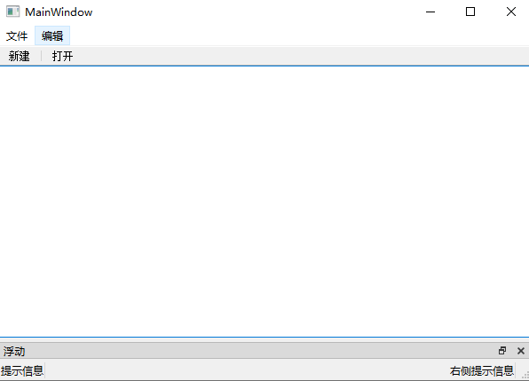

# QMainWindow

## 快速使用案例

```cpp
#include "mainwindow.h"
#include "ui_mainwindow.h"
#include <QMenuBar>
#include<QToolBar>

MainWindow::MainWindow(QWidget *parent)
    : QMainWindow(parent)
    , ui(new Ui::MainWindow)
{
    ui->setupUi(this);
    // 重置窗口的大小
    resize(600,400);

    // 菜单栏创建
    QMenuBar *bar = menuBar();

    // 菜单栏放入到窗口中
    setMenuBar(bar);

    // 创建菜单
    QMenu *fileMenu = bar->addMenu("文件");// 添加文件菜单
    QMenu *EditMenu = bar->addMenu("编辑");// 添加编辑菜单

    // 创建菜单项
    QAction *newAction = fileMenu->addAction("新建");
    // 添加分隔符
    fileMenu->addSeparator();
    QAction *openAction = fileMenu->addAction("打开");

    // 创建工具栏
    QToolBar *toolBar = new QToolBar(this);
    addToolBar(toolBar);

    // 设置允许左右停靠
    toolBar->setAllowedAreas(Qt::LeftToolBarArea | Qt::RightToolBarArea);

    // 设置浮动窗口
    toolBar->setFloatable(false);

    // 设置移动
    toolBar->setMovable(false);

    // 工具栏添加内容
    toolBar->addAction(newAction);
    toolBar->addSeparator();
    toolBar->addAction(openAction);


}

MainWindow::~MainWindow()
{
    delete ui;
}


```

  

## 状态栏

```cpp
    // 添加状态栏
    QStatusBar *stBar = statusBar();
    // 添加到窗口中
    setStatusBar(stBar);

    // 添加标签控件
    QLabel *label = new QLabel("提示信息",this);
    stBar->addWidget(label);

    QLabel *label2 = new QLabel("右侧提示信息",this);
    stBar->addPermanentWidget(label2);


```

  

## 浮动窗口

```cpp
    // 设置浮动窗口
    QDockWidget *dockWidget = new QDockWidget("浮动",this);
    addDockWidget(Qt::BottomDockWidgetArea,dockWidget);

    // 设置中心部件
    QTextEdit *edit = new QTextEdit(this);
    setCentralWidget(edit);// 将编辑窗口设置为中心部件

```

  


