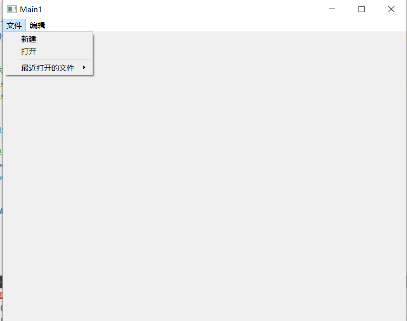
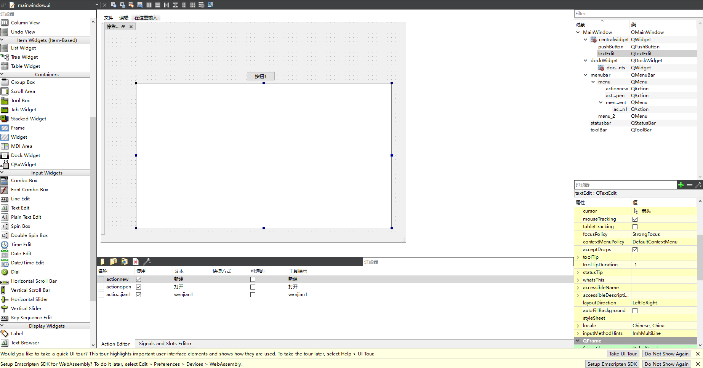

# QT-界面控件

## 一、QMainWindow

&QMainWindow是一个为用户提供主窗口程序的类，包含一个菜单栏、多个工具栏，多个停靠 部件，一个状态栏以及一个中心不见，是许多应用程序的基础，比如文本编辑器和图片编辑器

  

## 二、菜单栏的案例

```cpp
#include "mainwindow.h"
#include<QMenuBar>

MainWindow::MainWindow(QWidget *parent)
    : QMainWindow(parent)
{
    this->resize(800,600);// 改变窗口的大小


    // 菜单栏 获取当前窗口的菜单栏  没有的话就自动创建一个
    QMenuBar *mb = this->menuBar();// 获取菜单栏对象

    // 添加菜单
    QMenu *menuFile = mb->addMenu("文件");
    QMenu *menuEdit = mb->addMenu("编辑");// 添加编辑菜单


    // 向菜单里面添加菜单项
    QAction *actionNew = menuFile->addAction("新建");// 向文件菜单中添加菜单项
    QAction *actionOpen = menuFile->addAction("打开");// 向文件菜单中添加打开菜单项

    // 添加分隔符
    menuFile->addSeparator();

    // 添加二级菜单
    QMenu *menuRecent = menuFile->addMenu("最近打开的文件");
    menuRecent->addAction("最近打开的一个文件");
}

MainWindow::~MainWindow()
{
}

```

  


## 三、工具栏的案例

```cpp
#include "mainwindow.h"
#include<QMenuBar>
#include<QToolBar>

MainWindow::MainWindow(QWidget *parent)
    : QMainWindow(parent)
{
    this->resize(800,600);// 改变窗口的大小


    // 菜单栏 获取当前窗口的菜单栏  没有的话就自动创建一个
    QMenuBar *mb = this->menuBar();// 获取菜单栏对象

    // 添加菜单
    QMenu *menuFile = mb->addMenu("文件");
    QMenu *menuEdit = mb->addMenu("编辑");// 添加编辑菜单

    // 向菜单里面添加菜单项
    QAction *actionNew = menuFile->addAction("新建");// 向文件菜单中添加菜单项
    QAction *actionOpen = menuFile->addAction("打开");// 向文件菜单中添加打开菜单项

    // 添加分隔符
    menuFile->addSeparator();

    // 添加二级菜单
    QMenu *menuRecent = menuFile->addMenu("最近打开的文件");
    menuRecent->addAction("最近打开的一个文件");

    // 工具栏
    QToolBar *toolBar = this->addToolBar("工具栏");

    // 工具栏中添加工具
    toolBar->addAction(actionNew);// 向工具栏中添加菜单项  新建
    toolBar->addAction(actionOpen);// 向工具栏中添加 打开菜单项

    this->addToolBar(Qt::LeftToolBarArea,toolBar);// 添加工具栏  工具栏放在左边  枚举类型

    // 只允许停靠在左边或者右边
    toolBar->setAllowedAreas(Qt::LeftToolBarArea | Qt::RightToolBarArea);
    
    // 设置工具栏不可以浮动
    toolBar->setFloatable(false);
    
    toolBar->setMovable(false);// 设置工具栏不可以浮动
}

MainWindow::~MainWindow()
{
}
```

  


## 四、状态栏的案例

```cpp
#include "mainwindow.h"
#include<QMenuBar>
#include<QToolBar>
#include<QLabel>
#include<QStatusBar>

MainWindow::MainWindow(QWidget *parent)
    : QMainWindow(parent)
{
    this->resize(800,600);// 改变窗口的大小


    // 菜单栏 获取当前窗口的菜单栏  没有的话就自动创建一个
    QMenuBar *mb = this->menuBar();// 获取菜单栏对象

    // 添加菜单
    QMenu *menuFile = mb->addMenu("文件");
    QMenu *menuEdit = mb->addMenu("编辑");// 添加编辑菜单

    // 向菜单里面添加菜单项
    QAction *actionNew = menuFile->addAction("新建");// 向文件菜单中添加菜单项
    QAction *actionOpen = menuFile->addAction("打开");// 向文件菜单中添加打开菜单项

    // 添加分隔符
    menuFile->addSeparator();

    // 添加二级菜单
    QMenu *menuRecent = menuFile->addMenu("最近打开的文件");
    menuRecent->addAction("最近打开的一个文件");

    // 工具栏
    QToolBar *toolBar = this->addToolBar("工具栏");

    // 工具栏中添加工具
    toolBar->addAction(actionNew);// 向工具栏中添加菜单项  新建
    toolBar->addAction(actionOpen);// 向工具栏中添加 打开菜单项

    this->addToolBar(Qt::LeftToolBarArea,toolBar);// 添加工具栏  工具栏放在左边  枚举类型

    // 只允许停靠在左边或者右边
    toolBar->setAllowedAreas(Qt::LeftToolBarArea | Qt::RightToolBarArea);

    // 设置工具栏不可以浮动
    toolBar->setFloatable(false);

    toolBar->setMovable(false);// 设置工具栏不可以浮动

    // 状态栏
    QStatusBar *sb = this->statusBar();// 获取状态栏

    // 往状态栏中添加信息
    // 添加左侧信息
    QLabel *labelLeft = new QLabel("左侧信息",this);

    sb->addWidget(labelLeft);// 添加一个标签进入状态栏中

    // 添加右侧信息
    QLabel *labelRight = new QLabel("右侧信息",this);

    sb->addPermanentWidget(labelRight);// 在状态栏右侧添加信息

}

MainWindow::~MainWindow()
{
}


```

  

## 五、停靠部件和核心部件

```cpp
#include "mainwindow.h"
#include<QMenuBar>
#include<QToolBar>
#include<QLabel>
#include<QStatusBar>
#include<QDockWidget>
#include<QTextEdit>

MainWindow::MainWindow(QWidget *parent)
    : QMainWindow(parent)
{
    this->resize(800,600);// 改变窗口的大小


    // 菜单栏 获取当前窗口的菜单栏  没有的话就自动创建一个
    QMenuBar *mb = this->menuBar();// 获取菜单栏对象

    // 添加菜单
    QMenu *menuFile = mb->addMenu("文件");
    QMenu *menuEdit = mb->addMenu("编辑");// 添加编辑菜单

    // 向菜单里面添加菜单项
    QAction *actionNew = menuFile->addAction("新建");// 向文件菜单中添加菜单项
    QAction *actionOpen = menuFile->addAction("打开");// 向文件菜单中添加打开菜单项

    // 添加分隔符
    menuFile->addSeparator();

    // 添加二级菜单
    QMenu *menuRecent = menuFile->addMenu("最近打开的文件");
    menuRecent->addAction("最近打开的一个文件");

    // 工具栏
    QToolBar *toolBar = this->addToolBar("工具栏");

    // 工具栏中添加工具
    toolBar->addAction(actionNew);// 向工具栏中添加菜单项  新建
    toolBar->addAction(actionOpen);// 向工具栏中添加 打开菜单项

    this->addToolBar(Qt::LeftToolBarArea,toolBar);// 添加工具栏  工具栏放在左边  枚举类型

    // 只允许停靠在左边或者右边
    toolBar->setAllowedAreas(Qt::LeftToolBarArea | Qt::RightToolBarArea);

    // 设置工具栏不可以浮动
    toolBar->setFloatable(false);

    toolBar->setMovable(false);// 设置工具栏不可以浮动

    // 状态栏
    QStatusBar *sb = this->statusBar();// 获取状态栏

    // 往状态栏中添加信息
    // 添加左侧信息
    QLabel *labelLeft = new QLabel("左侧信息",this);

    sb->addWidget(labelLeft);// 添加一个标签进入状态栏中

    // 添加右侧信息
    QLabel *labelRight = new QLabel("右侧信息",this);

    sb->addPermanentWidget(labelRight);// 在状态栏右侧添加信息

    // 停靠部件 可以有多个
    QDockWidget *dockWidget = new QDockWidget("停靠部件",this);
    this->addDockWidget(Qt::BottomDockWidgetArea,dockWidget);// 停靠位置  底部  停靠在centralWidget控件的底部  参照物部件

    // 添加核心部件
   QTextEdit *textEdit = new QTextEdit();// 新建一个文本编辑区域
   this->setCentralWidget(textEdit);// 中间控件填充一个文本区域

}

MainWindow::~MainWindow()
{
}

```

## 六、UI文件的使用

* 创建项目的时候保留UI
* setup函数，就是关联UI文件的代码到程序
* 原理就是qt将ui文件转换成c++代码
* 就直接使用ui->对象名 来获取窗口对象指针

  

  


```cpp

#include "mainwindow.h"
#include "ui_mainwindow.h"
#include<QLabel>

MainWindow::MainWindow(QWidget *parent)
    : QMainWindow(parent)
    , ui(new Ui::MainWindow)
{
    // 关联ui文件到程序界面
    ui->setupUi(this);  // ui初始化
    
    // 在后面更改ui界面信息  前面只是初始化

    // 向状态栏中添加信息
    ui->statusbar->addWidget(new QLabel("左侧信息",this));
}

MainWindow::~MainWindow()
{
    delete ui;
}
```

## 七、资源文件的使用

* 使用资源绝对路径添加资源
```cpp
#include "mainwindow.h"
#include "ui_mainwindow.h"
#include<QLabel>

MainWindow::MainWindow(QWidget *parent)
    : QMainWindow(parent)
    , ui(new Ui::MainWindow)
{
    // 关联ui文件到程序界面
    ui->setupUi(this);  // ui初始化

    // 在后面更改ui界面信息  前面只是初始化

    // 向状态栏中添加信息
    ui->statusbar->addWidget(new QLabel("左侧信息",this));

    // 使用图片资源

    // 使用绝对路径
    ui->actionnew->setIcon(QIcon("D:\\Pictures\\vue.png"));
    
    // 使用资源文件
}

MainWindow::~MainWindow()
{
    delete ui;
}


```


* 添加资源文件

项目右键，添加资源文件

  

  

  


```cpp
#include "mainwindow.h"
#include "ui_mainwindow.h"
#include<QLabel>

MainWindow::MainWindow(QWidget *parent)
    : QMainWindow(parent)
    , ui(new Ui::MainWindow)
{
    // 关联ui文件到程序界面
    ui->setupUi(this);  // ui初始化

    // 在后面更改ui界面信息  前面只是初始化

    // 向状态栏中添加信息
    ui->statusbar->addWidget(new QLabel("左侧信息",this));

    // 使用图片资源

    // 使用绝对路径
//    ui->actionnew->setIcon(QIcon("D:\\Pictures\\vue.png"));

    // 使用资源文件
    // 冒号：+前缀 / + 目录文件名
    ui->actionnew->setIcon(QIcon(":/Talyor/T001M002000qrPik2w6lDr_99.jpg"));


}

MainWindow::~MainWindow()
{
    delete ui;
}


```

## 八、对话框的使用

对话框：没有最大化、最小化按钮的窗口

模态对话框，就是对话框还没有关闭前不能操作同一个进程的其他窗口

非模态对话框：就是对话框没有关闭之前也可以操作同一个进程的其他窗口

```cpp
#include "mainwindow.h"
#include "ui_mainwindow.h"
#include<QDialog>
#include<QDebug>
MainWindow::MainWindow(QWidget *parent)
    : QMainWindow(parent)
    , ui(new Ui::MainWindow)
{
    ui->setupUi(this);

    // 创建一个模态对话框
    connect(ui->actionModal,&QAction::triggered,[=](){
        // 点击按钮创建一个模态对话框

        QDialog dlg(this);
        dlg.exec();// 循环


        qDebug()<<"创建一个对话框";

    });


    // 点击按钮 创建一个非模态对话框
    connect(ui->actionNoModal,&QAction::triggered,[=](){
        // 创建一个非模态对话框

        // 因为show是一个非阻塞的函数  所以dlg会很快释放 改使用new
        QDialog *dlg = new QDialog(this);
        dlg->show();
        
        
        // 但是每次点击按钮 都会创建一个dialog对象 所以释放问题 父对象释放的时候 子对象才会释放
        // 通过设置窗口的属性 让它关闭的时候自动释放
        dlg->setAttribute(Qt::WA_DeleteOnClose);//  关闭窗口自动释放内存
        
        qDebug()<<"创建一个对话框";


    });
}

MainWindow::~MainWindow()
{
    delete ui;
}
```


## 九、QMessageBox的使用

  

QMessageBox用来提示用户某条信息，分为以下几个级别：

* info
* warning
* critical
* question
都可以通过QMessageBox::函数名的方式来调用

```cpp
#include "mainwindow.h"
#include "ui_mainwindow.h"
#include<QDialog>
#include<QDebug>
#include<QMessageBox>
MainWindow::MainWindow(QWidget *parent)
    : QMainWindow(parent)
    , ui(new Ui::MainWindow)
{
    ui->setupUi(this);

    // 创建一个模态对话框
    connect(ui->actionModal,&QAction::triggered,[=](){
        // 点击按钮创建一个模态对话框

        QDialog dlg(this);
        dlg.exec();// 循环
        qDebug()<<"创建一个对话框";

    });


    // 点击按钮 创建一个非模态对话框
    connect(ui->actionNoModal,&QAction::triggered,[=](){
        // 创建一个非模态对话框

        // 因为show是一个非阻塞的函数  所以dlg会很快释放 改使用new
        QDialog *dlg = new QDialog(this);
        dlg->show();


        // 但是每次点击按钮 都会创建一个dialog对象 所以释放问题 父对象释放的时候 子对象才会释放
        // 通过设置窗口的属性 让它关闭的时候自动释放
        dlg->setAttribute(Qt::WA_DeleteOnClose);//  关闭窗口自动释放内存
        qDebug()<<"创建一个对话框";
    });
}

MainWindow::~MainWindow()
{
    delete ui;
}

// 选中action 鼠标右键 直接转到槽  然后生成代码
// 这是槽函数   槽函数的定义
void MainWindow::on_actionCritical_triggered()
{
    QMessageBox::critical(this,"错误","critical");// 使用critical 函数
}

void MainWindow::on_actionWarning_triggered()
{
    QMessageBox::warning(this,"警告","warning");
}


void MainWindow::on_actionInfo_triggered()
{
    QMessageBox::information(this,"信息","information");
}
```

## 十、文件对话框的使用

* 使用QFileDialog来打开一个文件对话框
* 常用的函数是getOpenFIleName来选择单一某文件
* 可以指定默认路径
* 还可以指定文件过滤器，格式：类型名称
* 通过返回值来获取用户选取了哪个文件

```cpp
voidMainWindow::on_actionQFileDialog_triggered()
{
    // 打开一个文件对话框
    QFileDialog::getOpenFileName(this,"打开一个文件");
}

```


