# Qt-第一个HelloWorld界面

## 一、Qt简介

&emsp;Qt是一个跨平台的C++图形用户界面应用程序框架。他为应用程序开发者提供建立图形界面所需的所有功能。它是完全面向对象的，很容易进行扩展，并且允许真正的组件编程。

## 二、QtCreator简介

&emsp;Qt Creator是跨平台的 Qt IDE， Qt Creator 是 Qt 被 Nokia 收购后推出的一款新的轻量级集成开发环境（IDE）。此 IDE 能够跨平台运行，支持的系统包括 Linux（32 位及 64 位）、Mac OS X 以及 Windows。根据官方描述，Qt Creator 的设计目标是使开发人员能够利用 Qt 这个应用程序框架更加快速及轻易的完成开发任务。

## 三、第一个HelloWorld程序以及Qt项目

* 首先创建一个项目

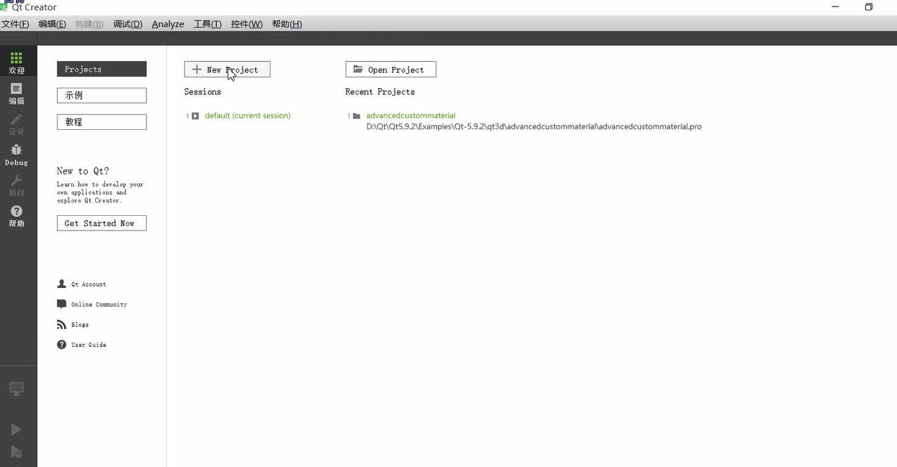  

* 选择第一个 Qt Widgets Application
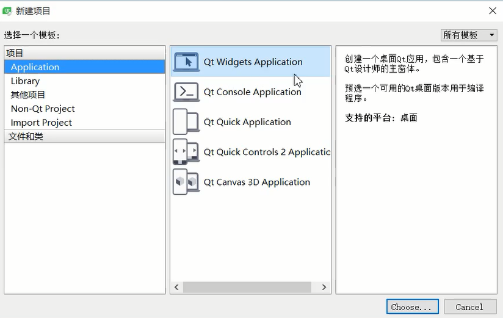  

* 填写名称和路径
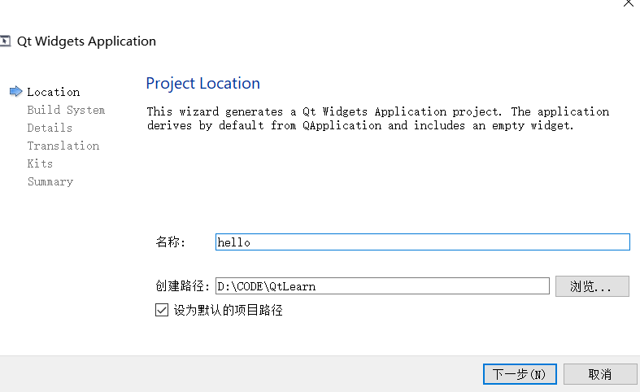  

* 选择编译器

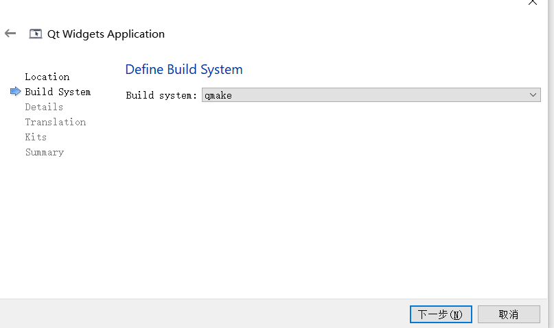  

* 选择QMWidget即可

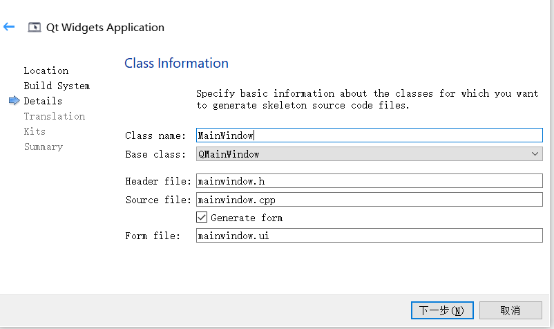  

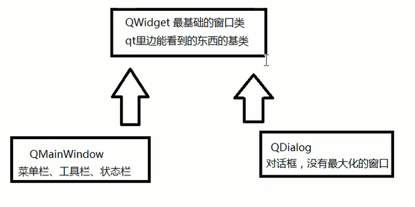  

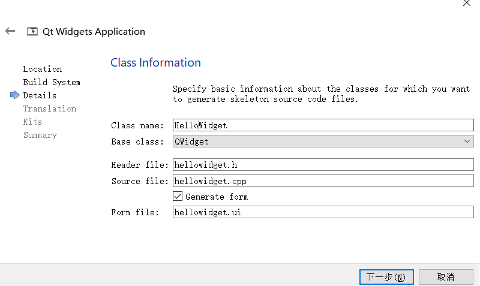  

* 选择组件
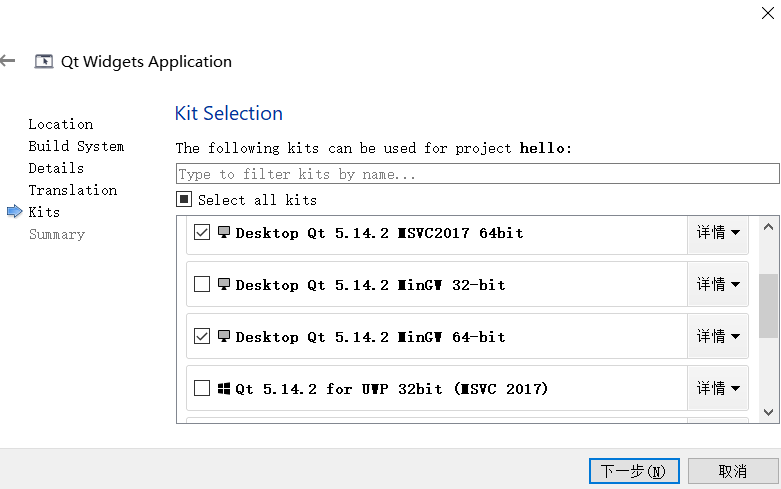  

* 点击按钮 运行
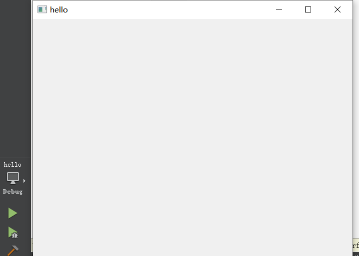  

* 文件结构
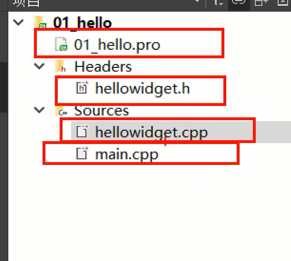  

main.cpp
```cpp
#include "hellowidget.h"
#include<iostream>
#include <QApplication>
using namespace  std;

int main(int argc, char *argv[])
{
    // 创建一个应用程序对象
    // 维护qt应用程序生命的一个对象  每个Qt有且仅有一个的对象
    QApplication a(argc, argv);

    // 窗口类的一个对象
    HelloWidget w;

    // 显示窗口
    w.show();
    cout<<"before exec"<<endl;

    // 这里陷入一个循环
    // 死循环让程序一直运行  生命循环  消息循环
    a.exec();
    
    // 等待循环结束之后  进行打印
    cout<<"affter exec"<<endl;
    return 0;
}
```

hellowidget.h
```cpp
#ifndef HELLOWIDGET_H
#define HELLOWIDGET_H

#include <QWidget>

class HelloWidget : public QWidget
{
    // 宏  引入qt信号和槽的一个宏
    Q_OBJECT

public:
    // 构造函数 parent窗口指针 父窗口对象的指针
    // 如果parent为0 或者NULL 表示当前窗口对象是个顶层窗口
    // 顶层窗口就是可以在任务栏找到的窗口
    HelloWidget(QWidget *parent = nullptr);
    ~HelloWidget();
};
#endif // HELLOWIDGET_H


```


helloWidget.cpp
```cpp
#include "hellowidget.h"

HelloWidget::HelloWidget(QWidget *parent)
    : QWidget(parent)
{
}

HelloWidget::~HelloWidget()
{
}
```

项目结构总结：

* 创建项目的时候 QWidget QApplication QDialog 都继承来自QWidget

* main函数 QApplication就是QT里面每一个应用程序有且仅有一个应用程序对象

* QAppliction::exec() 程序的生命循环、消息循环

* Widget头文件总结
  * Q_OBJECT：宏，引入Qt信号和槽的一个宏
  * HelloWidget（QWidget *parent = 0），parent是窗口指针，父窗口对象的指针，如果parent是0 或者NULL，表示当前窗口对象是一个顶层窗口，顶层窗口就是在任务栏可以找到的窗口


## 四、.pro文件介绍

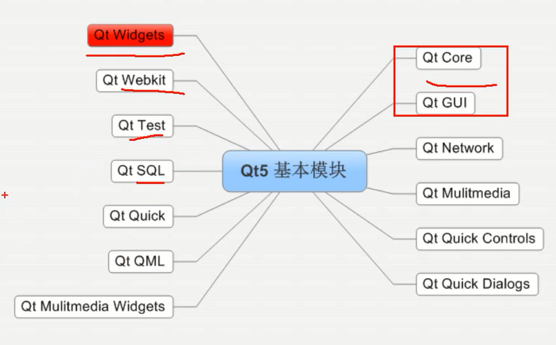  

```cpp
# Qt是工程模块变量 引入了Qt的core和gui模块
QT       += core gui

# 如果QT版本号大于4 就引入widgets模块
greaterThan(QT_MAJOR_VERSION, 4): QT += widgets

CONFIG += c++11

# The following define makes your compiler emit warnings if you use
# any Qt feature that has been marked deprecated (the exact warnings
# depend on your compiler). Please consult the documentation of the
# deprecated API in order to know how to port your code away from it.
DEFINES += QT_DEPRECATED_WARNINGS

# You can also make your code fail to compile if it uses deprecated APIs.
# In order to do so, uncomment the following line.
# You can also select to disable deprecated APIs only up to a certain version of Qt.
#DEFINES += QT_DISABLE_DEPRECATED_BEFORE=0x060000    # disables all the APIs deprecated before Qt 6.0.0


SOURCES += \
    main.cpp \
    hellowidget.cpp

HEADERS += \
    hellowidget.h

# 指定目标 生成可执行文件的名字
# 模板，生成什么文件，app表示应用程序exe lib就是生成库
# Default rules for deployment.
qnx: target.path = /tmp/$${TARGET}/bin
else: unix:!android: target.path = /opt/$${TARGET}/bin
!isEmpty(target.path): INSTALLS += target
```

## 五、Qt命名规范和QtCreator常用快捷键

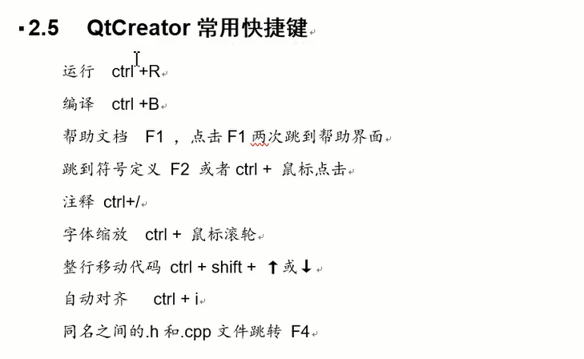  


## 六、帮助文档的使用


## 七、父子关系

* setParent
```cpp
#include "hellowidget.h"
#include<iostream>
#include <QApplication>
#include<QPushButton>
using namespace  std;

int main(int argc, char *argv[])
{
    // 创建一个应用程序对象
    // 维护qt应用程序生命的一个对象  每个Qt有且仅有一个的对象
    QApplication a(argc, argv);

    // 窗口类的一个对象
    HelloWidget w;

    // 默认情况下没有建立父子关系 现实的都是顶层窗口
    // 使用setParent函数
    QPushButton btn;
    btn.setText("aniu1");
//    btn.show();
    btn.setParent(&w);

    // 显示窗口
    w.show();
    a.exec();
    return 0;
}
```

* 使用构造函数传参
```cpp
#include "hellowidget.h"
#include<iostream>
#include <QApplication>
#include<QPushButton>
using namespace  std;

int main(int argc, char *argv[])
{
    // 创建一个应用程序对象
    // 维护qt应用程序生命的一个对象  每个Qt有且仅有一个的对象
    QApplication a(argc, argv);

    // 窗口类的一个对象
    HelloWidget w;

    // 默认情况下没有建立父子关系 现实的都是顶层窗口
    // 使用setParent函数
    QPushButton btn;
    btn.setText("aniu1");
//    btn.show();
    btn.setParent(&w);

    // 构造函数传参
    QPushButton btn2("按钮2",&w);

    // 移动以下按钮位置
    btn2.move(100,100);


    // 显示窗口
    w.show();
    a.exec();
    return 0;
}
```

## 八、Qt坐标系

```cpp
#include "hellowidget.h"
#include<iostream>
#include <QApplication>
#include<QPushButton>
using namespace  std;

int main(int argc, char *argv[])
{
    // 创建一个应用程序对象
    // 维护qt应用程序生命的一个对象  每个Qt有且仅有一个的对象
    QApplication a(argc, argv);

    // 窗口类的一个对象
    HelloWidget w;

    // 默认情况下没有建立父子关系 现实的都是顶层窗口
    // 使用setParent函数
    QPushButton btn;
    btn.setText("aniu1");
//    btn.show();
    btn.setParent(&w);

    // 构造函数传参
    QPushButton btn2("按钮2",&w);

    // 移动以下按钮位置
    btn2.move(100,100);// 相对于父窗口 进行移动坐标
    btn2.resize(500,500);

    //按钮3  和按钮2建立父子关系
    QPushButton btn3("按钮3",&btn2);
    btn3.move(100,100);// 相对于父窗口 移动坐标

    // 显示窗口
    w.show();
    a.exec();
    return 0;
}
```
* 是以父窗口的左上角为0，0
* 以向右的方向为x的正方向
* 以向下的方向为y的正方向
* 顶层窗口就是以屏幕左上角为0，0


## 九、Qt常用API

* move 移动窗口到父窗口的某个坐标
* resize 重新设置窗口的大小
* setFixedSize 设置窗口的固定大小
* setWindowTitle 设置窗口的标题
* setGeometry 同时设置窗口位置和大小 相当于Move和resize的结合体


## 十、对象树

* 概念：各个窗口对象通过建立父子关系构造对的一个关系树
* 内存管理：父对象释放的时候会自动释放各个子对象（使用children列表）
* 以后基本都是使用New方式来创建窗口对象
* 父对象能够被释放
* 父对象、子对象 直接或者简介继承自QObject

MyPushButton.h
```cpp
#ifndef MYPUSHBUTTON_H
#define MYPUSHBUTTON_H

#include <QWidget>
#include<QPushButton>

class MyPushButton : public QPushButton
{
    Q_OBJECT
public:
    // 构造函数只传入了一个地址
    explicit MyPushButton(QWidget *parent = nullptr);
    
    ~MyPushButton();
    

signals:

};

#endif // MYPUSHBUTTON_H


```

MyPushButton.cpp
```cpp
#include "mypushbutton.h"
#include<QDebug>

MyPushButton::MyPushButton(QWidget *parent) : QPushButton(parent)
{

}

// 析构函数
MyPushButton::~MyPushButton()
{
    qDebug()<<"MyPushButton Destroyed";
}

```

## 十一、点击按钮关闭窗口

```cpp
#include "widget.h"
#include<QPushButton>
#include"mypushbutton.h"

Widget::Widget(QWidget *parent)
    : QWidget(parent)
{
    QPushButton *btn = new QPushButton("按钮1",this);

    // 按钮
    // 被点击
    // 窗口
    // 关闭

    // 建立四者的关系 按钮  被点击  窗口 关闭
    connect(btn,&QPushButton::clicked,this,&Widget::close);

}

Widget::~Widget()
{
}


```
