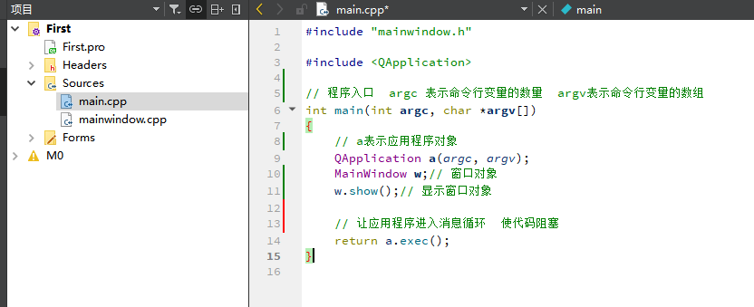

# Qt简单讲解


## 项目结构

  

```cpp
#include "mainwindow.h"

#include <QApplication>

// 程序入口  argc 表示命令行变量的数量  argv表示命令行变量的数组
int main(int argc, char *argv[])
{
    // a表示应用程序对象
    QApplication a(argc, argv);
    MainWindow w;// 窗口对象
    w.show();// 显示窗口对象
    
    // 让应用程序进入消息循环  使代码阻塞
    return a.exec();
}

```

mainwindow.h

```cpp
#ifndef MAINWINDOW_H
#define MAINWINDOW_H

#include <QMainWindow>

QT_BEGIN_NAMESPACE
namespace Ui { class MainWindow; }
QT_END_NAMESPACE

class MainWindow : public QMainWindow
{
    Q_OBJECT

public:
    MainWindow(QWidget *parent = nullptr);
    ~MainWindow();

private:
    Ui::MainWindow *ui;
};
#endif // MAINWINDOW_H


```

mainwindow.cpp

```cpp
#include "mainwindow.h"
#include "ui_mainwindow.h"

MainWindow::MainWindow(QWidget *parent)
    : QMainWindow(parent)
    , ui(new Ui::MainWindow)
{
    ui->setupUi(this);
}

MainWindow::~MainWindow()
{
    delete ui;
}


```


## pro文件的解释

```cpp
// qt包含的模块
QT       += core gui

// 大于4 的qt版本  包含widgets模块
greaterThan(QT_MAJOR_VERSION, 4): QT += widgets

CONFIG += c++17

# You can make your code fail to compile if it uses deprecated APIs.
# In order to do so, uncomment the following line.
#DEFINES += QT_DISABLE_DEPRECATED_BEFORE=0x060000    # disables all the APIs deprecated before Qt 6.0.0

// 代表源文件
SOURCES += \
    main.cpp \
    mainwindow.cpp

// 头文件
HEADERS += \
    mainwindow.h

FORMS += \
    mainwindow.ui

# Default rules for deployment.

// 生成的目标文件
qnx: target.path = /tmp/$${TARGET}/bin
else: unix:!android: target.path = /opt/$${TARGET}/bin
!isEmpty(target.path): INSTALLS += target


```

## 源文件的解释

mainwindow.h

```cpp


// 防止头文件重复编译
#ifndef MAINWINDOW_H
#define MAINWINDOW_H


#include <QMainWindow>


QT_BEGIN_NAMESPACE
namespace Ui { class MainWindow; }
QT_END_NAMESPACE

// 继承QMainWindow类
class MainWindow : public QMainWindow
{
    //宏 允许类中使用信号和槽的机制
    Q_OBJECT

public:
    // 默认有参构造函数
    MainWindow(QWidget *parent = nullptr);
    // 析构函数
    ~MainWindow();

private:
    Ui::MainWindow *ui;
};
#endif // MAINWINDOW_H


```

mainwindow.cpp


```cpp
#include "mainwindow.h"
#include "ui_mainwindow.h"


// 构造函数 使用初始化列表 初始化继承的QMainWindow类
MainWindow::MainWindow(QWidget *parent)
    : QMainWindow(parent)
    , ui(new Ui::MainWindow)
{
    ui->setupUi(this);
}

MainWindow::~MainWindow()
{
    delete ui;
}


```

