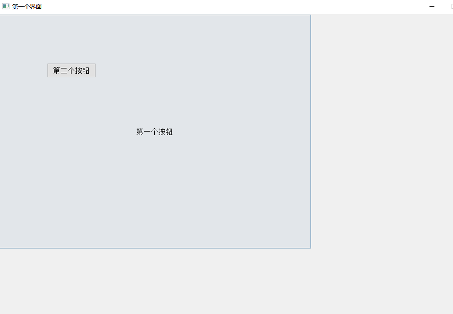

# QPushButton

## 简单使用

* 创建一个按钮 QPushButton *btn = new QPushButton;
* 让btn对象以来在窗口界面 btn->setParent(this);
* 显示文本 btn->setText("第一个按钮");
* 重置窗口大小resize(600,400);
* setWindowTitle("第一个界面");// 设置标题
* setFixedSize(1000,1000);// 设置固定的大小

```cpp
#include "mainwindow.h"
#include "ui_mainwindow.h"
#include <QPushButton>


// 构造函数 使用初始化列表 初始化继承的QMainWindow类
MainWindow::MainWindow(QWidget *parent)
    : QMainWindow(parent)
    , ui(new Ui::MainWindow)
{
    ui->setupUi(this);

    // 创建一个按钮
    QPushButton *btn = new QPushButton;

    // 让btn对象以来在窗口界面中
    btn->setParent(this);

    // 显示文本
    btn->setText("第一个按钮");

    QPushButton *btn2 = new QPushButton("第二个按钮",this);

    // 移动第二个按钮
    btn2->move(100,100);

    // 重置窗口大小
    resize(600,400);

    setWindowTitle("第一个界面");// 设置标题

    setFixedSize(1000,1000);// 设置固定的大小

}

MainWindow::~MainWindow()
{
    delete ui;
}


```
  


