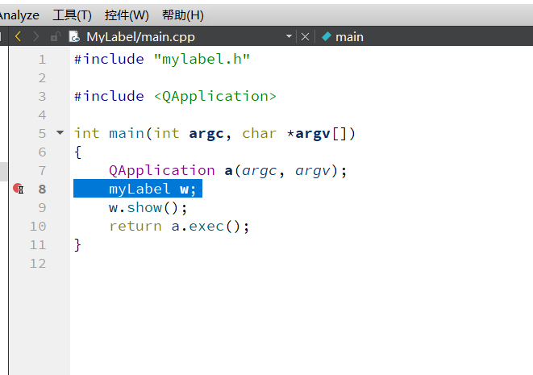
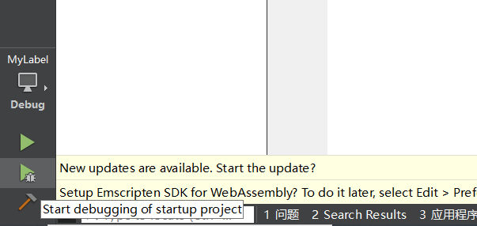
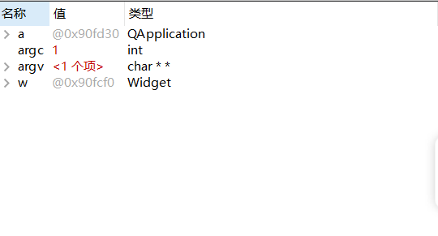
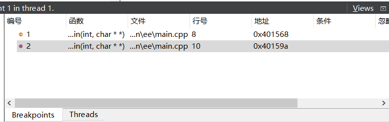
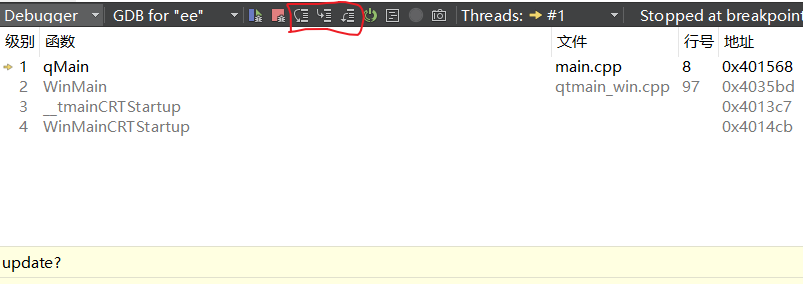
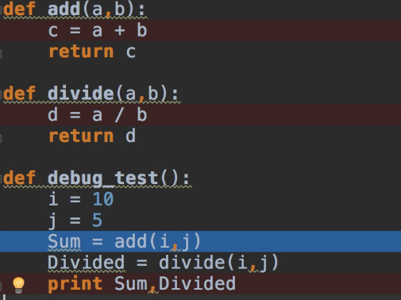

# 使用QtCreator进行debug

## 简单操作

### 设置断点

鼠标右键在需要打断点的地方打断点

  

### debug

点击小甲虫按钮，启动之后可以看到三个窗口表格

  

这里显示变量的值。

  

这里显示函数当前的执行处以及断点的地方

  

这三个按钮分别代表的含义是：

  

* step into: 单步执行，遇到子函数就可以进入并且继续单步执行，简而言之就是进入子函数
* step over:在单步执行之后，在函数内部遇到子函数时不会进入子函数内单步执行，而且是将子函数整个执行完在停止，也就是将整个子函数作为一步，简而言之，越过子函数，但是子函数会执行
* step out: 当单步执行到子函数内部的时候，step out 就可以执行完子函数剩下的一部分，并且返回到上一层函数
* 按下单步执行按钮，黄色的箭头指向的是当前正在运行的地方

  

程序执行到第14行断点处停止，然后按下step into进入add()函数，按下step out 执行完add()函数的剩下一部分，返回入口函数debug_test()继续执行，然后按下step over直接将divide函数执行完毕，最后单步执行指导入口函数结束。

上面只是举一个简单的例子，并不是QT Creator中的例子

