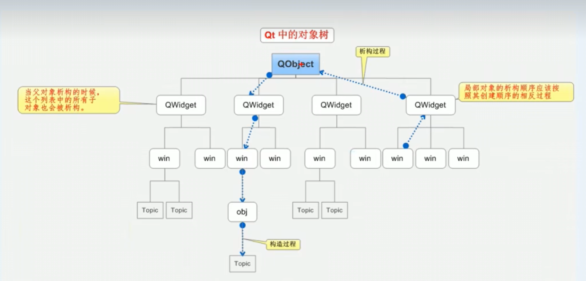

# 对象树


## 结构

  

**构造顺序从上到下，析构顺序从下到上**

## 自定义QPushButton

* h文件

```cpp
#ifndef MYPUSH_H
#define MYPUSH_H

#include <QWidget>
#include<QPushButton>

class MyPush : public QPushButton
{
    Q_OBJECT
public:
    explicit MyPush(QWidget *parent = nullptr);
    ~MyPush();// 析构函数

signals:

};

#endif // MYPUSH_H


```


* cpp文件

```cpp
#include "mypush.h"

MyPush::MyPush(QWidget *parent)
    : QPushButton{parent}
{

}


MyPush::~MyPush(){
    
}

```


