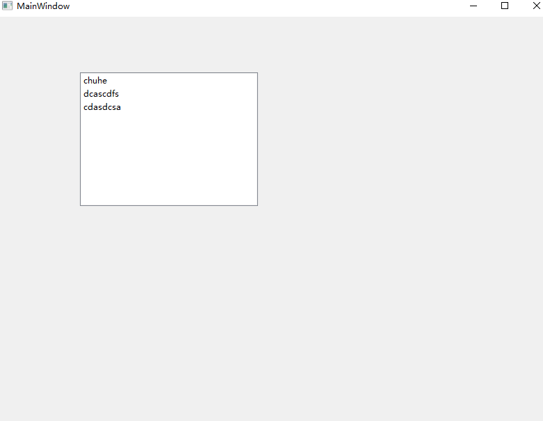

# 常用控件介绍

## QListWidget

**addItems一次性添加所有内容**


```cpp
#include "mainwindow.h"
#include "ui_mainwindow.h"
#include<QListWidget>
#include<QListWidgetItem>
#include<QStringList>
MainWindow::MainWindow(QWidget *parent)
    : QMainWindow(parent)
    , ui(new Ui::MainWindow)
{
    ui->setupUi(this);
       // 为QListWidget 添加Items

    // 创建一个item
//    QListWidgetItem *item = new QListWidgetItem("xxx");
//    // 放进listWidget中
//    ui->listWidget->addItem(item);

    // 将多个item 放入ListWidget中
    QStringList list;// 创建一个集合
    list<<"chuhe"<<"dcascdfs"<<"cdasdcsa";
    ui->listWidget->addItems(list);
}

MainWindow::~MainWindow()
{
    delete ui;
}

```

  

## QTreeWidget


