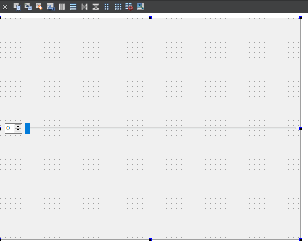

# 自定义控件

## 简单使用


* 首先创建一个工程
  

* 在现有的工程上添加文件，选择Qt设计师界面类

  

* 选择Widget

  

* 添加两个控件之后，选择水平布局

  

* 将刚刚自定义的控件smallWidget放置在原始的控件中

* 首先在原始工程的ui界面 随便放置一个widget

  

* 选择，右键提升为 添加，然后提升

  

* 运行，发现

  


* 移动slider QSpinBox数值发生变化

  


自定义控件 连接信号与槽
```cpp
#include "smallwidget.h"
#include "ui_smallwidget.h"

SmallWidget::SmallWidget(QWidget *parent) :
    QWidget(parent),
    ui(new Ui::SmallWidget)
{
    ui->setupUi(this);
    // QSpinBox移动  QSlider跟着移动

    void(QSpinBox:: *spinSignal)(int) = &QSpinBox::valueChanged;// 带参数的信号

    // QSpinBox是带参数的移动信号
    connect(ui->spinBox,spinSignal,ui->horizontalSlider,&QSlider::setValue);

    //QSlider滑动 QSpinBox数字跟着改变
    connect(ui->horizontalSlider,&QSlider::valueChanged,ui->spinBox,&QSpinBox::setValue);
}

// 设置数字
void SmallWidget::setNum(int num){
    ui->spinBox->setValue(num);
}
// 获取数字
int SmallWidget::getNum(){
    return ui->spinBox->value();
}

SmallWidget::~SmallWidget()
{
    delete ui;
}


```


