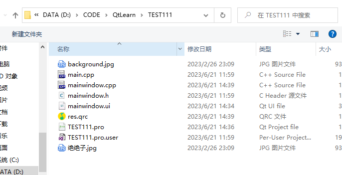
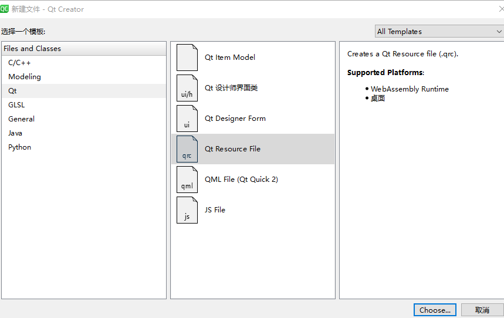
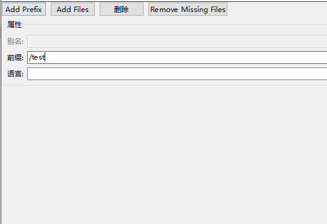

# 资源文件

## 简单使用

* 将图片文件拷贝到项目位置 background.jpg

  


* 右键项目->添加新文件-> QT resource file
  


* res生成res.qrc


* 添加前缀 添加文件
  


* 使用 ": + 前缀名 + 文件名"

```cpp
#include "mainwindow.h"
#include "ui_mainwindow.h"

MainWindow::MainWindow(QWidget *parent)
    : QMainWindow(parent)
    , ui(new Ui::MainWindow)
{
    ui->setupUi(this);

    // 添加图标
    ui->actionnew->setIcon(QIcon(":/background.jpg"));
}

MainWindow::~MainWindow()
{
    delete ui;
}


```
