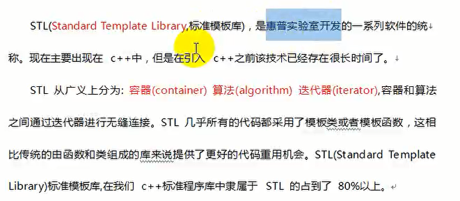
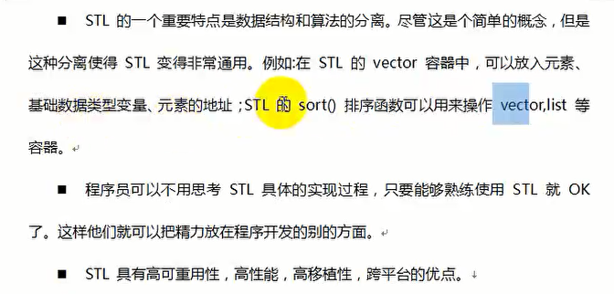
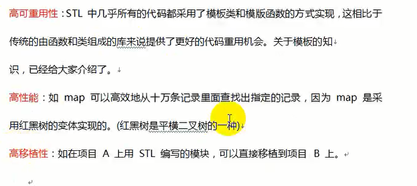

# STL编程概述

## 一、简介

  

## 二、STL六大组件

&emsp;STL六大组件：容器、算法、迭代器、仿函数、适配器、空间适配器

容器：各种数据结构，vector,list,deque,set,map,等用来存放数据，STL容器是一种class template(类模板)

算法：各种常用的算法，比如，sort,find,copy,for_each。从实现的角度来看，STL算法是一种function template(函数模板)

迭代器：扮演了容器与算法之间的胶合剂，五种类型：operator*,operator->,operator++,operator--等指针相关操作予以重载的class template,所有STL容器都附带自己专属的迭代器，只有容器的设计者才知道如何遍历自己的元素，原生指针也是一种迭代器。

仿函数：行为类似函数，可作为算法的某种策略，从实现角度来看，仿函数是一种重载了operator()的class或者class tempalte

适配器：一种用来修饰容器或者仿函数或者迭代器接口的东西

空间配置器：负责空间的配置与管理。从实现角度看，配置器是一个实现了动态空间配置、空间管理、空间释放的class tempalte

STL六大组件之间的交互关系：容器通过空间配置器取得数据存储空间，算法通过迭代器存储容器中的内容，仿函数可以协助算法完成不同的策略的变化，适配器可以修饰仿函数。
  

  

