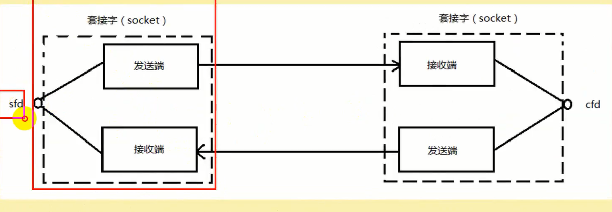

# Socket编程

## 一、Socket编程概述

&emsp;Socket本身有“插座”的意思，在Linux环境下，用于表示进程间网络通信的特殊文件类型。本质为内核借助缓冲区形成的伪文件。

&emsp;既然是文件，那么理所当然的，我们可以使用文件描述符引用套接字。与管道类似的，Linux系统将其封装成文件的目的是为了统一接口，使得读写套接字和读写文件的操作一致。区别是管道主要应用于本地进程间通信，而套接字多应用于网络进程间数据的传递。

套接字的内核实现较为复杂，不宜在学习初期深入学习。
在TCP/IP协议中，“IP地址+TCP或UDP端口号”唯一标识网络通讯中的一个进程。“IP地址+端口号”就对应一个socket。欲建立连接的两个进程各自有一个socket来标识，那么这两个socket组成的socket pair就唯一标识一个连接。因此可以用Socket来描述网络连接的一对一关系。

  

