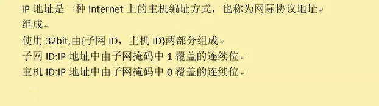

# 网络编程基础

## 一、基础概念的介绍

### 1.1 网卡的介绍

  

### 1.2 mac地址  六个字节 48位

标识网卡的id,理论上这个id是全球唯一的，mac地址一般用来标识主机的id，这个id是物理地址

  

### 1.3 ip地址 32位 四个字节 ipv4

一个IP将其分为子网id和主机id,子网id和主机id需要和子网掩码一起来看

ip中被连续的1覆盖的位就是子网id
ip中被连续的0覆盖的位就是主机id

  

举一个简单的例子：

  

IP地址是：10.1.1.2  子网掩码：255.255.255.0

那么子网id:10.1.1
主机id:2

网段地址：10.1.1.0
广播地址：10.1.1.255

主机id分配的范围：10.1.1.1 -> 10.1.1.254

再举一个例子：192.168.1.2  子网掩码：255.255.0.0
子网id:192.168
主机id:1.2

网段地址：192.168.0.0
广播地址：192.168.255.255

ping 命令用来测试两台主机的连通性

  

127.0.0.1就是本机地址，ping 127.0.0.1主要是用来测试本机的网络配置，能ping通说明本机的网卡和ip协议安装都没有问题

**linux下设置Ip命令：**

ifconfig ens33(网卡)  ip地址 netmask(子网掩码) 255.255.255.0(D类地址)
  

### 1.4 端口

作用：用来标识应用程序（进程）(一个程序多个端口，一个端口只能标识一个程序)

port:2个字节 0-65535

0-1023 知名端口 

自定义端口：1024-65535

netstat

## 二、网络模型

### 2.1 OSI七层模型

  

* 物理层：双绞线接口模型，光线的传输速率
* 数据链路层，mac负责收发数据
* 网络层：ip给两台主机提供路径选择
* 传输层：port区分数据出的送到哪一个应用程序
* 会话层：建立连接
* 表示层：解码

  

### 2.2 TCP/IP模型
  

### 2.3 协议

规定了数据传输的方式和格式

  

### 2.4 网络通信过程

  

### 2.4 arp协议

ARP协议：通过ip地址找mac地址

  

arp包：
  

### 2.5 网络设计模式

B/S  browser/ server
C/S  cilent/server 

c/s  性能较好 客户端容易篡改数据   开发周期较长
b/s  性能低   客户端安全  开发周期短

