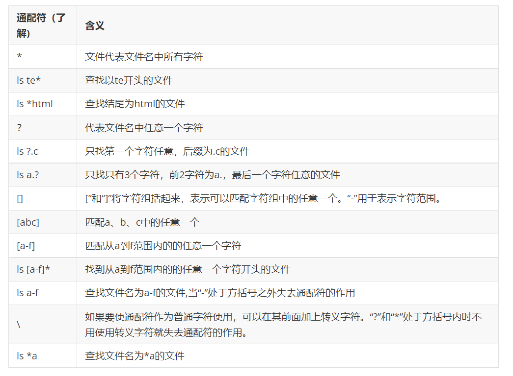
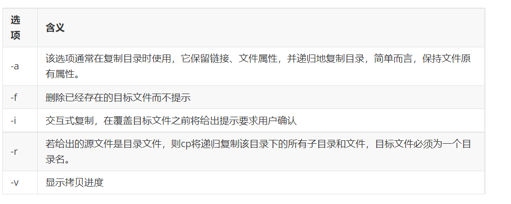

# linux下基本命令

## 一、linux相关快捷键

* 终端打开方式

  


* 终端相关快捷键

  

## 二、linux下内部命令和外部命令

### 2.1 内建命令

  

### 2.2 外部命令

外部命令是安装外部软件的命令

### 2.3 内建命令和外部命令对比

  

  

### 2.4 命令类型查看方法
  

  

如果有内建命令，优先使用内建命令，如果有内建，就是内建命令。有些命令既是内建命令也是外部命令。


### 2.4 内建命令和外部命令帮助

* 内建命令help

比如：help pwd

* 外部命令

ls --help

## 三、man手册

man 是 Linux 提供的一个手册，包含了绝大部分的命令、函数使用说明。

该手册分成很多章节（section），使用 man 时可以指定不同的章节来浏览不同的内容。
  

使用格式：man [选项名] 函数库

  

  

## 四、相对路径和绝对路径

  

## 五、pwd和cd命令

pwd [-LP] 打印当前工作目录的名字

使用pwd命令可以显示当前的工作目录

  

## 六、mkdir创建目录

用法：mkdir [选项]... 目录...

通过mkdir命令可以创建一个新的目录(不能新建普通文件)。参数-p可递归创建目录。

需要注意的是新建目录的名称不能与当前目录中已有的目录或文件同名，并且目录创建者必须对当前目录具有写权限。

* mkdir test 在当前目录下创建test目录 
* mkdir /tmp/test 在根目录下tmp目录里创建test目录 
* mkdir file{1..100} 在当前目录下创建file1到file100的目录,这里会创建100个目录 这里只创建一个目录 
* mkdir -p a/b/c 在当前目录下创建a/b/c目录树 mkdir "a b" 创建以"a b"命名的一个目录 

## 七、rmdir删除目录

用法：rmdir [选项]... 目录... 删除指定的空目录。

可使用rmdir命令删除一个目录。必须离开目录，并且目录必须为空目录，不然提示删除失败。

* rmdir test 删除当前目录的test目录，test必须是空目录 * rmdir /tmp/test 删除/tmp下的test目录 
* rmdir file{1..100} 删除file1到file100的目录
*  rmdir "file{1..100}" 删除file{1..100}目录 
*  rmdir "a b" 删除a b这个目录 rmdir a\ b 删除"a b"目录 rmdir a b c 删除目录a 目录b 目录c

## 八、linux文件类型

Unix/Linux对数据文件(.mp3、.bmp)，程序文件(.c、.h、*.o)，设备文件（LCD、触摸屏、鼠标），网络文件( socket ) 等的管理都抽象为文件，使用统一的方式方法管理。 Linux下一切皆文件。

在Unix/Linux操作系统中也必须区分文件类型，通过文件类型可以判断文件属于可执行文件、文本文件还是数据文件。在Unix/Linux系统中文件可以没有扩展名。

  

### 8.1 普通文件

普通文件是计算机操作系统用于存放数据、程序等信息的文件，一般都长期存放于外存储器（磁盘、磁带等）中。普通文件一般包括文本文件、数据文件、可执行的二进制程序文件等。

在Unix/Linux中可以通过file命令来查看文件的类型。如果file文件后面携带文件名，则查看指定文件的类型，如果携带通配符“*”，则可以查看当前目录下的所有文件的类型

### 8.2 目录文件
Unix/Linux系统把目录看成是一种特殊的文件，利用它构成文件系统的树型结构。

目录文件只允许系统管理员对其进行修改，用户进程可以读取目录文件，但不能对它们进行修改。

每个目录文件至少包括两个条目，“..”表示上一级目录，“.”表示该目录本身

### 8.3 设备文件

Unix/Linux系统把每个设备都映射成一个文件，这就是设备文件。它是用于向I/O设备提供连接的一种文件，分为字符设备和块设备文件。

字符设备的存取以一个字符为单位，块设备的存取以字符块为单位。每一种I/O设备对应一个设备文件，存放在/dev目录中，如行式打印机对应/dev/lp，第一个软盘驱动器对应/dev/fd0

### 8.4 管道文件

管道文件也是Unix/Linux中较特殊的文件类型，这类文件多用于进程间的通信。

### 8.5 链接文件

似于 windows 下的快捷方式，链接又可以分为软链接（符号链接）和硬链接。

  

## 九、文件相关命令

### 9.1 ls

ls是英文单词list的简写，其功能为列出目录的内容，是用户最常用的命令之一，它类似于DOS下的dir命令。

Linux文件或者目录名称最长可以有256个字符，“.”代表当前目录，“..”代表上一级目录，以“.”开头的文件为隐藏文件，需要用 -a 参数才能显示。

  


ls -a 显示指定目录下 所有子目录以及文件  包括隐藏文件
ls -l 文件  显示文件的详细信息
ls -lh 配合-l以人性化的方式显示文件大小

  


  

与DOS下的文件操作类似，在Unix/Linux系统中，也同样允许使用特殊字符来同时引用多个文件名，这些特殊字符被称为通配符。
  

### 9.2 touch命令

**用法：touch [选项]... 文件...**

1）如果文件不存在, 创建新文件(只能是普通文件，不能是文件夹)

2）如果文件存在, 更新文件时间

touch file 创建file空文件，如果file存在则更新file的存取和修改时间 touch file{2,3,4} 同时创建file2,file3,file4三个空文件 touch "file{2,3,4}" 创建file{2,3,4}一个空文件

### 9.3 cp命令

cp命令的功能是将给出的文件或目录复制到另一个文件或目录中，相当于DOS下的copy命令 。

  

  


### 9.4 文件删除

可通过rm删除文件或目录。使用rm命令要小心，因为文件删除后不能恢复。为了防止文件误删，可以在rm后使用-i参数以逐个确认要删除的文件。

  

  

### 9.5 mv命令

用户可以使用mv命令来移动文件或目录，也可以给文件或目录重命名

  


### 9.6 文件查看命令

cat 将文件内容一次性输出到终端。

缺点：终端显示的内容有限，如果文件太长无法全部显示

cat /etc/passwd 查看/etc/passwd内容

cat -n /etc/passwd 查看/etc/passwd内容,对输出的所有行编号

cat -b /etc/passwd 查看/etc/passwd内容并且给非空行编号

cat -A /etc/passwd 等价于 -vET

### 9.7 du和df命令

du命令用于查看某个目录大小。

du命令的使用格式如下：

du [选项] 目录或文件名

  

df命令用于检测文件系统的磁盘空间占用和空余情况，可以显示所有文件系统对节点和磁盘块的使用情况。


### 9.8 find命令

find命令功能非常强大，通常用来在特定的目录下搜索符合条件的文件，也可以用来搜索特定用户属主的文件。

**按文件名查询：使用参数 -name**

命令：find + 路径 + -name +“文件名”

示例：find /home -name “a.txt”


**按文件大小查询：使用参数 -size**

命令：find + 路径 + -size + 范围

范围

Ø 大于：+表示 -- +100k

Ø 小于：-表示 -- -100k

Ø 等于: 不需要添加符号 -- 100k

大小

Ø M 必须大写（10M）

Ø k 必须小写（20k）

例子: 查询目录为家目录

等于100k的文件: find ~/ -size 100k

大于100k的文件: find ~/ -size +100k

大于50k, 小于100k的文件: find ~/ -size +50k -size -100k


```linux

find /etc -name grub.conf   查找/etc目录下的grub.conf文件
find / -name "*.conf"       查找/下所有.conf文件
find  / -iname grub.conf    查找/目录下的grub.conf文件，忽略大小写
find / -maxdepth 2 -name grub.conf     可以使用-maxdepath参数来控制查找的层次，就是说只查当前目录和子目录,最多查2级目录
find / -mindepth 2 -name grub.conf     最少查二级目录
find /etc -type d           查找/etc/下所有的目录
find /etc -type f           查找/etc/下的所有普通文件
find /etc -type l -name *.conf      查找/etc/下软链接文件是.conf结尾的文件
find /etc -type s           查找/etc/下所有socket文件
find /etc -type c           查找/etc/下的所有字符设备文件
find /etc -type p           查找/etc/下所有管道文件
find /etc -user root        查找/etc/所属用户是root的文件
find /etc -group root       查找/etc/所属用户组是root的文件
find /etc -uid 500          查找/etc/下uid是500的文件,和-user类似
find /etc -gid 500          查找/etc/下gid是500的文件,和-group类似
find /etc -nouser           查找没有所属用户的文件
find /etc -nogroup          查找没有所属用户组的文件
find /etc -perm 777 -type d    查找/etc/下权限为777的目录
find . -perm  111           查找权限是111的文件
find . -size +10M           查找当前目录下大于10M的文件，单位可以有K,M,G,b等
find / -size -2M            查找根目录下少于2M的文件
find / -mtime 1             查找根目录下1天以前修改的所有文件
find / -mtime +2            查找根目录下2天以前修改的所有文件
find / -mtime -3            查找根目录下最近3天内修改的所有文件
find / -atime 1             查找根目录下1天以前访问或读过的所有文件
find / -atime -1            查找根目录下最近1天内读过或访问的文件
find / -ctime -3            查找根目录下最近3天内状态发生改变的文件
find / -cmin -3             查找根目录下最近3分钟内状态发生改变的文件
find / -empty               查找根目录下所有空白文件或者空目录
find / -false               查找根目录下总是错误的文件

```

**按文件类型查询：使用参数 -type**

命令：find + 路径 + -type + 类型

类型

Ø 普通文件类型用 f 表示而不是-

Ø d -> 目录

Ø l -> 符号链接

Ø b -> 块设备文件

Ø c -> 字符设备文件

Ø s -> socket文件，网络套接字

Ø p -> 管道

查找指定目录下的普通文件： find /home -type f

### 9.9 grep命令

Linux系统中grep命令是一种强大的文本搜索工具，grep允许对文本文件进行模式查找。如果找到匹配模式， grep打印包含模式的所有行。

grep一般格式为：

grep [-选项] ‘搜索内容串’ 文件名

在grep命令中输入字符串参数时，最好引号或双引号括起来。例如：grep ‘a ’1.txt

**应用场景：查找某一个文件中是否存在某个函数**
**grep -v "root" /etc/passwd**


  

命令：grep -r + “查找的关键字” + 路径

搜索目录需要添加参数： -r

查找 /home/itcast 下包含“hello，world“字符串的文件

grep -r "hello，world" /home/itcast

### 9.10 管道命令

管道：一个命令的输出可以通过管道做为另一个命令的输入，管道我们可以理解现实生活中的管子，管子的一头塞东西进去，另一头取出来，这里的|的左右分为两段，左端塞东西，右端取东西。

```bash
cat /etc/passwd | less
```

**将cat查找的内容批量显示**

## 十、压缩命令

### 10.1 tar

计算机中的数据经常需要备份，tar是Unix/Linux中最常用的备份工具，此命令可以把一系列文件归档到一个大文件中，也可以把档案文件解开以恢复数据。

tar使用格式

tar [选项] 打包文件名 文件

tar命令很特殊，其选项前面可以使用“-”，也可以不使用。

  

* tar -cvf 创建归档文件
* tar -xvf 解除归档文件(还原)
* tar -tvf 查看归档文件内容

### 10.2 gzip

* tar与gzip命令结合使用实现文件打包、压缩。

* tar只负责打包文件，但不压缩，用gzip压缩tar打包后的文件，其扩展名一般用xxxx.tar.gz。

gzip使用格式如下：gzip [选项] 被压缩文件

  

  


tar这个命令并没有压缩的功能，它只是一个打包的命令，但是在tar命令中增加一个选项(-z)可以调用gzip实现了一个压缩的功能，实行一个先打包后压缩的过程

压缩用法：tar cvzf 压缩包包名 文件1 文件2 ...

解压用法： tar zxvf 压缩包包名


### 10.3 bzip2

* tar与bzip2命令结合使用实现文件打包、压缩(用法和gzip一样)。
* tar只负责打包文件，但不压缩，用bzip2压缩tar打包后的文件，其扩展名一般用xxxx.tar.bz2。
* 在tar命令中增加一个选项(-j)可以调用bzip2实现了一个压缩的功能，实行一个先打包后压缩的过程。

* 压缩用法：tar jcvf 压缩包包名 文件...(tar jcvf bk.tar.bz2 *.c)
解压用法：tar jxvf 压缩包包名 (tar jxvf bk.tar.bz2)

### 10.3 zip与unzip

* 通过zip压缩文件的目标文件不需要指定扩展名，默认扩展名为zip。

* 压缩文件：zip -r 目标文件(没有扩展名) 源文件

* 解压文件：unzip -d 解压后目录文件 压缩文件

比如：zip myzip 1.txt

unzip -d test/ myzip.zip

## 十一、文件的权限管理

文件权限就是文件的访问控制权限，即哪些用户和组群可以访问文件以及可以执行什么样的操作。

Unix/Linux系统是一个典型的多用户系统，不同的用户处于不同的地位，对文件和目录有不同的访问权限。为了保护系统的安全性，Unix/Linux系统除了对用户权限作了严格的界定外，还在用户身份认证、访问控制、传输安全、文件读写权限等方面作了周密的控制。

在 Unix/Linux中的每一个文件或目录都包含有访问权限，这些访问权限决定了谁能访问和如何访问这些文件和目录。

### 11.1 用户分类

通过设定权限可以从以下三种访问方式限制访问权限：

**1）只允许用户自己访问（所有者）**

所有者就是创建文件的用户，用户是所有用户所创建文件的所有者，用户可以允许所在的用户组能访问用户的文件。

**2）允许一个预先指定的用户组中的用户访问（用户组）**

用户都组合成用户组，例如，某一类或某一项目中的所有用户都能够被系统管理员归为一个用户组，一个用户能够授予所在用户组的其他成员的文件访问权限。

**3）允许系统中的任何用户访问（其他用户）**

用户也将自己的文件向系统内的所有用户开放，在这种情况下，系统内的所有用户都能够访问用户的目录或文件。在这种意义上，系统内的其他所有用户就是 other 用户类

这有点类似于 QQ 空间的访问权限：

l 这个 QQ 空间是属于我的，我相当于管理者（也就是“所有者”），我想怎么访问就怎么访问。

l 同时，我可以设置允许 QQ 好友访问，而这些 QQ 好友则类似于“用户组”。

l 当然，我可以允许所有人访问，这里的所有人则类似于(不完全等价)“其他用户”。

### 11.2 访问权限说明

用户能够控制一个给定的文件或目录的访问程度，一个文件或目录可能有读、写及执行权限：

读权限（r）
对文件而言，具有读取文件内容的权限；对目录来说，具有浏览目录的权限。

写权限（w）
对文件而言，具有新增、修改文件内容的权限；对目录来说，具有删除、移动目录内文件的权限。

可执行权限（x）
对文件而言，具有执行文件的权限；对目录了来说该用户具有进入目录的权限。

注意：通常，Unix/Linux系统只允许文件的属主(所有者)或超级用户改变文件的读写权限。

### 11.3 chomd 权限设置

chmod 修改文件权限有两种使用格式：字母法与数字法。

字母法：chmod u/g/o/a +/-/= rwx 文件

  

比如：给文件file添加其他用户写的权限：chmod o+w file

chomd u-r 1.txt 将文件1.txt去除拥有者用户的读权限

chmod g=x file设置文件file的所属组权限为可执行，同时去除读、写权限

rwx 权限可以使用数字进行代替：
  

比如执行：chmod u = rwx,g = rx,o =r filename

就等同于执行：chmod u = 7,g = 5,o=4 filename

chmod 751 file

注意：如果想递归所有目录加上相同权限，需要加上参数“ -R ”。
如：chmod 777 test/ -R 递归 test 目录下所有文件加 777 权限。

## 十二、软件安装与卸载

### 12.1 软件在线安装

如果是在ubuntu平台，软件的安装可以通过互联网在线安装，更加方便快捷：

* sudo apt-get update 获取最新的软件包列表
* sudo apt-get install xxx 从源中安装xx软件
* sudo apt-get remove xxx 删除xxx软件
* sudo apt-get clean 清理安装包

### 12.2 软件安装包

在Ubuntu下安装文件为deb格式

软件安装

sudo dpkg -i xxx.deb

软件卸载

sudo dpkg -r 软件名

* tree软件安装

deng@itcast:~$ sudo dpkg -i tree_1.6.0-1_amd64.deb

* tree软件卸载

deng@itcast:~$ sudo dpkg -r tree

### 12.3 其他命令

tree 以树状形式查看指定目录内容，使用该命令需要安装软件 tree：

sudo apt-get install tree

### 12.4 软连接

ln命令主要用于创建链接文件。Linux链接文件类似于Windows下的快捷方式。

链接文件分为软链接和硬链接：

* 软链接：软链接不占用磁盘空间，源文件删除则软链接失效。
* 硬链接：硬链接只能链接普通文件，不能链接目录。

使用格式：

ln 源文件 链接文件

ln -s 源文件 链接文件

如果没有-s选项代表建立一个硬链接文件，两个文件占用相同大小的硬盘空间，即使删除了源文件，链接文件还是存在，所以-s选项是更常见的形式。

注意：如果软链接文件和源文件不在同一个目录，源文件最好要使用绝对路径，不要使用相对路径。

**链接文件指向源文件**


