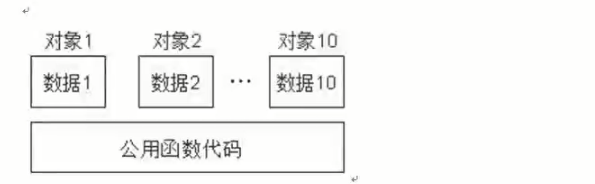

# this指针

## 一、this指针工作原理

&emsp; C++的数据和操作都是分开存储的，并且每一个非内敛成员函数指挥诞生一份函数实列，也就是说多个同类型的对象会公用一块代码

  

&emsp;C++通过提供特殊的对象指针，this指针，解决上述问题，指针指向被调用的成员函数所属的对象

&emsp;C++规定，this指针是隐含在对象成员函数内部的一个指针。当一个对象被创建之后，他的每一个成员函数都含有一个系统自动生成的隐含指针this,用以保存这个对象的地址，也就是说虽然我们没有写上this指针，编译器在编译的时候也是会加上的。因此this也被称为指向本对象的指针,this指针并不是对象的一部分，不会影响sizeof(对象的结果)。

**this指针是C++实现封装的一种机制，他将对象和该对象调用的成员函数连接在一起，在外部看来，每一个对象都拥有自己的函数成员，一般情况下，并不写this,而是让系统进行默认设置**

**this指针永远指向当前对象！！！！！！！**

&emsp;成员函数通过this指针即可知道操作的是哪一个对象的数据。This指针是一种隐含指针，它隐含于每个类的非静态成员函数中，This指针不需要定义，直接使用即可

**注意：静态成员函数内部没有this指针，静态成员函数不能操作非静态成员变量**

## 二、this指针使用注意点

* 每一个对象都有一个隐藏的this指针，但是不属于对象，是编译器添加的
* 编译器会把this指针传入成员函数
* this指针指向对象的存储空间
* this指针的作用：

```cpp
#include<iostream>
using namespace std;
#define _CRT_SECURE_NO_WARNINGS
#pragma warning(disable:4996)

class Maker {
public:
	// 当形参名和成员变量明相同时 用this指针进行区分
	Maker(int a,int b)
	{
		this->a = a;
		this->b = b;
	}

	// 返回对象本身
	Maker& getMaker()
	{
		return *this;// 运算符时重载有用
	}

	void func()
	{
		cout << this->a << " " << this->b << endl;
	}

private:
	int a;
	int b;
};

void test01()
{
	Maker m(1,2);
	m.func();
}

int main()
{

	test01();
	return EXIT_SUCCESS;
}


```

## 三、扩展

* this指针指向的空间不可以存储静态成员变量
* this指针的指向不可以改变，Maker *const this
