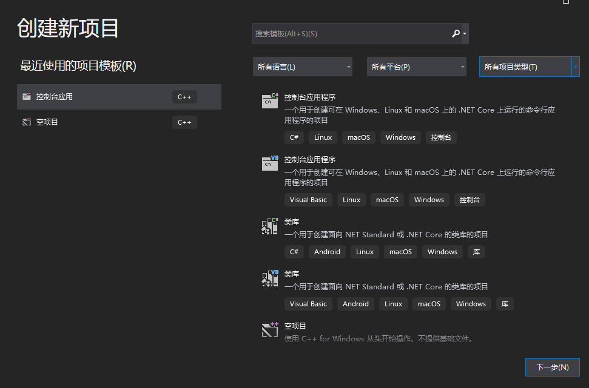
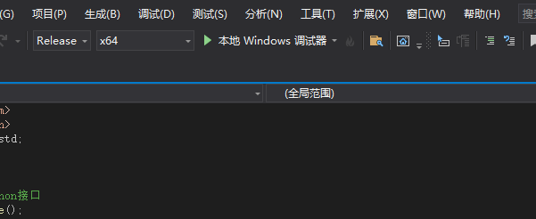
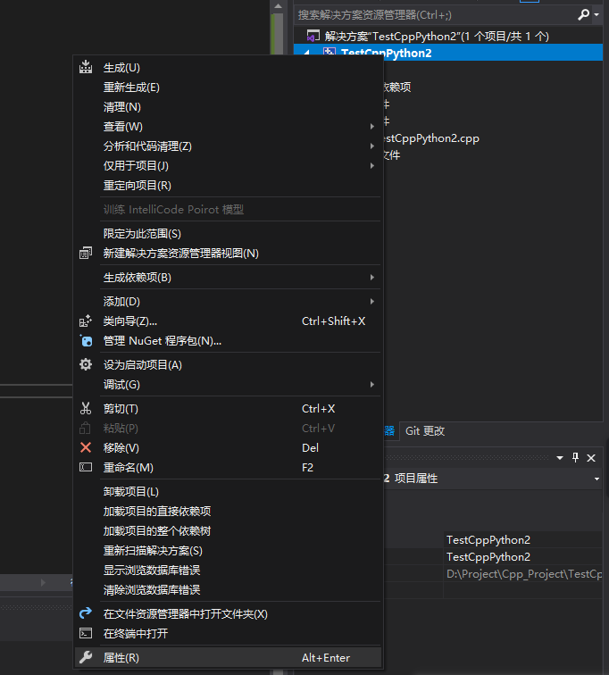
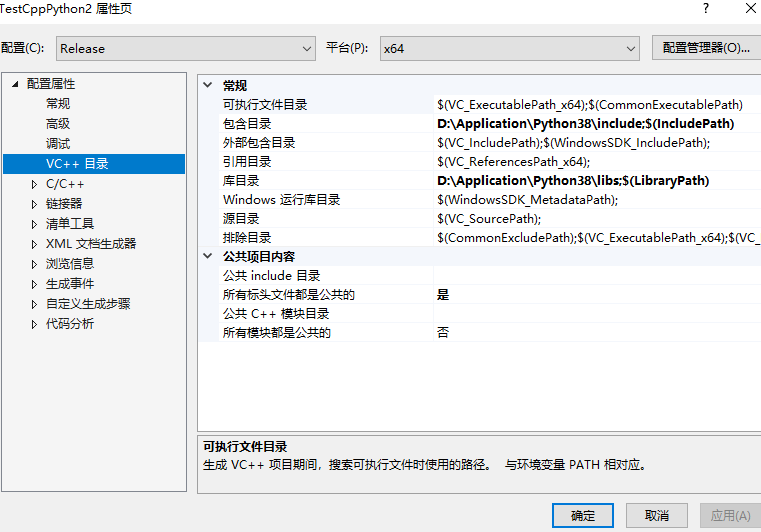
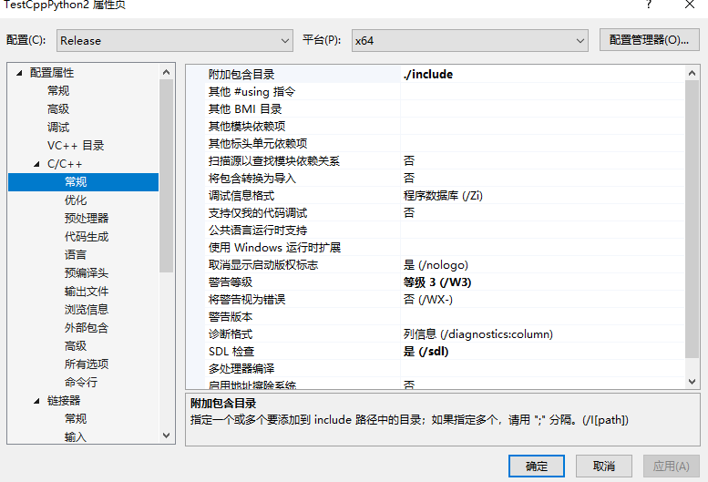
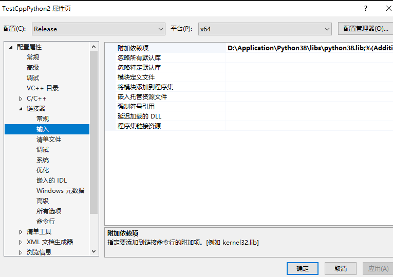
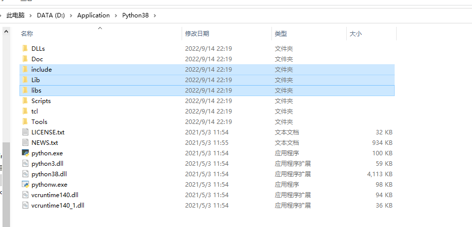
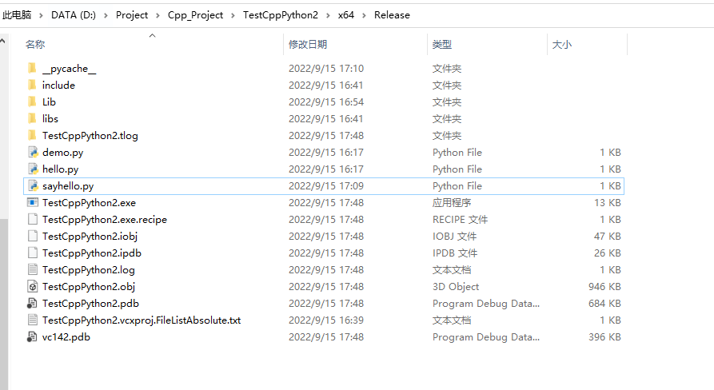
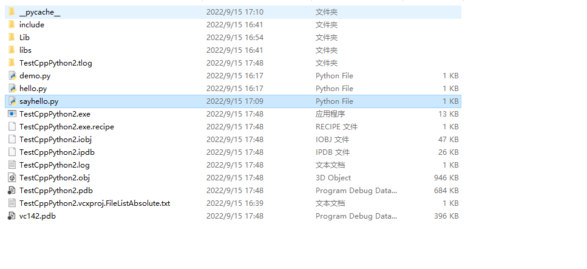
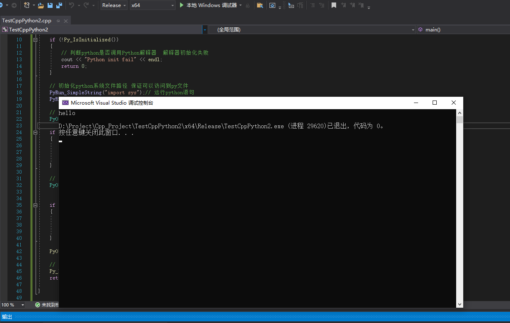

# 一文详解Cpp工程调用python文件

## 一、概述

&emsp;最近做一个项目，使用C++语言进行编写，但是里面有很多的算法代码都是python语言编写的，如果将这些py文件重新使用C++编写的话会花费很多精力，所以使用C++来调用这些python脚本，使用C++、python进行混合编程

python提供了一套API,我们可以很好的在C++程序中调用这些python模块，但是使用之前需要在VS中配置好相关库

## 二、配置方法

### 2.1 新建一个C++工程

&emsp;首先新建一个C++工程，然后将其调到release,x64
  

我们选择，C++控制台应用程序，然后调整成release,x64

  


### 2.2 添加相关python库和路径

* 鼠标右键：属性
  

* 在包含目录和库目录中添加相关路径（你安装的python路径）
  

* 添加附加包含目录：./include
  

* 附加依赖项
  

**以上这些操作都是为了C++代码可以引入Python.h的头文件**

### 2.3 复制包路径

将下面文件夹（python库）直接复制到C++编译的exe文件目录下，（如果没有，先运行程序，生成exe）,我这里的路径在：

```
D:\Project\Cpp_Project\TestCppPython2\x64\Release\TestCppPython2.exe
```
要复制的文件夹路径：

  


赋值之后的情况：
  

## 三、代码

```python
#include<iostream>
#include<Python.h>
using namespace std;

int main()
{
	// 初始化python接口
	Py_Initialize();

	if (!Py_IsInitialized())
	{
		// 判断python是否调用Python解释器  解释器初始化失败 
		cout << "Python init fail" << endl;
		return 0;
	}

	// 初始化python系统文件路径 保证可以访问到py文件
	PyRun_SimpleString("import sys");// 运行python语句
	PyRun_SimpleString("sys.path.append('./script')");

	// 调用python文件名 不需要写后缀 
	PyObject* pModule = PyImport_ImportModule("sayhello");

	if (pModule == NULL)
	{
		// 如果找不到该文件 
		cout << "module not found" << endl;
		return 1;
	}

	// 调用函数  没有参数
	PyObject* pFunc = PyObject_GetAttrString(pModule,"say");// 加载py文件中的函数


	if (!pFunc || !PyCallable_Check(pFunc))
	{
		// 判断一下指针pFunc是否为空  并且判断函数是否可调用
		cout << "not found function add_num" << endl;
		return 0;
	}

	PyObject_CallObject(pFunc,NULL);// 调用指定py文件中的函数

	// 结束python接口初始化
	Py_Finalize();
	return 0;

}

```


sayhello.py
```python
def say():
    print("hello")

```

**相关操作，请参考（感谢这位博主）：https://zhuanlan.zhihu.com/p/450318119**

**这里被调用的sayhello.py文件必须放在x64/release文件夹下面，也就是和你生成的exe同目录下**

  

最后的结果：
  
