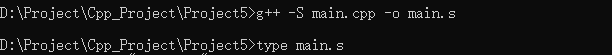
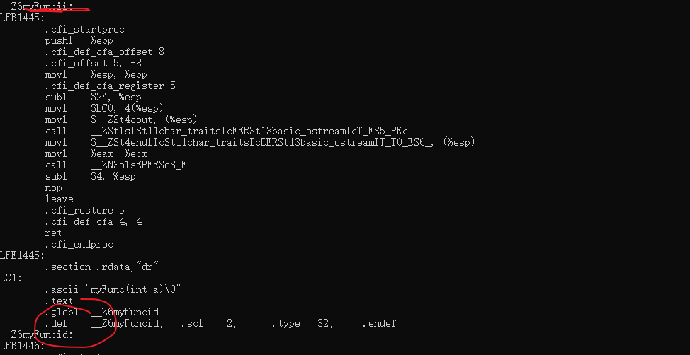

# C++语言基础-函数重载

## 一、函数重载概述

**能使名字方便使用，是任何程序设计语言的一个重要特征**

**同样一个字在不同的场景下具有不同的含义。那么在C++中也有一种类似的现象出现，同一个函数名在不同的场景下可以具有不同的含义**

**在传统的C语言中，函数名必须是唯一的，程序中不允许出现同名的函数。在C++中是允许出现同名的函数，这种现象称之为函数重载**

**函数重载的目的就是为了方便的使用函数名**

```cpp
int add(int a,int b)
{
    return a + b;
}

int add(double a, double b)
{
    return a + b;
}

```

**注意：**

* 函数重载是：允许函数名相同，这种现象叫做函数重载
* 函数重载的作用：是为了方便使用函数名
* 函数重载的条件：同一个作用域，参数的个数不同，参数的顺序不同，参数的类型不同

## 二、重载的类型


### 2.1 参数的个数不同

```cpp
void func()
{
    cout<<"func()"<<endl;
}

void func(int a)
{
    cout<<"func(int a)"<<endl;
}

```

### 2.2 参数的类型不同

```cpp
void func(int a)
{
    cout<<"func(int a)"<<endl;
}

void func(char c)
{
    cout<<"func(char c)"<<endl;
}

```


### 2.3 参数的顺序不同

```cpp
void func(int a,double b)
{
    cout<<"func(int a,double b)"<<endl;
}

void func(double a,int b)
{
    cout<<"func(double a,int b)"<<endl;
}

```

**调用重载函数的注意：**
* 严格的类型匹配，如果类型不匹配，那么尝试转换，转换成功就调用，失败就报错

```cpp
int a = 1;
double b = 3.1;

func();
func(a,b);
func(b,a);


char c = 'c';
func(c);// char 转换int成功 调用int参数的函数
```

* 函数重载和函数的默认参数一起使用，需要注意二义性的问题

```cpp
#include<iostream>
using namespace std;
#define _CRT_SECURE_NO_WARNINGS
#pragma warning(disable:4996)

// 函数重载和函数默认参数一起使用 会产生二义性问题
void myFunc(int a, int b = 0)
{
	cout << "myFunc(int a,int b = 0)" << endl;
}

void myFunc(int a)
{
	cout << "myFunc(int a)" << endl;
}

void test02()
{
	//myFunc();// 二义性问题 编译器不知道调用哪一个函数
}

int main()
{

	test02();
	return EXIT_SUCCESS;
}
```

* **函数的返回值不作为函数重载的条件，编译器是通过你调用函数时，传入的参数来判断调用重载的哪一个函数（并不是通过函数的返回值），我们调用函数时，不需要写返回值，所以返回值不能成为函数重载的条件**


## 三、函数重载的原理

**函数重载的原理是在汇编时，给每一个函数取别名，C语言不能重载的原因是没有取别名**

```
汇编命令：g++ -S hello.cpp -o hello.s
```

测试代码
```cpp
#include<iostream>
using namespace std;
#define _CRT_SECURE_NO_WARNINGS
#pragma warning(disable:4996)


// 函数重载和函数默认参数一起使用 会产生二义性问题
void myFunc(int a, int b = 0)
{
	cout << "myFunc(int a,int b = 0)" << endl;
}


void myFunc(int a,double b)
{
	cout << "myFunc(int a)" << endl;
}

void test02()
{
	myFunc(1,1.0);// 二义性问题 编译器不知道调用哪一个函数
}

int main()
{
	test02();
	return EXIT_SUCCESS;
}

```

汇编命令：
  

  

**我们可以清楚的看到汇编文件中，编译器给两个函数起了不一样的名字！！！**


## 四、C++调用C语言函数

**C++的函数在汇编时候，会给函数取别名，C语言的不会，这时，如果C++来调用C语言的函数，C++会找取了别名的函数，但是C语言没有取别名，这是就会出错**

main.cpp

```cpp
#include<iostream>
using namespace std;
#define _CRT_SECURE_NO_WARNINGS
#pragma warning(disable:4996)

#include"test.h"

int main()
{
	func();// 没办法找C语言中的函数
	return EXIT_SUCCESS;
}
```

test.h

```cpp
#pragma once
#include<stdio.h>

// 告诉C++编译器  找下面的函数 要以C语言的方式取去寻找
#ifdef __cplusplus
extern "C"
{
#endif
	void func();


#ifdef __cplusplus
}
#endif
```

test.c
```cpp
#pragma once
#include"test.h"

void func()
{
	printf("func");
}

```