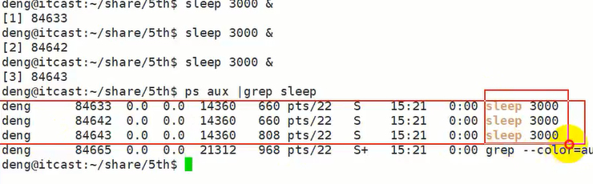

# C++多进程学习笔记

## 一、进程和程序概述

&emsp;程序是存放在存储介质上的一个可执行文件，而进程是程序执行的过程。进程的状态是变化的，其包括进程的创建、调度和消亡。程序是静态的，进程是动态的。

&emsp;在Linux系统中，操作系统是通过进程去完成一个一个任务，进程是管理事务的基本单元。进程拥有自己独立的处理环境和系统资源

## 二、并行和并发

并行：指在同一时刻，有多条指令在多个处理器上同时执行

并发：指在同一个时刻只能由一条指令执行，但是多个进程指令被快速的轮换执行，使得在宏观上具有多个进程同时执行，但是在微观上并不是同时执行，只是把时间划分成若干时间片，多个进程快速交替执行

## 三、MMU的概念

&emsp;MMU是内存管理单元，CPU调用它用来管理虚拟存储器、物理存储器的控制线路，负责虚拟地址映射为物理地址，以及提供硬件机制的内存访问授权多用户多进程操作系统


## 四、进程控制块PCB

&emsp;进程运行时，内核为每一个进程分配一个PCB（进程控制块），维护进程相关信息，Linux内核的进程控制块是task_struct结构体

* 进程id:每一个进程都有唯一的id
* 进程的状态：就绪、运行、挂起、停止等状态
* 进程的切换需要保存和回复一些cpu寄存器
* 描述虚拟地址空间的信息
* 当前工作目录
* 文件描述符表
* 和符号相关的信息
* 用户id和组id
* 进程可以使用的资源上限

## 五、进程的状态

&emsp;进程的状态反映了进程执行过程的变化，这些状态随着进程的执行和外界条件的变化而转换

三态模型：运行态，就绪态，阻塞态
五态模型：新建态，终止态，运行态，就绪态，阻塞态


## 六、进程相关的命令（linux）

### 6.1 使用ps命令可以查看进程的详细状况

* ps -a 显示终端上的所有进程 包括其他用户的进程
* ps -u 显示进程的详细状态
* ps -x 显示没有控制终端的进程
* ps -w 显示加宽 以便于显示更多信息
* ps -r 只显示正在运行的进程


### 6.2 top命令

top命令用来动态显示运行中的进程。在top命令执行之后，可以按下按键得到相应的显示结果：

* M 根据内存使用量来排序
* P 根据CPU占有率来排序
* T 根据进程运行时间的长短来排序
* q退出

### 6.3 Kill

kill命令指定进程号的进程，需要配合ps使用

使用格式：```kill [-signal] pid```

信号值从0到15，其中9是绝对终止，可以处理一般信号无法终止的进程

kill 9133 ：杀死进程号为9133的进程

**进程名字可以相同，但是进程的编号一定不同**

  

这里创建了三个sleep进程，然后可以看到有三个sleep进程正在执行，但是编号是不一样的

**killall:通过进程名字来杀死进程**

### 6.4 进程号相关的函数

&emsp;每一个进程都是由一个进程号来标识，类型是pid_t,进程号的范围：0~32767，进程号总是唯一的，但是进程号可以重用，当一个进程终止之后，进程号就可以再次使用

三种不同的进程号：

* 进程号(PID)：标识进程的一个非负整型数
* 父进程号（PPID）：任何进程（处理init进程）都是由另一个进程创建，该进程称之为被创建进程的父进程，对应的进程号是父进程号(PPID),
* 进程组号(PGID):进程组是一个或者多个进程的集合。他们之间相互关联，进程组可以接受同一个终端的各种信号，关联的进程有一个进程组号(PGID)

#### 6.4.1 获取进程号函数

```cpp
#include<stdio.h>
#include<sys/types.h>
#include<unistd.h>

// 获取进程号  父进程号 进程组号
int main(void)
{
    pid_t pid = -1;
    // 获取当前进程的进程号
    pid = getpid();
    printf("进程号:%d\n",pid);


    return 0;
}

```

每次运行的进程号都不一样，因为进程推出之后，再次运行会获取新的pid

#### 6.4.2 获取父进程号函数

```cpp
#include<stdio.h>
#include<sys/types.h>
#include<unistd.h>

// 获取进程号  父进程号 进程组号
int main(void)
{
    pid_t pid = -1;
    // 获取当前进程的进程号
    pid = getppid();
    printf("进程号:%d\n",pid);


    return 0;
}

```

每次执行该文件，父进程号都不会变化，因为在同一个bash解释器，在bash解释器下运行该文件，会创建一个子进程，不管该文件运行多少次，（子进程pid会变化多少次），bash终端都不会变，所以父进程号就不会变

#### 6.4.3 获取当前进程组号(getpgid)

```cpp
#include<stdio.h>
#include<sys/types.h>
#include<unistd.h>

// 获取进程号  父进程号 进程组号
int main(void)
{
    pid_t pid = -1;
    // 获取当前进程的进程号
    pid = getpgid();
    printf("进程号:%d\n",pid);
    return 0;
}

```

## 七、进程的创建

&emsp;系统允许一个进程创建新的进程，新进程也就是子进程，子进程还可以创建新的子进程，形成进程树结构模型

```cpp

#include<sys/types.h>
#include<unistd.h>

pid_t fork(void);
功能：用于从一个已经存在的进程中创建一个新的进程，新进程称之为子进程

参数：无

返回值：
成功：子进程中返回0，父进程中返回子进程ID，pid_t为整形数据
失败：返回-1

失败的原因主要是：
    1):当前的进程数已经达到系统规定的上限，这时errno的值被设置为EAGAIN
    2):系统内存不足，这时errno的值被设置为ENOMEN
```

```cpp
#include<stdio.h>
#include<sys/types.h>
#include<uniisted.h>

// 创建了一个子进程
int main(void)
{
    // 创建子进程
    fork();// 将下面的代码段都复制一遍
    printf("hello world\n");
    return 0;
}

```


上述代码打印两次hello world

子进程从fork()下一条语句开始执行！！！

## 八、父子进程的关系

&emsp;使用fork函数得到的子进程是父进程的一个复制品，它从父进程处继承了整个进程的地址空间：包括进程上下文（进程执行活动全过程的静态描述）、进程堆栈，打开的文件描述符、信号控制设定、进程优先级、进程组号

**子进程所独有的只有他的进程号，计时器等，所以使用fork()函数的代价是很大的**

&emsp;一个进程调用fork()函数之后，系统会给新的进程分配资源，然后把原来的进程的所有值都复制到新的进程中，进程编号不一样！

&emsp;Linux的fork()使用是通过写时拷贝实现，写时拷贝是一种可以推迟甚至避免拷贝数据的技术，内核此时并不复制整个进程的地址空间，而是让父子进程共享同一个地址空间，只需要在写入的时候才会复制地址空间，从而使各个进行拥有各自的地址空间。也就是说，资源的复制是在需要写入的时候才会进行，在此之前，只有以只读方式进行共享

注意：**fork之后父子进程共享文件，fork产生的子进程与父进程相同的文件文件描述符指向相同的文件表，引用计数增加，共享文件文件偏移指针**

## 九、区分父子进程

**我们通过fork()的返回值来区分父子进程，fork()函数被调用一次，但是返回两次，两次返回的区别是：子进程的返回值是0，而父进程的返回值是新进程的进程pid**

```cpp
#include<stdio.h>
#include<stdlib.h>
#include<unistd.h>


// 区分父子进程

int main()
{
    pid_t pid = -1;

    // 创建一个子进程
    // fork函数在子进程中返回0,在父进程中返回子进程的pid
    pid = fork();

    if(0 == pid)
    {
        // 子进程
        printf("hello world:pid %d ppid: %d \n"，getpid(),geppid());
        exit(0);
    }
    else
    {
        // 父进程

        // 打印的参数pid是子进程的ID 因为父进程中fork返回的是子进程的ID
        printf("hello world pid %d,cpid %d",getpid(),pid);
    }

    return 0;
}

```


