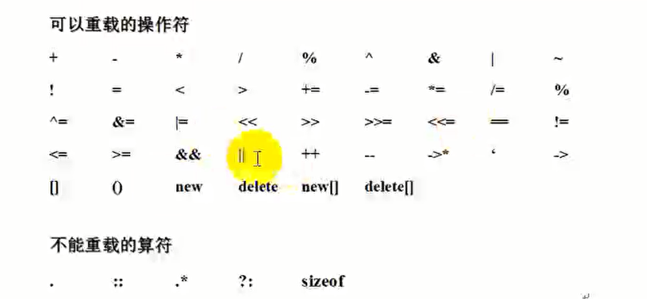

# 操作符重载

## 一、运算符重载的基本概念

&emsp;运算符重载，就是对已有的运算符重新进行定义，赋予其另一种功能，以适应不同的数据类型（运算符重载不能改变原来的寓意。不能改变基础类型寓意）

**运算符重载只是一种语法上的方便，也就是它只是另一种函数调用方式**

&emsp;在C++中可以定义一个处理类的新运算符，这种定义很像一个普通的函数定义，只是函数的名字由关键字operator及其紧跟的运算符组成，差别仅此而已，它像任何其他函数一样也是一个函数，当编译器遇到适当的模式时，就会调用这个函数

语法：定义重载的运算符就像定义函数，只是该函数的名字是operator@这里的@代表了被重载的运算符，函数的参数中参数个数取决于两个因素


## 二、加号运算符重载

### 2.1 写成全局函数

**重载函数如果写成全局的，那么双目运算符左边的是第一个参数，右边是第二个参数**


```cpp
#define _CRT_SECURE_NO_WARNINGS
#include<iostream>
using namespace std;

class Maker {

public:
	Maker(int id,int age)
	{
		this->id = id;
		this->age = age;
	}

	int getId()
	{
		return this->id;
	}

	int getAge()
	{
		return this->age;
	}

private:
	int id;
	int age;
};

// 全局重载
Maker operator+(Maker &p1, Maker &p2)
{
	Maker t(p1.getId() + p2.getId(), p1.getAge() + p2.getAge());
	return t;
}

void test01()
{
	Maker m(1,2);
	Maker n(2,3);

	// 编译器看到两个对象相加  那么编译器会去找有没有叫operator+的函数
	Maker m3 = m + n;// 运算符重载

	cout << m3.getId() << m3.getAge() << endl;
}

int main()
{

	test01();
	return EXIT_SUCCESS;
}

```


### 2.2 写成成员函数

**重载函数如果写成成员函数，那么双目运算符的左边就是this,右边是第一个参数**

```cpp
#define _CRT_SECURE_NO_WARNINGS
#include<iostream>
using namespace std;

class Maker {

public:
	Maker(int id,int age)
	{
		this->id = id;
		this->age = age;
	}

	int getId()
	{
		return this->id;
	}

	int getAge()
	{
		return this->age;
	}

	// 写成成员函数 那么只需要一个参数  这个参数是加号的右边
	Maker operator+(Maker& m)
	{
		Maker t(this->id + m.id,this->age + m.age);
		return t;
	}

private:
	int id;
	int age;
};

//// 全局重载
//Maker operator+(Maker &p1, Maker &p2)
//{
//	Maker t(p1.getId() + p2.getId(), p1.getAge() + p2.getAge());
//	return t;
//}

void test01()
{
	Maker m(1,2);
	Maker n(2,3);

	// 编译器看到两个对象相加  那么编译器会去找有没有叫operator+的函数
	Maker m3 = m + n;// 运算符重载

	cout << m3.getId() << m3.getAge() << endl;
}

int main()
{

	test01();
	return EXIT_SUCCESS;
}

```


### 2.3 不同类的对象相加

```cpp
#define _CRT_SECURE_NO_WARNINGS
#include<iostream>
using namespace std;

class Maker {

public:
	Maker(int id,int age)
	{
		this->id = id;
		this->age = age;
	}

	int getId()
	{
		return this->id;
	}

	int getAge()
	{
		return this->age;
	}

	// 写成成员函数 那么只需要一个参数  这个参数是加号的右边
	Maker operator+(Maker& m)
	{
		Maker t(this->id + m.id,this->age + m.age);
		return t;
	}

private:
	int id;
	int age;
};


class Student
{
public:
	Student()
	{
		this->mid = 0;
	}

	Student(int id)
	{
		this->mid = id;
	}


	int getID()
	{
		return this->mid;
	}
private:
	int mid;
};

//// 全局重载
//Maker operator+(Maker &p1, Maker &p2)
//{
//	Maker t(p1.getId() + p2.getId(), p1.getAge() + p2.getAge());
//	return t;
//}

void test01()
{
	Maker m(1,2);
	Maker n(2,3);

	// 编译器看到两个对象相加  那么编译器会去找有没有叫operator+的函数
	Maker m3 = m + n;// 运算符重载

	cout << m3.getId() << m3.getAge() << endl;
}

// 不同类的对象相加  全局重载
Maker operator+(Maker &m, Student &s)
{
	Maker t(m.getId() + s.getID(),20);
	return t;
}

void test02()
{
	Maker m(1, 9);
	Student n(2);
	Maker s = m + n;
	cout << s.getId() << s.getAge() << endl;
}

int main()
{
	test02();
	return EXIT_SUCCESS;
}

```

&emsp;几乎C中所有的运算符都可以重载，但是运算符重载的使用还是相当受限制，特别是不能使用C中当前没有意义的运算符，不能改变运算符优先级，不能改变运算符的参数个数

  


## 三、减号运算符重载

### 3.1 成员函数的形式

```cpp
#define _CRT_SECURE_NO_WARNINGS
#include<iostream>
using namespace std;

class Maker {

public:
	Maker(int id,int age)
	{
		this->id = id;
		this->age = age;
	}

	int getId()
	{
		return this->id;
	}

	int getAge()
	{
		return this->age;
	}

	// 写成成员函数 那么只需要一个参数  这个参数是加号的右边
	Maker operator-(Maker& m)
	{
		Maker t(this->id - m.id,this->age - m.age);
		return t;
	}

private:
	int id;
	int age;
};


void test01()
{
	Maker m(1,2);
	Maker n(2,3);

	// 编译器看到两个对象相加  那么编译器会去找有没有叫operator+的函数
	Maker m3 = m - n;// 运算符重载

	cout << m3.getId() << m3.getAge() << endl;
}

int main()
{
	test01();
	return EXIT_SUCCESS;
}

```

全局重载

```cpp
#define _CRT_SECURE_NO_WARNINGS
#include<iostream>
using namespace std;

class Maker {

public:
	Maker(int id,int age)
	{
		this->id = id;
		this->age = age;
	}

	int getId()
	{
		return this->id;
	}

	int getAge()
	{
		return this->age;
	}

	// 写成成员函数 那么只需要一个参数  这个参数是加号的右边
	Maker operator-(Maker& m)
	{
		Maker t(this->id - m.id,this->age - m.age);
		return t;
	}

private:
	int id;
	int age;
};


int operator-(Maker& m, int b)
{
	return m.getId() - b;
}


void test01()
{
	Maker m(1,2);
	Maker n(2,3);

	// 编译器看到两个对象相加  那么编译器会去找有没有叫operator+的函数
	int m3 = m - 5;// 运算符重载

	cout << m3 << endl;
}

int main()
{
	test01();
	return EXIT_SUCCESS;
}

```
## 四、左移运算符重载

### 4.1 全局函数

```cpp
#define _CRT_SECURE_NO_WARNINGS
#include<iostream>
using namespace std;

class Maker {

public:
	Maker(int id,int age)
	{
		this->id = id;
		this->age = age;
	}

	int getId()
	{
		return this->id;
	}

	int getAge()
	{
		return this->age;
	}

	// 写成成员函数 那么只需要一个参数  这个参数是加号的右边
	Maker operator-(Maker& m)
	{
		Maker t(this->id - m.id,this->age - m.age);
		return t;
	}

private:
	int id;
	int age;
};

// 如果要和endl一起使用 那么必须返回ostream对象
opstream& operator<<(ostream& out, Maker& m)
{
	cout << m.getId() << " " << m.getAge() << endl;
    return out;
}


void test01()
{
	Maker m(1,2);
	cout << m;// 重载左移运算符
}


int main()
{
	test01();
	return EXIT_SUCCESS;
}

```

注意：

* cout是对象，<<是左移运算符
* 重载左移运算符是为了直接打印对象
* 形参和实参是一个对象
* 不能改变库类中的代码
* oatream中把拷贝构造函数私有化
* 如果要把endl一起使用，那么必须返回ostream的对象

## 五、右移运算符重载

```cpp
#define _CRT_SECURE_NO_WARNINGS
#include<iostream>
using namespace std;

class Maker {
	friend void operator>>(istream& in, Maker& m);
public:
	Maker(int id,int age)
	{
		this->id = id;
		this->age = age;
	}

	int getId()
	{
		return this->id;
	}

	int getAge()
	{
		return this->age;
	}

	// 写成成员函数 那么只需要一个参数  这个参数是加号的右边
	Maker operator-(Maker& m)
	{
		Maker t(this->id - m.id,this->age - m.age);
		return t;
	}

private:
	int id;
	int age;
};

// 将全局函数声明为友元函数 可以访问私有成员
void operator>>(istream& in, Maker& m)
{
	in >> m.id;
	in >> m.age;
}

void test01()
{
	Maker m(1,2);
	cin >> m;
	cout << m.getAge() << " " << m.getId() << endl;
}


int main()
{
	test01();
	return EXIT_SUCCESS;
}

```

## 六、赋值运算符重载

### 6.1 默认的赋值运算符重载函数进行了简单的赋值操作

```cpp
#define _CRT_SECURE_NO_WARNINGS
#include<iostream>
using namespace std;

class Maker {

public:
	Maker()
	{
		this->id = 0;
		this->age = 0;

	}
	Maker(int id,int age)
	{
		this->id = id;
		this->age = age;
	}

	int getId()
	{
		return this->id;
	}

	int getAge()
	{
		return this->age;
	}


private:
	int id;
	int age;
};


void test01()
{
	Maker m(1,2);
	Maker m1;

	m1 = m;// 默认的赋值运算符重载函数进行了简单的赋值操作
	cout << m1.getId() << m1.getAge() << endl;
}

int main()
{
	test01();
	return EXIT_SUCCESS;
}

```

### 6.2 当类有成员指针时，然后在构造函数中申请堆区空间，在析构函数中释放堆区空间 

当类有成员指针时，然后在构造函数中申请堆区空间，在析构函数中释放堆区空间，会出现同一块空间释放两次，然后内存泄漏，所以要重写赋值运算符重载函数。


```cpp
#define _CRT_SECURE_NO_WARNINGS
#include<iostream>
using namespace std;

class Student {


public:
	Student(const char* name)
	{
		pName = new char[strlen(name) + 1];// 申请堆区空间
		strcpy(pName,name);// 复制内容
	}

	// 重写赋值运算符重载函数
	Student& operator=(const Student& stu)
	{
		// 不确定this->pName 指向的空间是否能装下stu中的数据  所以先释放this->pNmae所指向的空间
		if (this->pName != NULL)
		{
			delete this->pName;
			this->pName = NULL;
		}

		// 申请空间 大小由stu进行决定
		this->pName = new char[strlen(stu.pName) + 1];
		strcpy(this->pName,stu.pName);

		// 返回对象本身
		return *this;
	}

	~Student()
	{
		if (pName != NULL)
		{
			delete[] pName;
			pName = NULL;
		}
	}

	void printName()
	{
		cout << pName << endl;
	}


private:
	char* pName;
};

void test01()
{
	Student s1("孙悟空");
	Student s2("hhhh");

	s1.printName();
	s2.printName();

	s1 = s2;// 需要重载赋值运算符  否则发生内存泄露

	s1.printName();
	s2.printName();


}

int main()
{
	test01();
	return EXIT_SUCCESS;
}

```


## 七、关系运算符

```CPP

#define _CRT_SECURE_NO_WARNINGS
#include<iostream>
using namespace std;

class Maker {

public:
	Maker()
	{
		this->id = 0;
		this->age = 0;

	}
	Maker(int id,int age)
	{
		this->id = id;
		this->age = age;
	}

	// 关系运算符进行重载
	bool operator==(Maker& m)
	{
		if (this->id == m.getId() && this->age == m.getAge())
		{
			return true;
		}
		else
		{
			return false;
		}
	}

	int getId()
	{
		return this->id;
	}

	int getAge()
	{
		return this->age;
	}


private:
	int id;
	int age;
};


void test01()
{
	Maker m(1,2);
	Maker m1(2,3);

	if (m1 == m)
	{
		cout << "相同" << endl;
	}
	else
	{
		cout << "不相同" << endl;
	}
}


int main()
{
	test01();
	return EXIT_SUCCESS;
}

```

## 八、前置加加运算符与后置加加运算符

```cpp
#define _CRT_SECURE_NO_WARNINGS
#include<iostream>
using namespace std;

class Maker {

	friend ostream& operator<<(ostream& out, Maker& m);

public:

	// 默认的构造函数
	Maker()
	{
		this->a = 0;
	}

	Maker(int a)
	{
		this->a = a;
	}

	// 重载前置加加
	Maker& operator++()
	{
		// 需要返回引用  不然返回的是一个新的Maker 对象
		++this->a;
		return *this;
	}

	// 重载后置加加
	Maker operator++(int)
	{	
		// 后置加加  先返回 后加加
		Maker tmp(*this);// *this 里面的值a等于2  调用拷贝构造函数 
		++this->a;// 后加加
		return tmp;
	}

	int getA()
	{
		return this->a;
	}

private:
	int a;

};

ostream& operator<<(ostream& out, Maker& m)
{
	//cout << m.getA() << endl；
	cout << m.a<< endl;// 声明为友元函数 才可以访问私有成员变量

	return out;
}

void test01()
{
	Maker m1(1);
	cout << m1 << endl;
	cout << ++m1 << endl;

	cout << m1++ << endl;// 返回的是temp对象  局部对象
	cout << m1 << endl;
}


int main()
{
	test01();
	return EXIT_SUCCESS;
}

```


## 九、数组下标重载

main.cpp

```cpp
#define _CRT_SECURE_NO_WARNINGS
#include<iostream>
using namespace std;
#include<string>
#include"MyArray.h";

void printMyArray(MyArray& arr)
{
	for (int i = 0; i < arr.Size(); i++)
	{
		cout << arr.Get(i) << " ";
	}
	cout << endl;
}

void test01()
{
	MyArray arr;

	for (int i = 0; i < 20; i++)
	{

		arr[i] = i + 10;
	}

	MyArray arr2;
	arr2 = arr;

	for (int i = 0; i < 20; i++)
	{

		cout<<arr2[i] << endl;
	} 
}


int main()
{

	test01();

	return EXIT_SUCCESS;
}

```

MyArray.h

```cpp
#pragma once
class MyArray
{
public:
	MyArray();// 无参构造函数声明
	MyArray(const MyArray& arr);// 拷贝构造声明
	MyArray(int capacity, int val = 0);// 有参构造函数

	// 重写赋值运算符重载函数
	MyArray& operator=(const MyArray& m);

	// 重载数组 下标
	int& operator[](int index);


	~MyArray();// 析构函数

	//头插
	void PushFront(int val);

	//尾插
	void PushBack(int val);

	// 头部删除
	void PopFront();

	// 尾部删除
	void PopBack();

	// 获取数组元素个数
	int Size();

	// 获取数组容量
	int Capacity();

	// 指定位置插入元素
	void Insert(int pos, int val);

	// 获取指定位置的值
	int& Get(int pos);

	// 在指定位置修改值
	void Set(int pos, int val);

private:
	int* pArray;// 指向堆区空间，存储数据 = new int[this->mCapacity]; 创建堆区数组
	int mSize;// 元素个数
	int mCapacity;// 容量
};

```


MyArray.cpp


```cpp

#include "MyArray.h"
#include<iostream>
using namespace std;

MyArray::MyArray()
{
	this->mCapacity = 20;
	this->mSize = 0;

	// 创建堆区数组
	this->pArray = new int[this->mCapacity];

	// 数组元素全部初始化为0
	for (int i = 0; i < this->mCapacity; i++)
	{
		this->pArray[i] = 0;
	}
}

MyArray::~MyArray()
{
	if (this->pArray == NULL)
	{
		delete[] this->pArray;// 释放数组空间
		this->pArray = NULL;
	}
}

// 重写赋值运算符重载
MyArray& MyArray::operator=(const MyArray& m)
{
	// 首先释放原来的空间
	if (this->pArray != NULL)
	{
		delete[] this->pArray;
		this->pArray = NULL;
	}

	this->mCapacity = m.mCapacity;
	this->mSize = m.mSize;

	// 申请空间  
	this->pArray = new int[m.mCapacity];

	// 拷贝数据
	for (int i = 0; i < this->mCapacity; i++)
	{
		this->pArray[i] = m.pArray[i];
	}

	return *this;
}


// 重载数组 下标
int& MyArray::operator[](int index)
{
	// 赋值时 加加
	this->mSize++;
	return this->pArray[index];
}


// 拷贝构造函数的实现
MyArray::MyArray(const MyArray& arr)
{
	this->mCapacity = arr.mCapacity;
	this->mSize = arr.mSize;

	// 申请空间
	this->pArray = new int[arr.mCapacity];

	// 拷贝数据
	for (int i = 0; i < this->mSize; i++)
	{
		this->pArray[i] = arr.pArray[i];
	}
}

// 实现不能有默认参数
MyArray::MyArray(int capacity, int val)
{
	this->mCapacity = capacity;
	this->mSize = capacity;
	this->pArray = new int[capacity];
	for (int i = 0; i < this->mSize; i++)
	{
		this->pArray[i] = val;
	}
}

//头插
void MyArray::PushFront(int val)
{
	if (this->mSize == this->mCapacity)
	{
		return;// 数组满了
	}

	// 如果没有满 从数组最后一个元素开始向后移动元素
	for (int i = this->mSize - 1; i >= 0; i--)
	{
		this->pArray[i + 1] = this->pArray[i];
	}

	// 空出第一个位置
	this->pArray[0] = val;

	// 数组长度加一
	this->mSize++;
}

//尾插
void MyArray::PushBack(int val)
{
	if (this->mSize == this->mCapacity)
	{
		return;// 数组元素满
	}

	this->pArray[this->mSize] = val;
	this->mSize++;// 数组长度加一
}

// 头部删除
void MyArray::PopFront()
{
	if (this->mSize == 0)
	{
		return;// 数组元素为0
	}

	// 后面的数往前面移动来覆盖第一个元素
	for (int i = 0; i < this->mSize; i++)
	{
		this->pArray[i] = this->pArray[i + 1];
	}

	this->mSize--;
}

// 尾部删除
void MyArray::PopBack()
{
	// 这个只能在逻辑上进行删除
	if (this->mSize == 0)
	{
		return;
	}
	this->mSize--;
}

// 获取数组元素个数
int MyArray::Size()
{
	return this->mSize;
}

// 获取数组容量
int MyArray::Capacity()
{
	return this->mCapacity;
}


// 指定位置插入元素
void MyArray::Insert(int pos, int val)
{
	// 先判断容量是否已经满了
	if (this->mSize == this->mCapacity)
	{
		return;
	}

	// 如果位置不对  就插入尾部
	if (pos < 0 || pos > this->mSize - 1)
	{
		pos = this->mSize;
	}

	for (int i = this->mSize - 1; i >= pos; i--)
	{
		this->pArray[i + 1] = this->pArray[i];
	}

	this->pArray[pos] = val;
	this->mSize++;
}

// 获取指定位置的值
int& MyArray::Get(int pos)
{
	return this->pArray[pos];
}

// 在指定位置修改值
void MyArray::Set(int pos, int val) {

	if (pos < 0 || pos > this->mCapacity - 1)
	{
		return;
	}

	this->pArray[pos] = val;
}

```
