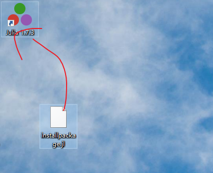
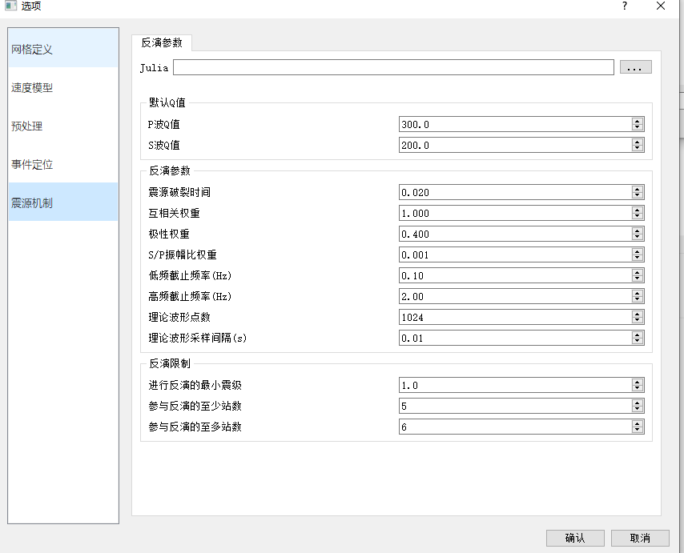

# 监测系统安装说明

## 安装julia

* 安装julia1.7 一路next，记得安装的位置
* 添加环境变量：

添加用户变量：

变量名：JULIA_PKG_SERVER
变量值：julia安装路径 不要到bin

  

添加系统变量path:需要到bin目录
  

打开cmnd命令行，输入julia，看是否安装成功

  

## 安装julia需要的库

* 将installpackage.jl文件放到桌面，直接拖到julia程序打开，系统自动进行安装扩展库

  

安装完成之后，打开julia,输入using Pkg, 输入 Pkg.status()，查看已经安装的库文件

  

## eqmonitor配置

* 将bin文件夹放到一个合适的位置,比如D盘新建一个文件夹

  

* 点击MRMS.exe

  

* 新建一个工区

  

  

将工区文件放到合适位置
  

* 使用eqmonitor设置地震数据下载位置

点击工具栏第一个按钮
  

将存储路径设置成新建的TEST1工区下面的monitor文件夹，不要到seg目录
  

* 点击制作台站坐标按钮

  

  

保存到TEST1工区下面的station文件夹下面，命名为station.txt
  

* 下载地震数据到TEST1工区

点击分段存储

  

点击加载坐标文件，将刚才保存到TEST1 station下面的station.txt加载进来

  

分段时长一般设置为60s

  

之后点击开始， 等一下可以看到TEST1工区下面的Monitor/seg目录下面有segy文件
  

## 监测参数设置

* 准备好一个速度模型文件，放任意位置，这里就放在TEST1工区

  

* 点击参数设置，运行前需要配置参数

  

* 导入台站坐标文件 station.txt，模式选择WGS84

 

加载TEST1下面station目录下面的station.txt文件

  

* 调整网格参数，自行计算，这里选用白鹤滩台站

调整的参数如下，然后刷新网格边界，点击确定

  

* 导入速度模型文件

使用刚才准备的速度模型文件，导入，点击确定
  

  

* 考虑震相拾取精度问题，设置预处理参数
  

* 加载julia.exe

  

  

  

点击确定

## 启动监测

点击工具栏检测数据按钮，系统开始处理数据，每当有新的数据下载下来，实时波形会自动更新

  

