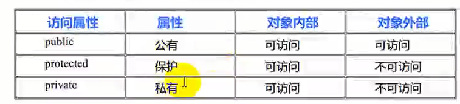
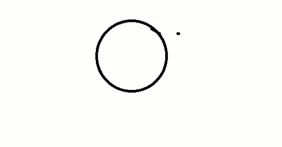
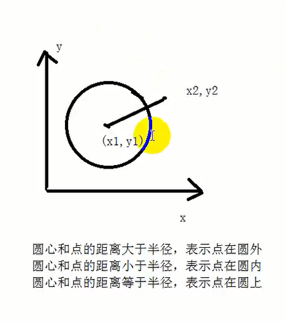

# C++基础-类与对象

## 一、类与对象概述

* 类是自定义数据类型，是C语言的结构体进化而成的
* 对象是类实例化而出的，用数据类型定义一个变量

```cpp
#include<iostream>
using namespace std;
#define _CRT_SECURE_NO_WARNINGS
#pragma warning(disable:4996)

// 定义一个类
class Maker
{
public:
	int a;// 成员变量
	// 成员函数
	void func()
	{
		cout << "func" << endl;
	}
};

int main()
{
	
	return EXIT_SUCCESS;
}

```

## 二、结构体和类的区别

**结构体的默认权限是公有的，类的默认权限是私有的**


## 三、类的封装

* 封装是把属性（变量）和方法（函数）封装到类内，然后给这些数据赋予权限
* 为什么要有封装
  * 防止乱调用函数和变量，出现错误
  * 维护代码更加方便

### 3.1 访问权限

* **在类的内部（作用域范围内），没有访问权限之分，所有成员都可以相互访问**
* 在类的外部（作用域范围之外），访问权限才有意义：public,private,protected
* 在类的外部，只有public修饰的成员才能被访问，在没有设计继承与派生时，private和protected是同等级的，外部不允许进行访问

  

```cpp
#include<iostream>
using namespace std;
#define _CRT_SECURE_NO_WARNINGS
#pragma warning(disable:4996)

// 封装：把属性和方法放到类中  给这些数据赋予权限

class Maker
{
public:
	void set(string Name, int Id)
	{
		id = Id;
		name = Name;
	}
	void printMaker()
	{
		cout << "id = " << id << ",Name = " << name << endl;
	}
private:
	// 私有权限
	int id;
	string name;

protected:
	int a;// 保护权限
};

//类外不能访问私有权限的成员
//类外可以访问公有权限的成员
//类外不可以访问保护权限的成员
// 子类的类内部可以访问父类的保护权限的成员
// 类内部是没有权限之分

void test()
{
	Maker m;
	m.set("小花",1);// 智能访问public成员 不可以访问私有权限 类外不可以访问私有权限 可以访问公有权限的成员
	m.printMaker();
}

class Son :public Maker
{
	void func()
	{
		a = 20;// 子类的类内部可以访问父类的保护权限的成员
	}
};

int main()
{
	test();

	
	return EXIT_SUCCESS;
}

```

```
//类外不能访问私有权限的成员
//类外可以访问公有权限的成员
//类外不可以访问保护权限的成员
// 子类的类内部可以访问父类的保护权限的成员
// 类内部是没有权限之分
```


**子类访问父类的保护成员，是复制过来的不是同一个值**
```cpp
#include<iostream>
using namespace std;
#define _CRT_SECURE_NO_WARNINGS
#pragma warning(disable:4996)

// 封装：把属性和方法放到类中  给这些数据赋予权限

class Maker
{
public:
	void set(string Name, int Id)
	{
		id = Id;
		name = Name;
	}
	void printMaker()
	{
		cout << "id = " << id << ",Name = " << name << endl;
	}
	void get()
	{
		cout << "Maker a= " << a << endl;
	}
private:
	// 私有权限
	int id;
	string name;

protected:
	int a;// 保护权限
};

//类外不能访问私有权限的成员
//类外可以访问公有权限的成员
//类外不可以访问保护权限的成员
// 子类的类内部可以访问父类的保护权限的成员
// 类内部是没有权限之分

void test()
{
	Maker m;
	m.set("小花",1);// 智能访问public成员 不可以访问私有权限 类外不可以访问私有权限 可以访问公有权限的成员
	m.printMaker();
}

// 继承父类
class Son :public Maker
{
public:
	void func()
	{
		// 这个a不是父类的a 是复制过来的a
		a = 20;// 子类的类内部可以访问父类的保护权限的成员
	}
	
	void getS()
	{
		cout << "Son a = " << a << endl;
	}
	
};

void test01()
{
	Maker m;
	

	Son s;
	s.func();// 对a进行赋值
	m.get();// 打印a 出现随机值
	s.getS();// 打印20
}

int main()
{
	test01();

	
	return EXIT_SUCCESS;
}
```

### 3.2 尽量把成员变量的权限设置成私有的权限

* 可以控制属性的读写权限
* 可以赋予客户端访问数据的一致性
* 可以保护属性的合法性

```cpp
#include<iostream>
using namespace std;
#define _CRT_SECURE_NO_WARNINGS
#pragma warning(disable:4996)


class Maker
{

public:
	// 写
	void setName(string Name)
	{
		name = Name;
	}

	string getName()
	{
		return name;
	
	}

	void setAge(int Age)
	{
		age = Age;
	}

	int getAge()
	{
		return age;
	}

	void setId(int Id)
	{
		id = Id;
	}

	int getId()
	{
		return id; 
	}


private:
	string name;
	int age;
	int id;
};


```

### 3.3 课堂小练习

```
请设计一个Maker类，Maker类具有name和age属性，提供初始化函数(Init),并且提供对name和age的读写函数(set,get),但是必须确保age的赋值在有效范围内（0-100），超出有效范围，拒绝赋值，并且提供方法输出姓名和年龄
```

```cpp
#include<iostream>
using namespace std;
#define _CRT_SECURE_NO_WARNINGS
#pragma warning(disable:4996)
#include<string>


class Maker
{
public:
	void init(string Name, int Age)
	{
		// 初始化函数
		name = Name;
		age = Age;
	}

	string getName()
	{
		return name;
	}

	int getAge()
	{
		return age;
	}

	void setName(string Name)
	{
		name = Name;
	}

	void setAge(int Age)
	{
		if (age >= 0 && age <= 100)
		{
			age = Age;
		}
		else
		{
			cout << "拒绝赋值" << endl;
		}

	}

	void printmaker()
	{
		cout << "name = " << name << " ，age = " << age;
	}


private:
	string name;
	int age;
};
```

## 四、作业：设计一个类：求圆的周长

```cpp
#include<iostream>
using namespace std;
#define _CRT_SECURE_NO_WARNINGS
#pragma warning(disable:4996)
#include<string>

// 自定义数据类型：现在没有内存
class Circle
{
public:
	// 设置半径的长度
	void setR(double r)
	{
		mr = r;
	}


	// 计算圆的周长
	double getC()
	{
		return   2 * 3.14 * mr;
	}

private:
	double mr;// 成员变量，成员属性

};

void test()
{
	Circle c;// 定义一个对象 这时候开辟内存
	c.setR(100);
		 
}

```

## 五、点和圆关系案例

### 5.1 点的类设计

```cpp
class Point
{
	void setX();
	void setY();
	int getX();
	int getY();
	int x;
	int y;
}
```

  


### 5.2 圆的类的设计

```cpp
class Circle
{
	// 圆心
	Point mHear;
	// 半径
	int mR;

	// 设置圆心和半径的方法
	// 判断点和圆的关系的方法
};

```

* 圆心和点的距离大于半径，表示点在园外
* 圆心和点的距离小于半径，表示点在园内
* 圆心和点的距离等于半径，表示点在圆上

  

main.cpp
```cpp
#include<iostream>
using namespace std;
#define _CRT_SECURE_NO_WARNINGS
#pragma warning(disable:4996)
#include"Circle.h"


int main()
{
	Point p;
	p.setX(10);
	p.setY(10);

	// 实例化圆对象
	Circle c;
	c.SetHear(10,20);
	c.SetR(10);

	c.isPointAndCircle(p);// 传入实例化点对象

	return EXIT_SUCCESS;
}

```
point.h
```cpp
#pragma once
class Point
{
public:
	void setX(int x);
	void setY(int y);
	int getX();
	int getY();

private:
	int mX;
	int mY;
};

```

point.cpp

```cpp
#include"point.h"

// 实现函数  加上作用域Point 表示是类Point的成员函数
void Point::setX(int x)
{
	mX = x;
}

void Point::setY(int y)
{
	mY = y;
}

int Point::getX()
{
	return mX;
}

int Point::getY()
{
	return mY;
}

```

Circle.cpp
```cpp
#include "Circle.h"

void Circle::SetR(int r)
{
	mR = r;// 设置半径
}

// 函数重载
void Circle::SetHear(Point& p) {

	// 设置圆心
	mHear.setX(p.getX());
	mHear.setY(p.getY());
}

void Circle::SetHear(int x, int y)
{
	// 设置圆心
	mHear.setX(x);
	mHear.setY(y);
}

int Circle::getR()
{
	return mR;
}

Point Circle::getHear()
{
	return mHear;
}

void Circle::isPointAndCircle(Point& p)
{
	// 获取圆心和点之间的距离
	int x2 = p.getX();
	int y2 = p.getY();

	double distance = pow((x2 - mHear.getX()),2) + pow((y2 - mHear.getY()),2);

	double tmp = pow(mR,2);

	if (distance > tmp)
	{
		cout << "点在圆外" << endl;
	}
	else if (distance == tmp)
	{
		cout << "点在圆上" << endl;
	}
	else
	{
		cout << "点在圆内" << endl;
	}
}
```

Circle.h
```cpp
#pragma once
#include"point.h"
#include<cmath>// 数据公式的库
#include<iostream>
using namespace std;

class Circle
{
public:
	void SetR(int r);// 设置半径

	// 函数重载
	void SetHear(Point& p);// 设置圆心  使用引用进行传递参数
	void SetHear(int x, int y);// 设置圆心

	int getR();// 获取半径
	Point getHear();// 获取圆心

	// 判断点和圆心的方法
	void isPointAndCircle(Point& p);

private:
	int mR;// 半径
	Point mHear;// 圆心
};

```