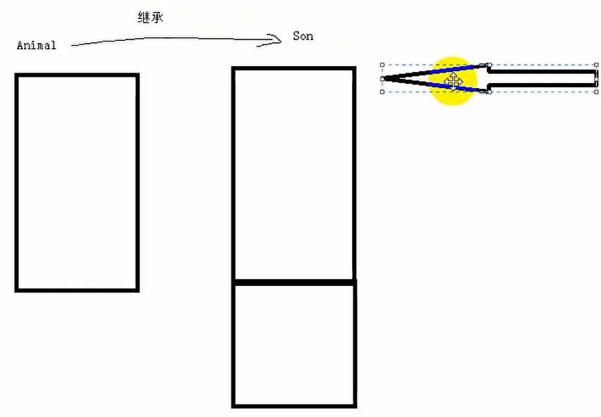
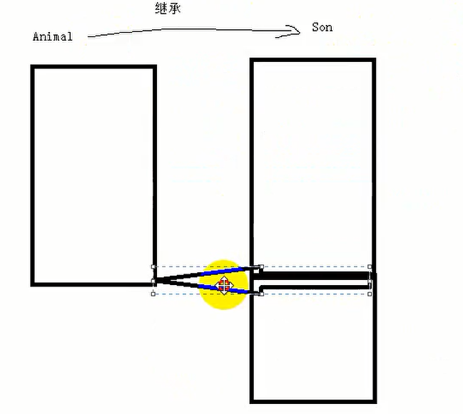

# 静态联编和动态联编


## 一、概念

* 静态联编：编译器会根据函数调用的对象类型，在编译阶段就确定函数的调用地址，这就是静态联编（早绑定）

* 动态联编：在运行的时候再确定调用那个函数（晚绑定）

* 虚函数：在普通成员变量前面加上virtual关键字  该函数变为虚函数，**告诉编译器 这个函数需要晚绑定**

* 动态编译的作用：可以晚绑定函数调用地址，这样扩展功能，不修改前面的代码的基础上，进行项目的扩充

## 二、示例

* 静态编译案例

**在编译阶段就确定了调用speak函数**

```cpp
#define _CRT_SECURE_NO_WARNINGS
#include<iostream>
using namespace std;

class Animal
{
public:
	void speak()
	{
		cout << "Animal speak" << endl;  // 在编译阶段就确定了调用speak这个函数 
	}
};


void test01()
{
	Animal an;
	an.speak();
}

int main()
{
	test01();
	return EXIT_SUCCESS;
}

```

* 动态编译案例

**应用场景：父类和子类中有同名函数，那么如果父类的同名函数不声明为虚函数 那么子类在调用该函数就会调用父类的函数，如果声明为虚函数，那么子类就会调用自己的同名函数**
```cpp
#define _CRT_SECURE_NO_WARNINGS
#include<iostream>
using namespace std;

class Animal
{
public:
	virtual void speak()
	{
		cout << "Animal speak" << endl;  // 在编译阶段就确定了调用speak这个函数 
	}
};

class Dog:public Animal
{
public:
	void speak()
	{
		cout << "Dog Speak" << endl;
	}
};

void doLogin(Animal* animal)
{
	animal->speak();
}

void test02()
{
	Dog* dog = new Dog; //声明一个子类
	// 由于父类中的同名函数声明为virtual 那么调用的时候不会调用父类的同名函数  调用的是子类的同名函数
	doLogin(dog);// 子类需要进行强制转换 
}

int main()
{
	test02();
	return EXIT_SUCCESS;
}

```


**应用场景：可以在前面项目的基础上，不改变项目基础，扩展功能，有利于维护代码**


这里dog对象作为参数传入，但是原始的参数类型是Animal，所以这里涉及到类型转换

类型转换问题：

* 子类转换成父类：称之为向上转换，**编译器认为指针的寻址范围缩小了，所以是安全的**

  

* 父类转换成子类：称之为向下转换，编译器认为指针的寻址范围扩大了，不安全的转换

  


