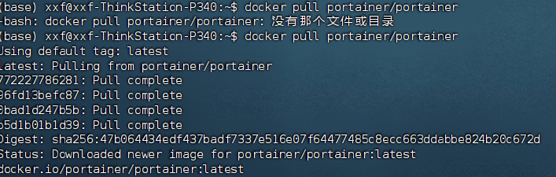
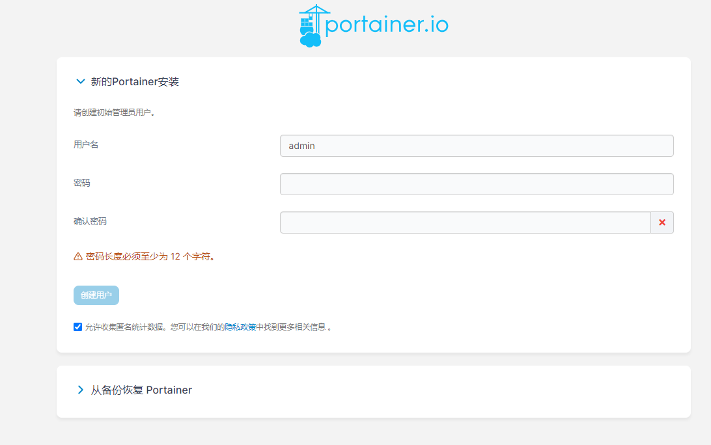
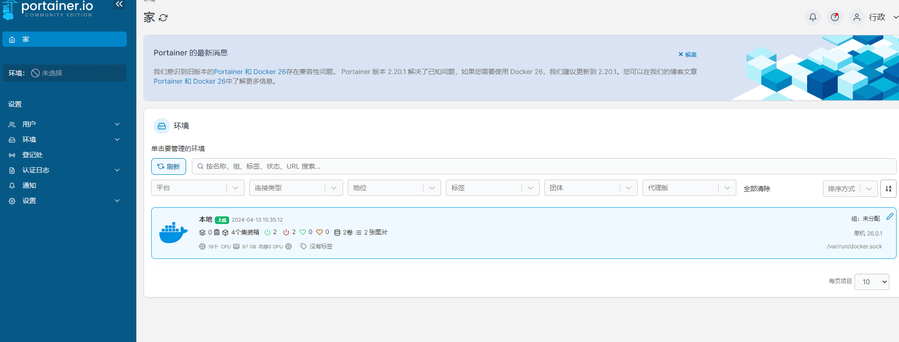
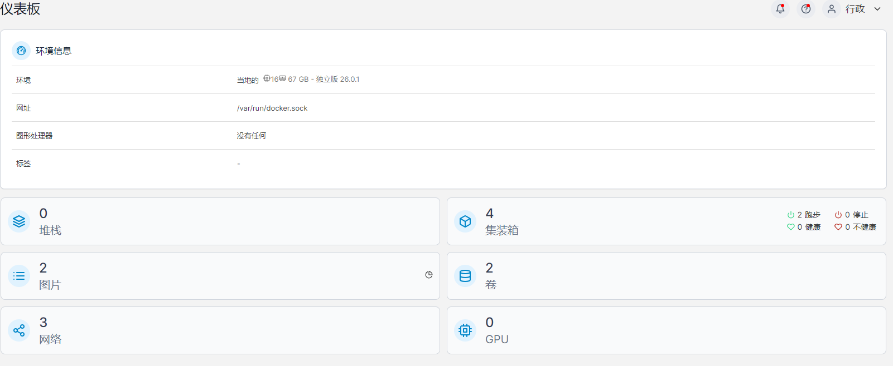
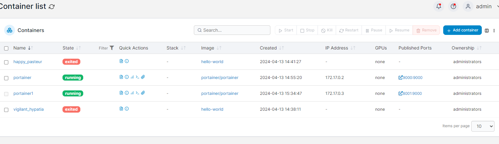
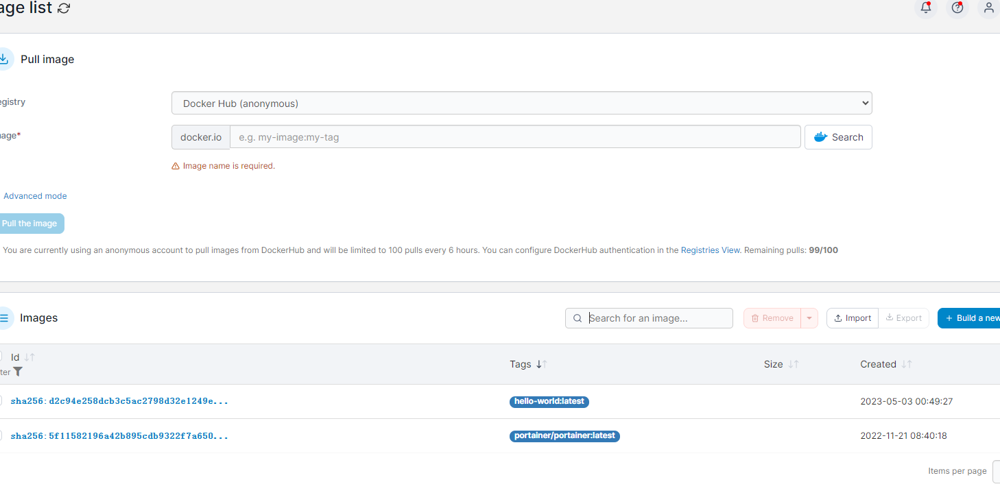

# Portainer环境配置

## 概述

* Portainer 是一种用于管理 Docker 和 Kubernetes 容器的开源工具。通过其用户友好的 Web 界面，用户可以轻松管理容器、镜像、网络和卷等资源

## 拉去最新的Portainer

* docker pull portainer/portainer

  

## 安装和启动

* docker run -d --restart=always --name portainer -p 8001:9000 -v /var/run/docker.sock:/var/run/docker.sock portainer/portainer

* 运行Portainer提供的镜像，也就是创建和启动容器
* 查看容器是否启动成功 docker ps
* http://192.168.1.4:8001/  192.168.1.4 是服务器的IP地址,8001 是客户端映射到服务器9000端口的端口

## 访问portainer

* 地址：http://180.76.175.***:9000/
* 操作：登录后设置你的用户名和密码，并设置本地Docker即可，设置完成后，如下:  
* 一定先创建admin账号啊
  

  

## 查看本地的docker环境

  

### 展示容器信息

  

### 展示镜像信息

  

