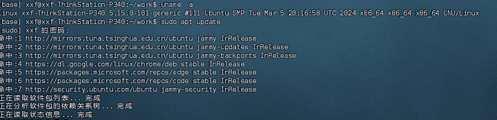
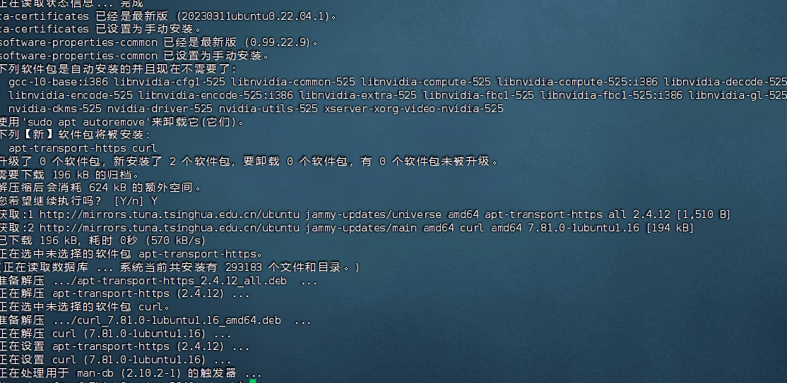
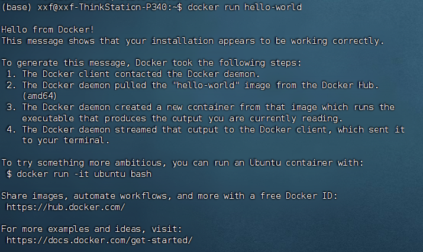

# docker环境配置

**本文是在ubuntu 22.04机器配置docker环境**

## 查看系统的内核版本

* uname -a
```
Linux xxf-ThinkStation-P340 5.15.0-101-generic #111-Ubuntu SMP Tue Mar 5 20:16:58 UTC 2024 x86_64 x86_64 x86_64 GNU/Linux


```


* x86 64位 系统 如果是32位 不能安装docker


## 更新软件


* sudo apt-get update

  


## 卸载旧版本


```
sudo apt remove docker docker-engine docker.io containerd runc

```

## 安装docker需要的依赖包

* sudo apt-get install apt-transport-https ca-certificates curl software-properties-common

  

## 添加Docker官方GPG密钥

```
curl -fsSL https://download.docker.com/linux/ubuntu/gpg | sudo gpg --dearmor -o /usr/share/keyrings/docker-archive-keyring.gpg

```


## 添加docker的软件仓库

```
echo "deb [arch=amd64 signed-by=/usr/share/keyrings/docker-archive-keyring.gpg] https://download.docker.com/linux/ubuntu $(lsb_release -cs) stable" | sudo tee /etc/apt/sources.list.d/docker.list > /dev/null


```


## 安装docker引擎


```
sudo apt update
sudo apt install docker-ce docker-ce-cli containerd.io


```

## 启动Docker服务

```
sudo systemctl start docker

```
## 验证安装

docker --version


```

docker run hello-world

```
  


* docker run hello-world 是一个用于验证 Docker 是否正确安装并能够在您的系统上运行容器的命令。此命令会尝试找到本地名为 hello-world 的镜像，如果未找到，它会从 Docker Hub（一个公共的容器镜像仓库）下载该镜像，并在容器中运行


