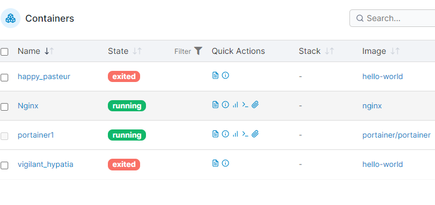

# ngnix环境配置


## 概述

* Nginx（发音为 "engine X"）是一个高性能的 HTTP 和反向代理服务器，也可用作邮件代理服务器。它以其稳定性、丰富的功能集、简单的配置和低资源消耗而闻名。Nginx 被广泛用于提高网站的可扩展性和性能，因为它可以处理高并发连接数，这主要归功于它的事件驱动架构。
* 关键特性
  * 处理静态文件、索引文件以及自动索引：能高效地服务静态内容，是传统 Web 服务器的完美替代
  * 反向代理：通过接收客户端的网络请求转发到其他服务器，可以用作负载均衡器。
  * 负载均衡：能够在多个后端服务器之间分配客户端请求，提高网站的可用性和扩展性。
  * 缓存：能够缓存请求的结果，减少向后端服务器的请求次数。
  * 压缩：支持压缩代理和内容，减少数据传输量。
  * SSL/TLS 支持：可以直接在 Nginx 中管理 SSL/TLS，提供安全的连接。
  


## 常用命令

* 停止：docker stop Nginx
* 重启：docker restart Nginx
* 删除服务：docker rm Nginx
* 删除镜像：docker rmi Nginx
* 进入服务：docker exec -it Nginx /bin/bash


## 基础安装


```
docker run \
--restart always \
--name Nginx \
-d \
-p 80:80 \
nginx
```
  


* restart 重启策略，always 是一直保持重启。如果不设置，可以把这条删掉。never\always
* 第1个 80 - 容器端口、第2个 80 - 服务器端口，这样外部通过80端口即可访问
* 可以看到ngnix已经启动,portaner也在运行

  


## 管理配置


* Nginx 的使用包括的配置有；配置、首页、日志、SSL等，而这些内容在默认基础安装的情况下，都是在 Docker 容器中的，不容易被管理和使用。所以一般我们在安装 Nginx 的时候是需要做映射处理。这个时候我们可以把在 Docker 上安装的 Nginx 配置信息拷贝到本地，之后做一些修改后，再去重新执行 Nginx 的安装【重新安装前记得把之前的 Nginx 删掉】。

## 进入ngnix


* 进入服务：docker exec -it Nginx /bin/bash
* 查看配置: ls /etc/ngnix/
* 查看页面：ls /usr/share/nginx/html
* 其他说明：conf.d 是个文件夹📂，所有这个文件夹下的 Nginx 配置文件【default.conf】都会被 nginx.conf 加载。所以后面的 Nginx 配置，我们也主要是来修改这个文件
* 或者从 portainer 中进入 Nginx 控制台，就不需要执行 docker exec -it Nginx /bin/bash 


  


## 拷贝nginx


### 创建目录
* 如果是在云服务端，需要通过命令创建文件夹📂或者通过 SFTP 工具手动创建
*  sudo mkdir -p /data/nginx/conf
*  sudo mkdir -p /data/nginx/html
*  


### 拷贝文件

* sudo docker container cp Nginx:/etc/nginx/nginx.conf /data/nginx/conf
* sudo docker container cp Nginx:/etc/nginx/conf.d/default.conf /data/nginx/conf.d/default.conf
* sudo docker container cp Nginx:/usr/share/nginx/html/index.html /data/nginx/html
* 

### 部署Ngnix


* docker run \
--restart always \
--name Nginx \
-d \
-v /data/nginx/html:/usr/share/nginx/html \
-v /data/nginx/conf/nginx.conf:/etc/nginx/nginx.conf \
-p 80:80 \
nginx

  

* 如果再修改其他配置，直接重启：sudo servce ngnix restart 或者再portainer页面操作
* -v 是映射配置 后面除了html conf 还有其他配置需要映射


* 删除 docker rm Nginx
* docker stop Nginx
