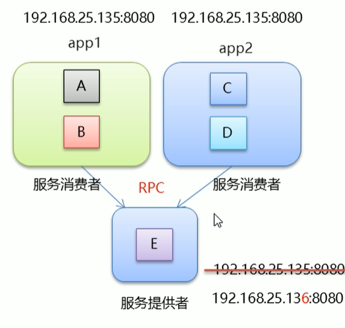
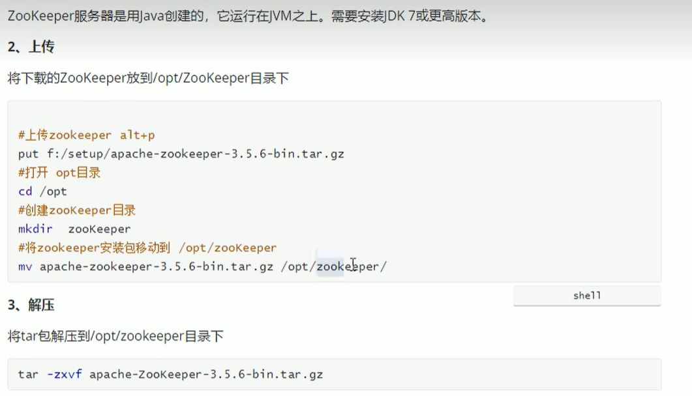

# 快速入门dubbo

## 简单概念

* 集群：很多人一起 干一样的事情  一个业务模块 部署在多台服务器
* 分布式：很多人一起，做不一样的事情，这些不一样的事情合起来就是一件大事  一个大的业务系统 拆分成小的业务模块  分别部署在不同的机器

## 架构演进

### 单体架构

* 简单：开发部署都很方便 小型项目首选
* 项目启动慢
* 可靠性差
* 可伸缩性差
* 扩展性和可维护性差
* 性能低

### 垂直架构

* 指的是将单体架构中的多个模块拆分成多个独立的项目 形成多个独立的单体架构
* 重复功能太多

### 分布式框架

  

* 分布式架构是指在垂直架构的基础上，将公共业务模块抽取出来，作为独立的服务，供其他调用者消费，以实现服务的共享和重用
* RPC： Remote Procedure Call 远程过程调用
* 服务提供方一旦产生变更，所有消费方都需要变更

## DUBBO的概念

* Dubbo是阿里巴巴公司开源的一个高性能、轻量级的Java RPC框架
* 致力于提供高性能和透明化的RPC远程服务调用方案，以及SOA服务治理方案

## 快速入门

### ZooKeeper注册中心

  

进入bin目录，执行./zkServer.sh start  启动服务

### dubbo admin安装  监控中心

