# 一、git基础

## 1.1 安装

一路next即可

## 1.2 简单的命令

git --version  查看git版本

### 1.2.1 基本工作流程

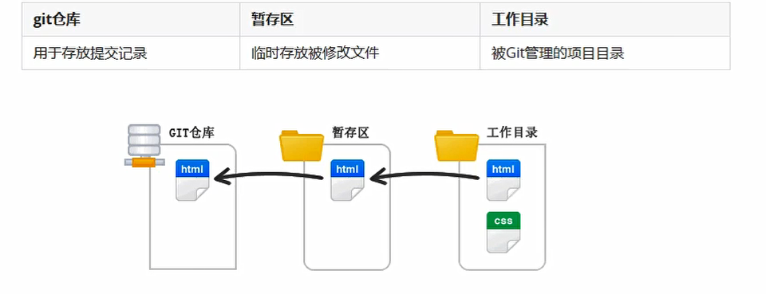  

开发者每次将修改的文件提交到暂存区，然后再从暂存区提交到git仓库

### 1.2.3 git使用前配置

在使用git前，需要告诉git提交人，在向git仓库中提交时用到

* 配置提交人姓名：git config --global user.name  提交人姓名

* 配置提交人邮箱：git config --global user.email 提交人邮箱

* 查看git配置信息：git config --list

注意：
* 如果需要对配置信息进行修改，重复上述命令即可
* 配置只需要执行一次

### 1.2.4 git提交步骤

* git init 初始化git仓库 生成.git文件夹  隐藏文件夹
* git status 查看文件状态
* git add 文件列表 追踪文件   提交文件
* git commmit -m 提交信息 向仓库中提交代码
* git log 查看提交记录

**当使用git init时，文件是红色 表示没有被添加到暂存区中，当使用git add 文件 表示提交文件，此时文件变成绿色，意思是这个文件已经被添加到暂存区中，然后可以使用git commit -m 提交信息（比如 第一次提交）将暂存区中的文件提交到仓库中  使用git log命令查看提交的日志记录**

### 1.2.5 恢复记录
* git rest --hard commitID

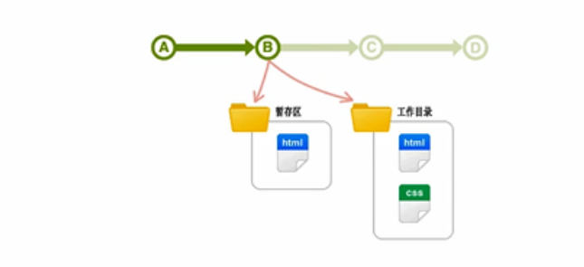  

### 1.2.6 撤销

* 使用暂存区的文件覆盖工作目录中的文件：git checkout 文件
* 将文件从暂存区中删除：git rm --cached 文件
* 将git仓库中指定的更新记录恢复出来，并且覆盖暂存区和工作目录：git reset --hard commitID

使用场景：

* 使用暂存区的文件覆盖工作目录中的文件：当开发到一半的时候，发现代码有问题，所以需要恢复代码，那么这时候就要将暂存区的代码拉回到工作目录中，使用 git checkout 文件 恢复

* 当我们使用一些测试文件的时候，这些测试文件被提交到暂存区中，那么我们不想让这些测试文件被提交到仓库中，那么就需要将这些测试文件删除 使用git rm --cached 文件进行删除,这个时候暂存区中的目标文件就被删除，这时再使用，git status进行查看文件，发现工作目录下的被删除的文件变成红色，说明没有被提交到暂存区中（工作目录下的该文件并没有被删除）

* git reset --hard commitID 使用这个命令可以指定原来某一个提交版本的文件覆盖现有的工作目录和暂存区，此时的工作目录中的文件恢复为（指定提交的版本）此时的提交记录 只有第一次提交 原有的提交记录全部被删除

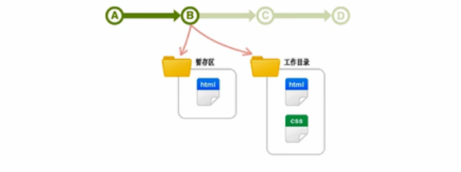  

# 二、git分支操作

emsp;分支就是当前工作目录中代码的一份副本，使用分支，可以让我们从开发主线中分离出来，以免影响开发主线

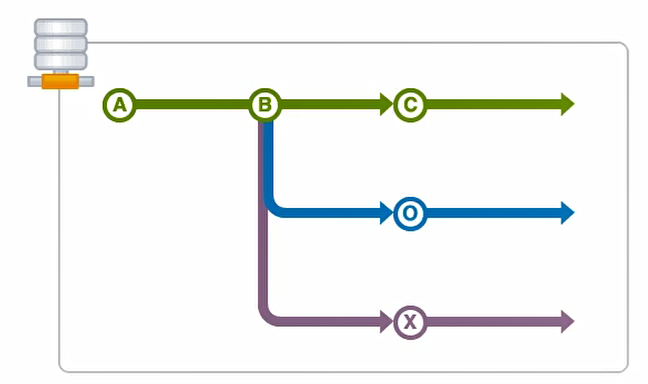  

## 2.1 分支细分

* 主分支（master）:第一次向git仓库中提交更新记录时自动产生的一个分支，**开发工作都不会在主分支上面进行**

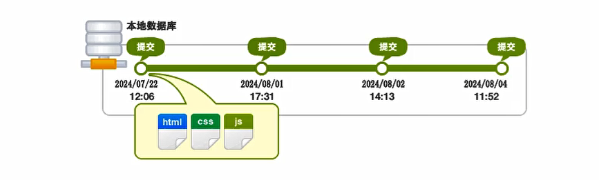  

* 开发分支(develop):作为开发的分支，基于Master分支创建，**当在开发分支上面测试的代码没有问题，再将其合并到主分支上面**

* 功能分支(feature)：作为开发具体功能的分支，基于开发分支的创建

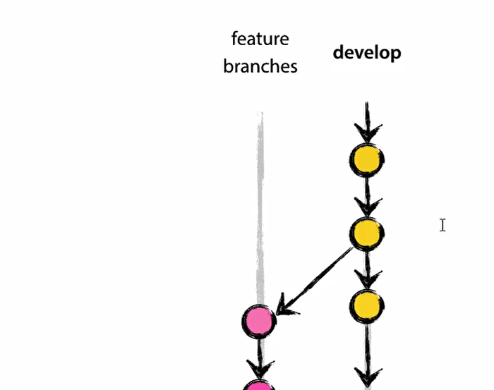  

**功能分支->开发分支->主分支**

## 2.2 分支命令

* git branch **查看分支**
* git branch 分支名称 **创建分支**
* git checkout 分支名称 **切换分支**
* git merge 来源分支 **合并分支**
* git branch -d 分支名称 **删除分支（分支被合并之后才允许删除）**（-D 强制删除）

**当我们创建一个开发分支develop 在开发分支上创建一个文件，将其添加到暂存区中，但是没有提交到仓库中，此时，我们切换分支到主分支master，可以看到主分支工作目录下有刚刚开发分支下创建的文件，但是，分支与分支之间的工作目录是无关的，所以在切换分支之前需要先将工作目录中的文件提交到仓库中 然后再切换分支**

**当我们在开发分支测试好代码之后，需要将代码合并到主分支上，使用git merge develop进行合并 之后就可以看到主分支工作目录下有develop目录下的文件**

**删除分支的时候，一定要先切换到Master分支 然后删除目标分支**

## 2.3 暂时保存更改

&emsp;在git中，可以暂时提取分支上所有的改动并且存储，让开发人员得到一个干净的工作副本，临时转向其他工作

使用场景：分支临时切换

* 存储临时改动：git stash
* 恢复改动：git stash pop

# 三、github操作

## 3.1 多人协作开发的流程

* A在自己的计算机中创建本地仓库
* A在github中创建远程仓库
* A将本地仓库推送到远程仓库 push
* B克隆远程仓库到本地进行开发 clone
* B将本地仓库中开发的内容推送到远程仓库 Push
* A将远程仓库中的最新内容拉去到本地 pull 

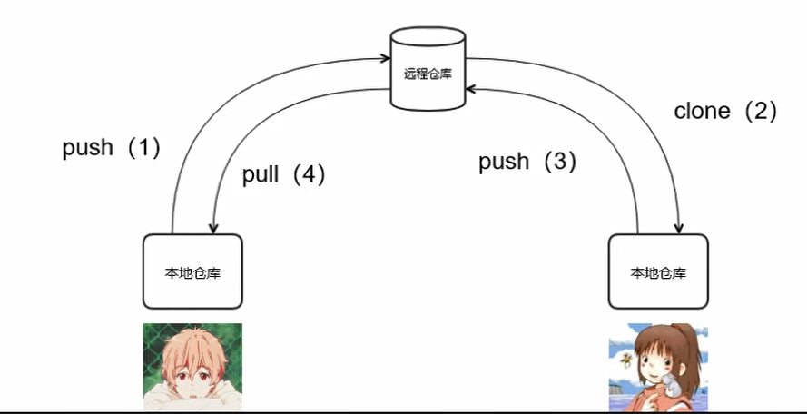  

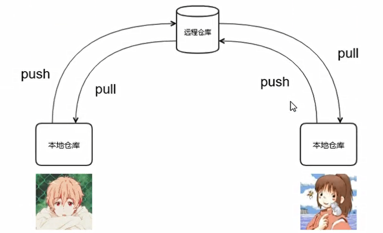  

## 3.2 创建远程仓库

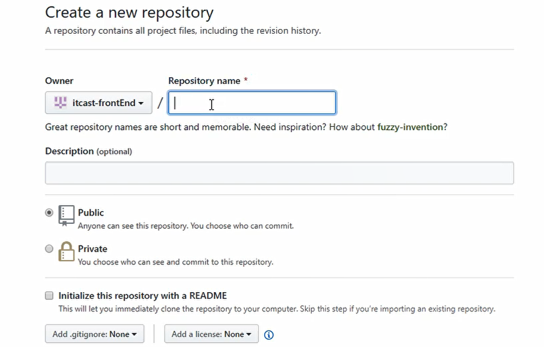  

* Owner：是仓库的所有者，其实就是github账号
* Repository name是仓库的名字
* public:表示仓库是公开的，其他人也可以看到
* private:表示仓库是私有的，其他人不可以访问

HTTPS/SSH显示的是远程仓库的地址：
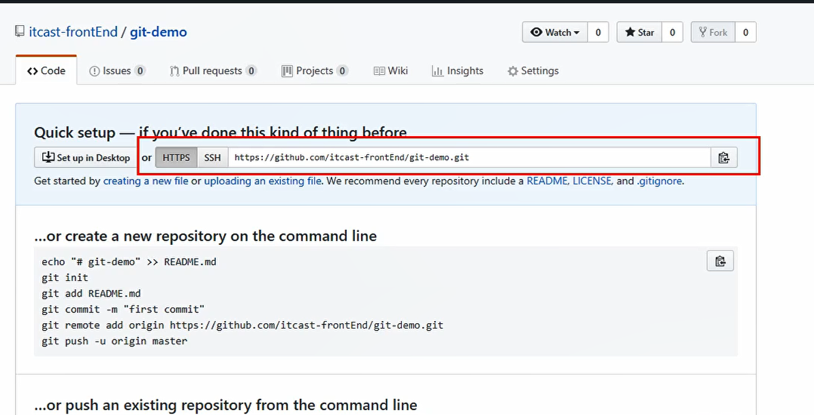  

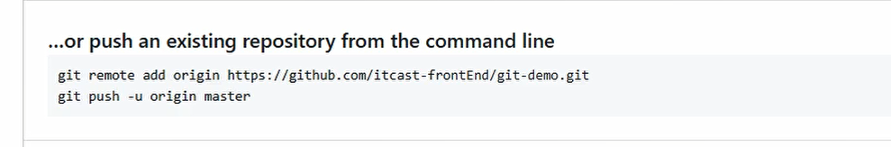  

* git push远程仓库地址 分支名称
* git push 远程仓库地址别名 分支名称
* git push -u 远程仓库地址别名 分支名称  -u 记住推送地址以及分支 下次推送只需要输入git push即可
* git remote add远程仓库地址别名 远程仓库地址

推送本地仓库：比如：**git push 远程仓库地址 master(分支名称)**

由于远程仓库的地址比较长，所以为了方便起别名，**比如，git remote add origin 远程仓库地址，这里的origin就是远程仓库地址别的别名，那么下一次将本地仓库提交到github的时候，直接git push origin master即可**

**git push -u 远程仓库地址别名 master 这样做的目的是为了下一次推送的时候直接使用git push命令即可**

## 3.3 远程仓库克隆到本地仓库

**克隆远程数据仓库到本地：git clone 仓库地址**

## 3.4 团队其他成员推送到远程仓库

比如团队成员B将远程仓库克隆到本地之后，然后进行了修改，之后需要将代码推送到远程仓库中。

这时候，就需要A程序员将B程序员在github上拉进团队，在settings中点击collaborators

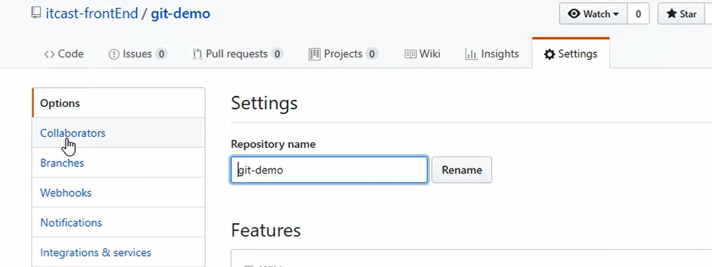  

将程序员B的github账号写入即可，

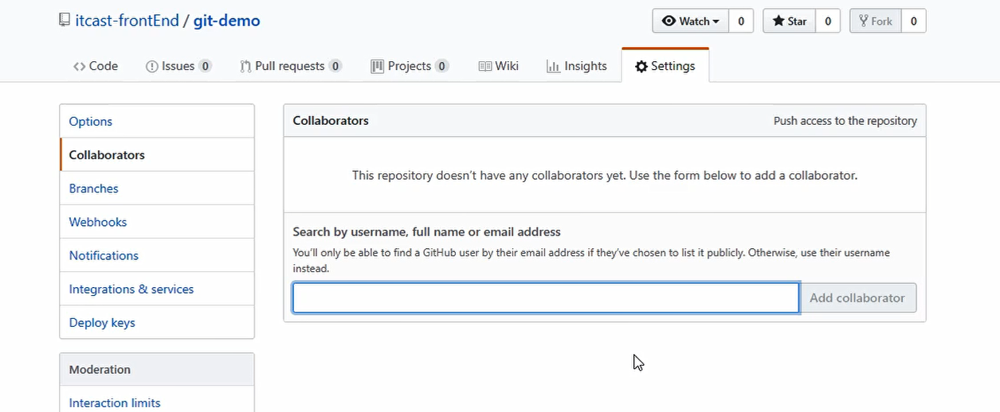  

邀请程序员B，程序员B Accept即可

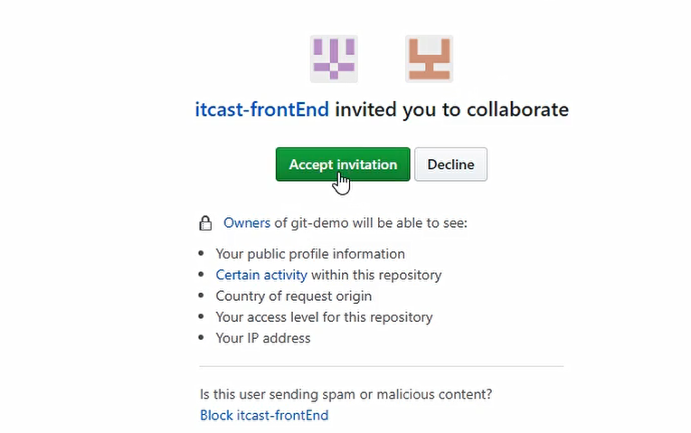  

然后程序员B就可以正常推送代码了。

然后A需要将代码的最新版本拉去到本地即可

**拉取远程仓库中最新的版本：git pull 远程仓库地址 分支名称**

## 3.5 使用SSH进行免登录操作

使用SSH-KEYGEN命令生成密钥，查看生成的公钥和私钥

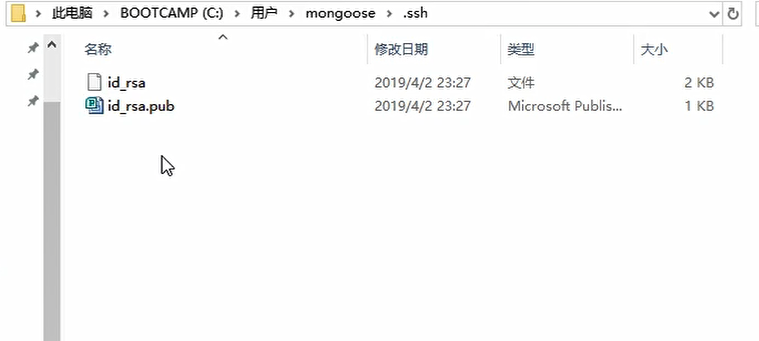  

公钥是pub结尾的文件，私钥是id_rsa

然后打开公钥,全选并且复制 

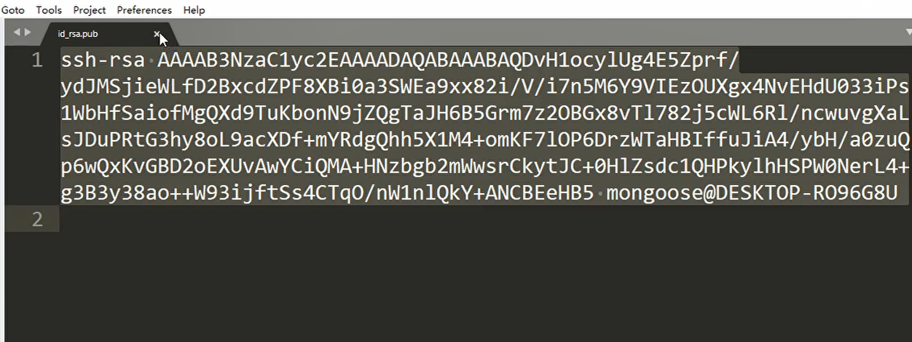  

然后就可以使用SSH地址实现免登录操作了

