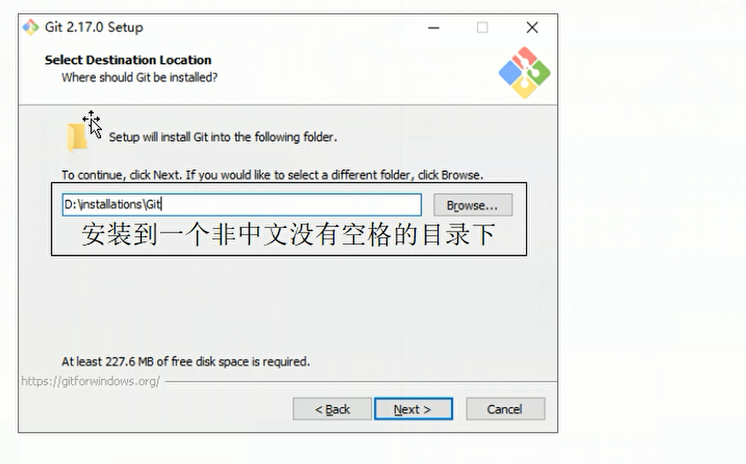
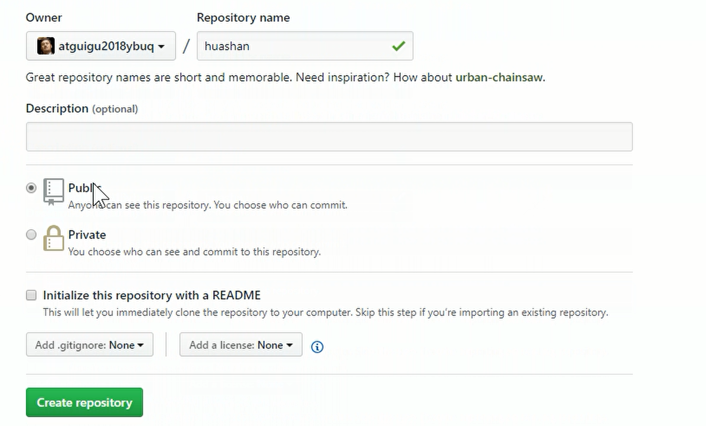
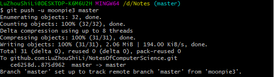

# 一文搞定github&git

## 一、版本控制

### 1.版本控制介绍
&emsp;工业设计领域中使用版本控制管理工程蓝图的设计过程。在IT开发过程中也可以使用版本控制思想管理代码的版本迭代。


（1）个人开发改进迭代

（2）团队协作


### 2.版本控制工具介绍

集中式版本控制工具：CVS、SVN、VSS

分布式版本控制工具：Git、Mercurial、Bazaar、Darcs


版本控制工具应该具备的功能：

* 协同修改
  多人并行修改服务器的同一个文件

* 数据备份
  不仅保存目录和文件的当前状态，还能保存提交过的历史状态

* 版本管理
  在保存每一个版本的文件信息的时候要做到不保存重复数据，以节约存储空间，提高运行效率。这方面SVN采用的是增量式管理的方式，而Git采取了文件系统快照的方式。

* 权限控制
  对团队中参与开发的人员进行权限控制
  对团队外开发者贡献的代码进行审核——Git独有

* 历史记录
  查看修改人、修改时间、修改内容、日志信息
  将本地文件恢复到某一个历史状态

* 分支管理
  允许开发团队在工作过程中多条生产线同时推进任务，进一步提高效率


## 二、Git简介

（1）Git历史
  


（2）Git官网
```
https://git-scm.com/

```

（3）Git优势
* 大部分操作在本地完成，不需要联网
* 完整性保证
* 尽可能添加数据而不是删除或者修改数据
* 分支操作非常快捷流畅
* 与Linux命令全面兼容


（4）Git结构
  


（5）Git和代码托管中心
 代码托管中心的任务：维护远程库

 * 局域网环境下：GitLab服务器
 * 外网环境下：Github  码云

（1）团队内部远程库操作
  

使用push命令将本地库推送到github，团队其他成员使用clone命令将代码下载下来，同时对代码进行修改，修改完毕之后使用push命令推送到github远程库。同时可以使用pull命令将代码拉取本地


（2）团队外部成员远程库操作

  

团队外的成员如果想使用代码 首先需要进行fork，将代码变成自己的远程库，同时可以在自己的远程库进行clone、push操作，如果想要将自己的代码上传到原始的远程库，那就需要先提出pull request请求，审核之后进行merge合并。


（6）Git安装

  * 双击 选择安装路径
    


  * 保持默认设置
    


  * 选择默认的版本编辑器（Linux下使用vim）
    


  * 选择环境变量  选择第一个（完全不修改PATH环境变量，仅仅在bash中使用Git）
    

  * 选择默认值
    

  * 使用默认值
    

  * 使用git bash默认的终端
    


  * 使用默认值，下一步install
    


## 三、Git命令行操作

### 3.1 本地库初始化

* 命令：git init
* 效果：
  
  在D盘新建一个Agit文件夹，进入文件夹，右键菜单选择git bash
    

* 注意：.git目录中存放的是本地库相关的子目录和文件，不要删除，也不要胡乱修改。


### 3.2 设置签名

* 形式：用户名：tom
  Email地址：goodMorning@outlook.com

* 作用：区分不同开发人员的身份
* 辨析：这里设置的签名和登录远程库（代码托管中心）的账号、密码没有任何关系
* 命令
  * 项目级别/仓库级别：仅在当前本地库范围内有效
    * git config user.name tom_pro
    * git config user.email goodmorning@outlook.com
  
  * 系统用户级别：登录当前操作系统的用户范围
    * git config --global user.name tom_glb
    * git config --global goodMorning_glb@outlook.com

  * 级别优先级：项目级别优先于系统用户级别，二者都有采用项目级别的签名


项目级别效果图：
  

.git文件夹中的config文件就存放着签名

系统用户级别效果图：
  

当前用户的家目录下有个gitconfig文件存放着签名信息：~/.gitconfig文件


### 3.3 git添加提交以及查看状态操作

* 使用git status命令查看状态
  


* 使用 git add good.txt 将good.txt文件提交到暂存区
  

* 使用 git rm --cached good.txt 删除该文件，good.txt 成了未追踪的文件
  

* 使用 git commit good.txt 将文件提交（进入vim 编辑器 编写提交信息）
  


* 如果提交过后，又对good.txt文件进行了修改，那么需要再次进行提交
  
  
  


### 3.4 版本穿梭测试的准备工作

使用git log命令查看日志信息
  


### 3.5 查看历史记录的几种不同方式

* 加上参数：--pretty=oneline  可以一行显示
  


* 加上参数：reflog: 显示提交信息 HEAD@{移动到当前版本需要多少步}
    


### 3.6 前进后退历史版本操作

历史版本前进后退操作其实是上面的HEAD指针的移动操作，当前HEAD指针所指向的是离我们最近的一个版本。

执行版本前进后退的具体操作有三种：

（1）基于索引值操作

代码：```git reset --hard 索引值```，后退到索引值代表的版本 
  

可以看到，指针已经移动到最开始的版本


（2）使用^符号
只能后退。使用几个^符号，就后退几个版本

  


（3）使用~符号
只能后退，git reset --hard HEAD~n，只能后退n步


### 3.7 reset命令的三个参数对比

* --soft参数
  仅仅在本地库移动HEAD指针
  

这里可以看到在本地库移动Head指针，但是暂存区并没有同步（所以这里出现了good.txt被修改的迹象，意味着你只add到暂存区，并没有提交到本地库）


* --mixed参数
  在本地库移动HEAD指针
  重置暂存区
  


* --hard参数
  在本地库移动HEAD指针
  重置暂存区
  重置工作区

使用```git reset --hard HEAD``` 对三个工作区都进行重置


### 3.8 本地库删除文件并且找回
  

要找回被删除的文件，只需要会退一个版本即可。
  


### 3.9 删除文件并找回总结
前提：删除前，文件存在时的状态提交到了本地库
操作：git reset --hard[指针位置]

* 删除操作已经提交到本地库: 指针位置指向历史记录
* 删除操作尚未提交到本地库：指针位置使用HEAD


### 3.10 比较文件

* git diff[文件名]
  将工作区中的文件和暂存区进行比较

* git diff[本地库中历史版本][文件名]
  将工作区中的文件和本地库历史记录比较

* 不带文件名比较多个文件

  


## 四、分支操作

### 4.1 分支概述
&emsp;在版本控制过程中，使用多条线同时推进多个任务。

&emsp;好处：各个分支在开发过程中，如果某一个分支开发失败，不会对其他分支有任何影响。失败的分支删除重新开始即可。


### 4.2 分支操作命令

常用操作命令:

```git
git branch -v # 查看当前所有分支 以及 当前所在分支
git branch 分支名  # 新建一个分支
git checkout 分支名 # 切换分支

# 合并分支操作

* 第一步：切换到接受修改的分支（被合并，增加新内容）
git checkout [被合并的分支名]

* 第二步：执行merge命令
git merge [有新内容分支名]

```

  

  


### 4.3 解决分支合并之后产生的冲突

  

```
将文件里面冲突的部分去掉即可
然后执行下面的语句：
git add 文件名
git commit -m "日志信息"

```


## 五、Git的基本原理

### 5.1 哈希
  

  


### 5.2 git保存版本的机制
&emsp;以文件变更列表的方式存储信息。这类系统将他们保存的信息看作是一组基本文件和每个文件随时间逐步累积的差异。

  


### 5.3 git文件管理机制
&emsp;Git将数据看作是小型文件系统的一组快照。每次提交更新时Git都会对当前的全部文件制作一个快照并保存这个快照的索引。为了搞笑，如果文件没有修改，Git不在重新存储该文件，而是只保留一个链接指向之前存储的文件。所以Git的工作方式可以称之为快照流。


## 六、GitHub相关操作

### 6.1 首先创建一个本地库

  


### 6.2 创建一个远程库

  

  


（1）远程仓库创建一个文件

点击create new file 可以在远程仓库创建一个文件
  

  


（2）远程仓库编辑文件
  

  

  


（3）上传文件至远程仓库 upload files
  


（4）查找文件  find files
  


### 6.3 Github Issues

作用：发现代码BUG,但是目前没有成型的代码，需要讨论时用，或者使用开源项目出现问题时使用

情景：张三发现李四开源git库吗，发现一个问题并提交了一个issue,李四隔天登陆在github主页看到通知 冰河张三进行交流，最后关闭issue。

  

提交一个issue
  


复制克隆项目：Fork
情景：张三fork了李四的项目，相当于张三复制了李四的项目，所以自己也单独有了一样名称的仓库（该仓库会声明来自于李四，但是独立存在）

  


发送请求：pull request

情景：张三修改了fork的项目中的文件，希望更新到原来的仓库，这个时候他要新建一个pull request

  

  

步骤总结：

```
fork 项目
修改自己仓库的项目代码
新建pull request
等待作者操作审核

```


### 6.4 为远程库创建一个别名
进入这个仓库，复制HTTPS仓库地址
  

使用git remote -v 可以查看所有的仓库地址别名，使用git remote add 别名 仓库地址 对仓库起一个别名

```
git remote -v

git remote add 别名 仓库地址

```

  


### 6.5 git clone操作
将远程仓库（github对应的项目）复制到本地
  


### 6.4 push操作

```
git push origin master #指定仓库名与分支名

```

在push操作之前先生成一个SSH公钥，
  

  

  


需要执行如下代码：

```
设置git账户：

git config user.name # 查看账户名
git config user.email # 查看邮箱


# 这两个是设置全局签名
git config --global user.name "账户名"
git config --global user.email "邮箱名" 

# 查看是否生成SSH公钥
cd ~/.ssh

# 生成命令
ssh-keygen -t rsa -C "邮箱"

# 需要三次回车

# 查看密钥SSH
cat ~/.ssh/id_rsa.pub

# 复制你的SSH 打开你的github 点击settings 将SSH复制上去

# 查看是否成功
ssh -T git@github.com


```

首先，你需要新建一个远程仓库，然后为你的远程仓库起一个别名（参考上面的操作）

  


之后使用 git push -u 仓库别名  分支名  推送数据
  

