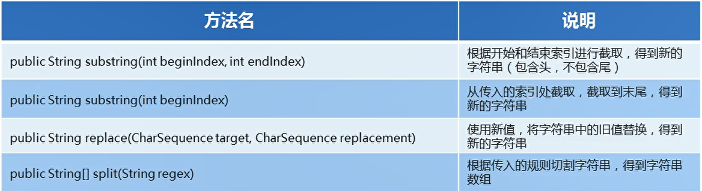

# API

## 一、概述

  

## 二、键盘读取字符串

```java
package com.ustc.base.DataFormat;

import java.util.Scanner;

public class ScannerDemo {
    public static void main(String[] args) {
        // 创建对象
        Scanner sc = new Scanner(System.in);

        // 接收数据
        System.out.println("请输入一个字符串数据");
        String line = sc.nextLine();// 读取一个字符串

        // 输出结果
        System.out.println(line);
    }
}

```

## 三、String 概述

  


```java
package com.ustc.base.DataFormat;

public class MyString {
    public static void main(String[] args) {
        String s1 = new String();// 创建一个空白字符串对象 不包含任何内容
        System.out.println("s1:" + s1);

        char[] chs = {'a','b','c'};// 使用字符数组创建字符串
        String s2 = new String(chs);
        System.out.println("s2" + s2);

        // 使用字节数组创建字符串
        byte[] bs = {97,98,99};
        String s3 = new String(bs);
        System.out.println(s3);

        // 直接进行赋值创建字符串
        String s4 = "abc";
        System.out.println(s4);
    }
}


```

## 四、创建字符串对象的区别对比

* 使用new创建的字符串对象每一次new 都会申请一块内存空间，虽然内容一样，但是地址值不一样

* 以""方式给出的字符串，只要字符序列相同， 无论在程序代码中出现几次，JVM都会建立一个String对象，并在字符串池中维护。

  


  


## 五、字符串的比较

```java
package com.ustc.base.DataFormat;

public class test20 {
    public static void main(String[] args) {
        // 字符串的比较

        // 使用构造方法的方式得到对象
        char[] chs = {'1','a','c'};
        String s1 = new String(chs);
        String s2 = new String(chs);

        // 直接赋值的方式得到对象
        String s3 = "abc";
        String s4 = "abc";


        // 比较字符串对象地址是否相同
        System.out.println(s1 == s2);// 输出false  new出来的是不同的地址
        System.out.println(s1 == s3);// 输出false
        System.out.println(s3 == s4);// 输出true  abc只有一个 存在常量池

        // 比较字符串内容是否相同
        System.out.println(s1.equals(s2));// 输出true
        System.out.println(s1.equals(s3));// 输出flase
        System.out.println(s3.equals(s4));// 输出true


    }
}


```

## 六、字符串的遍历

```java
package com.ustc.base.DataFormat;

public class test21 {
    public static void main(String[] args) {
        String s = "abcde";

        // 遍历字符串
        for (int i = 0;  i < s.length(); i++) {
            System.out.println(s.charAt(i));// 指定索引值
        }
    }
}


```


字符串反转

```java
package com.ustc.base.DataFormat;

public class test21 {
    public static void main(String[] args) {
        String s = "abcde";
        String sa = reverse(s);
        System.out.println(sa);
    }


    // 反转字符串方法
    public static  String reverse(String s)
    {
        // 在方法中将字符串到这遍历得了
        String ss = "";

        for (int i = s.length() - 1; i >= 0; i--) {
            ss += s.charAt(i);// 获取指定位置的字符 然后拼接
        }

        return ss;
    }
}

```


## 七、string方法小结

  


  

