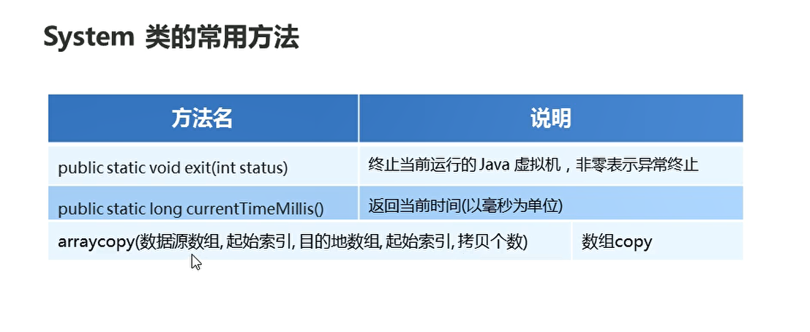
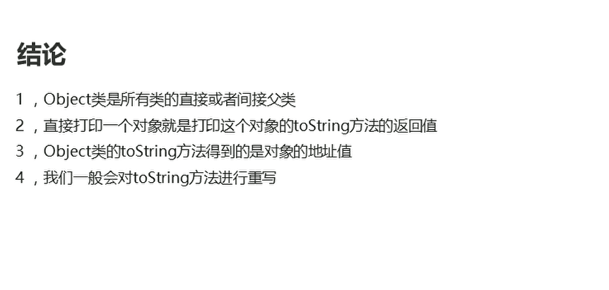
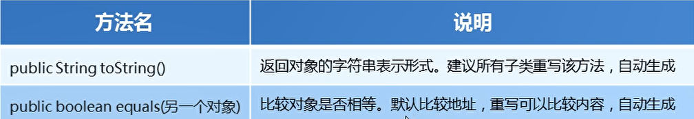
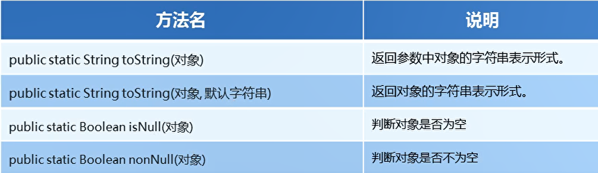

# 常用API基本使用toString 和 equals

## Math

所有成员方法都是静态方法，直接通过类名进行调用

```java
package com.hfut.edu.test1;

public class test1 {
    public static void main(String[] args) {
        // 绝对值
        int abs = Math.abs(-10);
        System.out.println(abs);

        // 向上取整
        double ceil = Math.ceil(10.1);
        System.out.println(ceil);

        double floor = Math.floor(10.9);// 向下取整
        System.out.println(floor);

        // 四舍五入
        long round = Math.round(1.9);
        System.out.println(round);

        // 返回较大的一个数
        int m = Math.max(1,2);
        System.out.println(m);

        // 返回较小的一个数字
        int n = Math.min(1,2);
        System.out.println(n);

        // 计算一个数字的幂次
        double s = Math.pow(2,3);
        System.out.println(s);

        // 获取一个随机数
        double r = Math.random() + 1;
        System.out.println(r);

    }
}


```

## System

  


```java
package com.hfut.edu.test1;

public class test2 {
    public static void main(String[] args) {

        long l = System.currentTimeMillis();
        for (int i = 0; i < 999; i++) {
            System.out.println(i);
        }
        long end = System.currentTimeMillis();
        System.out.println(end - l);// 计算程序的执行时间

        int[] arr1 = {1,2,3,4,5};
        int[] arr2 = new int[5];

        // 数组拷贝
        System.arraycopy(arr1,0,arr2,0,arr1.length);


        for (int i = 0; i < arr2.length; i++) {
            System.out.println(arr2[i]);
        }

    }
}

```

## toString

* 每一个类都可以将Object作为父类，所有的类都直接或者间接的继承该类

重写toString方法

  

```java
package com.hfut.edu.test1;

public class Student {
    private String age;
    private String name;

    public Student() {
    }

    public Student(String age, String name) {
        this.age = age;
        this.name = name;
    }

    public String getAge() {
        return age;
    }

    public void setAge(String age) {
        this.age = age;
    }

    public String getName() {
        return name;
    }

    public void setName(String name) {
        this.name = name;
    }

    // 重写toString 方法


    @Override
    public String toString() {
        return "Student{" +
                "age='" + age + '\'' +
                ", name='" + name + '\'' +
                '}';
    }
}

```

## equals

Object中的equals方法，底层也是使用==号比较地址值

重写Object中的equals方法

```java
package com.hfut.edu.test1;

import java.util.Objects;

public class Student {
    private String age;
    private String name;

    public Student() {
    }

    public Student(String age, String name) {
        this.age = age;
        this.name = name;
    }

    public String getAge() {
        return age;
    }

    public void setAge(String age) {
        this.age = age;
    }

    public String getName() {
        return name;
    }

    public void setName(String name) {
        this.name = name;
    }

    // 重写toString 方法
    @Override
    public String toString() {
        return "Student{" +
                "age='" + age + '\'' +
                ", name='" + name + '\'' +
                '}';
    }

    // 重写equals方法  比较属性值
    @Override
    public boolean equals(Object o) {
        if (this == o) return true;
        if (o == null || getClass() != o.getClass()) return false;
        Student student = (Student) o;
        if (!Objects.equals(age, student.age)) return false;
        return Objects.equals(name, student.name);
    }
}

```

  

## equals面试题

```java
package com.hfut.edu.test1;

public class test3 {
    public static void main(String[] args) {
        String s1 = "abc";
        StringBuilder sb = new StringBuilder("abc");

        // 此时调用的是String 类中的equals方法
        // 保证参数也是字符串  否则不会比较属性值而直接返回false
        System.out.println(s1.equals(sb));

        // StringBuilder类中是没有重写equals方法的  用的是Object类中的方法
        System.out.println(sb.equals(s1));
    }
}
```

## System常用的API

  


