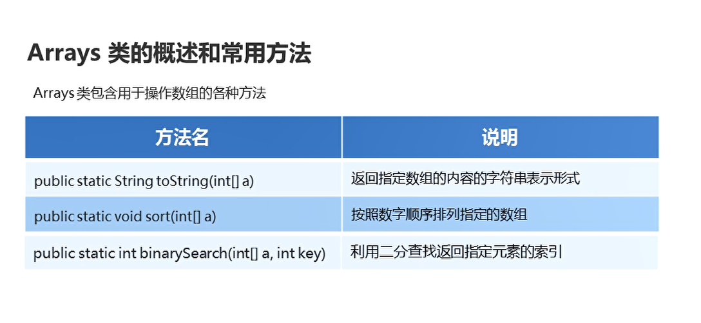

# Arrays

## 概述

Arrays类包含用于操作数组的各种方法,全部都是静态方法，直接类名进行调用

  

```java
package com.hfut.edu.test1;

import java.util.Arrays;

public class test12 {
    public static void main(String[] args) {
        int[] arr = {1,2,3,4,5,56};

        String s = Arrays.toString(arr);// 将数组转换成字符串的形式
        System.out.println(s);
        
        Arrays.sort(arr);// 排序

        int index = Arrays.binarySearch(arr,1);// 二分查找 找到指定元素的索引

        System.out.println(index);

    }
}


```


